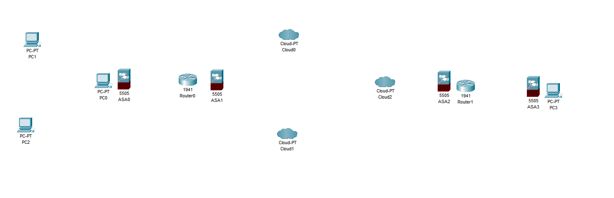
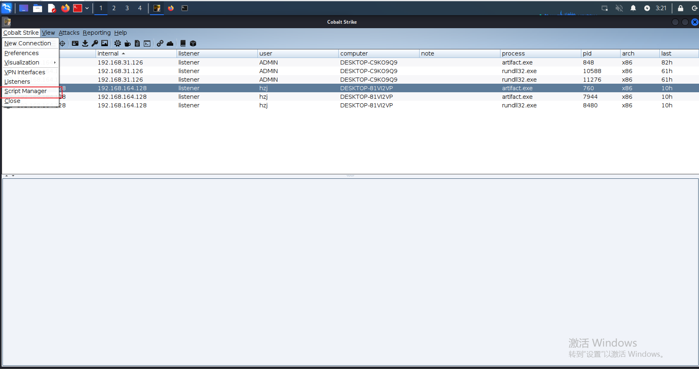
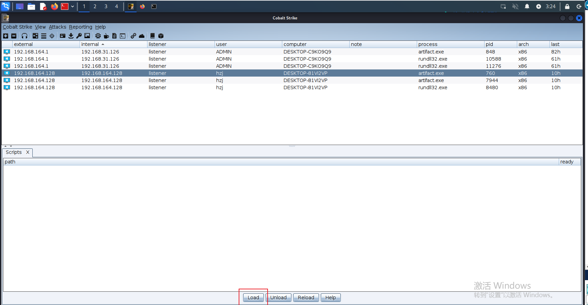
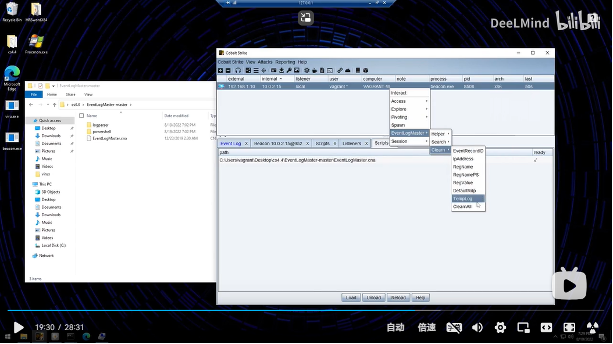
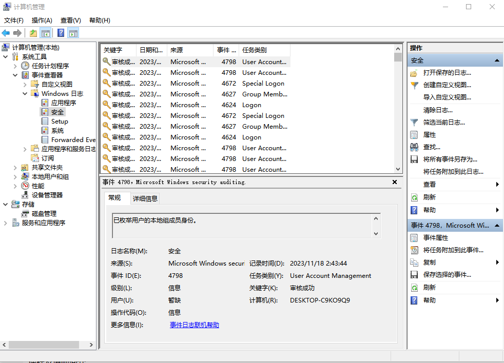

# [痕迹清理](https://www.bilibili.com/video/BV1at4y1E7Bd/?spm_id_from=333.1007.top_right_bar_window_history.content.click)

## 痕迹删除

+ 可能需要删除一些日志，但需要较高权限

+ 运行一些<code>cmd</code>脚本命令删除日志，痕迹清理等其实完全可以用命令行做到

+ 借助某些插件或者脚本删除日志，但一些小众的点可能需要自己写脚本或插件，需要掌握<code>C++</code>或<code>powershell</code>等语言

### CobaltStrike加载插件

1. 首先点<code>Script Manager</code>

2. 然后点<code>load</code>即可加载<code>cna</code>类型插件

3. 然后进行日志清理或其他操作即可

### 日志删除工具

+ https://github.com/xanszZZ/clear_tool
+ https://github.com/FiYHer/system_trace_tool/tree/main

### Windows

+ 在<code>我的电脑</code>上右键后点击<code>管理</code>然后会弹出计算机管理如下：

