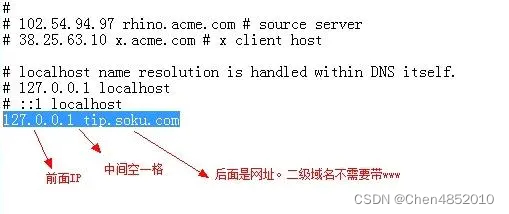

## 网址

网址：https://app.hackthebox.com/machines/CozyHosting

靶机IP：10.10.11.230，实际时内网ip

## User

> nmap扫描IP

~~~ shell
┌──(root㉿kali)-[/etc]
└─# nmap -sCV -p- -T4 10.10.11.230
Starting Nmap 7.93 ( https://nmap.org ) at 2023-09-26 21:27 CST
Nmap scan report for 10.10.11.230
Host is up (0.57s latency).
Not shown: 65193 closed tcp ports (reset), 327 filtered tcp ports (no-response), 11 filtered tcp ports (host-unreach)
PORT     STATE SERVICE    VERSION
22/tcp   open  ssh        OpenSSH 8.9p1 Ubuntu 3ubuntu0.3 (Ubuntu Linux; protocol 2.0)
| ssh-hostkey: 
|   256 4356bca7f2ec46ddc10f83304c2caaa8 (ECDSA)
|_  256 6f7a6c3fa68de27595d47b71ac4f7e42 (ED25519)
80/tcp   open  http       nginx 1.18.0 (Ubuntu)
|_http-title: Did not follow redirect to http://cozyhosting.htb
|_http-server-header: nginx/1.18.0 (Ubuntu)
3333/tcp open  tcpwrapped
4321/tcp open  tcpwrapped
Service Info: OS: Linux; CPE: cpe:/o:linux:linux_kernel

Service detection performed. Please report any incorrect results at https://nmap.org/submit/ .
Nmap done: 1 IP address (1 host up) scanned in 5185.36 seconds

~~~

### hosts文件

#### hosts文件是什么

hosts是一个没有扩展名的系统文件，其基本作用就是将一些常用的网址域名与其对应的 IP 地址建立一个关联“ 数据库 ”。当用户在浏览器中输入一个需要登录的网址时，系统会首先自动从hosts文件中寻找对应的 IP 地址，一旦找到，系统就会立即打开对应网页，如果没有找到，则系统会将网址提交 DNS 域名解析服务器进行 IP 地址的解析。

#### hosts文件的作用

1. 加快域名解析

对于经常访问的网站，咱们可以通过在hosts文件中配置域名和 IP 的映射关系，提高域名的解析速度。由于有了映射关系，当咱们输入域名后，计算机就能够快速解析出 IP 地址，而不用请求网络上的 DNS 服务器。

2. 构建映射的关系

在很多单位中，都会有自己[局域网](https://so.csdn.net/so/search?q=局域网&spm=1001.2101.3001.7020)，而且还会有不同的服务器提供给公司的成员使用。但由于局域网中一般很少架设 DNS 服务器，因此在访问这些服务器时，就需要输入难记的 IP 地址，这对大家来说相当麻烦。因此，咱们可以分别给这些服务器取个容易记住的名字，然后在hosts文件中建立 IP 映射，这样在以后访问的时候，只要输入这个服务器的名字就 OK 啦！

3. 屏蔽垃圾网站

现在有很多网站，在不经过咱们同意的时候，就将各种各样的插件安装到咱们的计算机中，其中不乏病毒和木马。对于这些网站，咱们就可以利用hosts文件把这些网站的域名映射到一个错误的 IP 或本地计算机的 IP 地址上，这样就可以达到禁止访问的目的啦！

一般来说修改host文件可以起到屏蔽网站广告等的作用。这个文件夹很敏感。有些密码病毒，修改这个文件起到钓鱼的作用。

#### hosts文件修改方法

由于 hosts 文件属性系统文件，因此需要管理员权限才能对其进行修改。

第一种方法：先将权限修改成管理员权限，然后在对其进行修改。

第二种方法：先将hosts文件复制到桌面，这时就不需要管理员权限了，因此可以对其进行修改了，等修改之后，在将其拖回原目录进行替换。

在 iOS 系统中中，hosts文件的位置为：~/private/etc；

在 Windows 系统中，hosts文件的位置为：C:\Windows\System32\drivers\etc；

1、window系统：

打开路径C:\Windows\System32\drivers\etc，里面会有一个hosts文件，右击用笔记本打开。在最下面添加如下格式 IP，空格，网址。

比如 127.0.0.1 www.baidu.com，那么你访问百度的时候 其实访问的是127.0.0.1（自己电脑的）；

如下所示，在本地的hosts文件中，将百度的 IP 地址与百度的域名建立了映射关系，也就起到了“加快域名解析”的作用，因为不需要再去请求 DNS 服务器。此外，如果想要对其进行注释的话，直接在前面加#符号就可以。

如果不能修改可以暂停安全软件。

2、MAC系统

2.1.点击上方菜单栏【前往】->【前往文件夹】，输入“/private/etc/hosts”，点击【前往】；

2.2.找到【hosts文件】，并将其拉到桌面上，也就是复制一份hosts文件到桌面上，这样才能修改桌面上的hosts文件。

2.3.右键桌面上hosts文件，选择用记事本打开，开始编辑hosts文件，编辑完后就可以把桌面上的hosts文件拉回到“/private/etc文件夹中”，会弹出询问框点击“确认”，并“取代”即可。

未完待续...[HTB-CozyHosting](https://blog.csdn.net/qq_58869808/article/details/132790366?ops_request_misc=%7B%22request%5Fid%22%3A%22169575143716800211510556%22%2C%22scm%22%3A%2220140713.130102334..%22%7D&request_id=169575143716800211510556&biz_id=0&utm_medium=distribute.pc_search_result.none-task-blog-2~all~sobaiduend~default-1-132790366-null-null.142^v94^control&utm_term=cozyhosting&spm=1018.2226.3001.4187)
