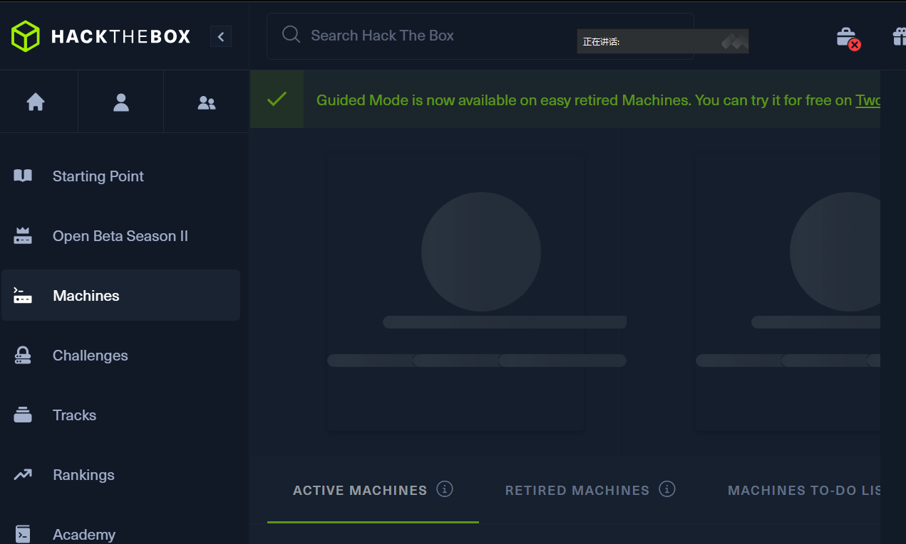
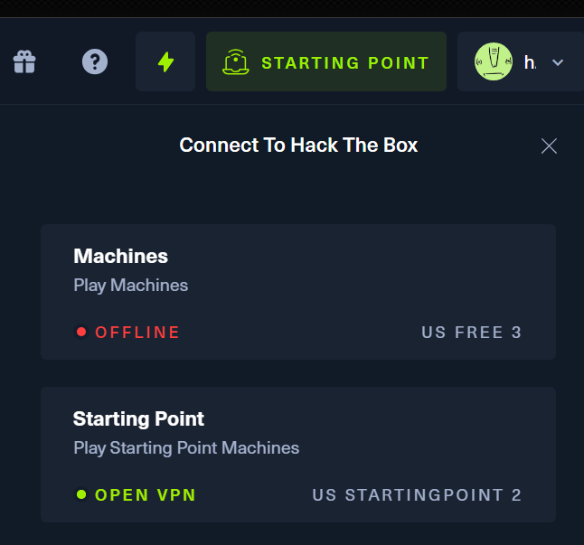
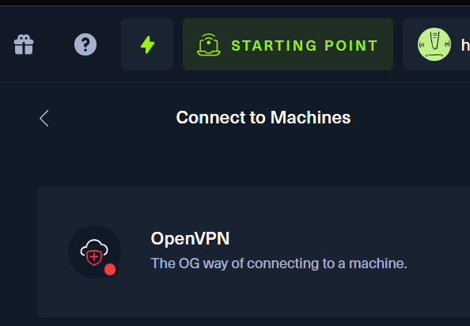
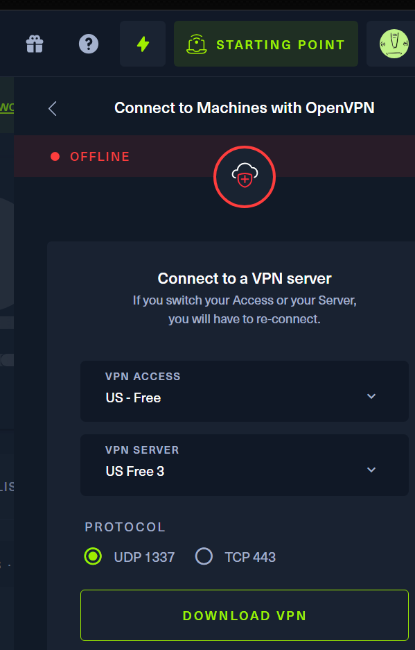
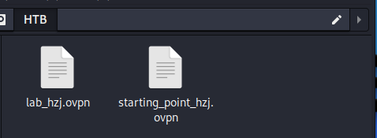
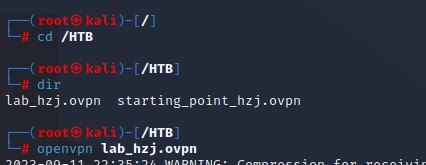
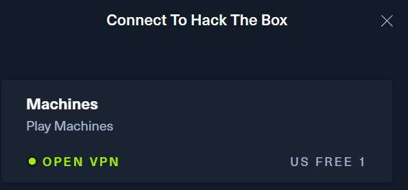

# machines

网址：https://app.hackthebox.com/machines

1.这是没有登录的状态，没有数据

2.查看Machines的状态，现在是离线状态

3. 通过OpenVPN下载登录用VPN

4.选择下载节点和服务器

5.下载文件后拉文件到kali_linux文件夹

6.在vpn文件的文件夹运行terminal执行以下命令 

~~~ shell
openvpn vpn文件名
~~~

7.执行后出现

~~~ shell
Initialization Sequence Completed
~~~

说明连接成功，重新打开https://app.hackthebox.com/machines发现已经登录成功。

