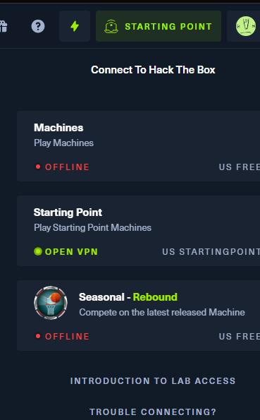
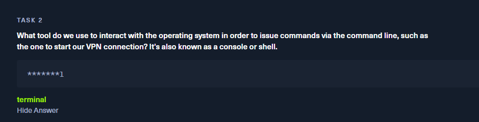

#  starting point

网址：https://app.hackthebox.com/starting-point

1. 注册用户
2. 登录用户
3. 进入网站首页

4.下载VPN

4.1. 选择第二个"Starting Point"

4.2.选择第一个"OpenVPN",这个不收费而第二个要收费

4.3.随便选一个VPN节点和服务器下载VPN文件

4.4.已经下载到靶机

5. 将文件从本地传入虚拟机中

5.1.安装VMWares Tools

虚拟机关机状态下发现 ”安装 VMware Tools“ 按钮是灰色无法点击

5.2.重新设置虚拟机的”CD/DVD(IDE)"选项选择“使用 ISO 映像文件”后点确定

5.3.登录到系统之前重新在第一步中的”安装 VMware Tools“上点击

5.4.登录到系统后发现第一步中相同的位置已经变成了“取消 VMware Tools 安装”,说实话这里我有点莫名其妙，看不到后台干了啥

5.5将文件直接从本机中拉入虚拟机中，发现文件直接出现在桌面

5.6.打开终端，切换root权限，用openvpn打开文件：

6.连接靶机

6.1.打开终端，切换root权限，用openvpn命令打开文件

6.2.回车后执行到下面这句话就已经成功

6.3.到hack the box网站上看已经登录成功了。

7.过关，攻击第一个靶机

7.1.问题1

7.2.问题2

7.3.问题3

7.4.问题4

7.5.问题5

7.6.问题6

7.7.问题7

7.8.问题8

这里让提交一个flag，实际上是让用kali linux结合刚刚学习到的知识去攻击第一台靶机。

在kali linux上执行以下命令：

~~~ shell
telnet target ip
~~~

~~~ shell
Meow login: root //root回车，免密码登录
~~~

~~~ shell
root@Meow:~# ls
flag.txt  snap
root@Meow:~# cat flag.txt
b40abdfe23665f766f9c61ecba8a4c19
~~~

