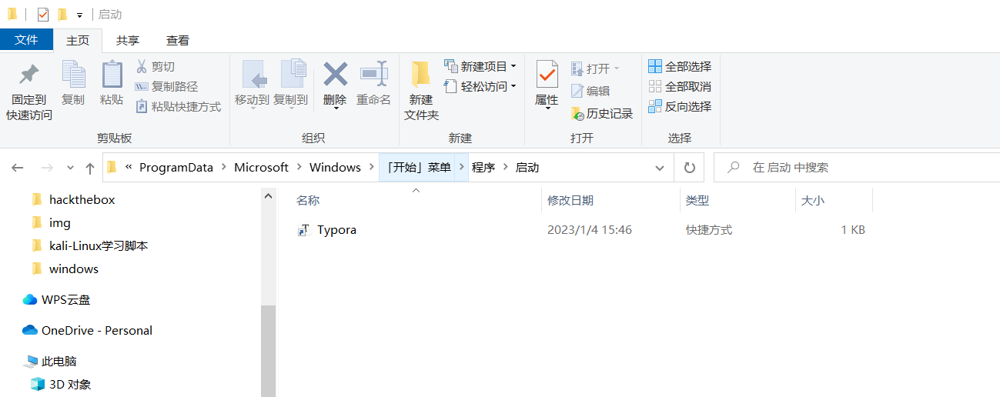
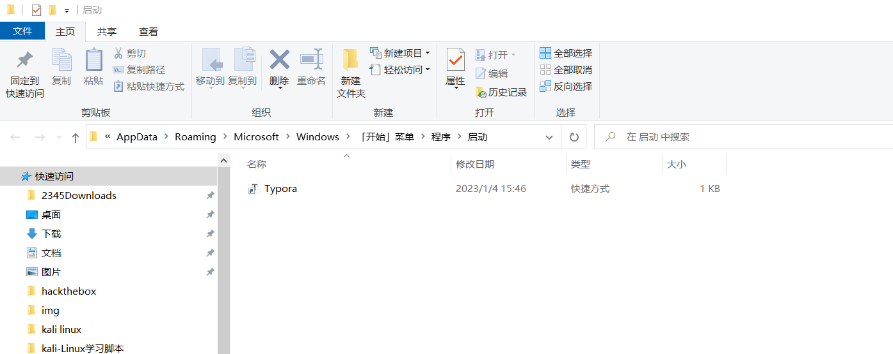

# 设置启动项

+ 针对win10系统

1.  把需要自启动的应用程序的快捷方式放到“系统启动文件夹”里，系统启动文件夹路径如下：

~~~ cmd
C:\ProgramData\Microsoft\Windows\Start Menu\Programs\StartUp
~~~

2. 按`win` + `R`，运行里输`shell:startup`，敲回车打开系统启动文件夹,再将快捷方式放入系统启动文件夹

3. 设置完成后可在任务管理器启动中，查看是否设置成功

