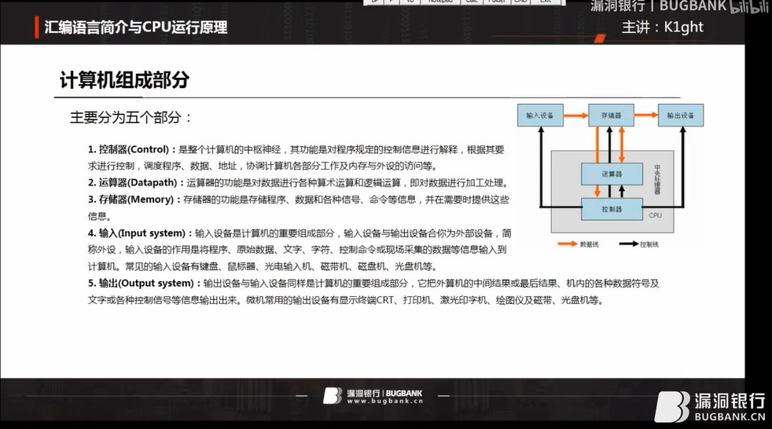
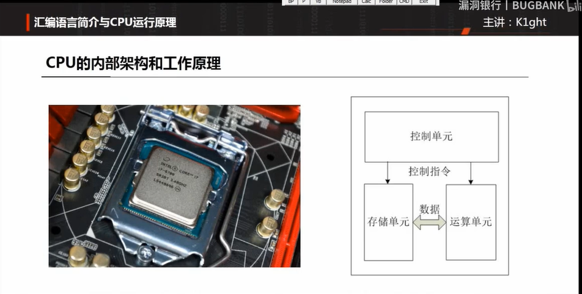
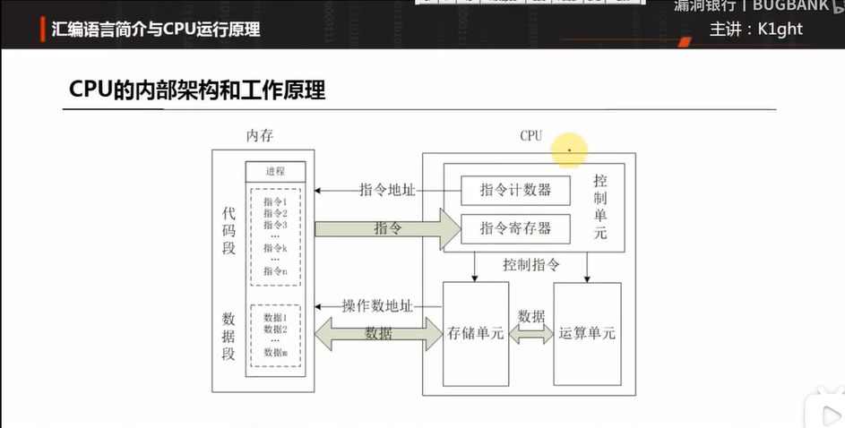
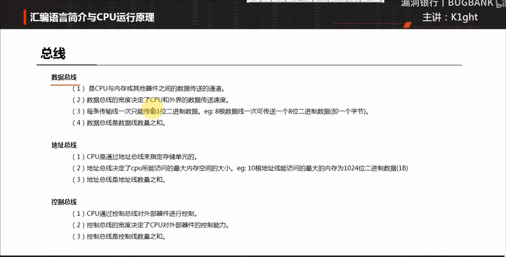
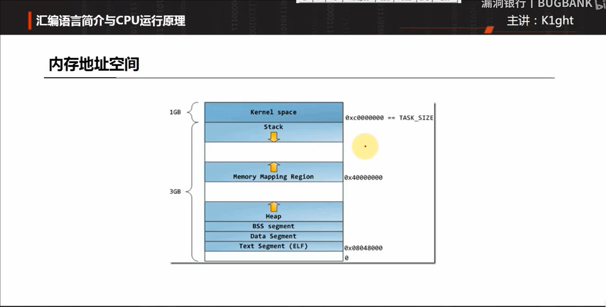
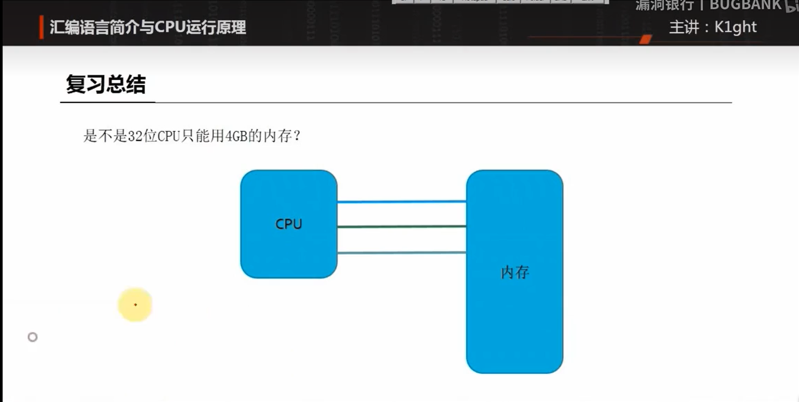

# [汇编基础热身](https://www.bilibili.com/video/BV18t411m71i/?spm_id_from=333.999.0.0&vd_source=1e325091774aa31c4dcd65d8667c69de)

windows脱壳一般分三大类：压缩壳、加密壳、VMP(即虚拟机壳)

其中，VMP即虚拟机壳是最复杂的壳

## OllyDbg

+ 下载地址：[OllyDbg v1.10](http://www.ollydbg.de/)

直接找到下载链接，然后下载解压缩即可运行<code>exe</code>文件

## 汇编语言介绍

~~~ tex
汇编语言是一种低级程序设计语言，也称为汇编代码。它是由机器指令和符号指令组成的，用于与计算机硬件进行直接交互。与高级编程语言相比，汇编语言更接近计算机底层的操作方式。

汇编语言使用助记符来表示机器指令，每个助记符对应着特定的操作。通过编写汇编语言程序，开发人员可以直接控制计算机的寄存器、内存和其他硬件资源，实现各种底层功能和算法。

汇编语言具有较高的执行效率和灵活性，常用于编写系统软件、驱动程序和嵌入式系统等需要直接操作硬件的场景。但是，汇编语言编程相对于高级语言编程来说更加复杂和繁琐，需要对计算机体系结构和指令集有深入的了解。
~~~

## 计算机组成部分

主要分为五个部分：

+ 控制器
+ 运算器
+ 存储器
+ 输入
+ 输出

## CPU内部架构和工作原理

## 汇编语言简介与CPU运行原理

Linux系统，内存共4G，其中Kernel space内核空间共1G，共用；

Stack是栈；Heap是堆；BSS/Text segment是数据段；Data segment是代码段；

## 复习总结

