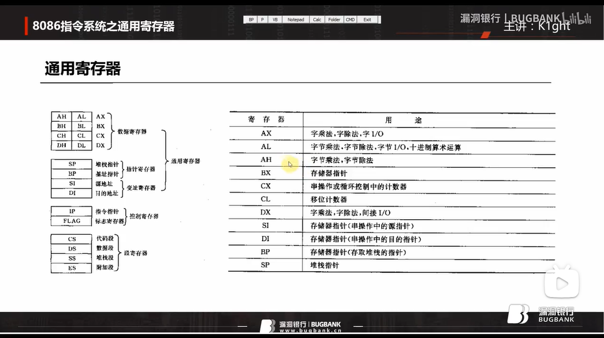
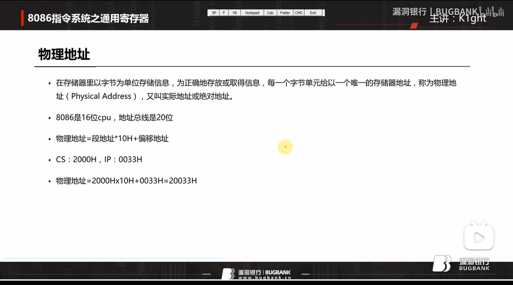

# 通用寄存器

+ 8086指令系统是16位指令系统；

## 通用寄存器

寄存器是CPU中除了运算器和控制器之外的部分

### 数据寄存器

数据寄存器是CPU可快速读取的存储空间，同时数据寄存器属于通用寄存器的一部分

+ 数据寄存器如：AX、CX、DX、BX
+ 1字节(如3C H，用十六进制表示)=8位(如00111100 B，用二进制表示)
+ 一个AX可装两字节（如十六进制ABCDH），分为高八位AH(装十六进制ABH，即二进制10101011)，低八位AL(装十六进制CDH，即二进制11001101)

## 几条汇编指令

+ nop，什么都不做

+ <code>move ax,18</code> 表示把十进制18（如是18 h则表示十六进制）放到寄存器<code>ax</code>里

+ <code>add ax,bx</code>表示将<code>ax</code>里及<code>bx</code>里的数据加起来再放到<code>ax</code>里

+ <code>add al，1</code>表示将<code>al</code>里数据加1后保存到<code>al</code>里

  ~~~tex
  有个问题：如果ax=00FFH，则add al,1 运行之后ax是多少？
  	如果ax=00FF H，则表示现在ax是十六进制下的00FF，此时十六进制下ah=00H/al=FFH，二进制下ah=00000000B/al=11111111B;
  	如果al里的原数据加上1，则二进制下al=100000000B，十六进制下al=100H，所以最后al=00H而其还有个进一不知道记录到了哪里反正不会保存到ah里ah还是00H；
  	所以最后ax=0000H,十六进制下ah=00H/al=00H,二进制下ah=00000000/al=00000000
  ~~~

+ <code>sub ax,1</code> 表示<code>ax</code>里的数据减去1后保存到<code>ax</code>里

~~~ tex
如果十六进制 ax=7000H ,则十六进制 sub ax,7001H 即相当于十六进制 0H-1H 后十六进制 ax=FFFFH（特殊情况，记住即可）
~~~

## 物理地址&字在内存中的存储

+ 物理地址=CS * 10H(十六进制下为16H,十进制下为16,二进制下为10000B) + IP
+ CS寄存器对应二进制的十六位，IP寄存器对应的也是二进制中的十六位；而CS段乘以10H（二进制为10000 B）后则对应20位二进制地址中的前十六位地址，IP则对应20位二进制地址中的后十六位地址；注意两者加起来不能超过二十位地址所能表达的最大地址（<code>FFFFFH</code>）否则会出现地址溢出
+ 16位<code>CPU</code>中叫<code>IP</code>,32位<code>CPU</code>中叫<code>EIP</code>，而<code>EIP</code>是32位寄存器足够表示20位地址所以对应的CPU中没有<code>CS</code>寄存器

## DS和[address]

## 栈

## SS和SP

[漏洞银行丨8086指令系统之通用寄存器丨逆向工程2_哔哩哔哩_bilibili](https://www.bilibili.com/video/BV1at411m7ay/?spm_id_from=333.880.my_history.page.click&vd_source=1e325091774aa31c4dcd65d8667c69de) 的25：35

