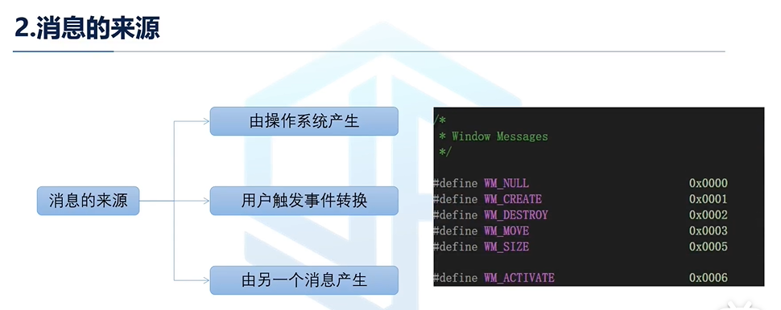
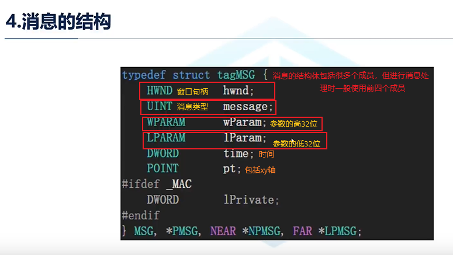
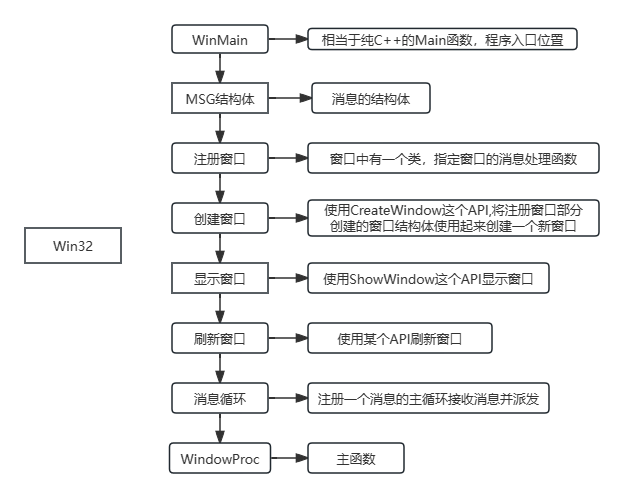

# 消息的基础概念

## Windows平台下开发程序的三种方式(C++)

+ 1. Windows开发包括SDK方式 开发、MFC方式开发、托管方式的开发

  1.PNG)

+ 2. 消息的来源：操作系统产生、用户触发事件转换、由另一个消息产生

+ 3. 消息的定义

| 前缀 | 说明       | 分割列 | 后缀 | 说明         |
| ---- | ---------- | ------ | ---- | ------------ |
| WM   | 普通窗口   | 分割列 | MCM  | 日历控件     |
| BM   | 按钮       | 分割列 | PBM  | 进度条       |
| CB   | 组合框     | 分割列 | PSM  | 属性         |
| CDM  | 通用对话框 | 分割列 | RB   | 伸缩条       |
| DBT  | 设备消息   | 分割列 | SB   | 状态栏       |
| DL   | 下拉列表   | 分割列 | STM  | 静态栏       |
| EM   | 编辑框     | 分割列 | TB   | 工具条       |
| HKM  | 热键       | 分割列 | TBM  | 跟踪条       |
| IPM  | IP控件     | 分割列 | TCM  | 标签控件     |
| LB   | 列表框     | 分割列 | TVM  | 树视图       |
| LVM  | 列表视图   | 分割列 | UDM  | 微调按钮控件 |

+ 4. 消息的结构

+ 5. SDK方式下的程序实现过程

**例子介绍:[01讲丨Windows消息机制基础](https://www.bilibili.com/video/BV1CU4y1t7E6/?spm_id_from=333.999.0.0&vd_source=1e325091774aa31c4dcd65d8667c69de)**的7：30开始

# 键盘消息的使用

# 鼠标消息的使用

# 自定义消息的使用

+ 学习视频：[01讲丨Windows消息机制基础](https://www.bilibili.com/video/BV1CU4y1t7E6/?spm_id_from=333.999.0.0&vd_source=1e325091774aa31c4dcd65d8667c69de)