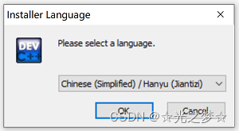
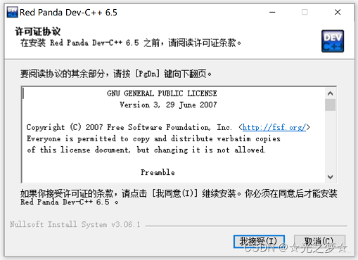
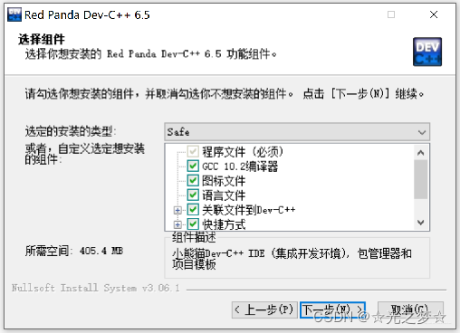
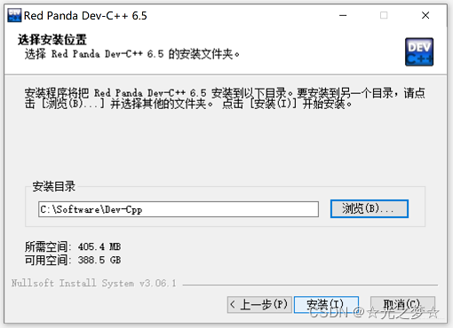
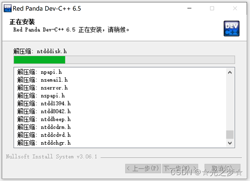
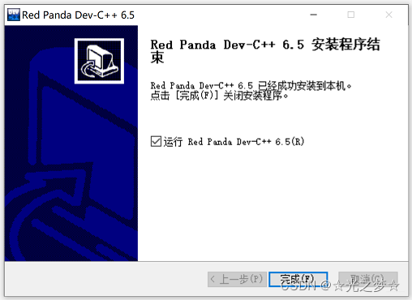
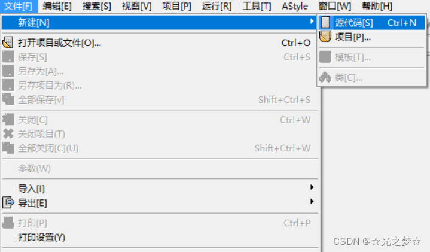
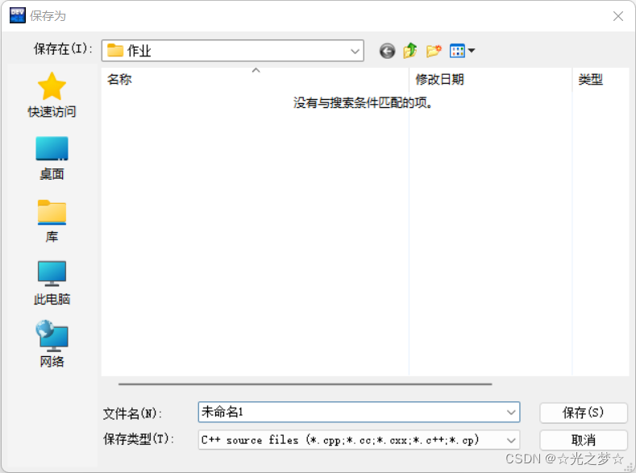

# 官方文档地址

+ [C语言参考手册](https://zh.cppreference.com/w/首页)
+ [Linux C编程一站式学习C文档 ](https://linux-c-learning-all-in-one.readthedocs.io/zh-cn/latest/前言.html)


# 一、🌿为什么要搭建本地环境🌿

1. **联网：在线编译环境涉及联网，如果没有网的情况下，我们就不能写代码了。**
2. **个性化：写代码是一辈子的事情，界面当然要搞得赏心悦目才能持久，本地环境可以配置字体和背景，支持个性化。**
3. **代码自动补全：字体高亮，代码补全 这些好用的功能，能够帮助你减少很多不必要编码错误**

<a name="5b74433c"></a>
# 二、🌿下载 DevC + +🌿

- Dev C++ 是一个轻量级的 C/C++ 集成编译环境，正因为是轻量级，所以还是有很多不太好用的地方，不过不用担心，对于教学来说已经足够了。

可以在腾讯电脑管家里下载DevC++,或者去DevC++ 的官网下

下面是下载链接：

[【Dev-C下载】2022年最新官方正式版Dev-C免费下载 - 腾讯软件中心官网 (qq.com)](https://pc.qq.com/detail/16/detail_163136.html)

[开发C++下载|SourceForge.net](https://sourceforge.net/projects/orwelldevcpp/)


# 三、🌿安装DevC++🌿


## 3.1、🔷语言选择

> **双击 DevCpp 的 exe 文件（可执行程序），会跳出如下对话框，初学者建议用中文。本次以DevC++6.5版本为例。如图所示：**


编辑


## 3.2、🔷我接受

> **同意安装，同意许可协议。操作如图：**



编辑


## 3.3、🔷下一步

> **按照默认的，什么都不要选，直接单击下一步就行。（一直单击下一步，直到出现安装为止）**



编辑

## 3.4、🔷选择安装位置

> **选择一个你熟悉的安装路径（最好放在D盘，不要装C盘，C盘留来装系统），点击安装。如图**



编辑

## 3.5、🔷等他装完

> **一直看着他，等他安装完就行，大概需要一分钟左右**



编辑


## 3.6、🔷单击完成

> **最后单击完成按钮即可**


编辑


# 四、🌿设置DevC++🌿

## 4.1、🔷选择语言

> **选择一个你常用的语言，推荐用中文。然后单击 Next**


编辑


## 4.2、🔷选择个性化颜色

> **选择一个你看着舒服的配色方案，推荐还是用默认，然后单击next**

# 五、🌿写代码🌿

## 5.1、🔷新建源代码

> **单击界面左上角的 【文件】——【新建】，选择【源代码】。如图**


编辑


## 5.2、🔷写代码

> **写下属于你的第一行代码吧。我们这里以 hello world 为例**


```cpp
#include <stdio.h>

int main()
{
    printf("hello world!")
    return 0;
}
```


## 5.3、🔷保存

> **可以按+~~键来保存，也可以单击菜单“文件”中的保存按钮。~~**
>  
> **注：DevC++中的每个文件第一次保存都会弹出保存为对话框。如图**




**注：C语言的程序必须要先编译再运行**

**完成以上所以步骤你的C语言在编译器DevC++就全部安装好啦**
