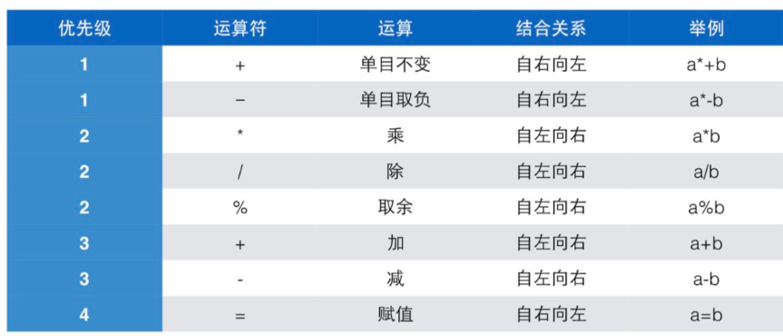

# 一、运算符🌿


## **🎇1.1 定义**

**运算符**是指进行运算的**动作**，比如加法运算符"+"，减法运算符"-"

**算子**是指参与运算的**值**，这个值可能是**常数**，也可能是**变量**，还可能是一个方法的**返回值**


## **🎇1.2 单目运算符**

> **只有一个**算子的运算符： +,-


例如-a，-b，+a，+b

**常用的单目运算符**:

`+`                                                    正值

`-`                                                   负值

`！`                                                  逻辑反

`&`                                                  取地址

`sizeof`                                            

                  操作数的类型长度（计算的是变量/类型所占空间的大小，单位是字节）

~                                    对一个数的二进制按位取反

（类型）                                   强制类型转换


## 🎇**1.3 双目运算符**

- **我们已知，只有一个算子**的运算符是**单目运算符**
- **那么，** 有**两个算子**的运算符就是**双目运算符**
- 如：a+b，b-a
- **那么**，有**三个算子**的运算符就是**三目运算符**


## 🎇**1.4 赋值运算符**

> **赋值**（=） 也是**运算**，也有结果

**举个栗子**：

a=6的结果是**a**被赋予的**值**，也就是6

a=b=6在计算机中可以看成是：a = (b=6)，也就是，**先**把6赋给b（此时b的值就是6），**然后**再把b的值（6）赋给a，所以a的值也是6

`=`  `+=`  `-=`  `*=`  `/=`  `&=`  `^=`  `I=`  `>>=`  `<<=`


### **用法**:

a+=3              相当于：a=a+3

a-_=6               相当于：a=a-_6

**代码示例如下**：

```c
#include <stdio.h>

int main()
{
    int a=6,b=6;                  //初始化
    
    a+=3;                         //计算
    b=b+3;
    
    printf("a=%d,b=%d\n",a,b);     //输出运算结果
     
    return 0;
}
```

**运行结果：**

```
a=9，b=9
```

解析：

a+=3 相当于 a=a+3,把a=6的值代入得：a=6+3 a的值：9


## 🎇**1.5 运算符优先级**
<br />


## 🎇**1.6 算数运算符（特别重要）**

-  ＋
```
                                  加法运算符
```


-  -
```
                                  减法运算符
```


-  *
```
                                  乘法运算符
```


/                                       除法运算符

%                                       取余运算符


### / 的用法:

```
int a,b,c,d,e,f,g;

a=5/2;
b=12345/10000;
c=12345/1000;
d=12345/100;
e=12345/10;

printf("a=%d\nb=%d\nc=%d\nd=%d\ne=%d",a,b,c,d,e);
```

**运行结果**:

```
a=2
b=1
c=12
d=123
e=1234
```

**解析**：

a=5/2

5/2=2.5,由于a是整型（int)，整形不包含小数部分，在计算时会把小数部分**全部舍弃**，所以a=5/2中a的结果是2

b=12345/10000  与e=12345/10 (我的想法：12345/10000，**除数有几个零，被除数就舍弃几位数**，如12345/10000，除数有4个零，那么被除数就舍弃后面四位数，所以答案就是：1)


> 由于b与e是整型（int)，整形不包含小数部分，在计算时会把小数部分全部舍弃


所以b的值为1，e的值为1234。

计算过程如下:


### % (取余) 的用法:

```
int a,b,c,d,e;

a=1%3;
b=1%2;
c=30%90;
d=12345%10000;
e=12345%10;

printf("a=%d\nb=%d\nc=%d\nd=%d\ne=%d",a,b,c,d,e);
```

**运行结果**

```
a=1
b=1
c=30
d=2345
e=5
```

**解析：**


a=1%3，c=30%90的解析如右 ，1向3取余，1除以3余1。同上30%90=30

1%2  1向2取余   1除以2=0.5，由于是int类型会舍弃小数，所以1/2的值只能是0，所以原来的除数1，还会留下了，所以1%2=1

d=12345%10000，e=12345%10


如图，所以**12345除以10000的余数就是：2345，12345除以10，余5**

所以  ：d=12345%10000=2345，e=12345%10=5


## 🎇**1.7 关系运算符**

"=="                                  判断相等

"！="                                   不等于

">"                                      大于

"<"                                      小于

">="                                   大于等于

"<="                                   小于等于

关系运算符的结果：判断如果结果是 true（真） 则为 1

判断如果结果是 false（假）则为 0

### **用法**：

```
int a=7,b=3,c;

a==b        //的值是0，因为a不等于b，所以是false（假），所以值是0
a!=b        //的值是1，a不等于b，判断正确，所以是true（真），所以值是1
```


## 🎇**1.8 逻辑运算符**

**逻辑运算**是对**逻辑量**进行的运算，**结果只有0或者1**

**逻辑量**是**关系运算**或**逻辑运算**的结果


**用代码表示：**

**a大于等于1，小于等于6**

```
a>=1 && a<=6;
```

**逻辑优先级**

! > && > ||


### 短路：

1. **逻辑运算是自左向右进行的，如果左边的结果已经能够决定结果了，就不会做右边的计算了**
2. **对于&&，左边是false时就不会做右边的运算了**
3. **对于||，左边是true时就不会做右边的运算了**
4. **不要把赋值，包括复合赋值组合进表达式**


### 总体优先级排名：
|  |  |  |
| --- | --- | --- |
| 优先级 | 运算符 | 结合性 |
| 1 | () | 从左到右 |
| 2 | ！+- ++ -- | 从右到左(单目的+和-) |
| 3 | -   / % | 从左到右 |
| 4 | + - | 从左到右 |
| 5 | < <= > >= | 从左到右 |
| 6 | == != | 从左到右 |
| 7 | && | 从左到右 |
| 8 |  |  |
| 9 | = += -= *= /= %= | 从右到左 |


## 🎇**1.9 位运算符**

"&"                                          按位与

"I"                                           按位或

"<<"                                         左移

">>"                                         右移


## 🎇**1.10 条件运算符**:

？  ：   ;

**如**:

```
int count=30;

count = (count>20)？count-10：count+10;

意思是如果条件满足，count如果>20;则count-10，否则就是执行count+10
```

也就是说：当count>20是 真（非零或1) 的时候执行前者，是 假(0) 执行后者

优先级**:**条件运算符**的优先级**高于**赋值运算符，但是**低于**其他运算符


## 🎇**1.11 逗号运算符**

**逗号**用来连接两个表达式，并以其**右边的表达式的值**作为它的**结果**。逗号的**优先级**是所有运算符中**最低**的，所以**它两边的表达式会先计算**;逗号的组合关系是**自左向右**，所以**左边**的表达式会**先计算**，而**右边**的表达式的**值**就留下来**作为逗号运算的结果**
