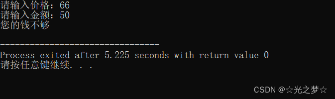
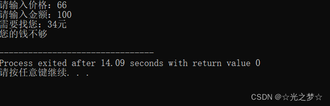

# 一、if 语句的基本结构

> **if （条件成立）{**

> **......**

> **}**


解析：

**if 代表的意思是如果，（）内是判断是否执行 if 语句的条件，{ }内的…… 代表 if 要执行的内容**

**if 语句 不循环，条件满足只执行一次 if 内的语句，条件不满足就跳过 if 语句**


# 二、 if 语句的基本用法

光说不练是肯定学不会的，接下来让我们在实战中来学习与掌握 if 语句


## 2.1 项目一 找钱

> **要求：计算并打印找钱，或告知用户余额不足以购买。**


代码示例：

```cpp
//初始化，定义两个变量，一个价格price，一个金额bill
int price = 0;
int bill = 0;

//读入价格和金额
printf("请输入价格：");
scanf("%d",&price);
printf("请输入金额：");
scanf("%d",&bill);

//判断找钱
if( bill >= price){
   printf("需要找您：%d元\n",bill - price);
}
```


**万一金额不够，我们还要输出：您的钱不够**

我们该怎么输呢？

```cpp
if( bill >= price){
   printf("需要找您：%d元\n",bill - price);
}
printf("您的钱不够\n");
```


这样输肯定不对，因为这种情况不管钱够不够都会输出 您的钱不够

请看下方运行结果：

编辑

编辑

**因为 printf("您的钱不够\n"); 不在 if 语句中，if语句如果条件不成立也不会跳过它，所以不管钱够不够都会输出 您的钱不够**

所以我们需要用到else


## 2.2 else的用法

> **else = 否则的话**


要输出 您的钱不够 正确的做法是：

```cpp
if( bill >= price){
   printf("需要找您：%d/n元"，bill - price);
}else{
   printf("您的钱不够\n");
}
```


这个代码的意思是：**当 if 语句条件不满足（也就是bill<price）时，也就是else（否则的话），执行else中的语句。打印：您的钱不够**


## 2.3 项目二 比较数的大小

> **要求：随机输入两个数，比较这两数中哪个数最大**


**比较数的大小（方案一） 纯 if**

```cpp
int a,b;
printf("请输入两个整数：");
scanf("%d %d", &a, &b); 

int max = 0;
if(a>b){
    max = a;
}
if(b>a){
    max = b;
}
printf("最大的那个数是%d\n", max);
```


**比较数的大小（方案二） if else（更推荐）**

```cpp
int a,b;
printf("请输入两个整数");
scanf("%d %d",&a,&b);

int max=0;

if(a>b){
    max=a;
}else{
    max=b;
}

printf("最的大那个数是：%d\n",max);
```


**比较数的大小（方案三） 先让其中一个数为最大值**

```cpp
int a,b;
printf("请输入两个整数：");
scanf("%d %d", &a, &b); 

int max = b;
if(a>b){
    max = a;
}

printf("大的那个是%d\n", max);
```


## 2.4 关于大括号{}

> **if与else也可以不带中括号去执行(非常不建议)，条件满足只能执行if接下来的一句内容，如果带来中括号{}，条件满足则可以执行{}内的全部内容**


**例如：**

```cpp
int a=3,b=4;
int max;

if(a>b)
    printf("max=a");
else
    printf("max=b");

printf("max=%d\n",max);
```

**注：即使只有一条语句的时候也要在 if 或者 else 后面总是用{}，这样做可以降低报错率**


# 三、分支

## 3.1 嵌套的 if 语句

> **当 if 的条件满足或者不满足的时候要执行的语句也可以是一条 if 或者 if-else 语句，这就是嵌套的if语句**

**代码示例如下;**

```cpp
int a=3,b=6;
int count=10;

if(count>=0){
    if(a>b){
        printf("一切正常");
    }else{
        printf("程序有问题");   
    }
}
```

**运行结果：**

编辑


## 3.2 else 的配对

> **else总是和最近的那个 if 匹配，且与缩进无关**


代码示例如下：

```cpp
int code,a,count=18;
	
printf("请输入code的值：");
scanf("%d",&code);
	
printf("请输入a的值：");
scanf("%d",&a);

if( code<=0)
    if( count < 20 )
        printf("一切正常\n");
else
        printf("继续等待\n");
```


运行结果：

编辑

**解析：由于code=3，大于0，所以 if 语句的条件code<=0不满足，所以就会跳过 if 语言，而 else总是和最近的那个 if 匹配，并且与缩进无关，所以这个else是与 if （count<20）匹配，不是与 if （code<=0）匹配。**


## **3.3 用 if else 语句来表示分段函数**

```cpp
if( x < 0 ){
  f = -1;
}else if( x == 0){
  f = 0;
} else {
  f = 2 * x;
}
```


## **3.4 if 语句的常见错误**

- **忘了大括号(永远在if和else后面加上大括号，即使当时后面只有一条语句)**
- **if后面忘了分号**
- **错误使用==和=**
- **使人困惑的else**
