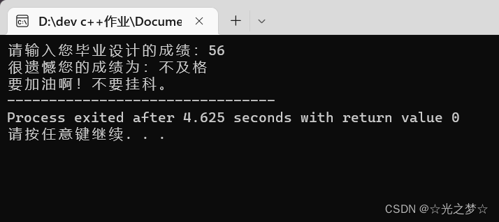

# **一、switch case 语句的基本结构**

> **switch（控制表达式）**

> **{**

>     **case 常量: 语句;**

>     **case 常量: 语句;**

>     **default: 语句;**

> **}**


**也可以这么表示：**

```cs
switch(控制表达式){
case常量:
        语句
        ...
case常量：
        语句
        ...
default：
        语句
        ...
}
```


**switch case语句在C语言中还是比较常用的,所以一定要学好它哦。**


# **二、switch case 语句的概念**

> **switch case 语句：根据表达式的结果，寻找匹配的case，并执行case后面的语句，一直到break为止，如果没有遇到 break 那就接着执行下面的语句。如果所有的case都不匹配，那么就执行default 后面的语句；如果没有default，那么程序就什么都不会执行，直接跳过switch case 语句。**

**注意哦：**

- **switch case 语句的结果只能是整数（int）类型**
- **控制表达式只能是整数型的结果**
- **常量可以是常数，也可以是常数计算的表达式**


# **三、break**

> **break 在程序中是代表 “结束” 的意思**

**break 在英文中有：休息，停留，结束的意思。**

**switch语句可以看作是一种基于计算的跳转，计算控制表达式的值后，程序会跳转到相匹配的 case（分支标号）处。case（分支标号）只是说明switch内部位置的路标，在执行完分支中的最后一条语句后，如果后面没有break，就会顺序执行到下面的case里去，直到遇到一个 break 就结束 ，或者直到 switch 语句结束为止。**


# 四、continue


## **4.1 continue的概念**

> **continue:跳过循环这一轮剩下的语句进入下一轮**


## 4.2 continue VS break

**异：**

- **break:跳出循环**
- **continue:跳过循环这一轮剩下的语句进入下一轮**

**同：**

- **都只能对它所在的那层循环生效**


# 五、switch case 语句的基本用法


## 5.1 判断成绩等级

> **某学校毕业设计成绩评定等级的规则如下：**

> **成绩 >= 90分，为优秀**

> **80分 <= 成绩 <90分，为良好**

> **70分 <= 成绩 <80分，为中等**

> **60分 <= 成绩 70<分，为及格**

> **成绩<60分，为不及格**

> **请编写程序，根据输入成绩，计算并输出成绩评定等级。**


**代码示例：**

```cpp
#include <stdio.h>

int main()
{
    //定义一个grade变量用来存放成绩
	int grade;
    
	printf("请输入您毕业设计的成绩：");
	scanf("%d",&grade);
	   
    //判断输入的成绩是否超过100
	if(grade<=100){
    
    	//如果没有超过一百，据题意那就保留十位数部分去掉个位数部分
		grade=grade/10;
    
		switch(grade)
    	{
            /* 因为不管是100还是90以上都是：优秀。所以根据switch case 语句的语法
            如果没有遇到 break 那就接着执行下面的语句 */
            case 10:
            case 9:
                printf("恭喜您！您的成绩为：优秀");
                break;
            case 8:
                printf("您的成绩为：良好");
                break;
            case 7:
                printf("您的成绩为：中等");
                break;
            case 6:
                printf("您的成绩为：及格");
                break;
            default :
                printf("很遗憾您的成绩为：不及格\n要加油啊！不要挂科。"); 
        }

    }else            //如果输入的数超过100，则输出：输入错误 
    {
		printf("输入错误！"); 
	}
	return 0;
}
```


**运行结果：**



编辑


## 5.2 switch case 语句 与 if 语句的互换

**switch case语句通常可以和 if else 语句互换**

**比如上面那个判断成绩等级的代码，也可以用 if else 语句来表示**

**例如：**

    **case 10:<br />
     case 9:<br />
           printf("恭喜您！您的成绩为：优秀");<br />
           break;**

**可以换成：**

    **if (grade10 || grade9)
         {
           printf("恭喜您！您的成绩为：优秀");
         }**

**具体代码如下：**

```cpp
#include <stdio.h>

int main()
{
	int grade;
	printf("请输入您毕业设计的成绩：");
	scanf("%d",&grade);
	
	if(grade<=100)
	{
		grade=grade/10;
	    if(grade==10 || grade==9)
	    {
	        printf("恭喜您！您的成绩为：优秀");
	    }
	    else if(grade==8)
	    {
	        printf("您的成绩为：良好");
	    }
		else if(grade==7)
	    {
	        printf("您的成绩为：中等");
	    }
	    else if(grade==6)
	    {
	        printf("您的成绩为：及格");
	    }
	    else
	    {
	        printf("很遗憾您的成绩为：不及格\n要加油啊！不要挂科。"); 
	    }
		
	}
	else
	{
		printf("输入错误！"); 
	}
	
	return 0;
}
```


# 小结：

**（重要的事当然需要再说一遍啦，以便大家加深印象）**

1. **switch case 语句的结果只能是整数（int）类型**
2. **控制表达式只能是整数型的结果**
3. **常量可以是常数，也可以是常数计算的表达式**
4. **break 在程序中是代表 “结束” 的意思**


