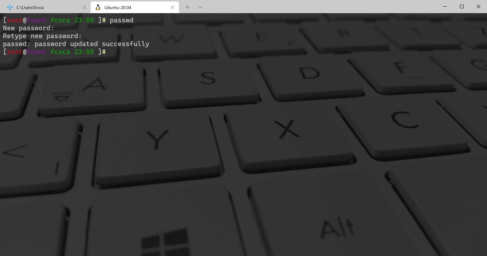

# C/C++ Clion

## 个性化setting文件
[settings.zip](https://www.yuque.com/attachments/yuque/0/2021/zip/396745/1638973902151-80dd63a4-50c9-49b4-b227-fe3a3cc6fa1b.zip?_lake_card=%7B%22src%22%3A%22https%3A%2F%2Fwww.yuque.com%2Fattachments%2Fyuque%2F0%2F2021%2Fzip%2F396745%2F1638973902151-80dd63a4-50c9-49b4-b227-fe3a3cc6fa1b.zip%22%2C%22name%22%3A%22settings.zip%22%2C%22size%22%3A7986%2C%22type%22%3A%22application%2Fx-zip-compressed%22%2C%22ext%22%3A%22zip%22%2C%22status%22%3A%22done%22%2C%22taskId%22%3A%22u48f8bdcd-4c37-44a3-90e6-9cf733192d7%22%2C%22taskType%22%3A%22upload%22%2C%22id%22%3A%22uaa2509fa%22%2C%22card%22%3A%22file%22%7D)

## 1、配置Visual Studio作为开发的SDK
:::danger
Clion官方文档提示：请注意，目前不支持 NMake作为加载 Makefile 项目的工具链，因此不能直接使用 Visual Studio 工具链，为了使用它，需要使用 GNU Make 单独构建项目。

[https://www.jetbrains.com/help/clion/2021.1/makefiles-support.html#makefile-settings](https://www.jetbrains.com/help/clion/2021.1/makefiles-support.html#makefile-settings)


:::

### 下载Visual Studio安装工具
官网：[https://visualstudio.microsoft.com/zh-hans/vs/](https://visualstudio.microsoft.com/zh-hans/vs/)


[vs_community__816328241.1590838898.zip](https://www.yuque.com/attachments/yuque/0/2021/zip/396745/1624801821646-3a920ad9-fcb1-4ef6-a56e-d61574ccd2d7.zip?_lake_card=%7B%22src%22%3A%22https%3A%2F%2Fwww.yuque.com%2Fattachments%2Fyuque%2F0%2F2021%2Fzip%2F396745%2F1624801821646-3a920ad9-fcb1-4ef6-a56e-d61574ccd2d7.zip%22%2C%22name%22%3A%22vs_community__816328241.1590838898.zip%22%2C%22size%22%3A1342453%2C%22type%22%3A%22application%2Fx-zip-compressed%22%2C%22ext%22%3A%22zip%22%2C%22status%22%3A%22done%22%2C%22taskId%22%3A%22ua20ebf13-c52a-42ed-9269-ad46f1486a2%22%2C%22taskType%22%3A%22upload%22%2C%22id%22%3A%22u6f80c4ac%22%2C%22card%22%3A%22file%22%7D)

### 通过安装工具下载对应的工具包


### 在CLion中进行配置
<br />

## 2、配置MinGW作为开发的SDK
:::danger
注意：不能使用MinGW做CU开发，否则会出现如下报错：
:::

```bash
D:\LinkSpace\Download\Jetbrains\CLion-2021.1.2.win\bin\cmake\win\bin\cmake.exe -DCMAKE_BUILD_TYPE=Debug -DCMAKE_MAKE_PROGRAM=D:/LinkSpace/Download/DevelopPackage/MinGW/bin/mingw32-make.exe -DCMAKE_C_COMPILER=D:/LinkSpace/Download/DevelopPackage/MinGW/bin/gcc.exe -DCMAKE_CXX_COMPILER=D:/LinkSpace/Download/DevelopPackage/MinGW/bin/g++.exe -G "CodeBlocks - MinGW Makefiles" D:\LinkSpace\Work\WorkSpace\Code\CLion\das
-- The CUDA compiler identification is NVIDIA 10.2.89
-- The CXX compiler identification is GNU 6.3.0
-- The C compiler identification is GNU 6.3.0
-- Detecting CUDA compiler ABI info
-- Detecting CUDA compiler ABI info - failed
-- Check for working CUDA compiler: C:/Program Files/NVIDIA GPU Computing Toolkit/CUDA/v10.2/bin/nvcc.exe
-- Check for working CUDA compiler: C:/Program Files/NVIDIA GPU Computing Toolkit/CUDA/v10.2/bin/nvcc.exe - broken
CMake Error at D:/LinkSpace/Download/Jetbrains/CLion-2021.1.2.win/bin/cmake/win/share/cmake-3.19/Modules/CMakeTestCUDACompiler.cmake:52 (message):
  The CUDA compiler

    "C:/Program Files/NVIDIA GPU Computing Toolkit/CUDA/v10.2/bin/nvcc.exe"

  is not able to compile a simple test program.

  It fails with the following output:

    Change Dir: D:/LinkSpace/Work/WorkSpace/Code/CLion/das/cmake-build-debug-mingw/CMakeFiles/CMakeTmp
    
    Run Build Command(s):D:/LinkSpace/Download/DevelopPackage/MinGW/bin/mingw32-make.exe cmTC_f1f91/fast && D:/LinkSpace/Download/DevelopPackage/MinGW/bin/mingw32-make.exe  -f CMakeFiles\cmTC_f1f91.dir\build.make CMakeFiles/cmTC_f1f91.dir/build
    mingw32-make.exe[1]: Entering directory 'D:/LinkSpace/Work/WorkSpace/Code/CLion/das/cmake-build-debug-mingw/CMakeFiles/CMakeTmp'
    Building CUDA object CMakeFiles/cmTC_f1f91.dir/main.cu.obj
    C:\PROGRA~1\NVIDIA~2\CUDA\v10.2\bin\nvcc.exe -forward-unknown-to-host-compiler   -D_WINDOWS -Xcompiler="/W3 /GR /EHsc"  -Xcompiler="-MDd -Zi -Ob0 -Od /RTC1" -x cu -c D:\LinkSpace\Work\WorkSpace\Code\CLion\das\cmake-build-debug-mingw\CMakeFiles\CMakeTmp\main.cu -o CMakeFiles\cmTC_f1f91.dir\main.cu.obj -Xcompiler=-FdCMakeFiles\cmTC_f1f91.dir/,-FS
    c:\program files\nvidia gpu computing toolkit\cuda\v10.2\include\cuda_runtime_api.h(9348): warning C4819: 鐠囥儲鏋冩禒璺哄瘶閸氼偂绗夐懗钘夋躬瑜版挸澧犳禒锝囩垳妞わ拷(936)娑擃叀銆冪粈铏规畱鐎涙顑侀妴鍌濐嚞鐏忓棜顕氶弬鍥︽娣囨繂鐡ㄦ稉锟� Unicode 閺嶇厧绱℃禒銉╂Щ濮濄垺鏆熼幑顔绘丢婢讹拷
    c:\program files\nvidia gpu computing toolkit\cuda\v10.2\include\cuda_runtime_api.h(9348): warning C4819: 鐠囥儲鏋冩禒璺哄瘶閸氼偂绗夐懗钘夋躬瑜版挸澧犳禒锝囩垳妞わ拷(936)娑擃叀銆冪粈铏规畱鐎涙顑侀妴鍌濐嚞鐏忓棜顕氶弬鍥︽娣囨繂鐡ㄦ稉锟� Unicode 閺嶇厧绱℃禒銉╂Щ濮濄垺鏆熼幑顔绘丢婢讹拷
    c:\program files\nvidia gpu computing toolkit\cuda\v10.2\include\cuda_runtime_api.h(9348): warning C4819: 鐠囥儲鏋冩禒璺哄瘶閸氼偂绗夐懗钘夋躬瑜版挸澧犳禒锝囩垳妞わ拷(936)娑擃叀銆冪粈铏规畱鐎涙顑侀妴鍌濐嚞鐏忓棜顕氶弬鍥︽娣囨繂鐡ㄦ稉锟� Unicode 閺嶇厧绱℃禒銉╂Щ濮濄垺鏆熼幑顔绘丢婢讹拷
    c:\program files\nvidia gpu computing toolkit\cuda\v10.2\include\cuda_runtime_api.h(9348): warning C4819: 鐠囥儲鏋冩禒璺哄瘶閸氼偂绗夐懗钘夋躬瑜版挸澧犳禒锝囩垳妞わ拷(936)娑擃叀銆冪粈铏规畱鐎涙顑侀妴鍌濐嚞鐏忓棜顕氶弬鍥︽娣囨繂鐡ㄦ稉锟� Unicode 閺嶇厧绱℃禒銉╂Щ濮濄垺鏆熼幑顔绘丢婢讹拷
    c:\program files\nvidia gpu computing toolkit\cuda\v10.2\include\cuda_runtime_api.h(9348): warning C4819: 鐠囥儲鏋冩禒璺哄瘶閸氼偂绗夐懗钘夋躬瑜版挸澧犳禒锝囩垳妞わ拷(936)娑擃叀銆冪粈铏规畱鐎涙顑侀妴鍌濐嚞鐏忓棜顕氶弬鍥︽娣囨繂鐡ㄦ稉锟� Unicode 閺嶇厧绱℃禒銉╂Щ濮濄垺鏆熼幑顔绘丢婢讹拷
    c:\program files\nvidia gpu computing toolkit\cuda\v10.2\include\cuda_runtime_api.h(9348): warning C4819: 鐠囥儲鏋冩禒璺哄瘶閸氼偂绗夐懗钘夋躬瑜版挸澧犳禒锝囩垳妞わ拷(936)娑擃叀銆冪粈铏规畱鐎涙顑侀妴鍌濐嚞鐏忓棜顕氶弬鍥︽娣囨繂鐡ㄦ稉锟� Unicode 閺嶇厧绱℃禒銉╂Щ濮濄垺鏆熼幑顔绘丢婢讹拷
    c:\program files\nvidia gpu computing toolkit\cuda\v10.2\include\cuda_runtime_api.h(9348): warning C4819: 鐠囥儲鏋冩禒璺哄瘶閸氼偂绗夐懗钘夋躬瑜版挸澧犳禒锝囩垳妞わ拷(936)娑擃叀銆冪粈铏规畱鐎涙顑侀妴鍌濐嚞鐏忓棜顕氶弬鍥︽娣囨繂鐡ㄦ稉锟� Unicode 閺嶇厧绱℃禒銉╂Щ濮濄垺鏆熼幑顔绘丢婢讹拷
    c:\program files\nvidia gpu computing toolkit\cuda\v10.2\include\cuda_runtime_api.h(9348): warning C4819: 鐠囥儲鏋冩禒璺哄瘶閸氼偂绗夐懗钘夋躬瑜版挸澧犳禒锝囩垳妞わ拷(936)娑擃叀銆冪粈铏规畱鐎涙顑侀妴鍌濐嚞鐏忓棜顕氶弬鍥︽娣囨繂鐡ㄦ稉锟� Unicode 閺嶇厧绱℃禒銉╂Щ濮濄垺鏆熼幑顔绘丢婢讹拷
    c:\program files\nvidia gpu computing toolkit\cuda\v10.2\include\cuda_runtime_api.h(9348): warning C4819: 鐠囥儲鏋冩禒璺哄瘶閸氼偂绗夐懗钘夋躬瑜版挸澧犳禒锝囩垳妞わ拷(936)娑擃叀銆冪粈铏规畱鐎涙顑侀妴鍌濐嚞鐏忓棜顕氶弬鍥︽娣囨繂鐡ㄦ稉锟� Unicode 閺嶇厧绱℃禒銉╂Щ濮濄垺鏆熼幑顔绘丢婢讹拷
    c:\program files\nvidia gpu computing toolkit\cuda\v10.2\include\cuda_runtime_api.h(9348): warning C4819: 鐠囥儲鏋冩禒璺哄瘶閸氼偂绗夐懗钘夋躬瑜版挸澧犳禒锝囩垳妞わ拷(936)娑擃叀銆冪粈铏规畱鐎涙顑侀妴鍌濐嚞鐏忓棜顕氶弬鍥︽娣囨繂鐡ㄦ稉锟� Unicode 閺嶇厧绱℃禒銉╂Щ濮濄垺鏆熼幑顔绘丢婢讹拷
    c:\program files\nvidia gpu computing toolkit\cuda\v10.2\include\cuda_runtime_api.h(9348): warning C4819: 鐠囥儲鏋冩禒璺哄瘶閸氼偂绗夐懗钘夋躬瑜版挸澧犳禒锝囩垳妞わ拷(936)娑擃叀銆冪粈铏规畱鐎涙顑侀妴鍌濐嚞鐏忓棜顕氶弬鍥︽娣囨繂鐡ㄦ稉锟� Unicode 閺嶇厧绱℃禒銉╂Щ濮濄垺鏆熼幑顔绘丢婢讹拷
    c:\program files\nvidia gpu computing toolkit\cuda\v10.2\include\cuda_runtime_api.h(9348): warning C4819: 鐠囥儲鏋冩禒璺哄瘶閸氼偂绗夐懗钘夋躬瑜版挸澧犳禒锝囩垳妞わ拷(936)娑擃叀銆冪粈铏规畱鐎涙顑侀妴鍌濐嚞鐏忓棜顕氶弬鍥︽娣囨繂鐡ㄦ稉锟� Unicode 閺嶇厧绱℃禒銉╂Щ濮濄垺鏆熼幑顔绘丢婢讹拷
    c:\program files\nvidia gpu computing toolkit\cuda\v10.2\include\sm_20_intrinsics.h: warning C4819: 鐠囥儲鏋冩禒璺哄瘶閸氼偂绗夐懗钘夋躬瑜版挸澧犳禒锝囩垳妞わ拷(936)娑擃叀銆冪粈铏规畱鐎涙顑侀妴鍌濐嚞鐏忓棜顕氶弬鍥︽娣囨繂鐡ㄦ稉锟� Unicode 閺嶇厧绱℃禒銉╂Щ濮濄垺鏆熼幑顔绘丢婢讹拷
    c:\program files\nvidia gpu computing toolkit\cuda\v10.2\include\cuda_runtime_api.h(9348): warning C4819: 鐠囥儲鏋冩禒璺哄瘶閸氼偂绗夐懗钘夋躬瑜版挸澧犳禒锝囩垳妞わ拷(936)娑擃叀銆冪粈铏规畱鐎涙顑侀妴鍌濐嚞鐏忓棜顕氶弬鍥︽娣囨繂鐡ㄦ稉锟� Unicode 閺嶇厧绱℃禒銉╂Щ濮濄垺鏆熼幑顔绘丢婢讹拷
    c:\program files\nvidia gpu computing toolkit\cuda\v10.2\include\sm_20_intrinsics.h(925): warning C4819: 鐠囥儲鏋冩禒璺哄瘶閸氼偂绗夐懗钘夋躬瑜版挸澧犳禒锝囩垳妞わ拷(936)娑擃叀銆冪粈铏规畱鐎涙顑侀妴鍌濐嚞鐏忓棜顕氶弬鍥︽娣囨繂鐡ㄦ稉锟� Unicode 閺嶇厧绱℃禒銉╂Щ濮濄垺鏆熼幑顔绘丢婢讹拷
    c:\program files\nvidia gpu computing toolkit\cuda\v10.2\include\cuda_runtime_api.h(9348): warning C4819: 鐠囥儲鏋冩禒璺哄瘶閸氼偂绗夐懗钘夋躬瑜版挸澧犳禒锝囩垳妞わ拷(936)娑擃叀銆冪粈铏规畱鐎涙顑侀妴鍌濐嚞鐏忓棜顕氶弬鍥︽娣囨繂鐡ㄦ稉锟� Unicode 閺嶇厧绱℃禒銉╂Щ濮濄垺鏆熼幑顔绘丢婢讹拷
    c:\program files\nvidia gpu computing toolkit\cuda\v10.2\include\cuda_runtime_api.h(9348): warning C4819: 鐠囥儲鏋冩禒璺哄瘶閸氼偂绗夐懗钘夋躬瑜版挸澧犳禒锝囩垳妞わ拷(936)娑擃叀銆冪粈铏规畱鐎涙顑侀妴鍌濐嚞鐏忓棜顕氶弬鍥︽娣囨繂鐡ㄦ稉锟� Unicode 閺嶇厧绱℃禒銉╂Щ濮濄垺鏆熼幑顔绘丢婢讹拷
    c:\program files\nvidia gpu computing toolkit\cuda\v10.2\include\cuda_runtime_api.h(9348): warning C4819: 鐠囥儲鏋冩禒璺哄瘶閸氼偂绗夐懗钘夋躬瑜版挸澧犳禒锝囩垳妞わ拷(936)娑擃叀銆冪粈铏规畱鐎涙顑侀妴鍌濐嚞鐏忓棜顕氶弬鍥︽娣囨繂鐡ㄦ稉锟� Unicode 閺嶇厧绱℃禒銉╂Щ濮濄垺鏆熼幑顔绘丢婢讹拷
    c:\program files\nvidia gpu computing toolkit\cuda\v10.2\include\cuda_runtime_api.h(9348): warning C4819: 鐠囥儲鏋冩禒璺哄瘶閸氼偂绗夐懗钘夋躬瑜版挸澧犳禒锝囩垳妞わ拷(936)娑擃叀銆冪粈铏规畱鐎涙顑侀妴鍌濐嚞鐏忓棜顕氶弬鍥︽娣囨繂鐡ㄦ稉锟� Unicode 閺嶇厧绱℃禒銉╂Щ濮濄垺鏆熼幑顔绘丢婢讹拷
    c:\program files\nvidia gpu computing toolkit\cuda\v10.2\include\cuda_runtime_api.h(9348): warning C4819: 鐠囥儲鏋冩禒璺哄瘶閸氼偂绗夐懗钘夋躬瑜版挸澧犳禒锝囩垳妞わ拷(936)娑擃叀銆冪粈铏规畱鐎涙顑侀妴鍌濐嚞鐏忓棜顕氶弬鍥︽娣囨繂鐡ㄦ稉锟� Unicode 閺嶇厧绱℃禒銉╂Щ濮濄垺鏆熼幑顔绘丢婢讹拷
    c:\program files\nvidia gpu computing toolkit\cuda\v10.2\include\cuda_runtime_api.h(9348): warning C4819: 鐠囥儲鏋冩禒璺哄瘶閸氼偂绗夐懗钘夋躬瑜版挸澧犳禒锝囩垳妞わ拷(936)娑擃叀銆冪粈铏规畱鐎涙顑侀妴鍌濐嚞鐏忓棜顕氶弬鍥︽娣囨繂鐡ㄦ稉锟� Unicode 閺嶇厧绱℃禒銉╂Щ濮濄垺鏆熼幑顔绘丢婢讹拷
    c:\program files\nvidia gpu computing toolkit\cuda\v10.2\include\cuda_runtime_api.h(9348): warning C4819: 鐠囥儲鏋冩禒璺哄瘶閸氼偂绗夐懗钘夋躬瑜版挸澧犳禒锝囩垳妞わ拷(936)娑擃叀銆冪粈铏规畱鐎涙顑侀妴鍌濐嚞鐏忓棜顕氶弬鍥︽娣囨繂鐡ㄦ稉锟� Unicode 閺嶇厧绱℃禒銉╂Щ濮濄垺鏆熼幑顔绘丢婢讹拷
    c:\program files\nvidia gpu computing toolkit\cuda\v10.2\include\cuda_runtime_api.h(9348): warning C4819: 鐠囥儲鏋冩禒璺哄瘶閸氼偂绗夐懗钘夋躬瑜版挸澧犳禒锝囩垳妞わ拷(936)娑擃叀銆冪粈铏规畱鐎涙顑侀妴鍌濐嚞鐏忓棜顕氶弬鍥︽娣囨繂鐡ㄦ稉锟� Unicode 閺嶇厧绱℃禒銉╂Щ濮濄垺鏆熼幑顔绘丢婢讹拷
    c:\program files\nvidia gpu computing toolkit\cuda\v10.2\include\cuda_runtime_api.h(9348): warning C4819: 鐠囥儲鏋冩禒璺哄瘶閸氼偂绗夐懗钘夋躬瑜版挸澧犳禒锝囩垳妞わ拷(936)娑擃叀銆冪粈铏规畱鐎涙顑侀妴鍌濐嚞鐏忓棜顕氶弬鍥︽娣囨繂鐡ㄦ稉锟� Unicode 閺嶇厧绱℃禒銉╂Щ濮濄垺鏆熼幑顔绘丢婢讹拷
    c:\program files\nvidia gpu computing toolkit\cuda\v10.2\include\cuda_runtime_api.h(9348): warning C4819: 鐠囥儲鏋冩禒璺哄瘶閸氼偂绗夐懗钘夋躬瑜版挸澧犳禒锝囩垳妞わ拷(936)娑擃叀銆冪粈铏规畱鐎涙顑侀妴鍌濐嚞鐏忓棜顕氶弬鍥︽娣囨繂鐡ㄦ稉锟� Unicode 閺嶇厧绱℃禒銉╂Щ濮濄垺鏆熼幑顔绘丢婢讹拷
    c:\program files\nvidia gpu computing toolkit\cuda\v10.2\include\cuda_runtime_api.h(9348): warning C4819: 鐠囥儲鏋冩禒璺哄瘶閸氼偂绗夐懗钘夋躬瑜版挸澧犳禒锝囩垳妞わ拷(936)娑擃叀銆冪粈铏规畱鐎涙顑侀妴鍌濐嚞鐏忓棜顕氶弬鍥︽娣囨繂鐡ㄦ稉锟� Unicode 閺嶇厧绱℃禒銉╂Щ濮濄垺鏆熼幑顔绘丢婢讹拷
    c:\program files\nvidia gpu computing toolkit\cuda\v10.2\include\cuda_runtime_api.h(9348): warning C4819: 鐠囥儲鏋冩禒璺哄瘶閸氼偂绗夐懗钘夋躬瑜版挸澧犳禒锝囩垳妞わ拷(936)娑擃叀銆冪粈铏规畱鐎涙顑侀妴鍌濐嚞鐏忓棜顕氶弬鍥︽娣囨繂鐡ㄦ稉锟� Unicode 閺嶇厧绱℃禒銉╂Щ濮濄垺鏆熼幑顔绘丢婢讹拷
    c:\program files\nvidia gpu computing toolkit\cuda\v10.2\include\cuda_runtime_api.h(9348): warning C4819: 鐠囥儲鏋冩禒璺哄瘶閸氼偂绗夐懗钘夋躬瑜版挸澧犳禒锝囩垳妞わ拷(936)娑擃叀銆冪粈铏规畱鐎涙顑侀妴鍌濐嚞鐏忓棜顕氶弬鍥︽娣囨繂鐡ㄦ稉锟� Unicode 閺嶇厧绱℃禒銉╂Щ濮濄垺鏆熼幑顔绘丢婢讹拷
    c:\program files\nvidia gpu computing toolkit\cuda\v10.2\include\cuda_runtime_api.h(9348): warning C4819: 鐠囥儲鏋冩禒璺哄瘶閸氼偂绗夐懗钘夋躬瑜版挸澧犳禒锝囩垳妞わ拷(936)娑擃叀銆冪粈铏规畱鐎涙顑侀妴鍌濐嚞鐏忓棜顕氶弬鍥︽娣囨繂鐡ㄦ稉锟� Unicode 閺嶇厧绱℃禒銉╂Щ濮濄垺鏆熼幑顔绘丢婢讹拷
    c:\program files\nvidia gpu computing toolkit\cuda\v10.2\include\cuda_runtime_api.h(9348): warning C4819: 鐠囥儲鏋冩禒璺哄瘶閸氼偂绗夐懗钘夋躬瑜版挸澧犳禒锝囩垳妞わ拷(936)娑擃叀銆冪粈铏规畱鐎涙顑侀妴鍌濐嚞鐏忓棜顕氶弬鍥︽娣囨繂鐡ㄦ稉锟� Unicode 閺嶇厧绱℃禒銉╂Щ濮濄垺鏆熼幑顔绘丢婢讹拷
    c:\program files\nvidia gpu computing toolkit\cuda\v10.2\include\cuda_runtime_api.h(9348): warning C4819: 鐠囥儲鏋冩禒璺哄瘶閸氼偂绗夐懗钘夋躬瑜版挸澧犳禒锝囩垳妞わ拷(936)娑擃叀銆冪粈铏规畱鐎涙顑侀妴鍌濐嚞鐏忓棜顕氶弬鍥︽娣囨繂鐡ㄦ稉锟� Unicode 閺嶇厧绱℃禒銉╂Щ濮濄垺鏆熼幑顔绘丢婢讹拷
    c:\program files\nvidia gpu computing toolkit\cuda\v10.2\include\cuda_runtime_api.h(9348): warning C4819: 鐠囥儲鏋冩禒璺哄瘶閸氼偂绗夐懗钘夋躬瑜版挸澧犳禒锝囩垳妞わ拷(936)娑擃叀銆冪粈铏规畱鐎涙顑侀妴鍌濐嚞鐏忓棜顕氶弬鍥︽娣囨繂鐡ㄦ稉锟� Unicode 閺嶇厧绱℃禒銉╂Щ濮濄垺鏆熼幑顔绘丢婢讹拷
    c:\program files\nvidia gpu computing toolkit\cuda\v10.2\include\cuda_runtime_api.h(9348): warning C4819: 鐠囥儲鏋冩禒璺哄瘶閸氼偂绗夐懗钘夋躬瑜版挸澧犳禒锝囩垳妞わ拷(936)娑擃叀銆冪粈铏规畱鐎涙顑侀妴鍌濐嚞鐏忓棜顕氶弬鍥︽娣囨繂鐡ㄦ稉锟� Unicode 閺嶇厧绱℃禒銉╂Щ濮濄垺鏆熼幑顔绘丢婢讹拷
    c:\program files\nvidia gpu computing toolkit\cuda\v10.2\include\sm_20_intrinsics.h: warning C4819: 鐠囥儲鏋冩禒璺哄瘶閸氼偂绗夐懗钘夋躬瑜版挸澧犳禒锝囩垳妞わ拷(936)娑擃叀銆冪粈铏规畱鐎涙顑侀妴鍌濐嚞鐏忓棜顕氶弬鍥︽娣囨繂鐡ㄦ稉锟� Unicode 閺嶇厧绱℃禒銉╂Щ濮濄垺鏆熼幑顔绘丢婢讹拷
    c:\program files\nvidia gpu computing toolkit\cuda\v10.2\include\cuda_runtime_api.h(9348): warning C4819: 鐠囥儲鏋冩禒璺哄瘶閸氼偂绗夐懗钘夋躬瑜版挸澧犳禒锝囩垳妞わ拷(936)娑擃叀銆冪粈铏规畱鐎涙顑侀妴鍌濐嚞鐏忓棜顕氶弬鍥︽娣囨繂鐡ㄦ稉锟� Unicode 閺嶇厧绱℃禒銉╂Щ濮濄垺鏆熼幑顔绘丢婢讹拷
    c:\program files\nvidia gpu computing toolkit\cuda\v10.2\include\sm_20_intrinsics.h(925): warning C4819: 鐠囥儲鏋冩禒璺哄瘶閸氼偂绗夐懗钘夋躬瑜版挸澧犳禒锝囩垳妞わ拷(936)娑擃叀銆冪粈铏规畱鐎涙顑侀妴鍌濐嚞鐏忓棜顕氶弬鍥︽娣囨繂鐡ㄦ稉锟� Unicode 閺嶇厧绱℃禒銉╂Щ濮濄垺鏆熼幑顔绘丢婢讹拷
    c:\program files\nvidia gpu computing toolkit\cuda\v10.2\include\cuda_runtime_api.h(9348): warning C4819: 鐠囥儲鏋冩禒璺哄瘶閸氼偂绗夐懗钘夋躬瑜版挸澧犳禒锝囩垳妞わ拷(936)娑擃叀銆冪粈铏规畱鐎涙顑侀妴鍌濐嚞鐏忓棜顕氶弬鍥︽娣囨繂鐡ㄦ稉锟� Unicode 閺嶇厧绱℃禒銉╂Щ濮濄垺鏆熼幑顔绘丢婢讹拷
    c:\program files\nvidia gpu computing toolkit\cuda\v10.2\include\cuda_runtime_api.h(9348): warning C4819: 鐠囥儲鏋冩禒璺哄瘶閸氼偂绗夐懗钘夋躬瑜版挸澧犳禒锝囩垳妞わ拷(936)娑擃叀銆冪粈铏规畱鐎涙顑侀妴鍌濐嚞鐏忓棜顕氶弬鍥︽娣囨繂鐡ㄦ稉锟� Unicode 閺嶇厧绱℃禒銉╂Щ濮濄垺鏆熼幑顔绘丢婢讹拷
    c:\program files\nvidia gpu computing toolkit\cuda\v10.2\include\cuda_runtime_api.h(9348): warning C4819: 鐠囥儲鏋冩禒璺哄瘶閸氼偂绗夐懗钘夋躬瑜版挸澧犳禒锝囩垳妞わ拷(936)娑擃叀銆冪粈铏规畱鐎涙顑侀妴鍌濐嚞鐏忓棜顕氶弬鍥︽娣囨繂鐡ㄦ稉锟� Unicode 閺嶇厧绱℃禒銉╂Щ濮濄垺鏆熼幑顔绘丢婢讹拷
    c:\program files\nvidia gpu computing toolkit\cuda\v10.2\include\cuda_runtime_api.h(9348): warning C4819: 鐠囥儲鏋冩禒璺哄瘶閸氼偂绗夐懗钘夋躬瑜版挸澧犳禒锝囩垳妞わ拷(936)娑擃叀銆冪粈铏规畱鐎涙顑侀妴鍌濐嚞鐏忓棜顕氶弬鍥︽娣囨繂鐡ㄦ稉锟� Unicode 閺嶇厧绱℃禒銉╂Щ濮濄垺鏆熼幑顔绘丢婢讹拷
    c:\program files\nvidia gpu computing toolkit\cuda\v10.2\include\cuda_runtime_api.h(9348): warning C4819: 鐠囥儲鏋冩禒璺哄瘶閸氼偂绗夐懗钘夋躬瑜版挸澧犳禒锝囩垳妞わ拷(936)娑擃叀銆冪粈铏规畱鐎涙顑侀妴鍌濐嚞鐏忓棜顕氶弬鍥︽娣囨繂鐡ㄦ稉锟� Unicode 閺嶇厧绱℃禒銉╂Щ濮濄垺鏆熼幑顔绘丢婢讹拷
    c:\program files\nvidia gpu computing toolkit\cuda\v10.2\include\cuda_runtime_api.h(9348): warning C4819: 鐠囥儲鏋冩禒璺哄瘶閸氼偂绗夐懗钘夋躬瑜版挸澧犳禒锝囩垳妞わ拷(936)娑擃叀銆冪粈铏规畱鐎涙顑侀妴鍌濐嚞鐏忓棜顕氶弬鍥︽娣囨繂鐡ㄦ稉锟� Unicode 閺嶇厧绱℃禒銉╂Щ濮濄垺鏆熼幑顔绘丢婢讹拷
    c:\program files\nvidia gpu computing toolkit\cuda\v10.2\include\cuda_runtime_api.h(9348): warning C4819: 鐠囥儲鏋冩禒璺哄瘶閸氼偂绗夐懗钘夋躬瑜版挸澧犳禒锝囩垳妞わ拷(936)娑擃叀銆冪粈铏规畱鐎涙顑侀妴鍌濐嚞鐏忓棜顕氶弬鍥︽娣囨繂鐡ㄦ稉锟� Unicode 閺嶇厧绱℃禒銉╂Щ濮濄垺鏆熼幑顔绘丢婢讹拷
    main.cu
    Linking CUDA executable cmTC_f1f91.exe
    D:\LinkSpace\Download\Jetbrains\CLion-2021.1.2.win\bin\cmake\win\bin\cmake.exe -E cmake_link_script CMakeFiles\cmTC_f1f91.dir\link.txt --verbose=1
    D:\LinkSpace\Download\Jetbrains\CLion-2021.1.2.win\bin\cmake\win\bin\cmake.exe -E vs_link_exe --intdir=CMakeFiles\cmTC_f1f91.dir --rc=rc --mt=CMAKE_MT-NOTFOUND --manifests -- C:\PROGRA~2\MICROS~3\2017\BUILDT~1\VC\Tools\MSVC\1416~1.270\bin\Hostx64\x64\link.exe /nologo CMakeFiles/cmTC_f1f91.dir/main.cu.obj  /out:cmTC_f1f91.exe /implib:cmTC_f1f91.lib /pdb:D:\LinkSpace\Work\WorkSpace\Code\CLion\das\cmake-build-debug-mingw\CMakeFiles\CMakeTmp\cmTC_f1f91.pdb /version:0.0 /debug /INCREMENTAL /subsystem:console  cudadevrt.lib cudart_static.lib kernel32.lib user32.lib gdi32.lib winspool.lib shell32.lib ole32.lib oleaut32.lib uuid.lib comdlg32.lib advapi32.lib  -LIBPATH:"C:/Program Files/NVIDIA GPU Computing Toolkit/CUDA/v10.2/lib/x64" 
    RC Pass 1: command "rc /fo CMakeFiles\cmTC_f1f91.dir/manifest.res CMakeFiles\cmTC_f1f91.dir/manifest.rc" failed (exit code 0) with the following output:
    缁崵绮洪幍鍙ョ瑝閸掔増瀵氱�规氨娈戦弬鍥︽閵嗕景MakeFiles\cmTC_f1f91.dir\build.make:104: recipe for target 'cmTC_f1f91.exe' failed
    mingw32-make.exe[1]: *** [cmTC_f1f91.exe] Error -1
    mingw32-make.exe[1]: Leaving directory 'D:/LinkSpace/Work/WorkSpace/Code/CLion/das/cmake-build-debug-mingw/CMakeFiles/CMakeTmp'
    Makefile:139: recipe for target 'cmTC_f1f91/fast' failed
    mingw32-make.exe: *** [cmTC_f1f91/fast] Error 2
    
    

  

  CMake will not be able to correctly generate this project.
Call Stack (most recent call first):
  CMakeLists.txt:3 (project)


-- Configuring incomplete, errors occurred!
See also "D:/LinkSpace/Work/WorkSpace/Code/CLion/das/cmake-build-debug-mingw/CMakeFiles/CMakeOutput.log".
See also "D:/LinkSpace/Work/WorkSpace/Code/CLion/das/cmake-build-debug-mingw/CMakeFiles/CMakeError.log".

```

### I. MinGW的安装包
[mingw-get-setup.zip](https://www.yuque.com/attachments/yuque/0/2019/zip/396745/1569400865164-398b2dcc-6679-4177-a13c-8c9d71364a86.zip?_lake_card=%7B%22src%22%3A%22https%3A%2F%2Fwww.yuque.com%2Fattachments%2Fyuque%2F0%2F2019%2Fzip%2F396745%2F1569400865164-398b2dcc-6679-4177-a13c-8c9d71364a86.zip%22%2C%22name%22%3A%22mingw-get-setup.zip%22%2C%22size%22%3A79386%2C%22type%22%3A%22application%2Fzip%22%2C%22ext%22%3A%22zip%22%2C%22status%22%3A%22done%22%2C%22uid%22%3A%221569400864798-0%22%2C%22progress%22%3A%7B%22percent%22%3A0%7D%2C%22percent%22%3A0%2C%22id%22%3A%22siGTS%22%2C%22card%22%3A%22file%22%7D)

### II. 安装Basic基础依赖包
#### A、打开安装目录下的bin目录-双击mingw-get.exe进入包管理


#### B、安装必要的基础包


#### C、安装如下包
**1.gcc(C语言编译环境)**


**2.g++(C++编译环境)**


**3.gdb(调试环境)**


### III. Clion配置MinGW
#### A.配置MinGW
**File | Settings | Build, Execution, Deployment | Toolchains**


#### B.配置make


#### C.不配置make会在环境检测报错
:::danger
注意：不显式的配置make的路径，加载Makefile项目时会有问题

目前该bug尚未修复，具体可见[issue](https://youtrack.jetbrains.com/issue/CPP-21816)：

[https://youtrack.jetbrains.com/issue/CPP-21816](https://youtrack.jetbrains.com/issue/CPP-21816)


:::


#### D.完全配置成功环境检测输出


## 3、配置Cygwin
### I. 下载Cygwin
[http://www.cygwin.com/install.html](http://www.cygwin.com/install.html)

### II. 安装Cygwin以及相关包组件
在选择下载节点时需要注意：首先在列表中寻找Cygwin中国镜像的地址：[http://www.cygwin.cn](http://www.cygwin.cn/)，如果找到就选中这个地址；如果找不到这个地址，就在下面手动输入中国镜像的地址：[http://www.cygwin.cn/pub/](http://www.cygwin.cn/pub/)，再点击“Add”，然后再在列表中选中。选择完成后，点击“下一步”，


下一步，选择需要下载安装的组件包，为了使安装的Cygwin能够编译程序，需要安装gcc编译器，默认情况下，gcc并不会被安装，需要选中来安装。为了安装gcc，用鼠标点开组件列表中的“Devel”分支


在该分支下，有很多组件，必须的组件是：

- **binutils**
- **gcc**
- **gcc-mingw**
- **gdb**


### III. 在Clion中配置Cygwin


## 4、配置WSL作为开发的SDK（协同Linux开发）
:::danger
注意：使用WSL作为开发环境时，导入的库文件的路径和VC里面的部分是不一样的，所以这个在协同开发中，需要注意环境统一的问题。
:::

### I. 在Window中开启适用于Linux的Window子系统
:::danger
不下载该项则在Linux子系统下载完成后不能成功启动，会报错误：WslRegisterDistribution failed with error: 0x8007019e。
:::


### II. 在微软应用商店下载Linux应用
安装完成启动Ubuntu子系统为登录用户设置登录密码，供后面WSL连接使用
```bash
passwd
```


### III. 使用Clion文档提供的脚本安装编译器以及Clion与编译器的SSH通信
#### 执行配置安装脚本（Clion官方提供，Ubuntu用户直接使用，其他用户只需要做相应的调整即可）
脚本地址：[https://github.com/JetBrains/clion-wsl/blob/master/ubuntu_setup_env.sh](https://github.com/JetBrains/clion-wsl/blob/master/ubuntu_setup_env.sh)如果访问不了可以使用下面这个：
```bash
#!/bin/bash
set -e

SSHD_LISTEN_ADDRESS=127.0.0.1

SSHD_PORT=2222
SSHD_FILE=/etc/ssh/sshd_config
SUDOERS_FILE=/etc/sudoers
  
# 0. update package lists
sudo apt-get update

# 0.1. reinstall sshd (workaround for initial version of WSL)
sudo apt remove -y --purge openssh-server
sudo apt install -y openssh-server

# 0.2. install basic dependencies
sudo apt install -y cmake gcc clang gdb valgrind build-essential

# 1.1. configure sshd
sudo cp $SSHD_FILE ${SSHD_FILE}.`date '+%Y-%m-%d_%H-%M-%S'`.back
sudo sed -i '/^Port/ d' $SSHD_FILE
sudo sed -i '/^ListenAddress/ d' $SSHD_FILE
sudo sed -i '/^UsePrivilegeSeparation/ d' $SSHD_FILE
sudo sed -i '/^PasswordAuthentication/ d' $SSHD_FILE
echo "# configured by CLion"      | sudo tee -a $SSHD_FILE
echo "ListenAddress ${SSHD_LISTEN_ADDRESS}"	| sudo tee -a $SSHD_FILE
echo "Port ${SSHD_PORT}"          | sudo tee -a $SSHD_FILE
echo "UsePrivilegeSeparation no"  | sudo tee -a $SSHD_FILE
echo "PasswordAuthentication yes" | sudo tee -a $SSHD_FILE
# 1.2. apply new settings
sudo service ssh --full-restart
  
# 2. autostart: run sshd 
sed -i '/^sudo service ssh --full-restart/ d' ~/.bashrc
echo "%sudo ALL=(ALL) NOPASSWD: /usr/sbin/service ssh --full-restart" | sudo tee -a $SUDOERS_FILE
cat << 'EOF' >> ~/.bashrc
sshd_status=$(service ssh status)
if [[ $sshd_status = *"is not running"* ]]; then
  sudo service ssh --full-restart
fi
EOF
  

# summary: SSHD config info
echo 
echo "SSH server parameters ($SSHD_FILE):"
echo "ListenAddress ${SSHD_LISTEN_ADDRESS}"
echo "Port ${SSHD_PORT}"
echo "UsePrivilegeSeparation no"
echo "PasswordAuthentication yes"
```
然后执行脚本即可安装。

基础的编译工具如下：

```bash
sudo apt-get update
sudo apt-get install cmake gcc clang gdb build-essential
```

#### 脚本执行完成后检测ssh的连接
:::tips
注意将下面命令的username改为登录用户的名称，一般为root，除非自己设置。
:::
```bash
ssh username@localhost -p2222
```

#### 在Ubuntu系统中可能会遇到ssh连接不上问题的解决办法：
[Ubuntu root用户ssh连接报错：Permission denied, please try again](https://www.yuque.com/fcant/linux/kqpkfe?view=doc_embed)

### IV. 在Clion中配置WSL


在与WSL子系统连接成功后，相应的编译工具也成功检测到了。


## 5、配置远程服务器编译环境
### 配置更新远程服务器端编译器环境（gcc、g++、cmake、make等）
#### gcc/g++升级参考
[CentOS7.3安装升级gcc/g++](https://www.yuque.com/fcant/linux/vv50z7?view=doc_embed)


#### 遇到CMake需要升级的情况

参考以下内容进行升级

[CentOS7.3安装升级Cmake](https://www.yuque.com/fcant/linux/xaihfa?view=doc_embed)


#### 配置gdb

[CentOS7.3安装升级gdb](https://www.yuque.com/fcant/linux/is21sq?view=doc_embed)

### 配置远程主机信息


### 配置完成后自动编译输出成功的日志

