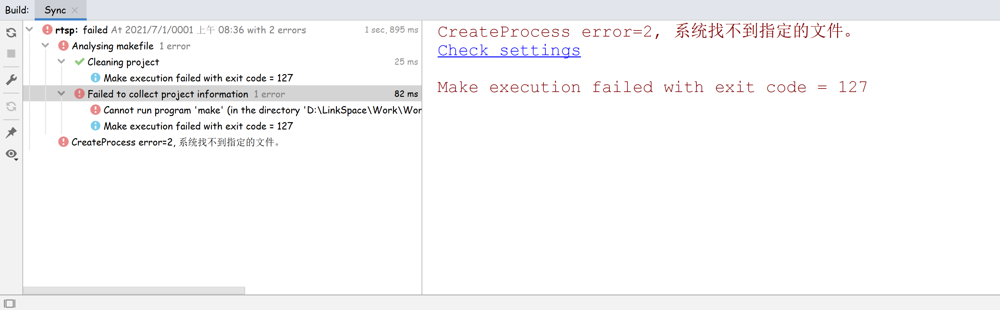
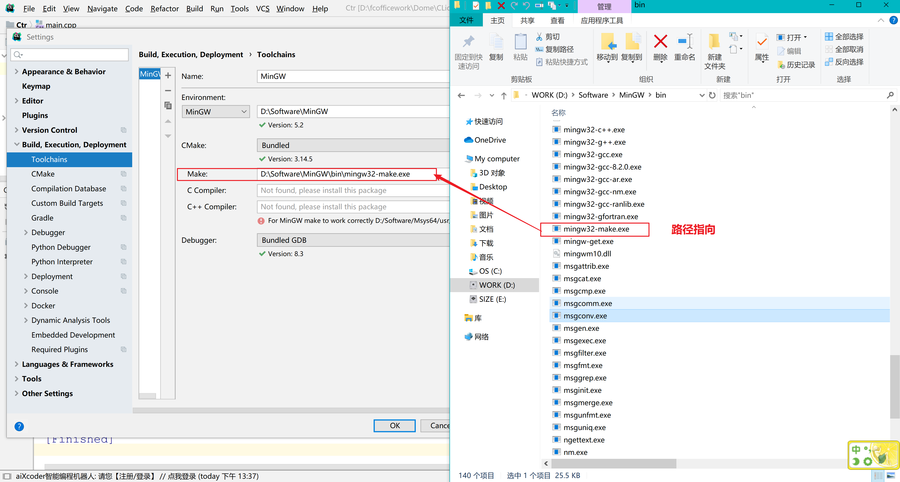
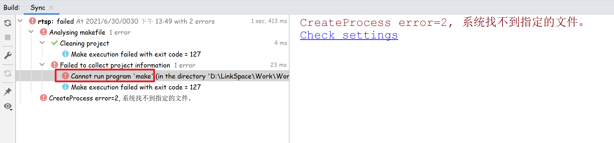
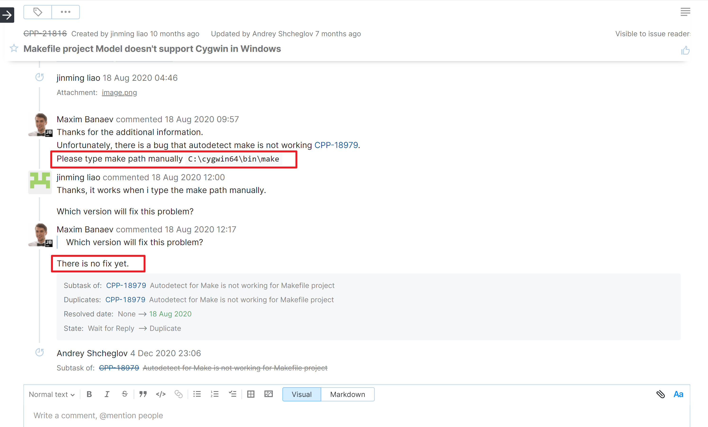

# Clion

### 报错内容
```bash
CreateProcess error=2, 系统找不到指定的文件。
Check settings

Make execution failed with exit code = 127
```


### 解决办法
#### 显式的配置make，不使用Clion自动检测的


#### 不配置make会在环境检测报错
:::danger
注意：不显式的配置make的路径，加载Makefile项目时会有问题



目前该bug尚未修复，具体可见[issue](https://youtrack.jetbrains.com/issue/CPP-21816)：

[https://youtrack.jetbrains.com/issue/CPP-21816](https://youtrack.jetbrains.com/issue/CPP-21816)


:::
