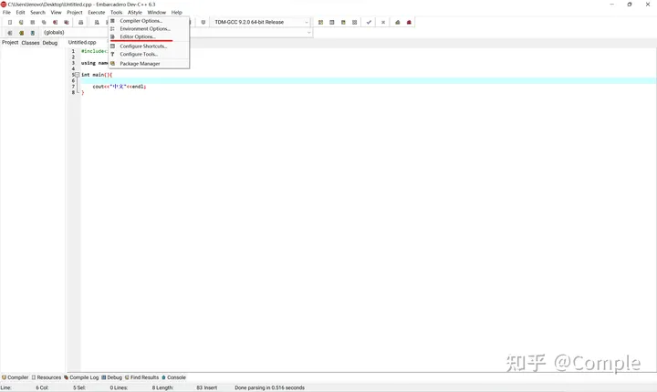
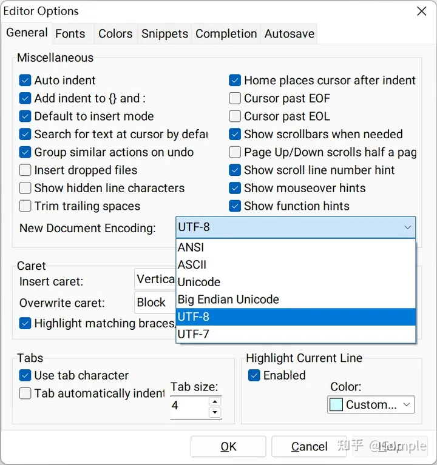
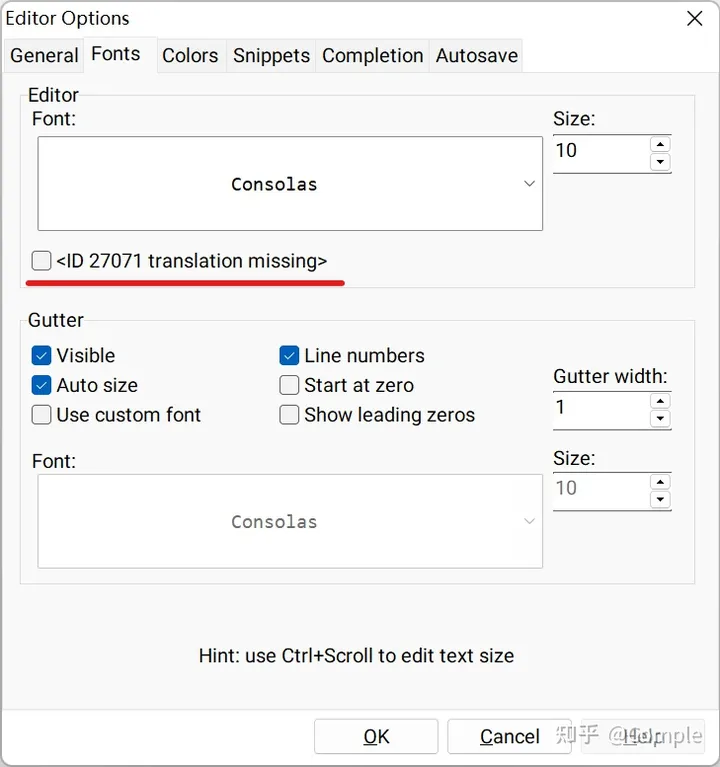
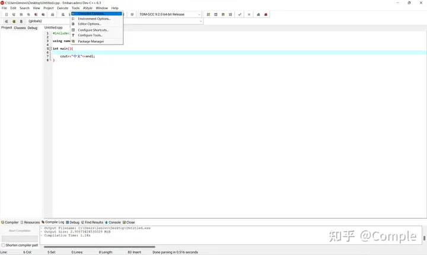
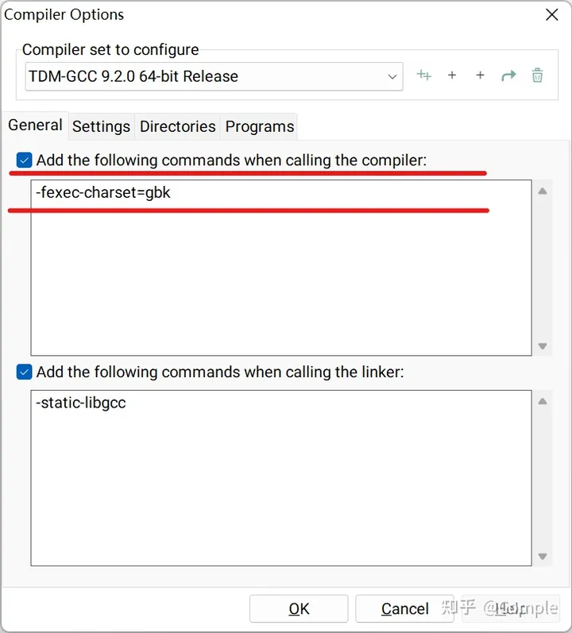
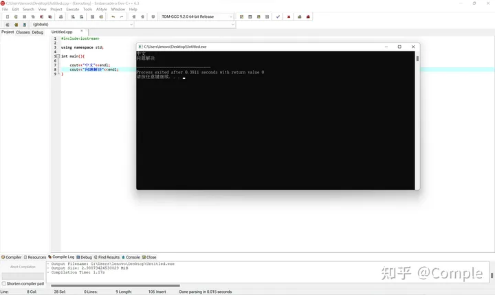

### **步骤1**：进入Dev C++ 6.3 界面，选择工具（Tools）-> 编辑器选项（Editor Options）

### **步骤2**：在弹出的设置窗口中将编码格式从默认的ANSI改为UTF-8

### **步骤3**：在同一窗口中转到 字体（fonts）标签，取消勾选下图标红选项，然后点击确定（OK）

### **步骤4**：点击工具（Tools）-> 编译器选项（Compiler Options）

### **步骤5**：勾选图示标红选项并向下面的文本框中添加参数 "-fexec-charset=gbk"，然后点击确定（OK）

### **步骤6**：重新建立新文档将你的代码复制进去即可，可以看到中文能够完美显示

