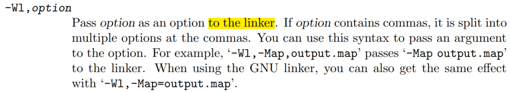

# gcc

## 前言
记录在学习和工作中遇到的各种GCC选项，虽然这些选项可以在GNU的手册上查到，不过这里做个总结，可以避免每次都去查手册。

## 1、 常用的编译选项
| 选项 | 作用 |
| --- | --- |
| -o | 指定输出文件名称 |
| -E | 只进行预处理 |
| -S | 只进行预处理、编译 |
| -c | 只预处理、编译、汇编，但不链接 |
| -D | 使用-D name[=definition]预定义名为name的宏，若不指定值则默认宏的内容为1 |
| -l（小写的L） | 使用-l libname或者-llibname，使链接器在链接时搜索名为libname.a/libname.so（静态/动态）的库文件 |
| -L | 使用-Ldir添加搜索目录，即链接器在搜索-l选项指定的库文件时，除了系统的库目录还会（优先）在-L指定的目录下搜索 |
| -I（大写的i） | 使用-I dir，将目录dir添加为头文件搜索目录 |
| -include | 使用-include file，等效于在被编译的源文件开头添加#include "file" |
| -static | 指定静态链接(默认是动态链接) |
| -O0~3 | 开启编译器优化，-O0为不优化，-O3为最高级别的优化 |
| -Os | 优化生成代码的尺寸，使能所有-O2的优化选项，除了那些让代码体积变大的 |
| -Og | 优化调试体验，在保留调试信息的同时保持快速的编译，对于生成可调试代码，比-O0更合适，不会禁用调试信息。 |
| -Wall | 使编译器输出所有的警告信息 |
| -march | 指定目标平台的体系结构，如-march=armv4t，常用于交叉编译 |
| -mtune | 指定目标平台的CPU以便GCC优化，如-mtune=arm9tdmi，常用于交叉编译 |


## 2、 其他编译选项
### 2.1 -x language
通常gcc通过源文件的后缀来判断该源文件是由什么语言编写的（虽然Linux中后缀没有意义），换句话说，如果文件名不带后缀，那么gcc就无法判断源文件的语言类型了，也就无法完成编译。举例来说：<br />**例1**用c语言编写了一段代码，将其保存在文件名为main.lll中，执行gcc main.lll会报错：
```
main.lll: file not recognized: File format not recognized
collect2: error: ld returned 1 exit status
12
```
**例2**在u-boot中，生成链接脚本的命令为`arm-linux-gcc -E -Wp,-MD,./.u-boot.lds.d ...... -x assembler-with-cpp -std=c99 -P -o u-boot.lds arch/arm/cpu/u-boot.lds`，如果把其中的`-x assembler-with-cpp`去掉，则编译器给出如下信息（且不会生成链接脚本）：
```
linker input file unused because linking not done
1
```
至此，`-x language`的作用就很好理解了，当源文件不添加常规的后缀时，使用该选项来告诉gcc源文件使用了哪种编程语言，其中的language表明的就是语言类型，其可取的值有（不是全部）：
:::danger
c c-header cpp-output c++ c+±header c+±cpp-output objective-c objective-c-header objective-c-cpp-output objective-c++ objective-c+±header objective-c+±cpp-output assembler assembler-with-cpp
:::

### 2.2 `-fno-xxx`

- `**-fno-common**`遇到多个弱定义的全局符号时输出一条警告信息。
- `**-fno-ident**`忽略`#ident`命令。
- `**-fno-builtin**`遇到与内建函数同名的函数时不去链接内建函数，除非函数名以`__builtin_`开头，也可以使用`-fno-builtin-function`来针对特定的函数。
<a name="CsNyd"></a>
### 2.3 `-fxxx`

- `**-ffreestanding**`告诉编译器要编译的目标处于**独立的环境**。在独立的环境中，标准库可能不存在，程序的入口也不一定是main。使用该选项的典型例子有bootloader、OS kernel等，这些程序不依赖标准库，也不需要编译器给它们添加`.init`段。
- **-fomit-frame-pointer**在不需要**帧指针**的函数中省略掉帧指针。所谓帧指针，指的是指向一个函数的**栈帧**的底部的指针（栈顶指针是没办法省的）。比如x86平台就使用ebp作为帧指针。省略掉帧指针的好处是可以多出一个可用的寄存器，坏处是不利于**栈回溯**。**值得注意的是**，有些平台的过程调用规范指定必须使用帧指针，此时该选项无效；同时，与该选项对应的`-fno-omit-frame-pointer`也不保证帧指针一定会被使用。
<a name="bMGX7"></a>
### 2.4 `-Wxxx`

- **-W/-Wextra**-W是-Wextra的旧称。显然，-Wextra更具有可读性，顾名思义，该选项可以使能一些**额外**的警告标志。所谓额外，是针对-Wall而言的，-Wall并没有使能所有的警告，尽管它有个all。
- `**-Wshadow**`使用该选项时，如果本地的变量或类型声明遮蔽了另一个变量、参数、类型、类成员（C++）、实例变量（Objective-C）或内建函数，则gcc会报警告。
- `**-Wconversion**`当使用该选项时，如果**隐式类型转换**会**更改**变量的值，则gcc会给出警告。这样的隐式转换有实数与整数的转换、有符号数与无符号数的转换、转向更小类型的转换等。当然，上述转换中，如果最终没有改变变量的值，那么就不会产生警告，如`abs(2.0)`。
### 2.5 `-Wno-xxx`

- `**-Wno-sign-conversion**`关闭有符号数和无符号数之间进行类型转换时产生的警告，即使用了该选项，那么有符号数和无符号数之间转换时gcc就不报警告了。
### 2.6 给链接器使用的选项：-Wl,options
这里所说的链接器是指集成在可执行文件gcc中的链接器，而不是单独使用的ld。当通过gcc间接使用链接器时，需要在链接器的编译选项前面加上`-Wl,`，然后跟着编译选项，即标题中的options。GCC手册中的相应介绍如下：那么，为什么需要`-Wl,`前缀呢？GNU的链接器手册中是这样解释的（很好懂，就不翻译了）：

---

接下来就介绍一些用于链接器的选项：

- `**-Wl,-rpath=dir**`在编译链接时，链接器会在dir目录下搜索动态库。同时，把动态库搜索路径dir添加到可执行文件中，以便可执行文件加载运行时使用。要注意该选项与-L选项的区别，-L选项用于编译链接时添加库文件的搜索路径；而该选项仅限于动态库，并且既可以在编译链接时添加搜索路径，同时也能将搜索路径添加到可执行文件中。
## 3 、ARM架构专有的编译选项

- **-mthumb**使编译器生成THUMB指令
- **-marm**使编译器生成ARM指令
- **-mthumb-interwork**使编译器生成支持ARM和Thumb指令集之间相互调用的代码，默认是`-mno-thumb-interwork`
