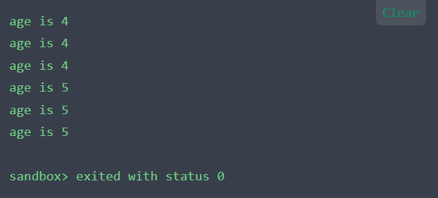

C语言中有没有见过`(int [2]){19,20}`或者`int (*pt2)[4]`的使用方法，字面上可能不好理解，这是C99之后才新增的知识点，名为复合型表述Compound Literals，一旦熟悉使用，便会体会到它简洁而强大的表达。

## 什么是“复合型表述”？
假设给带int类型的形参函数传递一个值，可以传递int类型的变量，也可以传递int类型常量，但是对于带数组形参的函数则不一样，可以传递数组，但是不支持传递数组常量，由此C99新增了“复合形表述”的用法，“表述(Literals)”是指除符号常量外的常量。

例如10是一种int的类型的表述，10.24是一种double类型的表述，“lixiaoyao”是一种字符串类型的表述等——这些都是关于单个类型常量值的表述。自然而然的，对于数组或者结构体这种内部存在多个成员的数据类型，其关于常量的表述就叫做复合型表述。


## 关于数组的复合型表述
数组的复合型表述和数组初始化列表差不多，前面使用括号括起来的类型名，例如下面是一个普通的数组声明。
```c
int age[2]=[19,20];
```
下面创建了一个和age数组相同的匿名数组，也有两个int类型值。
```c
(int [2]){19,20}; //复合型表述
```
注意去掉申明中的数组名，留下的`int[2]`就是复合型表述的类型名。<br />初始化有数组名的数组可以省略数组的大小，复合型表述也可以省略大小，编译器会自动计算数组当前的元素个数：
```c
（int []）{19,20,21,22,23}//内含5个元素的复合型表述
```
因为复合型表述是匿名的，所以不能先创建然后再使用它，必须在创建的同时使用它，如下：<br />一般需要这样定义使用：

注意，该复合型表述的字面常量与上面创建age数组的表述量完全相同，复合型表述的类型名也代表着首元素的地址，所以可以把它赋给指向int的指针。

### 作为实际参数
复合型表述作为实际参数传递给带有匹配形式参数的函数。
```c
#include <stdio.h>
int sum(const int age[],int n);

int main () {
    int total;
    total =sum((int[]){4,4,4,5,5,5},6);
    return 0;
}

int sum(const int age[],int n){
    int i=0;
    for(i=0;i<n;i++){
        printf("age is %d\n",age[i]);
    }
}
```
输出结果如下：<br />
<a name="B6hyw"></a>
### 应用于二维数组或者多维数组
这种用法还可以应用于二维或者多维数组，例如下面演示了如何创建二维int数组并存储其地址。

## 对于结构体
假设如下所示声明了struct foo和structure：<br />这是使用复合型表述构造struct foo的示例：<br />这等效于以下代码：<br />也可以构造一个数组，如下所述，如果复合型表述的所有元素都是由简单的常量表达式组成，则可以将复合型表述强制转换为指向其第一个元素的指针，并在此类初始化程序中使用， 如下所示：<br />标量类型和联合类型的复合型表述也被允许，在下面的示例中，变量i初始化为值2，该值是由复合型表述创建的未命名对象递增的结果。<br />作为GNU扩展，GCC允许通过复合型表述初始化具有静态存储持续时间的对象，如果复合型表述和对象的类型匹配，则如同仅使用括号括起来的列表初始化对象一样处理该对象，复合型表述的元素必须是常量。如果要初始化的对象具有未知大小的数组类型，则该大小由复合型表述的大小确定。<br />等效于以下内容：
<a name="nB0Lh"></a>
## C/C++中的区别
复合型表述看起来像是用括号括起来的聚合初始化程序列表的强制转换，它的值是强制类型转换中指定类型的对象，其中包含初始化程序中指定的元素。

与强制转换的结果不同，复合型表述是左值，但是 C++ 中目前还没有这种无名左值，作为扩展，GCC在C90模式和C++中也支持复合型表述，但C++语义有所不同。

在C中，复合型表述表示具有静态或自动存储持续时间的未命名对象；在C++中，复合型表述表示一个临时对象，该对象仅在其完整表达式结束之前一直存在。

所以，定义良好的C代码（采用复合型表述的子对象的地址）可以在C++中未定义，因此g++编译器不能将临时数组转换为指针。

例如，如果上面的数组复合型表述示例出现在函数内部，则C++中对foo的任何后续使用都将具有未定义的行为，因为数组的生存期在声明foo之后结束。

作为一种优化，g++编译器有时会给数组复合型表述提供更长的生存期：当数组出现在函数外部或具有const限定类型时。如果foo及其初始化程序的元素类型为`char * const`而不是`char *`，或者foo为全局变量，则该数组将具有静态存储持续时间。

**参考：**[https://gcc.gnu.org/onlinedocs/gcc/Compound-Literals.html](https://gcc.gnu.org/onlinedocs/gcc/Compound-Literals.html)
