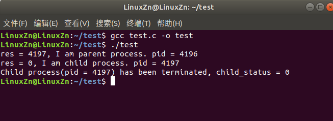
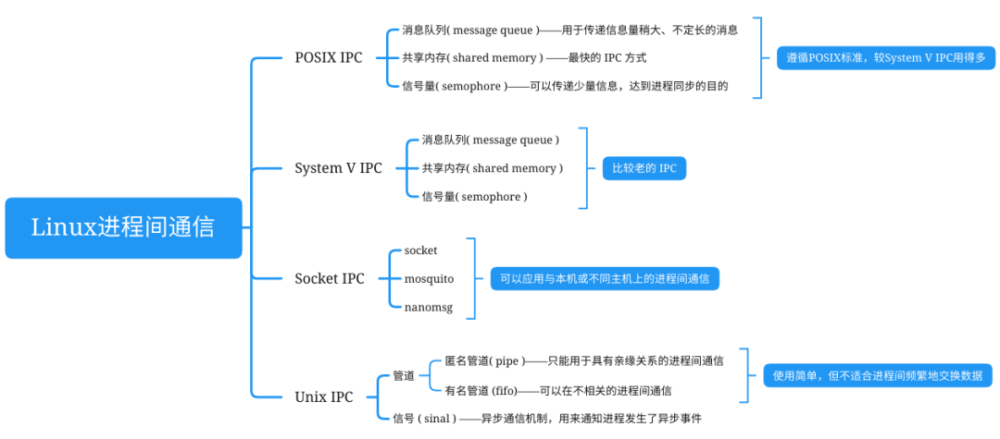
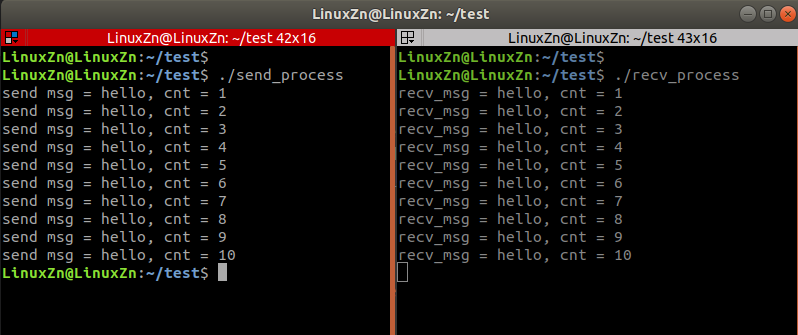
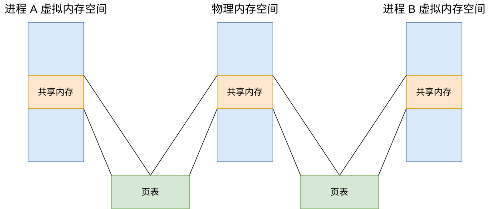
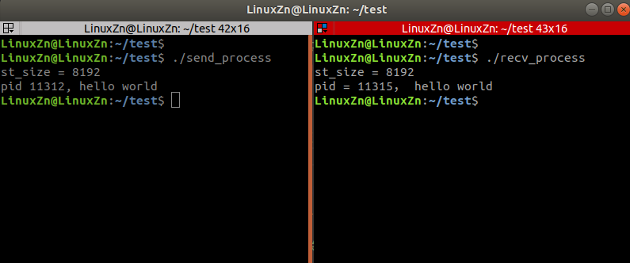
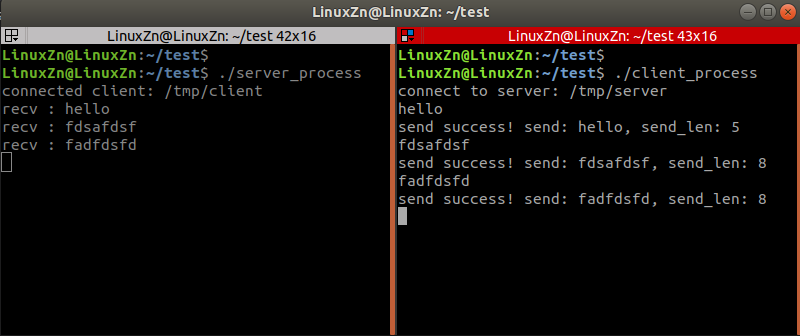
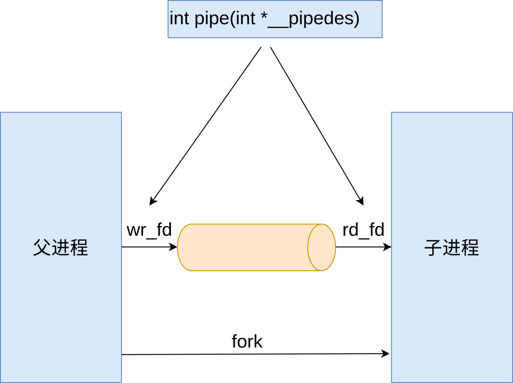
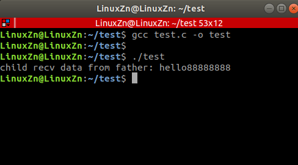
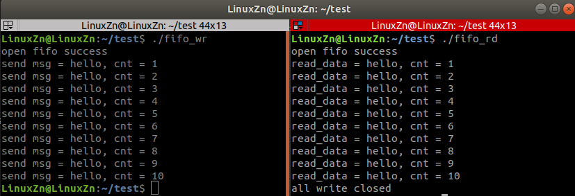
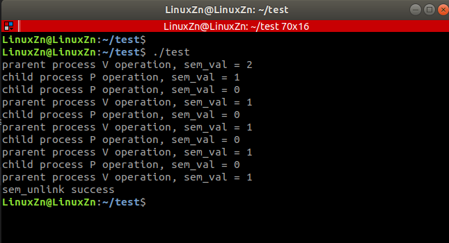

## 什么是进程
### 1、进程和线程的区别
进程是指正在运行的程序，它拥有独立的内存空间和系统资源，不同进程之间的数据不共享。进程是资源分配的基本单位。<br />线程是进程内的执行单元，它与同一进程内的其他线程共享进程的内存空间和系统资源。线程是调度的基本单位。
<a name="iFvcG"></a>
### 2、进程的创建和销毁
在Linux中启动一个进程有多种方法：
#### （1）通过system函数启动进程。（使用简单，效率较低）
```c
#include <stdlib.h>

/**
 * @brief 执行系统命令调用命令处理器来执行命令
 *
 * Detailed function description
 *
 * @param[in] command: 包含被请求变量名称的 C 字符串
 *
 * @return 如果发生错误，则返回值为 -1，否则返回命令的状态。
 */
int system(const char *command);
```
例子：通过system函数启动一个进程，列出当前目录下的文件及文件夹。
```c
#include <stdio.h>
#include <stdlib.h>

int main(void)
{
    system("ls");
    printf("ls end\n");

    return 0;
}
```

#### （2）通过fork函数启动进程。（用于启动子进程）
```c
#include <sys/types.h>
#include <unistd.h>

/**
 * @brief fork系统调用用于创建一个子进程
 *
 * Detailed function description
 *
 * @param[in]
 *
 * @return 如果发生错误，则返回值为 -1，否则返回命令的状态。
 */
pid_t fork(void);
```
例子：通过fork函数启动子进程
```c
#include <stdio.h>
#include <stdlib.h>
#include <unistd.h>
#include <sys/wait.h>

int main(void) 
{
    pid_t res = fork();

    ///< 子进程
    if (res == 0) 
    {
        printf("res = %d, I am child process. pid = %d\n", res, getpid());
        exit(EXIT_SUCCESS);   ///< 正常退出子进程
    } 
    ///< 父进程
    else if (res > 0) 
    {
        printf("res = %d, I am parent process. pid = %d\n", res, getpid());

        int child_status = 0;
        pid_t child_pid = wait(&child_status);   ///< 父进程阻塞等待信号到来或子进程结束
        printf("Child process(pid = %d) has been terminated, child_status = %d\n", child_pid, child_status);
    } 
    ///< 异常退出
    else 
    {
        printf("Fork failed.\n");
        exit(EXIT_FAILURE);
    }
    return 0;
}
```
编译、运行：<br /><br />我们使用了fork()系统调用来创建一个新进程。如果fork()返回值为0，则说明当前进程是子进程；如果返回值大于0，则说明当前进程是父进程。在父进程中，我们使用wait()系统调用来等待子进程结束。当子进程结束后，父进程会继续执行。

#### （3）通过exec系列函数启动进程。（用于启动新进程，新进程会覆盖旧进程）
```c
#include <unistd.h>

/**
 * @brief 启动新进程，新进程会覆盖旧进程
 *
 * Detailed function description
 *
 * @param[in] path: 所执行文件的路径
 * @param[in] file: 所执行文件的名称
 * @param[in] arg: 传入的参数列表，以NULL作为结束
 * @param[in] envp: 传入的环境变量
 *
 * @return 如果发生错误，则返回值为 -1，否则返回命令的状态。
 */
int execl(const char *path, const char *arg, ...);
int execlp(const char *file, const char *arg, ...);
int execle(const char *path, const char *arg, ..., char *const envp[]);
int execv(const char *path, char *const argv[]);
int execvp(const char *file, char *const argv[]);
int execve(const char *path, char *const argv[], char *const envp[]);
```
例子：通过`execl()`函数的参数列表调用了ls命令程序
```c
#include <stdio.h>
#include <unistd.h>

int main(void)
{
    execl("/bin/ls", "ls", "-la", NULL);
    printf("ls end\n");
    return 0;
}
```
`execl()`函数的参数列表调用了ls命令程序，与在终端上运行”ls -la”产生的结果是一样的。<br />在Linux中终止一个进程有多种方法：

- 从main函数返回。（正常终止）
- 调用`exit()`函数终止。（正常终止）
- 调用`_exit()`函数终止。（正常终止）
- 调用`abort()`函数终止。（异常终止）
- 由系统信号终止。（异常终止）
<a name="Hru29"></a>
## 进程间通信方式
进程间通信是指在不同进程之间传播或交换信息的一种机制。每个进程各自有不同的用户地址空间，任何一个进程的全局变量在另一个进程中都看不到，所以进程之间要交换数据必须通过内核，在内核中开辟一块缓冲区，进程A把数据从用户空间拷到内核缓冲区，进程B再从内核缓冲区把数据读走，内核提供的这种机制称为进程间通信。<br />进程间通信的目的：

- 传输数据。比如进程 A 负责生成数据，进程 B 负责处理数据，数据需要从 A 进程传输至 B 进程。
- 共享资源。比如进程 A 与进程 B 共享某一块内存资源。
- 模块化。将系统功能划分为多个进程模块进行开发，方便开发维护。
- 加速计算。多核处理器环境，一个特定进程划分为几个进程并行运行。

Linux IPC（Inter-process Comminication， 进程间通信）的方式：<br />
<a name="CI2Sw"></a>
### 1、消息队列
内核中的一个优先级队列，多个进程通过访问同一个队列，进行添加结点或者获取结点实现通信。<br />POSIX消息队列头文件：
```c
#include <fcntl.h>           /* For O_* constants */
#include <sys/stat.h>        /* For mode constants */
#include <mqueue.h>
```
编译链接需要加上 `-lrt` 链接。<br />消息队列API接口：
```c
/**
 * @brief 创建消息队列实例
 *
 * Detailed function description
 *
 * @param[in] name: 消息队列名称
 * @param[in] oflag：根据传入标识来创建或者打开一个已创建的消息队列
                    - O_CREAT: 创建一个消息队列
                    - O_EXCL: 检查消息队列是否存在，一般与O_CREAT一起使用
                    - O_CREAT|O_EXCL: 消息队列不存在则创建，已存在返回NULL
                    - O_NONBLOCK: 非阻塞模式打开，消息队列不存在返回NULL
                    - O_RDONLY: 只读模式打开
                    - O_WRONLY: 只写模式打开
                    - O_RDWR: 读写模式打开
 * @param[in] mode：访问权限
 * @param[in] attr：消息队列属性地址
 *
 * @return 成功返回消息队列描述符，失败返回-1，错误码存于error中
 */
mqd_t mq_open(const char *name, int oflag,  mode_t mode, struct mq_attr *attr);

/**
 * @brief 无限阻塞方式接收消息
 *
 * Detailed function description
 *
 * @param[in] mqdes: 消息队列描述符
 * @param[in] msg_ptr：消息体缓冲区地址
 * @param[in] msg_len：消息体长度，长度必须大于等于消息属性设定的最大值
 * @param[in] msg_prio：消息优先级
 *
 * @return 成功返回消息长度，失败返回-1，错误码存于error中
 */
mqd_t mq_receive(mqd_t mqdes, char *msg_ptr, size_t msg_len, unsigned *msg_prio);

/**
 * @brief 指定超时时间阻塞方式接收消息
 *
 * Detailed function description
 *
 * @param[in] mqdes: 消息队列描述符
 * @param[in] msg_ptr：消息体缓冲区地址
 * @param[in] msg_len：消息体长度，长度必须大于等于消息属性设定的最大值
 * @param[in] msg_prio：消息优先级
 * @param[in] abs_timeout：超时时间
 *
 * @return 成功返回消息长度，失败返回-1，错误码存于error中
 */
mqd_t mq_timedreceive(mqd_t mqdes, char *msg_ptr, size_t msg_len, unsigned *msg_prio, const struct timespec *abs_timeout);

/**
 * @brief 无限阻塞方式发送消息
 *
 * Detailed function description
 *
 * @param[in] mqdes: 消息队列描述符
 * @param[in] msg_ptr：待发送消息体缓冲区地址
 * @param[in] msg_len：消息体长度
 * @param[in] msg_prio：消息优先级
 *
 * @return 成功返回0，失败返回-1
 */
mqd_t mq_send(mqd_t mqdes, const char *msg_ptr, size_t msg_len, unsigned msg_prio);

/**
 * @brief 指定超时时间阻塞方式发送消息
 *
 * Detailed function description
 *
 * @param[in] mqdes: 消息队列描述符
 * @param[in] msg_ptr：待发送消息体缓冲区地址
 * @param[in] msg_len：消息体长度
 * @param[in] msg_prio：消息优先级
 * @param[in] abs_timeout：超时时间
 *
 * @return 成功返回0，失败返回-1
 */
mqd_t mq_timedsend(mqd_t mqdes, const char *msg_ptr, size_t msg_len, unsigned msg_prio, const struct timespec *abs_timeout);

/**
 * @brief 关闭消息队列
 *
 * Detailed function description
 *
 * @param[in] mqdes: 消息队列描述符
 *
 * @return 成功返回0，失败返回-1
 */
mqd_t mq_close(mqd_t mqdes);

/**
 * @brief 分离消息队列
 *
 * Detailed function description
 *
 * @param[in] name: 消息队列名称
 *
 * @return 成功返回0，失败返回-1
 */
mqd_t mq_unlink(const char *name);
```
消息队列基本API接口使用例子：发送进程给接收进程发送测试数据。

**send.c：**

```c
#include <stdio.h>
#include <stdlib.h>
#include <string.h>
#include <unistd.h>
#include <fcntl.h>           /* For O_* constants */
#include <sys/stat.h>        /* For mode constants */
#include <mqueue.h>

#define MQ_MSG_MAX_SIZE    512  ///< 最大消息长度 
#define MQ_MSG_MAX_ITEM    5  ///< 最大消息数目

static mqd_t s_mq;

typedef struct _msg_data
{
    char buf[128];
    int cnt;
}msg_data_t;


void send_data(void)
{
    static int cnt = 0;
    msg_data_t send_data = {0};

    cnt++;
    strcpy(send_data.buf, "hello");
    send_data.cnt = cnt;
    int ret = mq_send(s_mq, (char*)&send_data, sizeof(send_data), 0);
    if (ret < 0)
    {
        perror("mq_send error");
        return;
    }
    printf("send msg = %s, cnt = %d\n", send_data.buf, send_data.cnt);
}


int main(void)
{
    int ret = 0;
    struct mq_attr attr;

    ///< 创建消息队列
    memset(&attr, 0, sizeof(attr));
    attr.mq_maxmsg = MQ_MSG_MAX_ITEM;
    attr.mq_msgsize = MQ_MSG_MAX_SIZE;
    attr.mq_flags = 0;
    s_mq = mq_open("/mq", O_CREAT|O_RDWR, 0777, &attr);
    if(-1 == s_mq)
    {
        perror("mq_open error");
        return -1;
    }

    for (size_t i = 0; i < 10; i++)
    {
        send_data();
        sleep(1);
    }

    mq_close(s_mq);

    return 0;
}
```
**recv.c：**
```c
#include <stdio.h>
#include <stdlib.h>
#include <string.h>
#include <unistd.h>
#include <fcntl.h>           /* For O_* constants */
#include <sys/stat.h>        /* For mode constants */
#include <mqueue.h>

#define MQ_MSG_MAX_SIZE    512  ///< 最大消息长度 
#define MQ_MSG_MAX_ITEM    5  ///< 最大消息数目

static mqd_t s_mq;

typedef struct _msg_data
{
    char buf[128];
    int cnt;
}msg_data_t;

int main(void)
{
    int ret = 0;
    struct mq_attr attr;
    char recv_msg[MQ_MSG_MAX_SIZE] = {0};
    msg_data_t recv_data = {0};
    int prio = 0;
    ssize_t len = 0;

    s_mq = mq_open("/mq", O_RDONLY);
    if(-1 == s_mq)
    {
        perror("mq_open error");
        return -1;
    }

    while (1)
    {
        if((len = mq_receive(s_mq, (char*)&recv_data, MQ_MSG_MAX_SIZE, &prio)) == -1)
        {
            perror("mq_receive error");
            return -1;
        }
        printf("recv_msg = %s, cnt = %d\n", recv_data.buf, recv_data.cnt);
        sleep(1);
    }

    mq_close(s_mq);
    mq_unlink("/mq");

    return 0;
}
```
编译、运行：
```bash
gcc send.c -o send_process -lrt
gcc recv.c -o recv_process -lrt
```


### 2、共享内存
消息队列的读取和写入的过程，会有发生用户态与内核态之间的消息拷贝过程。而共享内存的方式则没有这个拷贝过程，进程间通信速度较快。<br />在物理内存上开辟一块内存空间，多个进程可以将同一块物理内存空间映射到自己的虚拟地址空间，通过自己的虚拟地址直接访问这块空间，通过这种方式实现数据共享。<br />POSIX共享内存头文件：
```c
#include <sys/mman.h>
#include <sys/stat.h>
#include <unistd.h>
```
共享内存API接口：
```c
/**
 * @brief 创建共享内存实例
 *
 * Detailed function description
 *
 * @param[in] name: 要打开或创建的共享内存文件名
 * @param[in] oflag：打开的文件操作属性
                    - O_CREAT: 创建一个共享内存文件
                    - O_EXCL: 检查共享内存是否存在，一般与O_CREAT一起使用
                    - O_CREAT|O_EXCL: 共享内存不存在则创建，已存在返回NULL
                    - O_NONBLOCK: 非阻塞模式打开，共享内存不存在返回NULL
                    - O_RDONLY: 只读模式打开
                    - O_WRONLY: 只写模式打开
                    - O_RDWR: 读写模式打开
 * @param[in] mode：文件共享模式，例如 0777
 *
 * @return 成功返回共享内存描述符，失败返回-1，错误码存于error中
 */
int shm_open(const char *name, int oflag, mode_t mode);

/**
 * @brief 删除共享内存
 *
 * Detailed function description
 *
 * @param[in] name: 创建的共享内存文件名
 *
 * @return 成功返回0，失败返回-1
 */
int shm_unlink(const char *name);

/**
 * @brief 将打开的文件映射到内存
 *
 * Detailed function description
 *
 * @param[in] addr: 要将文件映射到的内存地址，一般应该传递NULL来由Linux内核指定
 * @param[in] length: 要映射的文件数据长度
 * @param[in] prot: 映射的内存区域的操作权限（保护属性），包括PROT_READ、PROT_WRITE、PROT_READ|PROT_WRITE
 * @param[in] flags: 标志位参数，包括：MAP_SHARED、MAP_PRIVATE与MAP_ANONYMOUS。
 * @param[in] fd:  用来建立映射区的文件描述符，用 shm_open打开或者open打开的文件
 * @param[in] offset: 映射文件相对于文件头的偏移位置，应该按4096字节对齐
 *
 * @return 成功返回0，失败返回-1
 */
void *mmap(void *addr, size_t length, int prot, int flags, int fd, off_t offset);

/**
 * @brief 取消内存映射
 *
 * Detailed function description
 *
 * @param[in] addr: 由mmap成功返回的地址
 * @param[in] length: 要取消的内存长度
 *
 * @return 成功返回0，失败返回-1
 */
int munmap(void *addr, size_t length);

/**
 * @brief 将参数fd指定的文件大小改为参数length指定的大小
 *
 * Detailed function description
 *
 * @param[in] fd: 已打开的文件描述符，以写入模式打开的文件
 * @param[in] length: 要设置的长度
 *
 * @return 成功返回0，失败返回-1
 */
int ftruncate(int fd,off_t length);

/**
 * @brief 获取文件相关的信息，将获取到的信息放入到statbuf结构体中
 *
 * Detailed function description
 *
 * @param[in] fd: 已打开的文件描述符
 * @param[out] statbuf: 文件的信息
 *
 * @return 成功返回0，失败返回-1
 */
int fstat(int fd, struct stat *statbuf);
```
共享内存基本API接口使用例子：发送进程给接收进程发送测试数据。

**send.c：**

```c
#include <stdio.h>
#include <stdlib.h>
#include <string.h>
#include <unistd.h>
#include <fcntl.h>           /* For O_* constants */
#include <sys/stat.h>        /* For mode constants */
#include <sys/mman.h>

#define SHM_NAME "/shm"

int main(void)
{
    int ret = 0;

    ///< 创建和读端相同的文件标识
    int shm_fd = shm_open(SHM_NAME, O_RDWR | O_CREAT, 0666);
    if (shm_fd == -1) 
    {
        printf("shm_open error\n");
    }

    ///< 设置共享内存文件为8KB
    ftruncate(shm_fd , 8 * 1024);

    ///< 获取共享内存文件相关属性信息
    struct stat filestat = {0};
    fstat(shm_fd, &filestat);
    printf("st_size = %ld\n",filestat.st_size);

    ///< 内存映射
    char *shm_ptr = (char*)mmap(NULL, filestat.st_size, PROT_READ|PROT_WRITE, MAP_SHARED, shm_fd, 0);
    close(shm_fd);

    ///< 向共享内存中写入数据
    char buf[] = "hello world";
    memmove(shm_ptr,buf, sizeof(buf));
    printf("pid %d, %s\n",getpid(), shm_ptr);

    ///< 写入完成后解除映射
    munmap(shm_ptr, filestat.st_size);

    return 0;
}
```
**recv.c：**
```c
#include <stdio.h>
#include <stdlib.h>
#include <string.h>
#include <unistd.h>
#include <fcntl.h>           /* For O_* constants */
#include <sys/stat.h>        /* For mode constants */
#include <sys/mman.h>

#define SHM_NAME "/shm"

int main(void)
{
    ///< 创建共享内存文件标识符
    int shm_fd = shm_open(SHM_NAME, O_RDWR | O_CREAT, 0666);
    if (shm_fd == -1) 
    {
        printf("shm_open failed\n");
        exit(EXIT_FAILURE);
    }

    ///< 设置共享内存文件为8KB
    ftruncate(shm_fd , 8192);

    ///< 获取共享内存文件相关属性信息
    struct stat filestat;
    fstat(shm_fd, &filestat);
    printf("st_size = %ld\n",filestat.st_size);

    ///< 映射共享内存，并获取共享内存的地址
    char *shm_ptr = (char*)mmap(NULL, filestat.st_size, PROT_READ|PROT_WRITE, MAP_SHARED, shm_fd, 0);
    close(shm_fd);

    ///< 获取共享内存地址中的内容并打印，最后再解除映射，删除共享内存
    printf("pid = %d， %s\n", getpid(), shm_ptr);
    munmap(shm_ptr, filestat.st_size);
    shm_unlink(SHM_NAME);

    return 0;
}
```
编译、运行：
```bash
gcc send.c -o send_process -lrt
gcc recv.c -o recv_process -lrt
```
<br />对具有多个处理核系统消息传递的性能要优于共享内存。共享内存会有高速缓存一致性问题，这是由共享数据在多个高速缓存之间迁移而引起的。随着系统的处理核的数量的日益增加，可能导致消息传递作为 IPC 的首选机制。
<a name="QesPx"></a>
### 3、socket
UNIX域套接字与传统基于TCP/IP协议栈的socket不同，unix domain socket以文件系统作为地址空间，不需经过TCP/IP的头部封装、报文ack确认、路由选择、数据校验与重传过程，因此传输速率上也不会受网卡带宽的限制。<br />unix domain socket在进程间通信同样是基于“客户端—服务器”（C-S）模式。<br />UNIX域套接字基本API接口使用例子：基于UNIX域套接字客户端进程向服务端进程发送测试数据。<br />**server.c：**
```c
#include <stdio.h>
#include <stdlib.h>
#include <string.h>
#include <unistd.h>
#include <fcntl.h>           /* For O_* constants */
#include <sys/stat.h>        /* For mode constants */
#include <sys/socket.h>
#include <netinet/in.h>
#include <arpa/inet.h>
#include <sys/un.h>

#define SERVER_PATH "/tmp/server" 

int main(void)
{
    ///< 创建UNIX域字节流套接字
    int server_fd = socket(AF_LOCAL, SOCK_STREAM, 0);
    if(server_fd < 0)
    {
        printf("socket error\n");
        exit(EXIT_FAILURE);
    }

    ///< 绑定服务端地址
    unlink(SERVER_PATH);
    struct sockaddr_un server_addr;
    memset((char*)&server_addr, 0, sizeof(server_addr));
    server_addr.sun_family = AF_LOCAL;
    strncpy(server_addr.sun_path, SERVER_PATH, sizeof(server_addr.sun_path)-1);
    if(bind(server_fd, (struct sockaddr*)&server_addr, sizeof(server_addr)) < 0)
    {
        printf("bind error\n");
        close(server_fd);
        exit(EXIT_FAILURE);
    }

    ///< 监听
    if(listen(server_fd, 10) < 0) 
    {
        printf("listen error\n");
        close(server_fd);
        exit(EXIT_FAILURE);
    }

    ///< 等待客户端连接
    int addr_len = sizeof(struct sockaddr);
    struct sockaddr_un client_addr;
    int client_fd = accept(server_fd, (struct sockaddr*)&client_addr, (socklen_t *)&addr_len);
    if(client_fd < 0)
    {
        printf("accept error\n");
        close(server_fd);
        unlink(SERVER_PATH);
        exit(1); 
    }
    else
    {
        printf("connected client: %s\n", client_addr.sun_path);
    }

    while(1)
    {
        char buf[128] = {0};

        int recv_len = read(client_fd, buf, sizeof(buf)); 
        if(recv_len <= 0)
        {
            printf("recv error!\n");
            close(client_fd);
            exit(EXIT_FAILURE);
        }

        printf("recv : %s\n", buf);
    }

    unlink(SERVER_PATH);
    close(server_fd);
    close(client_fd);

    return 0;
}
```
**client.c：**
```c
#include <stdio.h>
#include <stdlib.h>
#include <string.h>
#include <unistd.h>
#include <fcntl.h>           /* For O_* constants */
#include <sys/stat.h>        /* For mode constants */
#include <sys/socket.h>
#include <netinet/in.h>
#include <arpa/inet.h>
#include <sys/un.h>

#define SERVER_PATH "/tmp/server"
#define CLIENT_PATH "/tmp/client"

int main(void)
{
    ///< 创建UNIX域字节流套接字
    int client_fd = socket(AF_UNIX, SOCK_STREAM, 0);
    if(client_fd < 0)
    {
        printf("socket error\n");
        exit(EXIT_FAILURE);
    }

    ///< 显式绑定客户端地址
    struct sockaddr_un client_addr;
    memset((char*)&client_addr, 0, sizeof(client_addr));
    client_addr.sun_family = AF_UNIX;
    strncpy(client_addr.sun_path, CLIENT_PATH, sizeof(client_addr.sun_path)-1);
    unlink(CLIENT_PATH);
    if(bind(client_fd, (struct sockaddr*)&client_addr, sizeof(client_addr)) < 0)
    {
        printf("bind error\n");
        close(client_fd);
        exit(1); 
    }

    ///< 连接服务端
    struct sockaddr_un server_addr;
    server_addr.sun_family  = AF_UNIX;
    strncpy(server_addr.sun_path, SERVER_PATH, sizeof(server_addr.sun_path)-1);
    int ret = connect(client_fd, (struct sockaddr*)&server_addr, sizeof(server_addr)); 
    if(ret < 0)
    {
        printf("connect error\n");
        close(client_fd);
        unlink(CLIENT_PATH);
        exit(1);  
    } 
    printf("connect to server: %s\n", server_addr.sun_path);

    while(1)
    {
        char buf[128] = {0};
        if (scanf("%s", buf))
        {
            int send_len = write(client_fd, buf, strlen(buf));
            if (send_len <= 0)
            {
                printf("write error!\n");
                close(client_fd);
                exit(EXIT_FAILURE);  
            }
            else
            {
                printf("send success! send: %s, send_len: %d\n", buf, send_len);
            }
        } 
    }

    unlink(SERVER_PATH);
    close(client_fd);

    return 0;
}
```
编译、运行：
```bash
gcc server.c -o server_process
gcc client.c -o client_process
```
<br />类socket的其它进程间通信方式：<br />[实用 | nanomsg通信库的简单使用分享](https://mp.weixin.qq.com/s?__biz=MzU5MzcyMjI4MA==&mid=2247494234&idx=1&sn=bb9c34884f7555047802224d57c92f60&chksm=fe0e849dc9790d8b2d3c6b1d63521ea55e2ef918ab0511c836ad15663c1b6ad870e06f9bb16d&token=682136103&lang=zh_CN&scene=21#wechat_redirect)<br />[mqtt应用于进程间通信](https://mp.weixin.qq.com/s?__biz=MzU5MzcyMjI4MA==&mid=2247490463&idx=1&sn=5298d698b16a130a1f46294003827775&chksm=fe0d7558c97afc4e2aea1d1f2d649271d8b64bb2033a51a5807d14f92c300456f56cff75dcc4&token=682136103&lang=zh_CN&scene=21#wechat_redirect)
<a name="qBGam"></a>
### 4、管道
在内核中开辟一块缓冲区；若多个进程拿到同一个管道(缓冲区)的操作句柄，就可以访问同一个缓冲区，就可以进行通信。涉及到两次用户态与内核态之间的数据拷贝。
<a name="CCilp"></a>
#### （1）匿名管道
内核中的缓冲区是没有具体的标识符的，匿名管道只能用于具有亲缘关系的进程间通信。<br /><br />调用pipe接口可以创建一个匿名管道，并返回了两个描述符，一个是管道的读取端描述符 `fd[0]`，另一个是管道的写入端描述符 `fd[1]`。<br />管道是一个**半双工通信**(可以选择方向的单向传输)<br />匿名管道基本API接口使用例子：父进程通过管道发送测试数据给子进程。
```c
#include <stdio.h>
#include <stdlib.h>
#include <unistd.h>
#include <string.h>

int main()
{
    ///< 创建管道
    int pipefd[2] = {-1};
    int ret = pipe(pipefd);
    if (ret < 0)
    {
        printf("pipe error\n");
        exit(EXIT_FAILURE);
    }

    int read_fd = pipefd[0];   ///< pipefd[0] 用于从管道中读取数据
    int write_fd = pipefd[1];  ///< pipefd[1] 用于向管道中写入数据

    ///< 创建子进程
    pid_t pid = fork();
    if (pid == 0)
    {
        ///< 子进程从管道读取数据  
        char buf[128] = {0};
        read(read_fd, buf, sizeof(buf));
        printf("child recv data from father: %s", buf);
    }
    else if (pid > 0)
    {
        ///< 父进程向管道写入数据
        char *ptr = "hello88888888\n";
        write(write_fd, ptr, strlen(ptr));
    }
    return 0;
}
```
编译、运行：<br /><br />如果需要双向通信，则应该创建两个管道。
<a name="rPI39"></a>
#### （2）命名管道
命名管道也是内核中的一块缓冲区，并且这个缓冲区具有标识符；这个标识符是一个可见于文件系统的管道文件，能够被其他进程找到并打开管道文件，则可以获取管道的操作句柄，所以该命名管道可用于同一主机上的任意进程间通信。<br />创建命名管道的接口：
```c
int mkfifo(const char *pathname, mode_t mode);
```
命名管道基本API接口使用例子：一个进程往管道中写入测试数据，另一个进程从管道中读取数据。<br />**fifo_wr.c：**
```c
#include <stdio.h>
#include <stdlib.h>
#include <string.h>
#include <fcntl.h>
#include <sys/stat.h>
#include <unistd.h>
#include <errno.h>

#define FIFO_PATH  "./fifo_file"

typedef struct _msg_data
{
    char buf[128];
    int cnt;
}msg_data_t;

void send_data(int fd)
{
    static int cnt = 0;
    msg_data_t send_data = {0};

    cnt++;
    strcpy(send_data.buf, "hello");
    send_data.cnt = cnt;
    write(fd, &send_data, sizeof(send_data));
    printf("send msg = %s, cnt = %d\n", send_data.buf, send_data.cnt);
}

int main(void)
{
    ///< 创建管道文件
    int ret = mkfifo(FIFO_PATH, 0664);
    if (ret < 0 && errno != EEXIST)
    {
        printf("mkfifo error\n");
        exit(EXIT_FAILURE);
    }

    ///< 以只写的方式打开管道文件
    int fd = open(FIFO_PATH, O_WRONLY);
    if (fd < 0)
    {
        printf("open fifo error\n");
        exit(EXIT_FAILURE);
    }
    printf("open fifo success\n");

    ///< 写10次
    for (size_t i = 0; i < 10; i++)
    {
        send_data(fd);
        sleep(1);
    }

    close(fd);

    return 0;
}
```
**fifo_rd.c：**
```c
#include <stdio.h>
#include <stdlib.h>
#include <unistd.h>
#include <string.h>
#include <sys/stat.h>
#include <errno.h>
#include <fcntl.h>

#define FIFO_PATH  "./fifo_file"

typedef struct _msg_data
{
    char buf[128];
    int cnt;
}msg_data_t;

int main(void)
{
    umask(0);
    ///< 创建管道文件
    int ret = mkfifo(FIFO_PATH,0664 );
    if (ret < 0 && errno != EEXIST)
    {
        printf("mkfifo error\n");
        exit(EXIT_FAILURE);
    }

    ///< 以只读方式获取管道文件的操作句柄
    int fd = open(FIFO_PATH, O_RDONLY);
    if (fd < 0)
    {
        printf("open error\n");
        exit(EXIT_FAILURE);
    }
    printf("open fifo success\n");

    while(1)
    {
        msg_data_t read_data = {0};
        ///< 将从管道读取的文件写到buf中
        int ret = read(fd, &read_data, sizeof(read_data));
        if (ret < 0)
        {
            printf("read error\n");
            exit(EXIT_FAILURE);
        }
        else if (ret == 0)
        {
            printf("all write closed\nd");
            exit(EXIT_FAILURE);
        }
        printf("read_data = %s, cnt = %d\n", read_data.buf, read_data.cnt);
        sleep(1);
    }
    close(fd);

    return 0;
}
```
编译、运行：
```bash
gcc fifo_wr.c -o fifo_wr
gcc fifo_rd.c -o fifo_rd
```

<a name="wDOVe"></a>
### 5、信号量
信号量（Seamphore）是进程和线程间同步的一种机制。<br />信号量本质是一个非负的整型变量。增加一个可用资源执行加一，也称为V操作；获取一个资源资源后执行减一，也称为P操作。<br />信号量根据信号值不同可分为两类：

- 二值信号量，信号量值只有0和1，初始值为1，1表示资源可用，0表示资源不可用；二值信号量与互斥锁类似。
- 计数信号量， 信号量的值在0到一个大于1的限制值之间，信号值表示可用的资源的数目。

信号量根据作用对象不同可分为两类：

- 有名信号量，信号值保存在文件中，用于进程间同步
- 无名信号量，又称为基于内存信号量，信号值保存在内存中，用于线程间同步

POSIX信号量头文件：
```c
#include <semaphore.h>
```
编译链接需要加`-lpthread`参数。<br />信号量API接口：
```c
/**
 * @brief 创建信号量
 *
 * Detailed function description
 *
 * @param[in] name: 信号量名称
 * @param[in] mode: 访问权限
 * @param[in] value: 信号量初始值
 *
 * @return 成功时返回指向信号量的指针，出错时为SEM_FAILED
 */
sem_t *sem_open(const char *name,int oflag, mode_t mode, unsigned int value);

/**
 * @brief 初始化信号量
 *
 * Detailed function description
 *
 * @param[in] sem: 信号量实例地址
 * @param[in] pshared: 信号量作用域，分为进程内作用域PTHREAD_PROCESS_PRIVATE和跨进程作用域PTHREAD_PROCESS_SHARED
 * @param[in] value: 信号量初始值
 *
 * @return 成功返回0，失败返回-1
 */
int sem_init(sem_t *sem, int pshared, unsigned int value);

/**
 * @brief 获取信号量
 *
 * Detailed function description
 *
 * @param[in] sem: 信号量实例地址
 * @param[out] sval: 保存返回信号值地址
 *
 * @return 成功返回0，失败返回-1
 */
int sem_getvalue(sem_t *sem, int *sval);

/**
 * @brief 阻塞方式等待信号量
 *
 * Detailed function description
 *
 * @param[in] sem: 信号量实例地址
 *
 * @return 成功返回0，失败返回-1
 */
int sem_wait(sem_t *sem);

/**
 * @brief 指定超时时间阻塞方式等待信号量
 *
 * Detailed function description
 *
 * @param[in] sem: 信号量实例地址
 * @param[in] sem: 超时时间，单位为时钟节拍
 *
 * @return 成功返回0，失败返回-1
 */
int sem_timedwait(sem_t *sem, const struct timespec *abs_timeout);

/**
 * @brief 非阻塞方式等待信号量
 *
 * Detailed function description
 *
 * @param[in] sem: 信号量实例地址
 *
 * @return 成功返回0，失败返回-1
 */
int sem_trywait(sem_t *sem);

/**
 * @brief 产生信号量
 *
 * Detailed function description
 *
 * @param[in] sem: 信号量实例地址
 *
 * @return 成功返回0，失败返回-1
 */
int sem_post(sem_t *sem);

/**
 * @brief 销毁信号量
 *
 * Detailed function description
 *
 * @param[in] sem: 信号量实例地址
 *
 * @return 成功返回0，失败返回-1
 */
int sem_destroy(sem_t *sem);

/**
 * @brief 关闭信号量
 *
 * Detailed function description
 *
 * @param[in] sem: 信号量实例地址
 *
 * @return 成功返回0，失败返回-1
 */
int sem_close(sem_t *sem);

/**
 * @brief 分离信号量
 *
 * Detailed function description
 *
 * @param[in] name: 信号量名称
 *
 * @return 成功返回0，失败返回-1
 */
int sem_unlink(const char *name);
```
信号量基本API接口使用例子：父子进程间通信
```c
#include <stdio.h>
#include <stdlib.h>
#include <unistd.h>
#include <semaphore.h>
#include <fcntl.h>

#define SEM_NAME "sem"

int main (void)
{
    int sem_val = 0;

    ///< 创建信号量
    sem_t *sem = sem_open(SEM_NAME, O_CREAT, 0666, 1);
    if (NULL == sem)
    {
        printf("sem_open error\n");
        exit(EXIT_FAILURE); 
    }

    ///< 创建子进程
    pid_t pid = fork();
    if (pid == -1) 
    {
        printf("fork error\n");
        sem_close(sem);
        sem_unlink(SEM_NAME);
        exit(EXIT_FAILURE);
    }
    else if(pid == 0) 
    {
        ///< 子进程进行5次P操作
        for (size_t i = 0; i < 5; i++)
        {
            sem_wait(sem);
            if (sem_getvalue(sem, &sem_val) != -1) 
            {
                printf("child process P operation, sem_val = %d\n", sem_val);
                sleep(1);
            }
        }
        _exit(1);
    }
    else if (pid > 0)
    {
        ///< 父进程执行5次V操作
        for (size_t i = 0; i < 5; i++)
        {
            sem_post(sem);
            if (sem_getvalue(sem, &sem_val) != -1) 
            {
                printf("prarent process V operation, sem_val = %d\n", sem_val);
                sleep(2);
            }
        }
    }

    ///< 删除sem信号量
    sem_close(sem);
    if (sem_unlink(SEM_NAME) != -1) 
    {
        printf("sem_unlink success\n");
    }

    return 0;
}
```
编译、运行：<br />
<a name="Uz0xm"></a>
### IPC总结
操作系统根据不同的场景提供了不同的方式，消息队列、共享内存、UNIX域套接字、管道、信号量。<br />**消息队列：** 内核中的一个优先级队列，多个进程通过访问同一个队列，在队列当中添加或者获取节点来实现进程间通信。<br />**共享内存：** 本质是一块物理内存，多个进程将同一块物理内存映射到自己的虚拟地址空间中，再通过页表映射到物理地址达到进程间通信，它是最快的进程间通信方式，相较其他通信方式少了两步数据拷贝操作。<br />**UNIX域套接字：** 与TCP/IP套接字使用方式相同，但UNIX域套接字以文件系统作为地址空间，不需经过TCP/IP的头部封装、报文ack确认、路由选择、数据校验与重传过程，因此传输速率上也不会受网卡带宽的限制。<br />**管道：** 内核中的一块缓冲区，分为匿名管道和命名管道。匿名管道只能用于具有亲缘关系的进程间；而命名管道可用于同一主机上任意进程间通信。<br />**信号量：** 本质是内核中的一个计数器，主要实现进程间的同步与互斥，对资源进行计数，有两种操作，分别是在访问资源之前进行的p操作，还有产生资源之后的v操作。
