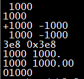
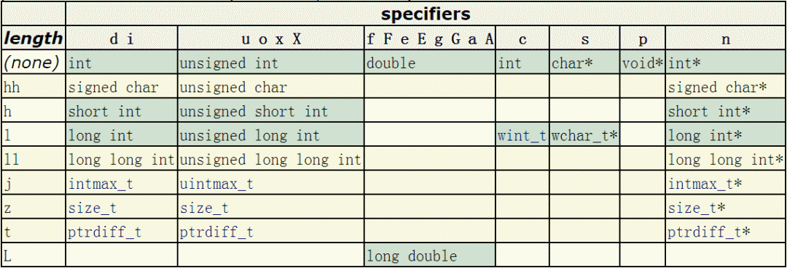

# C printf()


## 1、`printf()` 简介
`printf()` 是 C 语言标准库函数，用于将格式化后的字符串输出到标准输出。标准输出，即标准输出文件，对应终端的屏幕。`printf()` 申明于头文件 `stdio.h`。

### 函数原型：
```c
int printf ( const char * format, ... );
```

### 返回值：
正确返回输出的字符总数，错误返回负值。与此同时，输入输出流错误标志将被置值，可由指示器函数 `ferror(FILE *stream)` 来检查输入输出流的错误标志，如果 `ferror()` 返回一个非零值，表示出错。
<a name="xJqfS"></a>
### 调用格式：
```c
printf("格式化字符串", 输出表列)
```
格式化字符串包含三种对象，分别为：（1）字符串常量；（2）格式控制字符串；（3）转义字符。<br />字符串常量原样输出，在显示中起提示作用。输出表列中给出了各个输出项，要求格式控制字符串和各输出项在数量和类型上应该一一对应。其中格式控制字符串是以 `%` 开头的字符串，在 `%` 后面跟有各种格式控制符，以说明输出数据的类型、宽度、精度等。
<a name="bzaZf"></a>
## 2、格式控制字符串详解
`printf()` 的格式控制字符串组成如下：
```c
%[flags][width][.prec][length]type
```
分别为：<br />%[标志][最小宽度][.精度][类型长度]类型。
<a name="ejJQO"></a>
### 2.1 类型（type）
首先说明类型，因为类型是格式控制字符串的重中之重，是必不可少的组成部分，其它的选项都是可选的。type 用于规定输出数据的类型，含义如下：

| 字符 | 对应数据类型 | 含义 | 示例 |
| --- | --- | --- | --- |
| d/i | int | 输出十进制有符号 32bits 整数，i 是老式写法 | `printf("%i",123);`<br />输出123 |
| o | unsigned int | 无符号8进制(octal)整数(不输出前缀0) | `printf("0%o",123);`<br />输出0173 |
| u | unsigned int | 无符号10进制整数 | `printf("%u",123);`<br />输出123 |
| x/X | unsigned int | 无符号16进制整数，x对应的是abcdef，X对应的是ABCDEF（不输出前缀0x) | `printf("0x%x 0x%X",123,123);`<br />输出0x7b 0x7B |
| f/lf | float(double) | 单精度浮点数用f,双精度浮点数用lf(printf可混用，但scanf不能混用) | `printf("%.9f %.9lf",0.000000123,0.000000123);`<br />输出0.000000123 0.000000123。注意指定精度，否则printf默认精确到小数点后六位 |
| F | float(double) | 与f格式相同，只不过 infinity 和 nan 输出为大写形式。 | 例如<br />`printf("%f %F %f %F\\n",INFINITY,INFINITY,NAN,NAN);`<br />输出结果为<br />inf INF nan NAN |
| e/E | float(double) | 科学计数法，使用指数(Exponent)表示浮点数，此处"e"的大小写代表在输出时“e”的大小写 | `printf("%e %E",0.000000123,0.000000123);`<br />输出1.230000e-07 1.230000E-07 |
| g | float(double) | 根据数值的长度，选择以最短的方式输出，%f或%e | `printf("%g %g",0.000000123,0.123);`<br />输出1.23e-07 0.123 |
| G | float(double) | 根据数值的长度，选择以最短的方式输出，%f或%E | `printf("%G %G",0.000000123,0.123);`<br />输出1.23E-07 0.123 |
| c | char | 字符型。可以把输入的数字按照ASCII码相应转换为对应的字符 | `printf("%c\\n",64)`<br />输出A |
| s | char* | 字符串。输出字符串中的字符直至字符串中的空字符（字符串以空字符’\\0‘结尾） | `printf("%s","测试test");`<br />输出：测试test |
| S | wchar_t* | 宽字符串。输出字符串中的字符直至字符串中的空字符（宽字符串以两个空字符’\\0‘结尾） | `setlocale(LC_ALL,"zh_CN.UTF-8");` |

```c
wchar_t wtest[]=L"测试Test";
printf("%S\n",wtest);
```
输出：测试test | | p | void* | 以16进制形式输出指针 |` printf("0x%p","lvlv");`输出：0x000000013FF73350 | | n | int* | 什么也不输出。%n对应的参数是一个指向signed int的指针，在此之前输出的字符数将存储到指针所指的位置 | 
```c
int num=0;
printf("lvlv%n",&num);
printf("num:%d",num);
```
输出:lvlvnum:4 | | % | 字符% | 输出字符‘%’（百分号）本身 | <br />`printf("%%");`输出:% | | m | 无 | 打印errno值对应的出错内容 | <br />`printf("%m\n");` | | a/A | float(double) | 十六进制p计数法输出浮点数，a为小写，A为大写 | <br />`printf("%a %A",15.15,15.15);`输出：0x1.e4ccccccccccdp+3 0X1.E4CCCCCCCCCCDP+3 |<br />注意：<br />（1）使用 `printf()` 输出宽字符时，需要使用 `setlocale` 指定本地化信息并同时指明当前代码的编码方式。除了使用 %S，还可以使用 %ls。<br />（2）`printf()` 输出 bool 类型无专用类型标识符，实际输出时按照整型 0 或 1 输出布尔值。<br />（3）%a 和 %A 是 C99 引入的格式化类型，采用十六进制 p 计数法输出浮点数。p 计数法类似 E 科学计数法，但有所不同。数以 0x 开头，然后是 16 进制浮点数部分，接着是 p 后面是以 2 为底的阶码。以上面输出的 15.15 为例，推算输出结果。15.15 转换成二进制为1111.00 1001 1001 1001 1001 ...，因为二进制表示数值的离散特点，计算机对于小数有时是不能精确表示的，比如 0.5 可以精确表示为 0. 1 2 0.1_2 0.12，而 0.15 却不能精确表示。将15.15 对应的二进制右移三位，为1.1110 0100 1100 1100 1100 ...转换对应的十六进制就是0x1.e4ccccccccccd，注意舍入时向高位进了1位。由于右移三位，所以二进制阶码是 3。最后的结果就是 0x1.e4ccccccccccdp+3。<br />（4）格式控制字符串除了指明输出的数据类型，还可以包含一些其它的可选的格式说明，依序有 flags, width, .precision and length。下面一一讲解。
<a name="x7OBS"></a>
### 2.2 标志（flags）
flags 规定输出样式，取值和含义如下：

| 字符 | 名称 | 说明 |
| --- | --- | --- |
| - | 减号 | 结果左对齐，右边填空格。默认是右对齐，左边填空格。 |
| + | 加号 | 输出符号(正号或负号) |
| space | 空格 | 输出值为正时加上空格，为负时加上负号 |
| # | 井号 | type是o、x、X时，增加前缀0、0x、0X。 |

type是a、A、e、E、f、g、G时，一定使用小数点。默认的，如果使用.0控制不输出小数部分，则不输出小数点。type是g、G时，尾部的0保留。| | 0 | 数字零 | 将输出的前面补上0，直到占满指定列宽为止（不可以搭配使用“-”） |<br />示例：
```c
printf("%5d\n",1000); //默认右对齐,左边补空格
printf("%-5d\n",1000); //左对齐,右边补空格

printf("%+d %+d\n",1000,-1000); //输出正负号

printf("% d % d\n",1000,-1000); //正号用空格替代，负号输出

printf("%x %#x\n",1000,1000); //输出0x

printf("%.0f %#.0f\n",1000.0,1000.0); //当小数点后不输出值时依然输出小数点

printf("%g %#g\n",1000.0,1000.0); //保留小数点后后的0

printf("%05d\n",1000); //前面补0
```
输出结果为：<br />
<a name="JtFak"></a>
### 2.3 输出最小宽度（width）
用十进制整数来表示输出的最少位数。若实际位数多于指定的宽度，则按实际位数输出，若实际位数少于定义的宽度则补以空格或0。width的可能取值如下：

| width | 描述 | 示例 |
| --- | --- | --- |
| 数值 | 十进制整数 | `printf("%06d",1000);`<br />输出:001000 |
| * | 星号。不显示指明输出最小宽度，而是以星号代替，在printf的输出参数列表中给出 | `printf("%0*d",6,1000);`<br />输出:001000 |

<a name="zx4n4"></a>
### 2.4 精度（`.precision`）
精度格式符以“`.`”开头，后跟十进制整数。可取值如下：

| `.precision` | 描述 |
| --- | --- |
| `.数值` | 十进制整数。 |

(1)对于整型（d,i,o,u,x,X）,`precision`表示输出的最小的数字个数，不足补前导零，超过不截断。<br />(2)对于浮点型（a, A, e, E, f ），`precision`表示小数点后数值位数，默认为六位，不足补后置0，超过则截断。<br />(3)对于类型说明符g或G，表示可输出的最大有效数字。<br />(4)对于字符串（s），`precision`表示最大可输出字符数，不足正常输出，超过则截断。<br />`precision`不显示指定，则默认为0 | | .* | 以星号代替数值，类似于width中的*，在输出参数列表中指定精度。|<br />示例：
```c
printf("%.8d\n",1000); //不足指定宽度补前导0，效果等同于%08d
printf("%.8f\n",1000.123456789);//超过精度，截断
printf("%.8f\n",1000.123456); //不足精度，补后置0
printf("%.8g\n",1000.123456); //最大有效数字为8位
printf("%.8s\n","abcdefghij"); //超过指定长度截断
```
输出结果：
```c
00001000
1000.12345679
1000.12345600
1000.1235
abcdefgh
```
注意： 在对浮点数和整数截断时，存在四舍五入。
<a name="ssfLn"></a>
### 2.5 类型长度（length）
类型长度指明待输出数据的长度。因为相同类型可以有不同的长度，比如整型有 char（8bits）、short int（16bits），int（32bits）和 long int（64bits），浮点型有 32bits 的单精度 float 和 64bits 的双精度 double。为了指明同一类型的不同长度，于是乎，类型长度（length）应运而生，成为格式控制字符串的一部分。<br />因为 Markdown 表格不支持单元格合并，背景颜色等样式，所以直接引用C++ reference.printf [http://www.cplusplus.com/reference/cstdio/printf/?kw=printf](http://www.cplusplus.com/reference/cstdio/printf/?kw=printf))的表格。<br /><br />注意： 黄色背景行标识的类型长度说明符和相应的数据类型是C99引入的。<br />示例代码：
```c
printf("%hhd\n",'A');    //输出有符号char
printf("%hhu\n",'A'+128);   //输出无符号char
printf("%hd\n",32767);    //输出有符号短整型short int
printf("%hu\n",65535);    //输出无符号短整型unsigned short int
printf("%ld\n",0x7fffffffffffffff); //输出有符号长整型long int
printf("%lu\n",0xffffffffffffffff); //输出有符号长整型unsigned long int
```
输出结果：
```c
65
193
32767
65535
9223372036854775807
18446744073709551615
```
注意：long int 到底是 32bits 还是 64bits 跟生成的程序是 32bits 还是 64bits 一一对应，如果使用 g++ 编译程序的话，可通过-m32或-m64选项分别生成 32bits 和 64bits 的程序。因测试代码编译生成的是 64bits 的程序，所以 long int 也就是 64btis。
<a name="xo8P3"></a>
## 3、转义字符
转义字符在字符串中会被自动转换为相应操作命令。printf() 使用的常见转义字符如下：

| 转义字符 | 意义 |
| --- | --- |
| \\a | 警报（响铃）符 |
| \\b | 回退符 |
| \\f | 换页符 |
| \\n | 换行符 |
| \\r | 回车符 |
| \\t | 横向制表符 |
| \\v | 纵向制表符 |
| \\\\ | 反斜杠 |
| \\" | 双引号 |

<a name="g6Us4"></a>
## 4、关于 `printf` 缓冲
在 `printf` 的实现中，在调用 `write` 之前先写入 IO 缓冲区，这是一个用户空间的缓冲。系统调用是软中断，频繁调用，需要频繁陷入内核态，这样的效率不是很高，而 `printf` 实际是向用户空间的 IO 缓冲写，在满足条件的情况下才会调用 `write` 系统调用，减少 IO 次数，提高效率。<br />`printf(…)` 在 glibc 中默认为行缓冲，遇到以下几种情况会刷新缓冲区，输出内容：<br />（1）缓冲区填满；<br />（2）写入的字符中有换行符`\n`或回车符`\r`；<br />（3）调用 `fflush(…)` 手动刷新缓冲区；<br />（4）调用 `scanf(…)` 从输入缓冲区中读取数据时，也会将输出缓冲区内的数据刷新。<br />可使用`setbuf(stdout,NULL)`关闭行缓冲，或者`setbuf(stdout,uBuff)`设置新的缓冲区，uBuff 为自己指定的缓冲区。也可以使用`setvbuf(stdout,NULL,_IOFBF,0);`来改变标准输出为全缓冲。全缓冲与行缓冲的区别在于遇到换行符不刷新缓冲区。<br />`printf(…)` 在 VC++ 中默认关闭缓冲区，输出时会及时输到屏幕 [ 3 ] ^{[3]} [3]。如果显示开启缓冲区，只能设置全缓冲。因为微软闭源，所以无法研究 `printf(…)` 的实现源码。<br />Linux 和 Windows 下的缓冲区管理可见：C的全缓冲、行缓冲和无缓冲 
<a name="Z9GCb"></a>
## 5、`printf` 与 `wprintf` 不能同时使用
在输出宽字符串时，发现将 `printf` 和 `wprintf` 同时使用时，则后使用的函数没有输出。这里建议不要同时使用 `printf` 和 `wprintf`，以免发生错误。<br />`printf` 和 `wprintf` 不能同时输出宽字符串的示例代码如下：
```c
#include <stdio.h>
#include <wchar.h>
#include <locale.h>

int main(int argc, char *argv[]) {
    char test[] = "测试Test";
    setlocale(LC_ALL, "zh_CN.UTF-8");
    wchar_t wtest[] = L"0m~K0m~UTest";
    printf("printf:%S\n", wtest);     //语句1：可正常输出"测试Test"
    wprintf(L"wprintf:%S\n", wtest);  //语句2：无任何内容输出
}
```
上面的代码中语句 1 和语句 2 不能同时存在，否则只能正常输出第一个。也不知道在 Windows 平台是否也存在这种问题，有兴趣的同学可以尝试一下。关于原因，GNU 官方文档中有明确说明不能同时使用 `printf` 与 `wprintf`，参见[The GNU C Library Section 12.6 Streams in Internationalized Applications ](http://www.gnu.org/software/libc/manual/html_node/Streams-and-I18N.html#Streams-and-I18N)[http://www.gnu.org/software/libc/manual/html_node/Streams-and-I18N.html#Streams-and-I18N](http://www.gnu.org/software/libc/manual/html_node/Streams-and-I18N.html#Streams-and-I18N))，内容如下：
> It is important to never mix the use of wide and not wide operations on a stream. There are no diagnostics issued. The application behavior will simply be strange or the application will simply crash. 

这里是因为输出流在被创建时，不存在流定向，一旦使用了 `printf(多字节字符串)` 或 `wprintf(宽字符串)`后，就被设置为对应的流定向，且无法更改。可以使用如下函数获取当前输出流的流定向。
```c
//
//@param: stream：文件流；mode：取值可以 >0、=0 或 <0
//@ret: <0：流已被设置为多字节流定向；=0：流尚未被设置；>0：流已被设置为宽字符流定向
//
int fwide (FILE* stream, int mode);

//获取当前标准输出流定向
int ret=fwide(stdout,0);
```
通过 `fwide` 可以设置当前流定向，前提是未有任何的 I/O 操作，也就是当前流尚未被设置任何流定向。不知为何标准库函数 fwide 实现的如此受限。具体操作如下：
```c
//设置标准输出流定向为多字节流定向
fwide(stdout, -1);

//设置标准输出流定向为宽字符流定向
fwide(stdout, 1);
```
既然 GNU C 存在这个问题，那该如何解决呢？这里有两种办法：<br />（1）统一使用一种函数。例如：
```c
wprintf(L"%s","a\n");
wprintf(L"b\n");

//或
printf("a\n");
printf("%ls\n", L"b");
```
（2）使用 C 标准库函数 `freopen(…)` 清空流定向。
```c
//重新打开标准输出流，清空流定向
FILE* pFile=freopen("/dev/tty", "w", stdout);
wprintf(L"wide freopen succeeded\n");

//重新打开标准输出流，清空流定向
pFile=freopen("/dev/tty", "w", stdout);
printf("narrow freopen succeeded\n");
```
上面可以让 `printf(…)` 与 `wprintf(…)` 同时使用。
