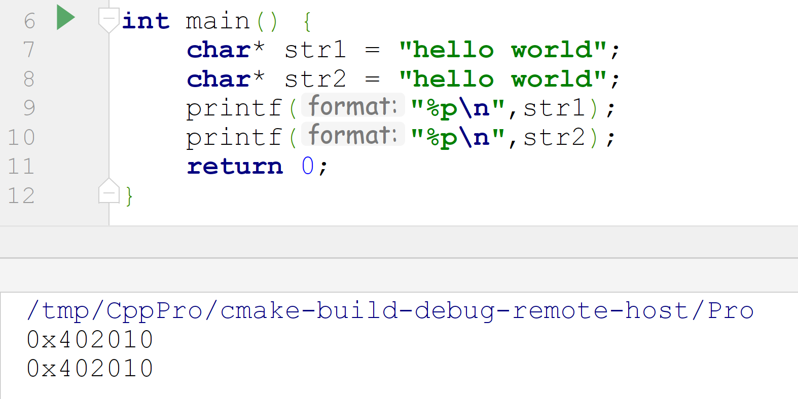
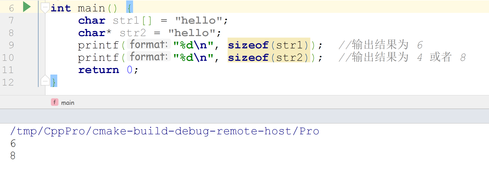
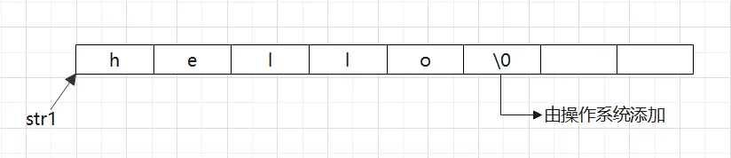
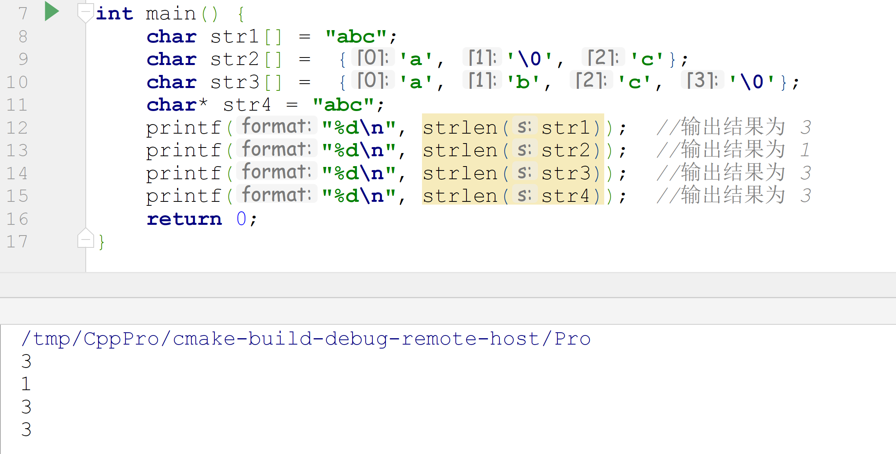
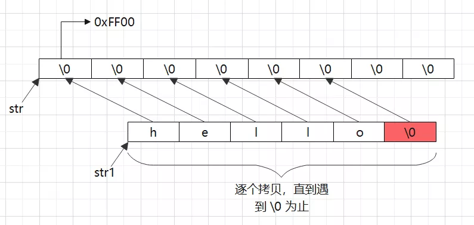
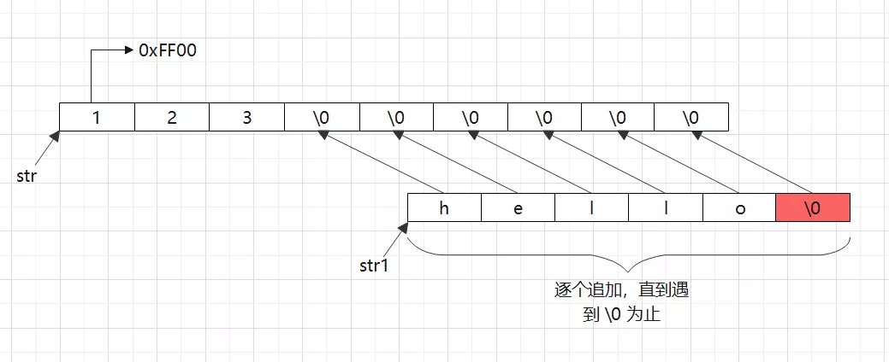

# C 字符串

c/c++之所以使用起来灵活，很大原因归因于它能够它对能够对内存的直接操作。
<a name="tftoG"></a>

## C语言中的字符串有两种定义的方法
分别是：
```c
char str1[] = "hello world";  //栈区字符串
char* str2 = "hello world";  //数据常量区字符串
```
那么这两种在使用起来究竟有什么区别呢？答案是第一行定以后，操作系统给它分配的是栈区内存，而第二行通过指针形式来定义字符串的话，它分配的内存区在数据的常量区，意味着它的值是不可更改的：
```c
str1[0] = 'm';  //正确，字符数组可以修改
str2[0] = 'm';  //错误，常量区不可修改
```
所以，在常量区，如果两个内容相同但变量不同的指针变量，其实它们指向的是同一块内存：
```c
char* str1 = "hello world";  
char* str2 = "hello world";  
printf("%p\n",str1);
printf("%p\n",str2);
```
<br />上面两行代码中，将str1与str2指向的内存地址分别打印出来，发现他们的值是一样的，为什么呢，这是因为常量区内存的值是只读的，即便声明两个不同的变量，只要他们的值是相同的，那么两个变量指向的就是同一块内存区域。<br />这里值得注意的是，在c++中，字符串指针与c语言中稍有区别，c++中直接将字符串指针做了增强处理，因为c++中规定字符串指针必须用`const`修饰，例如在c++中这样定义，编译器会直接报错：
```c
char* str = "hello world";  //直接报错
const char * str = "hello world";  //正确
```
而在实际开发过程中，使用字符串一般使用数组形式，不太建议使用指针字符串形式，也即：
```c
char str[] = "hello world";  //建议使用
char* str = "hello world";  //不建议使用
```
所以，这方面细微的差别需要注意。
<a name="jZOlr"></a>
## 符串长度问题
c语言中的字符串是以 '`\0`' 为结尾的，也就是说在声明一个字符串的时候，系统会自动为结尾添加上一个以 '`\0`' 为结尾的结束字符，而且，`printf` 在每打印一个字符就会检查当前字符是否为 '`\0`' ，直到遇到 '`\0`' 立马停止。这里最容易混淆的的是字符串的长度，来看下面两行代码：<br />先来看下面两行代码：
```c
char str1[] = "hello";
char* str2 = "hello";
printf("%d\n", sizeof(str1));  //输出结果为 6
printf("%d\n", sizeof(str2));  //输出结果为 4 或者 8
```
<br />那么为什么在使用 sizeof 计算字符串长度，两者计算出来的结果不一样呢，而且第一行长度还不是我们想要的，不应该是 5 才对吗？这是因为在声明一个字符串的时候，系统会自动为结尾添加上一个以 '`\0`' 为结尾的结束字符，内存模型如下：<br /><br />所以，对于上面两行代码，实际上它们的长度都为 6 才对。那为什么第二行输出却为 4 呢，这是因为第二行定义的是一个字符串指针，它指向一个常量区的字符串，而 `sizeof` 操作符操作这个指针的时候，实际上计算的是这个指针的字节长度，而一个指针在x86系统下占有长度为 4 字节，在x64环境下占有长度为 8 字节，所以，在实际上计算字符串长度的时候，一般会用 `strlen()` 这个函数，但是要注意，`strlen` 计算字符串也是以 '`\0`' 为结束的，也就是说，`strlen()` 函数会不断判断当前字符是否为 '`\0`'，如果是的话，立马结束，这个特点与`printf`函数一样，两者都是碰到 '`\0`' 就立马结束：
```c
char str1[] = "abc";
char str2[] =  {'a', '\0', 'c'};
char str3[] =  {'a', 'b', 'c', '\0'};
char* str4 = "abc";
printf("%d\n", strlen(str1));  //输出结果为 3
printf("%d\n", strlen(str2));  //输出结果为 1
printf("%d\n", strlen(str3));  //输出结果为 3
printf("%d\n", strlen(str4));  //输出结果为 3
```
<br />上面就是c语言中的字符串长度函数，在使用过程中千万要注意。
<a name="FfWka"></a>
## C语言中的字符串拷贝函数
<a name="bZuNX"></a>
### 1)、`strcpy()`
```c
#include <string.h>
char *strcpy(char *dest, const char *src);
//功能：把src所指向的字符串复制到dest所指向的空间中，'\0'也会拷贝过去
参数：
  dest：目的字符串首地址
  src：源字符首地
返回值：
  成功：返回dest字符串的首地址
  失败：NULL
```
示意代码如下：
```c
#define _CRT_SECURE_NO_WARNINGS
#include <string.h>
char str[10] = { 0 };
char str1[] = "hello";
char* mystr = strcpy(str, str1);  将strcpy返回的指针保存到mystr里面
printf(mystr);
```
内存模型如下：<br /><br />由于是逐个拷贝，意味着哪怕在字符串的中间遇到了 '\0' 字符，也会结束拷贝。<br />这里边要注意两个问题：第一，必须保证 dest 所指向的内存空间足够大，否则可能会造成缓冲溢出的错误；第二，由于本身`strcpy`函数是一个非安全函数，所以编译器会弹出警告，要想忽略，请在程序最开头添加宏定义代码：
```c
#define _CRT_SECURE_NO_WARNINGS
```
<a name="tMChB"></a>
### 2)、`strncpy()`
```c
#include <string.h>
char *strncpy(char *dest, const char *src, size_t n);
功能：
  把src指向字符串的前n个字符复制到dest所指向的空间中，
  是否拷贝结束符看指定的长度是否包含'\0'。
参数：
  dest：目的字符串首地址
  src：源字符首地址
  n：指定需要拷贝字符串个数
返回值：
  成功：返回dest字符串的首地址
  失败：NULL
```
这个函数与`strcpy`类似。
<a name="CeRSl"></a>
### 3)、`strcat()`
```c
#include <string.h>
char *strcat(char *dest, const char *src);
功能：将src字符串连接到dest的尾部，‘\0’也会追加过去
参数：
  dest：目的字符串首地址
  src：源字符首地址
返回值：
  成功：返回dest字符串的首地址
  失败：NULL
```
这是一个字符串追加函数，将 src 指向的字符串追加到 dest 指向的字符串后面，同样，结束符 '`\0`' 也会追加过去：
```c
#define _CRT_SECURE_NO_WARNINGS
#include <string.h>
char str[] = "123";
char str1[] = "hello";
char* mystr = strcat(str, str1);
printf("%s\n%p", mystr, mystr);  
//输出结果为：123hello
```
但是同样注意的是，目标字符串 dest 要有足够大的缓冲区来接收，否则会报错，内存模型如下：<br />
<a name="sHtIj"></a>
### 4)、`strncat()`
```c
#include <string.h>
char *strncat(char *dest, const char *src, size_t n);
功能：将src字符串前n个字符连接到dest的尾部，‘\0’也会追加过去
参数：
  dest：目的字符串首地址
  src：源字符首地址
  n：指定需要追加字符串个数
返回值：
  成功：返回dest字符串的首地址
  失败：NULL
```
这个函数与`strcat`类似，只不过指定了追加的数量。
<a name="S3qag"></a>

### 5)、`strcmp()`
```c
#include <string.h>
char *strcat(char *dest, const char *src);
功能：将src字符串连接到dest的尾部，‘\0’也会追加过去
参数：
  dest：目的字符串首地址
  src：源字符首地址
返回值：
  成功：返回dest字符串的首地址
  失败：NULL
```
作用是对两个字符串的ASCII码进行比较，输出不同结果，经常用于判断两个字符串是否相等，示例代码如下：
```c
char *str1 = "hello world";
char *str2 = "hello mike";

if (strcmp(str1, str2) == 0)
{
  printf("str1==str2\n");
}
else if (strcmp(str1, str2) > 0)
{
  printf("str1>str2\n");
}  
else
{
  printf("str1<str2\n");
}
```

### 6)、`strncmp()`
```c
#include <string.h>
int strncmp(const char *s1, const char *s2, size_t n);
功能：比较 s1 和 s2 前n个字符的大小，比较的是字符ASCII码大小。
参数：
  s1：字符串1首地址
  s2：字符串2首地址
  n：指定比较字符串的数量
返回值：
  相等：0
  大于：> 0
  小于： < 0
```
这个函数作用也是与`strcmp`类似。

### 7)、`sprintf()`
```c
#include <stdio.h>
int sprintf(char *str, const char *format, ...);
功能：根据参数format字符串来转换并格式化数据，
      然后将结果输出到str指定的空间中，
      直到出现字符串结束符 '\0' 为止。
参数：
  str：字符串首地址
  format：字符串格式，用法和printf()一样
返回值：
  成功：实际格式化的字符个数
  失败： - 1
```
示例代码如下：
```c
char dst[100] = { 0 };
int a = 10;
char src[] = "hello";
int len = sprintf(dst, "a=%d, src=%s", a, src);
printf("dst: %s\n", dst);  输出 a=10,src=hello
printf("len = %d\n", len);  输出14
```
下面再介绍几个字符串操作函数，但这几个使用频率比较小：
<a name="J4fsQ"></a>
### 8)、`sscanf()`
```c
#include <stdio.h>
int sscanf(const char *str, const char *format, ...);
功能：从str指定的字符串读取数据，
  并根据参数format字符串来转换并格式化数据。
参数：
  str：指定的字符串首地址
  format：字符串格式，用法和scanf()一样
返回值：
  成功：参数数目，成功转换的值的个数
  失败： - 1
```
示例代码：
```c
char src[] = "a=10, b=20";
int a;
int b;
sscanf(src, "a=%d,  b=%d", &a, &b);
printf("a:%d, b:%d\n", a, b);
输出：a:20,b:20
```
`sscanf`与`scanf`类似，都是用于输入的，只是后者以屏幕(`stdin`)为输入源，前者以固定字符串为输入源。 
<a name="HvT4X"></a>
### 9)、`strchr()`
```c
#include <string.h>
char *strchr(const char *s, char c);
功能：在字符串s中查找字母c出现的位置
参数：
  s：字符串首地址
  c：匹配字母(字符)
返回值：
  成功：返回第一次出现的c地址（注意是地址，不是字符数组索引）
  失败：NULL
```
示例代码：
```c
char src[] = "ddda123abcd";
char *p = strchr(src, 'a');
printf("p = %s\n", p);
输出：p=a123abcd
```
<a name="BzaO8"></a>
### 10)、`strstr()`
```c
#include <string.h>
char *strstr(const char *haystack, const char *needle);
功能：在字符串haystack中查找字符串needle出现的位置
参数：
  haystack：源字符串首地址
  needle：匹配字符串首地址
返回值：
  成功：返回第一次出现的needle地址
  失败：NULL
```
这个函数与上一个 `strchr` 功能类似，只不过查找的内容是字符串，而非字单个字符。
<a name="ahf3o"></a>
### 11)、`strtok()`
```c
#include <string.h>
char *strtok(char *str, const char *delim);
功能：将字符串分割成一个个片段, 
      当strtok()在参数str的字符串中发现参数delim中包含的分割字符时, 
      则会将该字符改为\0 字符，当连续出现多个时只替换第一个为\0，
      该函数会破坏原有字符串。
参数：
  str：指向欲分割的字符串
  delim：为分割字符串中包含的所有字符
返回值：
  成功：分割后字符串首地址
  失败：NULL
```
示例代码：
```c
char a[100] = "www.baidu.com";
char *p = strtok(a, ".");
while (p != NULL)
{  
  printf("%s\n", p);  
  p = strtok(NULL, ".");
}
输出：www baidu com
```
