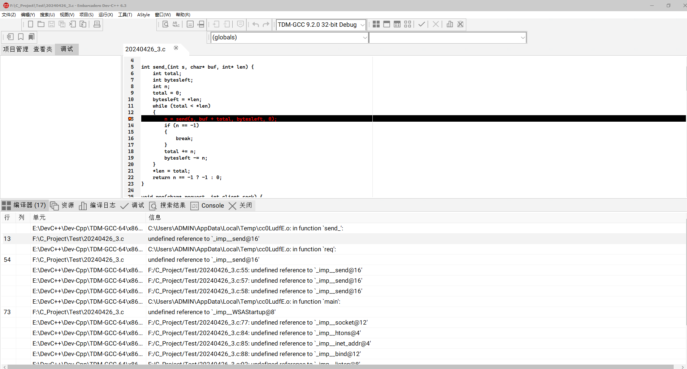

# C

​	说到 web 服务器想必大多数人首先想到的协议是 http，那么 http 之下则是 tcp，这里通过 tcp 来实现一个简单的 web 服务器。着重讲解如何实现，对于 http 与 tcp 的概念本篇将不过多讲解。


## 一、了解 Socket 及 web 服务工作原理
既然是基于 tcp 实现 web 服务器，很多学习 C 语言的小伙伴可能会很快的想到套接字 socket。socket 是一个较为抽象的通信进程，或者说是主机与主机进行信息交互的一种抽象。socket 可以将数据流送入网络中，也可以接收数据流。

socket 的信息交互与本地文件信息的读取从表面特征上看类似，但其中所存在的编写复杂度是本地 IO 不能比拟的，但却有相似点。在 win 下 socket 的交互交互步骤为：WSAStartup 进行初始化--> socket 创建套接字--> bind 绑定--> listen 监听--> connect 连接--> accept 接收请求--> send/recv 发送或接收数据--> closesocket 关闭 socket--> WSACleanup 最终关闭。


​	了解完了一个 socket 的基本步骤后了解一下一个基本 web 请求的用户常规操作，操作分为：打开浏览器-->输入资源地址 ip 地址-->得到资源。当目标服务器接收到该操作产生掉请求后，可以把服务器的响应流程步骤看为：获得 request 请求-->得到请求关键数据-->获取关键数据-->发送关键数据。服务器的这一步流程是在启动socket 进行监听后才能响应。通过监听得知接收到请求，使用 recv 接收请求数据，从而根据该参数得到进行资源获取，最后通过 send 将数据进行返回。


## 二、创建sokect完成监听
### 2.1 WSAStartup初始化
首先在c语言头文件中引入依赖 WinSock2.h：
```c
#include <WinSock2.h>
```
在第一点中对 socket 的创建步骤已有说明，首先需要完成 socket 的初始化操作，使用函数 WSAStartup，该函数的原型为：
```c
int WSAStartup(
    WORD      wVersionRequired,
    LPWSADATA lpWSAData
);
```
该函数的参数 wVersionRequired 表示 WinSock2 的版本号；lpWSAData 参数为指向 WSADATA 的指针，WSADATA 结构用于 WSAStartup 初始化后返回的信息。

wVersionRequired 可以使用 MAKEWORD 生成，在这里可以使用版本 1.1 或版本2.2，1.1 只支持 TCP/IP，版本 2.1 则会有更多的支持，在此选择版本 1.1。

首先声明一个 WSADATA 结构体  ：

```c
WSADATA wsaData;
```
随后传参至初始化函数 WSAStartup 完成初始化：
```c
WSAStartup(MAKEWORD(1, 1), &wsaData)
```
WSAStartup 若初始化失败则会返回非0值：
```c
if (WSAStartup(MAKEWORD(1, 1), &wsaData) != 0) 
{
 exit(1);
}
```


### 2.2 创建socket 套接字
初始化完毕后开始创建套接字，套接字创建使用函数，函数原型为：
```c
SOCKET WSAAPI socket(
  int af,
  int type,
  int protocol
);
```
在函数原型中，af 表示 IP 地址类型，使用 PF_INET 表示 IPV4，type 表示使用哪种通信类型，例如 SOCK_STREAM 表示 TCP，protocol 表示传输协议，使用 0 会根据前 2 个参数使用默认值。
```c
int skt = socket(PF_INET, SOCK_STREAM, 0);
```
创建完 socket 后，若为 -1 表示创建失败，进行判断如下：
```c
if (skt == -1) 
{         
 return -1;
}
```

### 2.3 绑定服务器
创建完 socket 后需要对服务器进行绑定，配置端口信息、IP 地址等。 首先查看 bind 函数需要哪一些参数，函数原型如下：
```c
int bind(
  SOCKET         socket,
  const sockaddr *addr,
  int            addrlen
);
```
参数 socket 表示绑定的 socket，传入 socket 即可；addr 为 sockaddr_in 的结构体变量的指针，在 sockaddr_in 结构体变量中配置一些服务器信息；addrlen 为 addr 的大小值。

通过 bind 函数原型得知了所需要的数据，接下来创建一个 sockaddr_in 结构体变量用于配置服务器信息：

```c
struct sockaddr_in server_addr;
```
随后配置地址家族为AF_INET对应TCP/IP：
```c
server_addr.sin_family = AF_INET;
```
接着配置端口信息：
```c
server_addr.sin_port = htons(8080);
```
再指定 ip 地址：
```c
server_addr.sin_addr.s_addr = inet_addr("127.0.0.1");
```
ip 地址若不确定可以手动输入，最后使用神器 memset 初始化内存，完整代码如下：
```c
//配置服务器 
struct sockaddr_in server_addr;
server_addr.sin_family = AF_INET;
server_addr.sin_port = htons(8080);
server_addr.sin_addr.s_addr = inet_addr("127.0.0.1");
memset(&(server_addr.sin_zero), '\0', 8);
```
随后使用 bind 函数进行绑定且进行判断是否绑定成功：
```c
//绑定
if (bind(skt, (struct sockaddr *)&server_addr,sizeof(server_addr)) == -1) {       
    return -1; 
}
```

### 2.4 listen进行监听
绑定成功后开始对端口进行监听。查看 listen 函数原型：
```c
int listen(
    int sockfd, 
    int backlog
)
```
函数原型中，参数 sockfd 表示监听的套接字，backlog 为设置内核中的某一些处理（此处不进行深入讲解），直接设置成 10 即可，最大上限为 128。使用监听并且判断是否成功代码为：
```c
if (listen(skt, 10) == -1 ) {    
    return -1;
}
```
此阶段完整代码如下：
```c
#include <WinSock2.h>
#include<stdio.h> 
int main(){
    //初始化 
    WSADATA wsaData;
    if (WSAStartup(MAKEWORD(1, 1), &wsaData) != 0) {
     exit(1);
 }
    //socket创建 
    int skt = socket(PF_INET, SOCK_STREAM, 0);
    if (skt == -1) {         
     return -1;
 }
    //配置服务器 
    struct sockaddr_in server_addr;
    server_addr.sin_family = AF_INET;
    server_addr.sin_port = htons(8080);
    server_addr.sin_addr.s_addr = inet_addr("127.0.0.1");
    memset(&(server_addr.sin_zero), '\0', 8);
    //绑定
    if (bind(skt, (struct sockaddr *)&server_addr,sizeof(server_addr)) == -1){       
     return -1; 
 } 
    //监听 
    if (listen(skt, 10) == -1 ) {    
     return -1;
 }

    printf("Listening ... ...\n");
}
```
运行代码可得知代码无错误，并且输出 listening：


### 2.5 获取请求
监听完成后开始获取请求。受限需要使用 accept 对套接字进行连接，accept 函数原型如下：
```c
int accept(
    int sockfd,
    struct sockaddr *addr,
    socklen_t *addrlen
);
```
参数 sockfd 为指定的套接字；addr 为指向 struct sockaddr 的指针，一般为客户端地址；addrlen 一般设置为设置为 sizeof(struct   sockaddr_in) 即可。代码为：
```c
struct sockaddr_in c_skt; 
int s_size=sizeof(struct   sockaddr_in);
int access_skt = accept(skt, (struct sockaddr *)&c_skt, &s_size);
```
接下来开始接受客户端的请求，使用recv函数，函数原型为：
```c
ssize_t recv(
    int sockfd, 
    void *buf, 
    size_t len, 
    int flags
)
```
参数 sockfd 为 accept 建立的通信；buf 为缓存，数据存放的位置；len 为缓存大小；flags 一般设置为0即可：
```c
//获取数据 
char buf[1024];
if (recv(access_skt, buf, 1024, 0) == -1) {
    exit(1);
}
```
此时再到 accpt 和 recv 外层添加一个循环，使之流程可重复：
```c
while(1){
    //建立连接 
    printf("Listening ... ...\n");
    struct sockaddr_in c_skt; 
    int s_size=sizeof(struct   sockaddr_in);
    int access_skt = accept(skt, (struct sockaddr *)&c_skt, &s_size);

    //获取数据 
    char buf[1024];
    if (recv(access_skt, buf, 1024, 0) == -1) {
      exit(1);
  }
}
```
并且可以在浏览器输入 127.0.0.1:8080 将会看到客户端打印了 listening 新建了链接:<br />


添加`printf`语句可查看客户端请求：

```c
while(1){
    //建立连接 
    printf("Listening ... ...\n");
    struct sockaddr_in c_skt; 
    int s_size=sizeof(struct   sockaddr_in);
    int access_skt = accept(skt, (struct sockaddr *)&c_skt, &s_size);

    //获取数据 
    char buf[1024];
    if (recv(access_skt, buf, 1024, 0) == -1) {
      exit(1);
  }

    printf("%s",buf);
}
```
<br />接下来对请求头进行对应的操作。

### 2.6 请求处理层编写
得到请求后开始编写处理层。继续接着代码往下写没有层级，编写一个函数名为 req，该函数接收请求信息与一个建立好的连接为参数：
```c
void req(char* buf, int access_socket) 
{
}
```
然后先在 while 循环中传递需要的值：
```c
req(buf, access_skt);
```
接着开始编写 req 函数，首先在 req 函数中标记当前目录下：
```c
char arguments[BUFSIZ];  
strcpy(arguments, "./");
```
随后分离出请求与参数：
```c
char command[BUFSIZ];     
sscanf(request, "%s%s", command, arguments+2);
```
接着标记一些头元素：
```c
char* extension = "text/html";   
char* content_type = "text/plain";     
char* body_length = "Content-Length: ";
```
接着获取请求参数，若获取 index.html，就获取当前路径下的该文件：
```c
FILE* rfile= fopen(arguments, "rb");
```
获取文件后表示请求 ok，先返回一个 200 状态：
```c
char* head = "HTTP/1.1 200 OK\r\n";    
int len; 
char ctype[30] = "Content-type:text/html\r\n";   
len = strlen(head);
```
接着编写一个发送函数 send_：
```c
int send_(int s, char *buf, int *len) {
    int total;          
    int bytesleft;                                
    int n;
    total=0;
    bytesleft=*len;
    while(total < *len) 
 {
     n = send(s, buf+total, bytesleft, 0);
     if (n == -1) 
  {
      break;
  }
     total += n;
     bytesleft -= n;
 }
    *len = total;          
    return n==-1?-1:0;         
}
```
`send` 函数功能并不难在此不再赘述，就是一个遍历发送的逻辑。随后发送 http 响应与文件类型：

```c
send_(send_to, head, &len);
len = strlen(ctype);
send_(send_to, ctype, &len);
```
随后获得请求文件的描述，需要添加头文件`#include <sys/stat.h>`使用`fstat`，且向已连接的通信发生必要的信息 ：
```c
//获取文件描述
struct stat statbuf;
char read_buf[1024];       
char length_buf[20];
fstat(fileno(rfile), &statbuf);
itoa( statbuf.st_size, length_buf, 10 );
send(client_sock, body_length, strlen(body_length), 0);
send(client_sock, length_buf, strlen(length_buf), 0);

send(client_sock, "\n", 1, 0);
send(client_sock, "\r\n", 2, 0);
```
最后发送数据：
```c
//·数据发送
char read_buf[1024]; 
len = fread(read_buf ,1 , statbuf.st_size, rfile);
if (send_(client_sock, read_buf, &len) == -1) { 
    printf("error!");   
}
```
最后访问地址 http://127.0.0.1:8080/index.html，得到当前目录下 index.html 文件数据，并且在浏览器渲染：<br /><br />


所有代码如下：

```c
#include <WinSock2.h>
#include <stdio.h> 
#include <sys/stat.h> 

int send_(int s, char *buf, int *len) {
    int total;          
    int bytesleft;                                
    int n;
    total=0;
    bytesleft=*len;
    while(total < *len) 
    {
        n = send(s, buf+total, bytesleft, 0);
        if (n == -1) 
        {
            break;
        }
        total += n;
        bytesleft -= n;
    }
    *len = total;          
    return n==-1?-1:0;         
}

void req(char* request, int client_sock) {   
    char arguments[BUFSIZ];  
    strcpy(arguments, "./");

    char command[BUFSIZ];     
    sscanf(request, "%s%s", command, arguments+2);

    char* extension = "text/html";   
    char* content_type = "text/plain";     
    char* body_length = "Content-Length: ";

    FILE* rfile= fopen(arguments, "rb");


    char* head = "HTTP/1.1 200 OK\r\n";    
    int len; 
    char ctype[30] = "Content-type:text/html\r\n";   
    len = strlen(head);

    send_(client_sock, head, &len);
    len = strlen(ctype);
    send_(client_sock, ctype, &len);


    struct stat statbuf;

    char length_buf[20];
    fstat(fileno(rfile), &statbuf);
    itoa( statbuf.st_size, length_buf, 10 );
    send(client_sock, body_length, strlen(body_length), 0);
    send(client_sock, length_buf, strlen(length_buf), 0);

    send(client_sock, "\n", 1, 0);
    send(client_sock, "\r\n", 2, 0);


    char read_buf[1024]; 
    len = fread(read_buf ,1 , statbuf.st_size, rfile);
    if (send_(client_sock, read_buf, &len) == -1) { 
        printf("error!");   
    }

    return;
}


int main(){
    WSADATA wsaData;
    if (WSAStartup(MAKEWORD(1, 1), &wsaData) != 0) {
        exit(1);
    }

    int skt = socket(PF_INET, SOCK_STREAM, 0);
    if (skt == -1) {         
        return -1;
    }

    struct sockaddr_in server_addr;
    server_addr.sin_family = AF_INET;
    server_addr.sin_port = htons(8080);
    server_addr.sin_addr.s_addr = inet_addr("127.0.0.1");
    memset(&(server_addr.sin_zero), '\0', 8);

    if (bind(skt, (struct sockaddr *)&server_addr,sizeof(server_addr)) == -1) {       
        return -1; 
    } 

    if (listen(skt, 10) == -1 ) {    
        return -1;
    }

    while(1){

        printf("Listening ... ...\n");
        struct sockaddr_in c_skt; 
        int s_size=sizeof(struct   sockaddr_in);
        int access_skt = accept(skt, (struct sockaddr *)&c_skt, &s_size);

        char buf[1024];
        if (recv(access_skt, buf, 1024, 0) == -1) {
            exit(1);
        }

        req(buf, access_skt);
    } 

}
```
可以编写更加灵活的指定资源类型、错误处理等完善这个 demo。


+ 首次编译运行上述代码会出现以下错误




+ 在这里编辑编译器命令


+ 加入以下命令

~~~ shell
-static-libgcc -lws2_32
~~~


