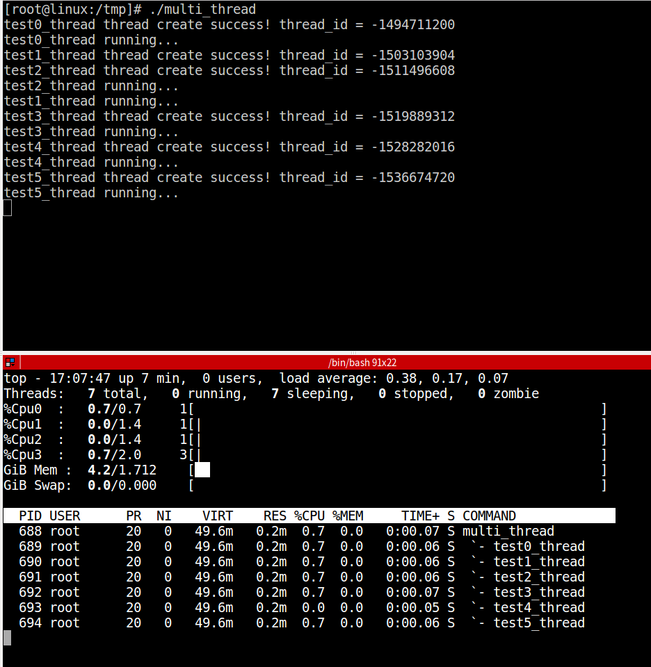
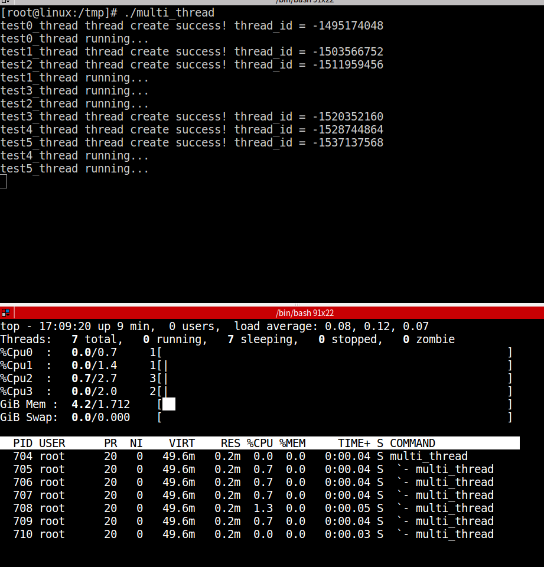

嵌入式Linux开发中，有时候为了定位问题，需要查看某个进程的各个线程的运行情况。

### 例子
**multi_thread.c：**
```c
#define _GNU_SOURCE
#include <pthread.h>
#include <stdio.h>
#include <stdlib.h>
#include <unistd.h>

// 线程名称最大长度
#define APP_THREAD_NAME_MAX_LEN     32

// 线程索引
typedef enum _app_thread_index
{
    APP_THREAD_INDEX_TEST0,
    APP_THREAD_INDEX_TEST1,
    APP_THREAD_INDEX_TEST2,
    APP_THREAD_INDEX_TEST3,
    APP_THREAD_INDEX_TEST4,
    APP_THREAD_INDEX_TEST5,
    APP_THREAD_INDEX_MAX
    }app_thread_index_e;

// 线程入口函数指针类型
typedef void *(*p_thread_fun)(void *param);

// 线程数据表
typedef struct _app_thread
{
    pthread_t thread_handle;
    p_thread_fun thread_entry;
    char name[APP_THREAD_NAME_MAX_LEN];
}app_thread_s;

static void *test0_thread_entry(void *param);
static void *test1_thread_entry(void *param);
static void *test2_thread_entry(void *param);
static void *test3_thread_entry(void *param);
static void *test4_thread_entry(void *param);
static void *test5_thread_entry(void *param);

// 线程表
app_thread_s s_app_thread_table[APP_THREAD_INDEX_MAX] =
{
    {0, test0_thread_entry, "test0_thread"},
    {0, test1_thread_entry, "test1_thread"},
    {0, test2_thread_entry, "test2_thread"},
    {0, test3_thread_entry, "test3_thread"},
    {0, test4_thread_entry, "test4_thread"},
    {0, test5_thread_entry, "test5_thread"}
};

static void *test0_thread_entry(void *param)
{
    printf("test0_thread running...\n");

    while (1)
    {
        usleep(2 * 1000);
    }

    return NULL;
}

static void *test1_thread_entry(void *param)
{
    printf("test1_thread running...\n");

    while (1)
    {
        usleep(2 * 1000);
    }

    return NULL;
}

static void *test2_thread_entry(void *param)
{
    printf("test2_thread running...\n");

    while (1)
    {
        usleep(2 * 1000);
    }

    return NULL;
}

static void *test3_thread_entry(void *param)
{
    printf("test3_thread running...\n");

    while (1)
    {
        usleep(2 * 1000);
    }

    return NULL;
}

static void *test4_thread_entry(void *param)
{
    printf("test4_thread running...\n");

    while (1)
    {
        usleep(2 * 1000);
    }

    return NULL;
}

static void *test5_thread_entry(void *param)
{
    printf("test5_thread running...\n");

    while (1)
    {
        usleep(2 * 1000);
    }

    return NULL;
};

static int create_all_app_thread(void)
{
    int ret = 0;

    for (int i = 0; i < APP_THREAD_INDEX_MAX; i++)
    {
        ret = pthread_create(&s_app_thread_table[i].thread_handle, NULL, s_app_thread_table[i].thread_entry, NULL);

        if (0 != ret)
        {
            printf("%s thread create error! thread_id = %ld\n", s_app_thread_table[i].name, s_app_thread_table[i].thread_handle);
            return ret;
        }
        else
        {
            printf("%s thread create success! thread_id = %ld\n", s_app_thread_table[i].name, s_app_thread_table[i].thread_handle);
            pthread_setname_np(s_app_thread_table[i].thread_handle, s_app_thread_table[i].name);
        }

        pthread_detach(s_app_thread_table[i].thread_handle);
    }

    return ret;
}

int main(int argc, char **argv)
{ 
    create_all_app_thread();

    while (1)
    {
        usleep(2 * 1000);
    }

    return 0;
}
```
可以通过top命令来查看。要在top输出中开启线程查看，请调用top命令的“-H”选项，该选项会列出所有Linux线程。

这里指定查看multi_thread进程的各线程运行情况，命令：

```bash
top -H -p `pidof multi_thread`
```
:::danger
**注意：**

这里的 `**`**`**号**并不是单引号！！！<br />这里的 `**`**`**号**并不是单引号！！！<br />这里的 `**`**`**号**并不是单引号！！！
:::
这个符号在键盘上感叹号!键的左边。`

`先运行程序，再使用top命令查看，如：<br />

`

`注意，创建线程的时候需要使用 **pthread_setname_np** 函数设置线程的名字，否则`top -H`显示不出来具体的线程。`

`假如把上例中的pthread_setname_np屏蔽掉，结果如：`

`

`可见，不调用pthread_setname_np设置线程名称的话，`top -H查看得到的各线程名称就是进程名。
