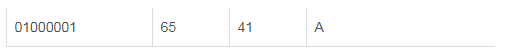

# C

### 1、字符串转十六进制
代码实现：
```c
void StrToHex(char *pbDest, char *pbSrc, int nLen)
{
    char h1,h2;
    char s1,s2;
    int i;

    for (i=0; i<nLen/2; i++)
    {
        h1 = pbSrc[2*i];
        h2 = pbSrc[2*i+1];

        s1 = toupper(h1) - 0x30; //toupper 转换为大写字母
        if (s1 > 9)
            s1 -= 7;
        s2 = toupper(h2) - 0x30;
        if (s2 > 9)
            s2 -= 7;

        pbDest[i] = s1*16 + s2;
    }
}
```
<a name="kZXDc"></a>
### 2、十六进制转字符串
代码实现：
```c
void HexToStr(char *pszDest, char *pbSrc, int nLen)
{
    char    ddl, ddh;
    for (int i = 0; i < nLen; i++)
    {
        ddh = 48 + pbSrc[i] / 16;
        ddl = 48 + pbSrc[i] % 16;
        if (ddh > 57) ddh = ddh + 7;
        if (ddl > 57) ddl = ddl + 7;
        pszDest[i * 2] = ddh;
        pszDest[i * 2 + 1] = ddl;
    }
    pszDest[nLen * 2] = '\0';
}
```
或者
```c
u16 Hex2StringArray (u8 *pSrc,  u16 SrcLen, u8 *pObj)
{
    u16 i=0;

    for(i=0;    i<SrcLen;   i++)
    {
        sprintf((char *)(pObj + i * 2), "%02X", *(pSrc + i));
    }
    *(pObj + i * 2) = '\0';
    return  (i * 2);
}
```
效果：十六进制：0x13 0xAA 0x02转为字符串：”13AAA2”
<a name="H22Ea"></a>
### 3、字符串转十进制
代码实现：<br />第一种，如果带负号 这个就是atoi函数的实现：
```c
int my_atoi(const char *str)
{
    int value = 0;
    int flag = 1; //判断符号
    while (*str == ' ')  //跳过字符串前面的空格
    {
        str++;
    }
    if (*str == '-')  //第一个字符若是‘-’，说明可能是负数
    {
        flag = 0;
        str++;
    }
    else if (*str == '+') //第一个字符若是‘+’，说明可能是正数
    {
        flag = 1;
        str++;
    }//第一个字符若不是‘+’‘-’也不是数字字符，直接返回0
    else if (*str >= '9' || *str <= '0') 
    {
        return 0;    
    }
    //当遇到非数字字符或遇到‘\0’时，结束转化
    while (*str != '\0' && *str <= '9' && *str >= '0')
    {
        value = value * 10 + *str - '0'; //将数字字符转为对应的整形数
        str++;
    }
    if (flag == 0) //负数的情况
    {
        value = -value;
    }
    return value;
}
```
效果：字符串：”-123” 转为 -123<br />第二种，如果不带负号：
```c
void StrtoDec(uint32_t *pbDest, char *pbSrc, int nLen)
{
    int i;
    int tmp=0;
    if(nLen > 10)
        *pbDest = 0;
    tmp = 1;
    *pbDest = 0;
    for (i=nLen-1; i>=0; i--)
    {
        *pbDest += tmp*(*(pbSrc+i)-'0');
        tmp = tmp*10;
    }
}
```
效果：字符串：”123” 转为 123<br />第三种：包含转为浮点数：
```c
//m^n函数
//返回值:m^n次方.
u32 NMEA_Pow(u8 m,u8 n)
{
    u32 result=1;    
    while(n--)result*=m;    
    return result;
}
//str转换为数字,以','或者'*'结束
//buf:数字存储区
//dx:小数点位数,返回给调用函数
//返回值:转换后的数值
int NMEA_Str2num(u8 *buf,u8*dx)
{
    u8 *p=buf;
    u32 ires=0,fres=0;
    u8 ilen=0,flen=0,i;
    u8 mask=0;
    int res;
    while(1) //得到整数和小数的长度
    {
        if(*p=='-'){mask|=0X02;p++;}//是负数
        if(*p==','||(*p=='*'))break;//遇到结束了
        if(*p=='.'){mask|=0X01;p++;}//遇到小数点了
        else if(*p>'9'||(*p<'0'))   //有非法字符
        {   
            ilen=0;
            flen=0;
            break;
        }   
        if(mask&0X01)flen++;
        else ilen++;
        p++;
    }
    if(mask&0X02)buf++; //去掉负号
    for(i=0;i<ilen;i++) //得到整数部分数据
    {  
        ires+=NMEA_Pow(10,ilen-1-i)*(buf[i]-'0');
    }
    if(flen>5)flen=5;   //最多取5位小数
    *dx=flen;           //小数点位数
    for(i=0;i<flen;i++) //得到小数部分数据
    {  
        fres+=NMEA_Pow(10,flen-1-i)*(buf[ilen+1+i]-'0');
    } 
    res=ires*NMEA_Pow(10,flen)+fres;
    if(mask&0X02)res=-res;         
    return res;
}
```
效果：字符串：”123.456” 先转为 123456，然后除以1000得到123.456
<a name="AeoWb"></a>
### 4、十进制转字符串
代码实现：<br />如果只是单个十进制转字符串，使用sprintf函数就可以了。<br />如果是十进制数组：
```c
u16 DectoStr (u8 *pSrc, u16 SrcLen, u8 *pObj)
{
    u16 i=0;

    for(i=0;    i<SrcLen;   i++)
    {
        sprintf((char *)(pObj + i * 2), "%02d", *(pSrc + i));
    }
    *(pObj + i * 2) = '\0';
    return  (i * 2);
}
```
效果：十进制数组13 14转为字符串“1314”
<a name="s99iT"></a>
### 5、u8、u32转换
举个栗子：ASCII码里 <br /><br />这里写图片描述 字符‘A’ ， 一个字节8bit ，即u8 十六进制为 0x41 二进制为 0100 0001<br />而对应的十进制为 65 整型65，4个字节32bit，即u32 十六进制为 0x41 二进制为 0000 0000 0000 0000 0000 0000 0100 0001<br />将u32数转换成u8数组<br />注意：这里是字符数组，不是字符串<br />字符串是以空字符(\0)结尾的char数组
```c
void U32ToU8Array(uint8_t *buf, uint32_t u32Value){
    buf[0] = ((u32Value >> 24) & 0xFF);
    buf[1] = ((u32Value >> 16) & 0xFF);
    buf[2] = ((u32Value >> 8) & 0xFF);
    buf[3] = (u32Value & 0xFF);
}
```
效果：整型 50 转字符数组 {‘\0’,’\0’,’\0’,’2’}<br />u8数组转u32
```c
void U8ArrayToU32(uint8_t *buf, uint32_t *u32Value)
{
    *u32Value = (buf[0] <<24) + (buf[1] <<16) + (buf[2] <<8) + (buf[3] <<0);
}
```
效果：字符数组 {‘\0’,’\0’,’\0’,’2’}转为整型 50
<a name="Dc2QD"></a>
### 6、大端小端
最后就是大小端问题了。STM32 默认是小端模式的，那么该如何转为大端？<br />1、转为大端
```c
// 为大端：
pPack[0] = (u8)((len >> 8) & 0xFF);
pPack[1] = (u8)(len & 0xFF);

// 为小端：
pPack[0] = (u8)(len & 0xFF);
pPack[1] =  (u8)((len >> 8) & 0xFF);
```
效果：len为数据类型为 u16（short），比如 0x11 0x22，转为u8（usigned char）数组。<br />大端为：
```
pPack[0] （0x11 ） 
pPack[1] （0x22）
```
小端为：
```
pPack[0] （0x22） 
pPack[1] （0x11）
```
