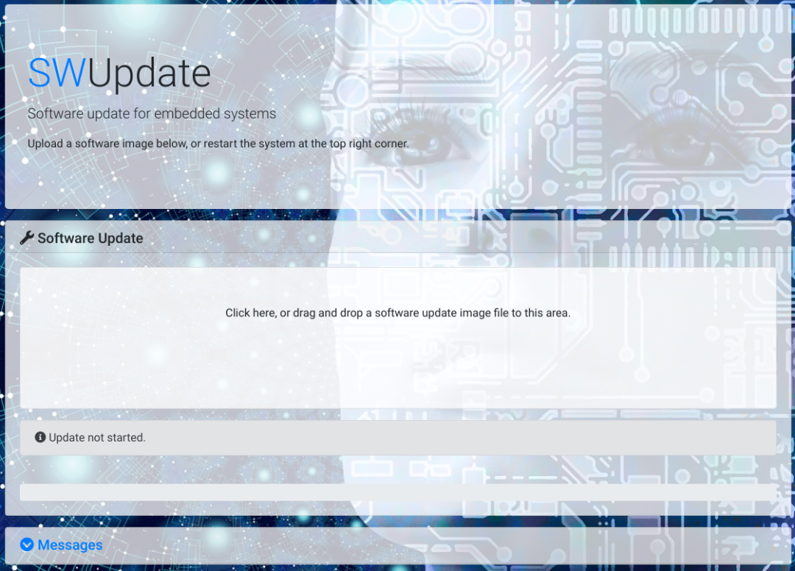

# C

## Mongoose 是什么？
Mongoose 是一个非常小巧易用的网络库。

它为 TCP、UDP、HTTP、WebSocket、MQTT 实现了基于事件驱动的非阻塞 API，非常适合在嵌入式系统上使用。

官网链接**：[https://mongoose.ws/](https://mongoose.ws/)**

Github 链接**：[https://github.com/cesanta/mongoose](https://github.com/cesanta/mongoose)**

官网上列举了它的各种优点，其中最看重的是**：

1、小巧易用，全部代码就一个 mongoose.c 和一个 mongoose.h 文件。

2、依赖少，就是纯粹的 Socket 编程，没有引用任何第三方库。

3、稳定可靠，Github 上有 8.1K 的 Star，且大量知名企业都基于 Mongoose 推出了商业产品。

4、丰富的文档和示例。

## Mongoose 怎么用？
Mongoose 解决了广泛的业务需求，如在设备上实现 Web UI 界面、RESTful API 服务、遥测数据交换、产品远程控制、远程软件更新、远程监控等。<br />**下面是官方提供的示例**：<br /><br />简单地看点代码。
<a name="Q3g2A"></a>
### 示例1：实现 HTTP server
```c
// main.c 
#include "mongoose.h"

static void fn(struct mg_connection *c, int ev, void *ev_data, void *fn_data) {
    // Serve local dir
    struct mg_http_serve_opts opts = {.root_dir = "."};
    if (ev == MG_EV_HTTP_MSG) mg_http_serve_dir(c, ev_data, &opts);
}

int main(int argc, char *argv[]) {
    struct mg_mgr mgr;
    mg_mgr_init(&mgr);
    // Setup listener
    mg_http_listen(&mgr, "http://localhost:8000", fn, &mgr);
    // Event loop
    for (;;) mg_mgr_poll(&mgr, 1000);
    mg_mgr_free(&mgr);
    return 0;
}
```
将上面的 main.c 和 mongoose.c 一起编译，就可以得到一个最简单的 HTTP server了，它会列举 server 当前所在目录下的文件列表。<br />对于源码，`mg_http_listen()` 负责建立 http server，然后 `mg_mgr_poll()` 负责等待事件的发生。
<a name="fSK7j"></a>
### 示例2：swupdate
swupdate 是一个关于 嵌入式 Linux OTA 的开源项目。它集成了 Mongoose， 以实现通过 web 来上传更新包的功能。<br /><br />具体的代码实现请自行阅读：[https://github.com/sbabic/swupdate/blob/master/mongoose/mongoose_interface.c](https://github.com/sbabic/swupdate/blob/master/mongoose/mongoose_interface.c)
<a name="y0GSf"></a>
## Mongoose 是怎么实现的？
想要理解 Mongoose 的核心设计，要抓住 2个要点：<br />1、如何对 Socket 编程进行封装？<br />2、如何实现事件驱动？<br />对此，只要重点阅读其源码里的几个核心的 API 和结构体就够了。为了控制篇幅，下面以理解 TCP 通讯的实现为例。
<a name="roQZI"></a>

### 1> `struct mg_mgr`
```c
struct mg_mgr {
    struct mg_connection *conns; 
    unsigned long nextid; 
};
```
mg_mgr 负责管理所有的网络连接。
<a name="Qcg5c"></a>
### 2> `struct mg_connection`
```c
struct mg_connection {
    struct mg_connection *next;
    // 地址信息
    struct mg_addr loc;
    struct mg_addr rem;
    int fd;
    unsigned long id;
    // 收发的数据
    struct mg_iobuf recv;
    struct mg_iobuf send;
    // 用户定义的事件处理函数
    mg_event_handler_t fn;
    // 预定义的协议专用的事件处理函数
    mg_event_handler_t pfn;
    ...
    };
```
mg_connection 代表一个网络通讯连接，这个结构体可以处理 TCP、UDP、HTTP、WebSocket、MQTT等协议。
<a name="WTlVm"></a>
### 3> `mg_listen()`
示例：
```c
mg_listen(&mgr, "tcp://0 0.0.0.0:1989", fn, NULL);
```
这个 API 用于建立 TCP Server，它封装了 TCP Socket 编程的所有细节。它的内部实现大致就是创建一个 mg_connection，然后调用 `socket()`、`setsockopt()`、`bind()`、`listen()`。

与其想对应的是 `mg_connect()`，它负责发起 TCP 连接，内部实现类似。


### 4> `mg_mgr_poll()`

这个 API 会使用 `select()` 监听所有的 socket。

当有事件发生时，例如有客户连接、数据可读写，调用对应的 mg_connection 的事件处理函数， 执行用户定义的事件处理流程。

到此，Mongoose 对 TCP 通讯的核心封装思路就分析完毕了。

至于其是如何封装 UDP、HTTP、WebSocket、MQTT 等协议的使用，请自行阅读源码。


## 总结
Mongoose 使嵌入式网络编程变得快速、健壮和简单。

网络编程的水很深，细节很多。

虽说有一本经典书籍《UNIX 网络编程》，但是大多数人根本没时间去阅读这么厚的一本书。

如果想给嵌入式设备增加网络通讯的能力，真的可以考虑集成 Mongoose。
