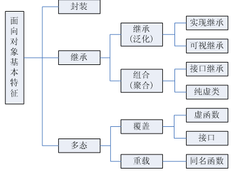
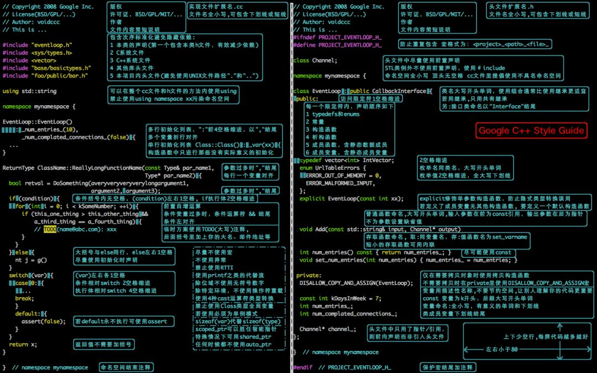
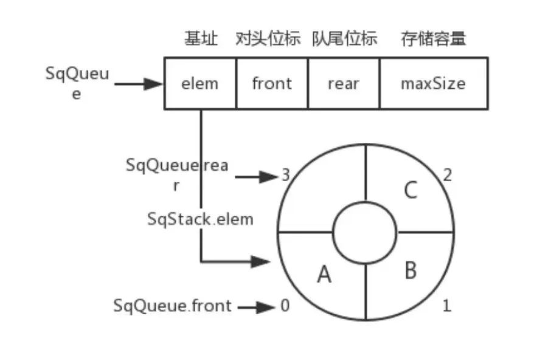
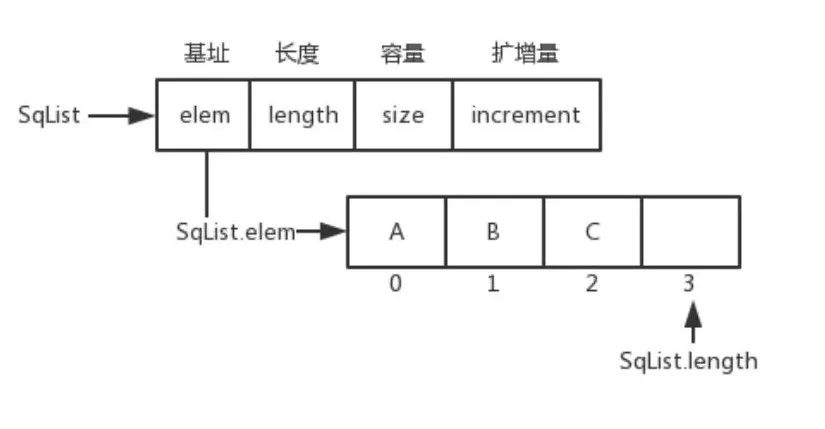
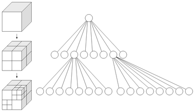
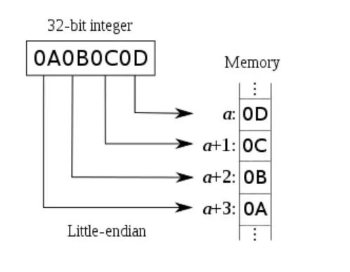

# C/C++


## 目录

- C/C++
- STL
- 数据结构
- 算法
- Problems
- 操作系统
- 计算机网络
- 网络编程
- 数据库
- 设计模式
- 链接装载库
- 海量数据处理
- 音视频
- 其他
## C/C++
### const
#### 作用

1. 修饰变量，说明该变量不可以被改变；
2. 修饰指针，分为指向常量的指针和指针常量；
3. 常量引用，经常用于形参类型，即避免了拷贝，又避免了函数对值的修改；
4. 修饰成员函数，说明该成员函数内不能修改成员变量。


#### 使用
```cpp
// 类
class A
{
private:
    const int a;                // 常对象成员，只能在初始化列表赋值

public:
    // 构造函数
    A() { };
    A(int x) : a(x) { };        // 初始化列表

    // const可用于对重载函数的区分
    int getValue();             // 普通成员函数
    int getValue() const;       // 常成员函数，不得修改类中的任何数据成员的值
};

void function()
{
    // 对象
    A b;                        // 普通对象，可以调用全部成员函数
    const A a;                  // 常对象，只能调用常成员函数、更新常成员变量
    const A *p = &a;            // 常指针
    const A &q = a;             // 常引用

    // 指针
    char greeting[] = "Hello";
    char* p1 = greeting;                // 指针变量，指向字符数组变量
    const char* p2 = greeting;          // 指针变量，指向字符数组常量
    char* const p3 = greeting;          // 常指针，指向字符数组变量
    const char* const p4 = greeting;    // 常指针，指向字符数组常量
}

// 函数
void function1(const int Var);           // 传递过来的参数在函数内不可变
void function2(const char* Var);         // 参数指针所指内容为常量
void function3(char* const Var);         // 参数指针为常指针
void function4(const int& Var);          // 引用参数在函数内为常量

// 函数返回值
const int function5();      // 返回一个常数
const int* function6();     // 返回一个指向常量的指针变量，使用：const int *p = function6();
int* const function7();     // 返回一个指向变量的常指针，使用：int* const p = function7();
```


### static

#### 作用

1. 修饰普通变量，修改变量的存储区域和生命周期，使变量存储在静态区，在 main 函数运行前就分配了空间，如果有初始值就用初始值初始化它，如果没有初始值系统用默认值初始化它。
2. 修饰普通函数，表明函数的作用范围，仅在定义该函数的文件内才能使用。在多人开发项目时，为了防止与他人命令函数重名，可以将函数定位为 static。
3. 修饰成员变量，修饰成员变量使所有的对象只保存一个该变量，而且不需要生成对象就可以访问该成员。
4. 修饰成员函数，修饰成员函数使得不需要生成对象就可以访问该函数，但是在 static 函数内不能访问非静态成员。
### this 指针

1. this 指针是一个隐含于每一个非静态成员函数中的特殊指针。它指向正在被该成员函数操作的那个对象。
2. 当对一个对象调用成员函数时，编译程序先将对象的地址赋给 this 指针，然后调用成员函数，每次成员函数存取数据成员时，由隐含使用 this 指针。
3. 当一个成员函数被调用时，自动向它传递一个隐含的参数，该参数是一个指向这个成员函数所在的对象的指针。
4. this 指针被隐含地声明为: ClassName *const this，这意味着不能给 this 指针赋值；在 ClassName 类的 const 成员函数中，this 指针的类型为：const ClassName* const，这说明不能对 this 指针所指向的这种对象是不可修改的（即不能对这种对象的数据成员进行赋值操作）；
5. this 并不是一个常规变量，而是个右值，所以不能取得 this 的地址（不能 &this）。
6. 在以下场景中，经常需要显式引用 this 指针：
   1. 为实现对象的链式引用；
   2. 为避免对同一对象进行赋值操作；
   3. 在实现一些数据结构时，如 list。
### inline 内联函数
#### 特征

- 相当于把内联函数里面的内容写在调用内联函数处；
- 相当于不用执行进入函数的步骤，直接执行函数体；
- 相当于宏，却比宏多了类型检查，真正具有函数特性；
- 不能包含循环、递归、switch 等复杂操作；
- 在类声明中定义的函数，除了虚函数的其他函数都会自动隐式地当成内联函数。


#### 使用
```cpp
// 声明1（加 inline，建议使用）
inline int functionName(int first, int secend,...);

// 声明2（不加 inline）
int functionName(int first, int secend,...);

// 定义
inline int functionName(int first, int secend,...) {/****/};

// 类内定义，隐式内联
class A {
    int doA() { return 0; }         // 隐式内联
}

// 类外定义，需要显式内联
class A {
    int doA();
}
inline int A::doA() { return 0; }   // 需要显式内联
```


#### 编译器对 inline 函数的处理步骤

1. 将 inline 函数体复制到 inline 函数调用点处；
2. 为所用 inline 函数中的局部变量分配内存空间；
3. 将 inline 函数的的输入参数和返回值映射到调用方法的局部变量空间中；
4. 如果 inline 函数有多个返回点，将其转变为 inline 函数代码块末尾的分支（使用 GOTO）。


#### 优缺点

优点

1. 内联函数同宏函数一样将在被调用处进行代码展开，省去了参数压栈、栈帧开辟与回收，结果返回等，从而提高程序运行速度。
2. 内联函数相比宏函数来说，在代码展开时，会做安全检查或自动类型转换（同普通函数），而宏定义则不会。
3. 在类中声明同时定义的成员函数，自动转化为内联函数，因此内联函数可以访问类的成员变量，宏定义则不能。
4. 内联函数在运行时可调试，而宏定义不可以。


缺点

1. 代码膨胀。内联是以代码膨胀（复制）为代价，消除函数调用带来的开销。如果执行函数体内代码的时间，相比于函数调用的开销较大，那么效率的收获会很少。另一方面，每一处内联函数的调用都要复制代码，将使程序的总代码量增大，消耗更多的内存空间。
2. inline 函数无法随着函数库升级而升级。inline函数的改变需要重新编译，不像 non-inline 可以直接链接。
3. 是否内联，程序员不可控。内联函数只是对编译器的建议，是否对函数内联，决定权在于编译器。


#### 虚函数（virtual）可以是内联函数（inline）吗？

Are "inline virtual" member functions ever actually "inlined"?

答案：[http://www.cs.technion.ac.il/users/yechiel/c++-faq/inline-virtuals.html](http://www.cs.technion.ac.il/users/yechiel/c++-faq/inline-virtuals.html)

- 虚函数可以是内联函数，内联是可以修饰虚函数的，但是当虚函数表现多态性的时候不能内联。
- 内联是在编译器建议编译器内联，而虚函数的多态性在运行期，编译器无法知道运行期调用哪个代码，因此虚函数表现为多态性时（运行期）不可以内联。
- inline virtual 唯一可以内联的时候是：编译器知道所调用的对象是哪个类（如 Base::who()），这只有在编译器具有实际对象而不是对象的指针或引用时才会发生。


#### 虚函数内联使用
```cpp
#include <iostream>  
using namespace std;
class Base
{
public:
    inline virtual void who()
    {
        cout << "I am Base\n";
    }
    virtual ~Base() {}
};
class Derived : public Base
{
public:
    inline void who()  // 不写inline时隐式内联
    {
        cout << "I am Derived\n";
    }
};

int main()
{
    // 此处的虚函数 who()，是通过类（Base）的具体对象（b）来调用的，编译期间就能确定了，所以它可以是内联的，但最终是否内联取决于编译器。 
    Base b;
    b.who();

    // 此处的虚函数是通过指针调用的，呈现多态性，需要在运行时期间才能确定，所以不能为内联。  
    Base *ptr = new Derived();
    ptr->who();

    // 因为Base有虚析构函数（virtual ~Base() {}），所以 delete 时，会先调用派生类（Derived）析构函数，再调用基类（Base）析构函数，防止内存泄漏。
    delete ptr;
    ptr = nullptr;

    system("pause");
    return 0;
} 
```

### `assert()`
断言，是宏，而非函数。assert 宏的原型定义在 <assert.h>（C）、<cassert>（C++）中，其作用是如果它的条件返回错误，则终止程序执行。可以通过定义 NDEBUG 来关闭 assert，但是需要在源代码的开头，include <assert.h> 之前。

#### 使用

```cpp
#define NDEBUG          // 加上这行，则 assert 不可用
#include <assert.h>

assert( p != NULL );    // assert 不可用
```
### `sizeof()`

- sizeof 对数组，得到整个数组所占空间大小。
- sizeof 对指针，得到指针本身所占空间大小。
### #pragma pack(n)
设定结构体、联合以及类成员变量以 n 字节方式对齐
#### 使用
```cpp
#pragma pack(push)  // 保存对齐状态
#pragma pack(4)     // 设定为 4 字节对齐

struct test
{
    char m1;
    double m4;
    int m3;
};

#pragma pack(pop)   // 恢复对齐状态
```


### 位域

```cpp
Bit mode: 2;    // mode 占 2 位
```
类可以将其（非静态）数据成员定义为位域（bit-field），在一个位域中含有一定数量的二进制位。当一个程序需要向其他程序或硬件设备传递二进制数据时，通常会用到位域。

- 位域在内存中的布局是与机器有关的
- 位域的类型必须是整型或枚举类型，带符号类型中的位域的行为将因具体实现而定
- 取地址运算符（&）不能作用于位域，任何指针都无法指向类的位域


### volatile
```cpp
volatile int i = 10; 
```

- volatile 关键字是一种类型修饰符，用它声明的类型变量表示可以被某些编译器未知的因素（操作系统、硬件、其它线程等）更改。所以使用 volatile 告诉编译器不应对这样的对象进行优化。
- volatile 关键字声明的变量，每次访问时都必须从内存中取出值（没有被 volatile 修饰的变量，可能由于编译器的优化，从 CPU 寄存器中取值）
- const 可以是 volatile （如只读的状态寄存器）
- 指针可以是 volatile
<


### extern "C"

- 被 extern 限定的函数或变量是 extern 类型的
- 被 extern "C" 修饰的变量和函数是按照 C 语言方式编译和连接的

extern "C" 的作用是让 C++ 编译器将 extern "C" 声明的代码当作 C 语言代码处理，可以避免 C++ 因符号修饰导致代码不能和C语言库中的符号进行链接的问题。
<a name="X7xq8"></a>
#### "C" 使用
```cpp
#ifdef __cplusplus
extern "C" {
#endif

void *memset(void *, int, size_t);

#ifdef __cplusplus
}
#endif
```
<a name="rsEM0"></a>
### `struct` 和 `typedef struct`
<a name="ZE7gv"></a>
#### C 中
```cpp
// c
typedef struct Student {
    int age; 
} S;
```
等价于
```cpp
// c
struct Student { 
    int age; 
};

typedef struct Student S;
```
此时 S 等价于 `struct Student`，但两个标识符名称空间不相同。

另外还可以定义与 struct Student 不冲突的 `void Student() {}`。


#### C++ 中

由于编译器定位符号的规则（搜索规则）改变，导致不同于C语言。

一、如果在类标识符空间定义了 `struct Student {...};`，使用 `Student me;` 时，编译器将搜索全局标识符表，Student 未找到，则在类标识符内搜索。

即表现为可以使用 Student 也可以使用 struct Student，如下：

```cpp
// cpp
struct Student { 
    int age; 
};

void f( Student me );       // 正确，"struct" 关键字可省略
```
二、若定义了与 Student 同名函数之后，则 Student 只代表函数，不代表结构体，如下：
```cpp
typedef struct Student { 
    int age; 
} S;

void Student() {}           // 正确，定义后 "Student" 只代表此函数

//void S() {}               // 错误，符号 "S" 已经被定义为一个 "struct Student" 的别名

int main() {
    Student(); 
    struct Student me;      // 或者 "S me";
    return 0;
}
```
<a name="zHEbq"></a>
### C++ 中 struct 和 class
总的来说，struct 更适合看成是一个数据结构的实现体，class 更适合看成是一个对象的实现体。

#### 区别

- 最本质的一个区别就是默认的访问控制
   1. 默认的继承访问权限。struct 是 public 的，class 是 private 的。
   2. struct 作为数据结构的实现体，它默认的数据访问控制是 public 的，而 class 作为对象的实现体，它默认的成员变量访问控制是 private 的。
     
   
   
### union 联合
联合（union）是一种节省空间的特殊的类，一个 union 可以有多个数据成员，但是在任意时刻只有一个数据成员可以有值。当某个成员被赋值后其他成员变为未定义状态。联合有如下特点：

- 默认访问控制符为 public
- 可以含有构造函数、析构函数
- 不能含有引用类型的成员
- 不能继承自其他类，不能作为基类
- 不能含有虚函数
- 匿名 union 在定义所在作用域可直接访问 union 成员
- 匿名 union 不能包含 protected 成员或 private 成员
- 全局匿名联合必须是静态（static）的


#### 使用
```cpp
#include<iostream>

union UnionTest {
    UnionTest() : i(10) {};
    int i;
    double d;
};

static union {
    int i;
    double d;
};

int main() {
    UnionTest u;

    union {
        int i;
        double d;
    };

    std::cout << u.i << std::endl;  // 输出 UnionTest 联合的 10

    ::i = 20;
    std::cout << ::i << std::endl;  // 输出全局静态匿名联合的 20

    i = 30;
    std::cout << i << std::endl;    // 输出局部匿名联合的 30

    return 0;
}
```

### C 实现 C++ 类
C 语言实现封装、继承和多态：

[http://dongxicheng.org/cpp/ooc/](http://dongxicheng.org/cpp/ooc/)


### explicit（显式）构造函数
explicit 修饰的构造函数可用来防止隐式转换
<a name="zGVXW"></a>
#### explicit 使用
```cpp
class Test1
{
public:
    Test1(int n)            // 普通构造函数
    {
        num=n;
    }
private:
    int num;
};

class Test2
{
public:
    explicit Test2(int n)   // explicit（显式）构造函数
    {
        num=n;
    }
private:
    int num;
};

int main()
{
    Test1 t1=12;            // 隐式调用其构造函数，成功
    Test2 t2=12;            // 编译错误，不能隐式调用其构造函数
    Test2 t2(12);           // 显式调用成功
    return 0;
}
```
<a name="jHlOm"></a>
### friend 友元类和友元函数

- 能访问私有成员
- 破坏封装性
- 友元关系不可传递
- 友元关系的单向性
- 友元声明的形式及数量不受限制

### using

#### using 声明
一条 using 声明 语句一次只引入命名空间的一个成员。它使得我们可以清楚知道程序中所引用的到底是哪个名字。如：
```cpp
using namespace_name::name;
```

#### 构造函数的 using 声明【C++11】
在 C++11 中，派生类能够重用其直接基类定义的构造函数。
```cpp
class Derived : Base {
public:
    using Base::Base;
    /* ... */
};
```
如上 using 声明，对于基类的每个构造函数，编译器都生成一个与之对应（形参列表完全相同）的派生类构造函数。生成如下类型构造函数：
```cpp
derived(parms) : base(args) { }
```

#### using 指示
using 指示 使得某个特定命名空间中所有名字都可见，这样我们就无需再为它们添加任何前缀限定符了。如：
```cpp
using namespace_name name;
```

#### 尽量少使用 using 指示 污染命名空间
一般说来，使用 using 命令比使用 using 编译命令更安全，这是由于它**只导入了制定的名称**。如果该名称与局部名称发生冲突，编译器将**发出指示**。using编译命令导入所有的名称，包括可能并不需要的名称。<br />如果与局部名称发生冲突，则**局部名称将覆盖名称空间版本**，而编译器**并不会发出警告**。另外，名称空间的开放性意味着名称空间的名称可能分散在多个地方，这使得难以准确知道添加了哪些名称。

#### using 使用
尽量少使用 using 指示
```cpp
using namespace std;
```
应该多使用 using 声明
```cpp
int x;
std::cin >> x ;
std::cout << x << std::endl;
```
或者
```cpp
using std::cin;
using std::cout;
using std::endl;
int x;
cin >> x;
cout << x << endl;
```

### `::` 范围解析运算符

#### 分类

1. 全局作用域符（::name）：用于类型名称（类、类成员、成员函数、变量等）前，表示作用域为全局命名空间
2. 类作用域符（class::name）：用于表示指定类型的作用域范围是具体某个类的
3. 命名空间作用域符（namespace::name）:用于表示指定类型的作用域范围是具体某个命名空间的

#### `::` 使用
```cpp
int count = 0;        // 全局（::）的 count

class A {
public:
    static int count; // 类 A 的 count（A::count）
};

int main() {
    ::count = 1;      // 设置全局的 count 的值为 1

    A::count = 2;     // 设置类 A 的 count 为 2

    int count = 0;    // 局部的 count
    count = 3;        // 设置局部的 count 的值为 3

    return 0;
}
```

### enum 枚举类型

#### 限定作用域的枚举类型
```cpp
enum class open_modes { input, output, append };
```

#### 不限定作用域的枚举类型
```cpp
enum color { red, yellow, green };
enum { floatPrec = 6, doublePrec = 10 };
```

### decltype
decltype 关键字用于检查实体的声明类型或表达式的类型及值分类。语法：
```cpp
decltype ( expression )
```

#### 使用
```cpp
// 尾置返回允许我们在参数列表之后声明返回类型
template <typename It>
auto fcn(It beg, It end) -> decltype(*beg)
{
    // 处理序列
    return *beg;    // 返回序列中一个元素的引用
}
// 为了使用模板参数成员，必须用 typename
template <typename It>
auto fcn2(It beg, It end) -> typename remove_reference<decltype(*beg)>::type
{
    // 处理序列
    return *beg;    // 返回序列中一个元素的拷贝
}
```

### 引用

#### 左值引用
常规引用，一般表示对象的身份。在C++中，左值（Lvalue）是一个存储在内存中的对象，它有一个确定的内存地址，并且其值在程序执行过程中可以被改变。左值引用是指向左值的引用，它允许你直接修改引用所指向的原始对象的值。左值引用在C++中用`&`符号来表示。


以下是一些左值引用的例子：

1. **变量的引用**：
   ```cpp
   int a = 10;
   int& ref = a; // ref是一个指向变量a的左值引用
   ref = 20;     // 通过引用修改a的值，现在a的值变为20
   ```

2. **数组元素的引用**：
   ```cpp
   int arr[] = {1, 2, 3};
   int& firstElement = arr[0]; // 引用数组的第一个元素
   firstElement += 10;         // 修改引用的元素，arr[0] 现在为 11
   ```

3. **函数参数中的引用**：
   ```cpp
   void increment(int& value) {
       value++; // 通过引用直接修改传入的变量
   }
   
   int main() {
       int n = 0;
       increment(n); // 调用函数，n的值现在为1
   }
   ```

4. **类成员的引用**：
   ```cpp
   class Example {
   public:
       int& getMember() {
           return member; // 返回类中成员变量的引用
       }
   private:
       int member = 5;
   };
   
   int main() {
       Example ex;
       int& memberRef = ex.getMember();
       memberRef += 1; // 修改Example对象中的member变量
   }
   ```

5. **通过引用返回左值**：
   ```cpp
   int& returnReference() {
       static int staticVar = 10; // 静态变量作为临时对象
       return staticVar; // 返回静态变量的引用
   }
   
   int main() {
       int& ref = returnReference();
       ref += 5; // 通过引用修改静态变量的值
   }
   ```

左值引用使得你可以在不使用指针的情况下，安全地传递对象的别名，并且保证了引用必须绑定到有效的对象上，这有助于编写更安全、更易于理解的代码。


#### 右值引用
右值引用就是必须绑定到右值（一个临时对象、将要销毁的对象）的引用，一般表示对象的值。<br />右值引用可实现转移语义（Move Sementics）和精确传递（Perfect Forwarding），它的主要目的有两个方面：

- 消除两个对象交互时不必要的对象拷贝，节省运算存储资源，提高效率。
- 能够更简洁明确地定义泛型函数。


在C++中，右值（Rvalue）是指一个不能被赋予新值的表达式的结果，它通常是一个临时对象，比如一个字面量、一个表达式的求值结果，或者是一个即将销毁的对象。右值引用允许你直接操作这些临时对象，而不需要拷贝它们。

右值引用在C++11中引入，使用两个`&`符号来表示，即`&&`。右值引用的一个典型用途是实现移动语义（Move Semantics），它允许资源（如内存、文件句柄等）的转移，而不是复制。

以下是一些右值引用的例子：

1. **字面量的右值引用**：
   ```cpp
   int&& rv1 = 10; // 绑定到字面量10的右值引用
   ```

2. **表达式的右值引用**：
   ```cpp
   int a = 10;
   int b = 20;
   int&& rv2 = a + b; // 绑定到表达式a + b结果的右值引用
   ```

3. **函数返回的右值引用**：
   ```cpp
   int&& getRvalue() {
       return 30; // 返回一个右值引用
   }
   
   int&& rv3 = getRvalue(); // 绑定到getRvalue()返回值的右值引用
   ```

4. **移动语义**：
   ```cpp
   void process(int&& x) {
       // x是一个右值引用，可以用于移动操作
   }
   
   int main() {
       process(10); // 使用字面量10调用函数
       int local = 20;
       process(std::move(local)); // 使用std::move将local转为右值引用
   }
   ```

5. **完美转发**（Perfect Forwarding）：
   ```cpp
   template<typename T>
   void wrapper(T&& arg) {
       // arg是一个右值引用，可以完美转发给其他函数
       otherFunction(std::forward<T>(arg));
   }
   
   void otherFunction(int&& param) {
       // param也是一个右值引用
   }
   ```

6. **交换两个变量的值**：
   ```cpp
   void swap(int&& a, int&& b) {
       int temp = a;
       a = b;
       b = temp;
   }
   
   int main() {
       int x = 10;
       int y = 20;
       swap(std::move(x), std::move(y)); // 使用右值引用实现无成本的交换
   }
   ```

7. **智能指针的移动赋值**：
   ```cpp
   #include <memory>
   
   void function(std::unique_ptr<int>&& ptr) {
       // ptr是一个智能指针的右值引用
   }
   ```

右值引用是C++11及以后版本中的一项重要特性，它允许开发者更有效地处理临时对象，提高程序的性能。


#### 引用折叠

- X& &、X& &&、X&& & 可折叠成 X&

- X&& && 可折叠成 X&&

  

  引用折叠（Reference Collapsing）是C++11标准中引入的一个特性，它定义了当有多个引用类型组合在一起时，编译器如何处理这些引用的规则。引用折叠主要用于模板编程中，尤其是在涉及到转发参数时。

  引用折叠的规则如下：

  1. `T& &` 或 `T& &&` 折叠成 `T&`（左值引用）
  2. `T&& &` 折叠成 `T&`（左值引用）
  3. `T&& &&` 折叠成 `T&&`（右值引用）

  这里的 `T` 可以是任意类型。

  下面通过一些例子来说明引用折叠：

  ```cpp
  #include <iostream>
  #include <utility>
  #include <type_traits>
  
  // 函数模板，用于演示引用折叠
  template <typename T>
  void printReferenceType(T&& obj) {
      // 使用std::is_same来检查类型是否相同
      if (std::is_same<decltype(obj), T>::value) {
          std::cout << "Same type" << std::endl;
      } else {
          std::cout << "Different type" << std::endl";
      }
  }
  
  int main() {
      int a = 10;
      int& b = a;
      int&& c = 20; // 右值引用绑定到字面量
  
      // 示例1：左值引用到左值
      printReferenceType(a); // int&，引用折叠成int&
      printReferenceType(b); // int&，引用折叠成int&
  
      // 示例2：右值引用到字面量
      printReferenceType(20); // int&&，引用折叠成int&&
      
      // 示例3：std::move将左值转换为右值引用
      printReferenceType(std::move(a)); // int&，通过std::move转换后，引用折叠成int&&
      
      // 示例4：右值引用到右值引用
      printReferenceType(static_cast<int&&>(c)); // int&&，引用折叠成int&&
      
      // 示例5：完美转发
      auto x = std::move(a); // auto会推导为int&&
      printReferenceType(x); // int&&，引用折叠成int&&
      
      return 0;
  }
  ```

  在这个例子中，`printReferenceType` 函数模板接受一个通用引用（`T&&`），并使用 `decltype` 和 `std::is_same` 来检查传递给函数的对象类型和模板参数 `T` 是否相同。通过不同的调用方式，展示了引用折叠的规则。

  引用折叠在实现像 `std::forward` 这样的转发机制时非常有用，它允许模板函数准确地转发它们接收到的参数类型，无论是左值还是右值。
### 宏

- 宏定义可以实现类似于函数的功能，但是它终归不是函数，而宏定义中括弧中的“参数”也不是真的参数，在宏展开的时候对 “参数” 进行的是一对一的替换。


在C++中，宏是通过预处理器使用`#define`指令定义的。宏可以用来定义常量表达式、简化复杂的表达式、创建类型定义、控制条件编译等。宏在C++中非常有用，但也应当谨慎使用，因为它们不进行类型检查，且可能引起一些难以发现的错误。

以下是一些宏的例子：

1. **定义常量**：
   ```cpp
   #define PI 3.14159265358979323846
   ```

2. **条件编译**：
   ```cpp
   #ifdef DEBUG
   #define LOG(msg) std::cout << __FILE__ << ":" << __LINE__ << ": " << msg << std::endl
   #else
   #define LOG(msg) 
   #endif
   ```

3. **创建类型定义**：
   ```cpp
   #define NEW_DELETE new
   ```

4. **简化复杂的表达式**：
   ```cpp
   #define SQUARE(x) ((x) * (x))
   ```

5. **函数样宏**（类似于函数，但不是真正的函数，因为宏在预处理阶段就展开）：
   ```cpp
   #define MAX(a, b) ((a) > (b) ? (a) : (b))
   ```

6. **带参数的宏**：
   ```cpp
   #define PRINT_INT(x) std::cout << #x << " = " << x << std::endl
   ```

7. **字符串化操作符**（`#`）：
   ```cpp
   #define STRINGIZE(x) #x
   #define EXPAND(x) STRINGIZE(x)
   std::cout << EXPAND(THIS WILL BE A STRING)
   ```

8. **宏的组合使用**：
   ```cpp
   #define CONCAT_INTERNAL(a, b) a##b
   #define CONCAT(a, b) CONCAT_INTERNAL(a, b)
   ```

9. **虚函数的宏**（用于防止虚函数被编译器优化掉）：
   ```cpp
   #define VIRTUAL virtual
   VIRTUAL void dummy() {}
   ```

10. **宏用于类型选择**：
    ```cpp
    #define SELECT_TYPE(type, size) ((size) > 4 ? type##64 : type##32)
    using MyInt = SELECT_TYPE(int, sizeof(void*));
    ```

使用宏时要注意几个问题：

- 宏不会进行类型检查，因此宏的参数在使用时需要格外小心。
- 宏展开可能会产生意料之外的代码，特别是当参数包含逗号表达式时。
- 宏定义应该放在包含文件的顶部，通常在头文件中使用`#undef`来取消宏定义，以避免重复包含引起的冲突。
- 宏不应该有副作用，因为它们可能会在程序中多次展开。

尽管宏在某些情况下非常有用，但在C++中，模板和内联函数通常是更好的选择，因为它们提供了类型安全和更多的控制。


### 成员初始化列表

好处

- 更高效：少了一次调用默认构造函数的过程。
- 有些场合必须要用初始化列表：
   1. 常量成员，因为常量只能初始化不能赋值，所以必须放在初始化列表里面
   2. 引用类型，引用必须在定义的时候初始化，并且不能重新赋值，所以也要写在初始化列表里面
   3. 没有默认构造函数的类类型，因为使用初始化列表可以不必调用默认构造函数来初始化，而是直接调用拷贝构造函数初始化。
   
### initializer_list 列表初始化【C++11】
用花括号初始化器列表列表初始化一个对象，其中对应构造函数接受一个 std::initializer_list 参数.

#### initializer_list 使用
```cpp
#include <iostream>
#include <vector>
#include <initializer_list>

template <class T>
struct S {
    std::vector<T> v;
    S(std::initializer_list<T> l) : v(l) {
         std::cout << "constructed with a " << l.size() << "-element list\n";
    }
    void append(std::initializer_list<T> l) {
        v.insert(v.end(), l.begin(), l.end());
    }
    std::pair<const T*, std::size_t> c_arr() const {
        return {&v[0], v.size()};  // 在 return 语句中复制列表初始化
                                   // 这不使用 std::initializer_list
    }
};

template <typename T>
void templated_fn(T) {}

int main()
{
    S<int> s = {1, 2, 3, 4, 5}; // 复制初始化
    s.append({6, 7, 8});      // 函数调用中的列表初始化

    std::cout << "The vector size is now " << s.c_arr().second << " ints:\n";

    for (auto n : s.v)
        std::cout << n << ' ';
    std::cout << '\n';

    std::cout << "Range-for over brace-init-list: \n";

    for (int x : {-1, -2, -3}) // auto 的规则令此带范围 for 工作
        std::cout << x << ' ';
    std::cout << '\n';

    auto al = {10, 11, 12};   // auto 的特殊规则

    std::cout << "The list bound to auto has size() = " << al.size() << '\n';

//    templated_fn({1, 2, 3}); // 编译错误！“ {1, 2, 3} ”不是表达式，
                             // 它无类型，故 T 无法推导
    templated_fn<std::initializer_list<int>>({1, 2, 3}); // OK
    templated_fn<std::vector<int>>({1, 2, 3});           // 也 OK
}
```

### 面向对象
面向对象程序设计（Object-oriented programming，OOP）是种具有对象概念的程序编程典范，同时也是一种程序开发的抽象方针。<br /><br />面向对象三大特征 —— 封装、继承、多态

#### 封装

- 把客观事物封装成抽象的类，并且类可以把自己的数据和方法只让可信的类或者对象操作，对不可信的进行信息隐藏。
- 关键字：public, protected, friendly, private。不写默认为 friendly。
| 关键字 | 当前类 | 包内 | 子孙类 | 包外 |
| --- | --- | --- | --- | --- |
| public | √ | √ | √ | √ |
| protected | √ | √ | √ | × |
| friendly | √ | √ | × | × |
| private | √ | × | × | × |


### 继承

- 基类（父类）——> 派生类（子类）

### 多态

- 多态，即多种状态，在面向对象语言中，接口的多种不同的实现方式即为多态。
- C++ 多态有两种：静态多态（早绑定）、动态多态（晚绑定）。静态多态是通过函数重载实现的；动态多态是通过虚函数实现的。
- 多态是以封装和继承为基础的。

#### 静态多态（早绑定）
函数重载
```cpp
class A
{
public:
    void do(int a);
    void do(int a, int b);
};
```

#### 动态多态（晚绑定）

- 虚函数：用 virtual 修饰成员函数，使其成为虚函数

**注意：**

- 普通函数（非类成员函数）不能是虚函数
- 静态函数（static）不能是虚函数
- 构造函数不能是虚函数（因为在调用构造函数时，虚表指针并没有在对象的内存空间中，必须要构造函数调用完成后才会形成虚表指针）
- 内联函数不能是表现多态性时的虚函数，解释见：虚函数（virtual）可以是内联函数（inline）吗？：[http://t.cn/E4WVXSP](http://t.cn/E4WVXSP)

#### 动态多态使用
```cpp
class Shape                     // 形状类
{
public:
    virtual double calcArea()
    {
        ...
    }
    virtual ~Shape();
};
class Circle : public Shape     // 圆形类
{
public:
    virtual double calcArea();
    ...
};
class Rect : public Shape       // 矩形类
{
public:
    virtual double calcArea();
    ...
};
int main()
{
    Shape * shape1 = new Circle(4.0);
    Shape * shape2 = new Rect(5.0, 6.0);
    shape1->calcArea();         // 调用圆形类里面的方法
    shape2->calcArea();         // 调用矩形类里面的方法
    delete shape1;
    shape1 = nullptr;
    delete shape2;
    shape2 = nullptr;
    return 0;
}
```

### 虚析构函数
虚析构函数是为了解决基类的指针指向派生类对象，并用基类的指针删除派生类对象。

#### 虚析构函数使用
```cpp
class Shape
{
public:
    Shape();                    // 构造函数不能是虚函数
    virtual double calcArea();
    virtual ~Shape();           // 虚析构函数
};
class Circle : public Shape     // 圆形类
{
public:
    virtual double calcArea();
    ...
};
int main()
{
    Shape * shape1 = new Circle(4.0);
    shape1->calcArea();    
    delete shape1;  // 因为Shape有虚析构函数，所以delete释放内存时，先调用子类析构函数，再调用基类析构函数，防止内存泄漏。
    shape1 = NULL;
    return 0；
}
```

### 纯虚函数
纯虚函数是一种特殊的虚函数，在基类中不能对虚函数给出有意义的实现，而把它声明为纯虚函数，它的实现留给该基类的派生类去做。
```cpp
virtual int A() = 0;
```

### 虚函数、纯虚函数
CSDN . C++ 中的虚函数、纯虚函数区别和联系：[http://t.cn/E4WVQBI](http://t.cn/E4WVQBI)

- 类里如果声明了虚函数，这个函数是实现的，哪怕是空实现，它的作用就是为了能让这个函数在它的子类里面可以被覆盖，这样的话，这样编译器就可以使用后期绑定来达到多态了。纯虚函数只是一个接口，是个函数的声明而已，它要留到子类里去实现。
- 虚函数在子类里面也可以不重载的；但纯虚函数必须在子类去实现。
- 虚函数的类用于 “实作继承”，继承接口的同时也继承了父类的实现。当然大家也可以完成自己的实现。纯虚函数关注的是接口的统一性，实现由子类完成。
- 带纯虚函数的类叫抽象类，这种类不能直接生成对象，而只有被继承，并重写其虚函数后，才能使用。抽象类和大家口头常说的虚基类还是有区别的，在 C# 中用 abstract 定义抽象类，而在 C++ 中有抽象类的概念，但是没有这个关键字。抽象类被继承后，子类可以继续是抽象类，也可以是普通类，而虚基类，是含有纯虚函数的类，它如果被继承，那么子类就必须实现虚基类里面的所有纯虚函数，其子类不能是抽象类。
<a name="Z4sCb"></a>
### 虚函数指针、虚函数表

- 虚函数指针：在含有虚函数类的对象中，指向虚函数表，在运行时确定。
- 虚函数表：在程序只读数据段（.rodata section，见：目标文件存储结构:[http://t.cn/E4WVBeF](http://t.cn/E4WVBeF)），存放虚函数指针，如果派生类实现了基类的某个虚函数，则在虚表中覆盖原本基类的那个虚函数指针，在编译时根据类的声明创建。
<a name="V8OAG"></a>
### 虚继承
虚继承用于解决多继承条件下的菱形继承问题（浪费存储空间、存在二义性）。<br />底层实现原理与编译器相关，一般通过**虚基类指针**和**虚基类表**实现，每个虚继承的子类都有一个虚基类指针（占用一个指针的存储空间，4字节）和虚基类表（不占用类对象的存储空间）（需要强调的是，虚基类依旧会在子类里面存在拷贝，只是仅仅最多存在一份而已，并不是不在子类里面了）；当虚继承的子类被当做父类继承时，虚基类指针也会被继承。<br />实际上，vbptr 指的是虚基类表指针（virtual base table pointer），该指针指向了一个虚基类表（virtual table），虚表中记录了虚基类与本类的偏移地址；通过偏移地址，这样就找到了虚基类成员，而虚继承也不用像普通多继承那样维持着公共基类（虚基类）的两份同样的拷贝，节省了存储空间。
<a name="Od5hh"></a>
### 虚继承、虚函数

- 相同之处：都利用了虚指针（均占用类的存储空间）和虚表（均不占用类的存储空间）
- 不同之处：
   - 虚函数不占用存储空间
   - 虚函数表存储的是虚函数地址
   - 虚基类依旧存在继承类中，只占用存储空间
   - 虚基类表存储的是虚基类相对直接继承类的偏移
   - 虚继承
   - 虚函数
   <a name="EmhW6"></a>
### 模板类、成员模板、虚函数

- 模板类中可以使用虚函数
- 一个类（无论是普通类还是类模板）的成员模板（本身是模板的成员函数）不能是虚函数
<a name="Cez92"></a>
### 抽象类、接口类、聚合类

- 抽象类：含有纯虚函数的类
- 接口类：仅含有纯虚函数的抽象类
- 聚合类：用户可以直接访问其成员，并且具有特殊的初始化语法形式。满足如下特点：
   - 所有成员都是 public
   - 没有有定于任何构造函数
   - 没有类内初始化
   - 没有基类，也没有 virtual 函数
   <a name="q8xGu"></a>
### 内存分配和管理
#### malloc、calloc、realloc、alloca

1. malloc：申请指定字节数的内存。申请到的内存中的初始值不确定。
2. calloc：为指定长度的对象，分配能容纳其指定个数的内存。申请到的内存的每一位（bit）都初始化为 0。
3. realloc：更改以前分配的内存长度（增加或减少）。当增加长度时，可能需将以前分配区的内容移到另一个足够大的区域，而新增区域内的初始值则不确定。
4. alloca：在栈上申请内存。程序在出栈的时候，会自动释放内存。但是需要注意的是，alloca 不具可移植性, 而且在没有传统堆栈的机器上很难实现。alloca 不宜使用在必须广泛移植的程序中。C99 中支持变长数组 (VLA)，可以用来替代 alloca。

#### malloc、free
用于分配、释放内存

#### malloc、free 使用
申请内存，确认是否申请成功
```cpp
char *str = (char*) malloc(100);
assert(str != nullptr);
```
释放内存后指针置空
```cpp
free(p); 
p = nullptr;
```

#### new、delete

1. `new`/`new[]`：完成两件事，先底层调用 malloc 分了配内存，然后调用构造函数（创建对象）。
2. `delete`/`delete[]`：也完成两件事，先调用析构函数（清理资源），然后底层调用 free 释放空间。
3. `new` 在申请内存时会自动计算所需字节数，而 malloc 则需自己输入申请内存空间的字节数。
#### `new`、`delete` 使用
申请内存，确认是否申请成功
```cpp
int main()
{
    T* t = new T();     // 先内存分配 ，再构造函数
    delete t;           // 先析构函数，再内存释放
    return 0;
}
```

#### 定位 `new`
定位 new（placement new）允许我们向 new 传递额外的参数。
```cpp
new (palce_address) type
new (palce_address) type (initializers)
new (palce_address) type [size]
new (palce_address) type [size] { braced initializer list }
```

- palce_address 是个指针
- initializers 提供一个（可能为空的）以逗号分隔的初始值列表

### delete this 合法吗？
Is it legal (and moral) for a member function to say delete this? 答案：[http://t.cn/E4Wfcfl](http://t.cn/E4Wfcfl)<br />合法，但：

1. 必须保证 this 对象是通过 new（不是 new[]、不是 placement new、不是栈上、不是全局、不是其他对象成员）分配的
2. 必须保证调用 delete this 的成员函数是最后一个调用 this 的成员函数
3. 必须保证成员函数的 delete this 后面没有调用 this 了
4. 必须保证 delete this 后没有人使用了

### 如何定义一个只能在堆上（栈上）生成对象的类？
如何定义一个只能在堆上（栈上）生成对象的类?<br />答案：[http://t.cn/E4WfDhP](http://t.cn/E4WfDhP)
<a name="CYN9y"></a>

#### 只能在堆上
方法：将析构函数设置为私有<br />原因：C++ 是静态绑定语言，编译器管理栈上对象的生命周期，编译器在为类对象分配栈空间时，会先检查类的析构函数的访问性。若析构函数不可访问，则不能在栈上创建对象。
<a name="NWs8G"></a>
#### 只能在栈上
方法：将 new 和 delete 重载为私有<br />原因：在堆上生成对象，使用 new 关键词操作，其过程分为两阶段：第一阶段，使用 new 在堆上寻找可用内存，分配给对象；第二阶段，调用构造函数生成对象。将 new 操作设置为私有，那么第一阶段就无法完成，就不能够在堆上生成对象。
<a name="kaDpn"></a>
### 智能指针
<a name="W2SCJ"></a>
#### C++ 标准库（STL）中
头文件：`#include <memory>`
<a name="hhcAP"></a>
#### C++ 98
```cpp
std::auto_ptr<std::string> ps (new std::string(str));
```
<a name="GqIfc"></a>

#### C++ 11

1. shared_ptr
2. unique_ptr
3. weak_ptr
4. auto_ptr（被 C++11 弃用）
- Class shared_ptr 实现共享式拥有（shared ownership）概念。多个智能指针指向相同对象，该对象和其相关资源会在 “最后一个 reference 被销毁” 时被释放。为了在结构较复杂的情景中执行上述工作，标准库提供 weak_ptr、bad_weak_ptr 和 enable_shared_from_this 等辅助类。
- Class unique_ptr 实现独占式拥有（exclusive ownership）或严格拥有（strict ownership）概念，保证同一时间内只有一个智能指针可以指向该对象。你可以移交拥有权。它对于避免内存泄漏（resource leak）——如 new 后忘记 delete ——特别有用。
<a name="jCozz"></a>
##### shared_ptr
多个智能指针可以共享同一个对象，对象的最末一个拥有着有责任销毁对象，并清理与该对象相关的所有资源。

- 支持定制型删除器（custom deleter），可防范 Cross-DLL 问题（对象在动态链接库（DLL）中被 new 创建，却在另一个 DLL 内被 delete 销毁）、自动解除互斥锁
<a name="LMOsj"></a>
##### weak_ptr
weak_ptr 允许你共享但不拥有某对象，一旦最末一个拥有该对象的智能指针失去了所有权，任何 weak_ptr 都会自动成空（empty）。因此，在 default 和 copy 构造函数之外，weak_ptr 只提供 “接受一个 shared_ptr” 的构造函数。

- 可打破环状引用（cycles of references，两个其实已经没有被使用的对象彼此互指，使之看似还在 “被使用” 的状态）的问题
<a name="a0mSw"></a>
##### unique_ptr
unique_ptr 是 C++11 才开始提供的类型，是一种在异常时可以帮助避免资源泄漏的智能指针。采用独占式拥有，意味着可以确保一个对象和其相应的资源同一时间只被一个 pointer 拥有。一旦拥有着被销毁或编程 empty，或开始拥有另一个对象，先前拥有的那个对象就会被销毁，其任何相应资源亦会被释放。

- unique_ptr 用于取代 auto_ptr
<a name="g52Qs"></a>
##### auto_ptr
被 c++11 弃用，原因是缺乏语言特性如 “针对构造和赋值” 的 std::move 语义，以及其他瑕疵。
<a name="dMVV9"></a>
##### auto_ptr 与 unique_ptr 比较

- auto_ptr 可以赋值拷贝，复制拷贝后所有权转移；unqiue_ptr 无拷贝赋值语义，但实现了move 语义；
- auto_ptr 对象不能管理数组（析构调用 delete），unique_ptr 可以管理数组（析构调用 delete[] ）；
<a name="cmPEJ"></a>
### 强制类型转换运算符
MSDN . 强制转换运算符：http://t.cn/E4WIt5W

#### static_cast

- 用于非多态类型的转换
- 不执行运行时类型检查（转换安全性不如 dynamic_cast）
- 通常用于转换数值数据类型（如 float -> int）
- 可以在整个类层次结构中移动指针，子类转化为父类安全（向上转换），父类转化为子类不安全（因为子类可能有不在父类的字段或方法）

向上转换是一种隐式转换。

#### dynamic_cast

- 用于多态类型的转换
- 执行行运行时类型检查
- 只适用于指针或引用
- 对不明确的指针的转换将失败（返回 nullptr），但不引发异常
- 可以在整个类层次结构中移动指针，包括向上转换、向下转换

#### const_cast

- 用于删除 const、volatile 和 __unaligned 特性（如将 const int 类型转换为 int 类型 ）

#### reinterpret_cast

- 用于位的简单重新解释
- 滥用 reinterpret_cast 运算符可能很容易带来风险。除非所需转换本身是低级别的，否则应使用其他强制转换运算符之一。
- 允许将任何指针转换为任何其他指针类型（如 char* 到 int* 或 One_class* 到 Unrelated_class* 之类的转换，但其本身并不安全）
- 也允许将任何整数类型转换为任何指针类型以及反向转换。
- reinterpret_cast 运算符不能丢掉 const、volatile 或 __unaligned 特性。
- reinterpret_cast 的一个实际用途是在哈希函数中，即，通过让两个不同的值几乎不以相同的索引结尾的方式将值映射到索引。

#### bad_cast

- 由于强制转换为引用类型失败，dynamic_cast 运算符引发 bad_cast 异常。

#### bad_cast 使用
```cpp
try {  
    Circle& ref_circle = dynamic_cast<Circle&>(ref_shape);   
}  
catch (bad_cast b) {  
    cout << "Caught: " << b.what();  
} 
```

### 运行时类型信息 (RTTI)

#### dynamic_cast

- 用于多态类型的转换

#### typeid

- typeid 运算符允许在运行时确定对象的类型
- type_id 返回一个 type_info 对象的引用
- 如果想通过基类的指针获得派生类的数据类型，基类必须带有虚函数
- 只能获取对象的实际类型

#### type_info

- type_info 类描述编译器在程序中生成的类型信息。此类的对象可以有效存储指向类型的名称的指针。type_info 类还可存储适合比较两个类型是否相等或比较其排列顺序的编码值。类型的编码规则和排列顺序是未指定的，并且可能因程序而异。
- 头文件：typeinfo

#### typeid、type_info 使用
```cpp
class Flyable                       // 能飞的
{
public:
    virtual void takeoff() = 0;     // 起飞
    virtual void land() = 0;        // 降落
};
class Bird : public Flyable         // 鸟
{
public:
    void foraging() {...}           // 觅食
    virtual void takeoff() {...}
    virtual void land() {...}
};
class Plane : public Flyable        // 飞机
{
public:
    void carry() {...}              // 运输
    virtual void take off() {...}
    virtual void land() {...}
};

class type_info
{
public:
    const char* name() const;
    bool operator == (const type_info & rhs) const;
    bool operator != (const type_info & rhs) const;
    int before(const type_info & rhs) const;
    virtual ~type_info();
private:
    ...
};

class doSomething(Flyable *obj)                 // 做些事情
{
    obj->takeoff();

    cout << typeid(*obj).name() << endl;        // 输出传入对象类型（"class Bird" or "class Plane"）

    if(typeid(*obj) == typeid(Bird))            // 判断对象类型
    {
        Bird *bird = dynamic_cast<Bird *>(obj); // 对象转化
        bird->foraging();
    }

    obj->land();
};
```

### Effective C++

1. 视 C++ 为一个语言联邦（C、Object-Oriented C++、Template C++、STL）
2. 宁可以编译器替换预处理器（尽量以 const、enum、inline 替换 #define）
3. 尽可能使用 const
4. 确定对象被使用前已先被初始化（构造时赋值（copy 构造函数）比 default 构造后赋值（copy assignment）效率高）
5. 了解 C++ 默默编写并调用哪些函数（编译器暗自为 class 创建 default 构造函数、copy 构造函数、copy assignment 操作符、析构函数）
6. 若不想使用编译器自动生成的函数，就应该明确拒绝（将不想使用的成员函数声明为 private，并且不予实现）
7. 为多态基类声明 virtual 析构函数（如果 class 带有任何 virtual 函数，它就应该拥有一个 virtual 析构函数）
8. 别让异常逃离析构函数（析构函数应该吞下不传播异常，或者结束程序，而不是吐出异常；如果要处理异常应该在非析构的普通函数处理）
9. 绝不在构造和析构过程中调用 virtual 函数（因为这类调用从不下降至 derived class）
10. 令 operator= 返回一个 reference to *this （用于连锁赋值）
11. 在 operator= 中处理 “自我赋值”
12. 赋值对象时应确保复制 “对象内的所有成员变量” 及 “所有 base class 成分”（调用基类复制构造函数）
13. 以对象管理资源（资源在构造函数获得，在析构函数释放，建议使用智能指针，资源取得时机便是初始化时机（Resource Acquisition Is Initialization，RAII））
14. 在资源管理类中小心 copying 行为（普遍的 RAII class copying 行为是：抑制 copying、引用计数、深度拷贝、转移底部资源拥有权（类似 auto_ptr））
15. 在资源管理类中提供对原始资源（raw resources）的访问（对原始资源的访问可能经过显式转换或隐式转换，一般而言显示转换比较安全，隐式转换对客户比较方便）
16. 成对使用 new 和 delete 时要采取相同形式（new 中使用 [] 则 delete []，new 中不使用 [] 则 delete）
17. 以独立语句将 newed 对象存储于（置入）智能指针（如果不这样做，可能会因为编译器优化，导致难以察觉的资源泄漏）
18. 让接口容易被正确使用，不易被误用（促进正常使用的办法：接口的一致性、内置类型的行为兼容；阻止误用的办法：建立新类型，限制类型上的操作，约束对象值、消除客户的资源管理责任）
19. 设计 class 犹如设计 type，需要考虑对象创建、销毁、初始化、赋值、值传递、合法值、继承关系、转换、一般化等等。
20. 宁以 pass-by-reference-to-const 替换 pass-by-value （前者通常更高效、避免切割问题（slicing problem），但不适用于内置类型、STL迭代器、函数对象）
21. 必须返回对象时，别妄想返回其 reference（绝不返回 pointer 或 reference 指向一个 local stack 对象，或返回 reference 指向一个 heap-allocated 对象，或返回 pointer 或 reference 指向一个 local static 对象而有可能同时需要多个这样的对象。）
22. 将成员变量声明为 private（为了封装、一致性、对其读写精确控制等）
23. 宁以 non-member、non-friend 替换 member 函数（可增加封装性、包裹弹性（packaging flexibility）、机能扩充性）
24. 若所有参数（包括被this指针所指的那个隐喻参数）皆须要类型转换，请为此采用 non-member 函数
25. 考虑写一个不抛异常的 swap 函数
26. 尽可能延后变量定义式的出现时间（可增加程序清晰度并改善程序效率）
27. 尽量少做转型动作（旧式：(T)expression、T(expression)；新式：const_cast(expression)、dynamic_cast(expression)、reinterpret_cast(expression)、static_cast(expression)、；尽量避免转型、注重效率避免 dynamic_casts、尽量设计成无需转型、可把转型封装成函数、宁可用新式转型）
28. 避免使用 handles（包括 引用、指针、迭代器）指向对象内部（以增加封装性、使 const 成员函数的行为更像 const、降低 “虚吊号码牌”（dangling handles，如悬空指针等）的可能性）
29. 为 “异常安全” 而努力是值得的（异常安全函数（Exception-safe functions）即使发生异常也不会泄露资源或允许任何数据结构败坏，分为三种可能的保证：基本型、强列型、不抛异常型）
30. 透彻了解 inlining 的里里外外（inlining 在大多数 C++ 程序中是编译期的行为；inline 函数是否真正 inline，取决于编译器；大部分编译器拒绝太过复杂（如带有循环或递归）的函数 inlining，而所有对 virtual 函数的调用（除非是最平淡无奇的）也都会使 inlining 落空；inline 造成的代码膨胀可能带来效率损失；inline 函数无法随着程序库的升级而升级）
31. 将文件间的编译依存关系降至最低（如果使用 object references 或 object pointers 可以完成任务，就不要使用 objects；如果能过够，尽量以 class 声明式替换 class 定义式；为声明式和定义式提供不同的头文件）
32. 确定你的 public 继承塑模出 is-a（是一种）关系（适用于 base classes 身上的每一件事情一定适用于 derived classes 身上，因为每一个 derived class 对象也都是一个 base class 对象）
33. 避免遮掩继承而来的名字（可使用 using 声明式或转交函数（forwarding functions）来让被遮掩的名字再见天日）
34. 区分接口继承和实现继承（在 public 继承之下，derived classes 总是继承 base class 的接口；pure virtual 函数只具体指定接口继承；非纯 impure virtual 函数具体指定接口继承及缺省实现继承；non-virtual 函数具体指定接口继承以及强制性实现继承）
35. 考虑 virtual 函数以外的其他选择（如 Template Method 设计模式的 non-virtual interface（NVI）手法，将 virtual 函数替换为 “函数指针成员变量”，以 tr1::function 成员变量替换 virtual 函数，将继承体系内的 virtual 函数替换为另一个继承体系内的 virtual 函数）
36. 绝不重新定义继承而来的 non-virtual 函数
37. 绝不重新定义继承而来的缺省参数值，因为缺省参数值是静态绑定（statically bound），而 virtual 函数却是动态绑定（dynamically bound）
38. 通过复合塑模 has-a（有一个）或 “根据某物实现出”（在应用域（application domain），复合意味 has-a（有一个）；在实现域（implementation domain），复合意味着 is-implemented-in-terms-of（根据某物实现出））
39. 明智而审慎地使用 private 继承（private 继承意味着 is-implemented-in-terms-of（根据某物实现出），尽可能使用复合，当 derived class 需要访问 protected base class 的成员，或需要重新定义继承而来的时候 virtual 函数，或需要 empty base 最优化时，才使用 private 继承）
40. 明智而审慎地使用多重继承（多继承比单一继承复杂，可能导致新的歧义性，以及对 virtual 继承的需要，但确有正当用途，如 “public 继承某个 interface class” 和 “private 继承某个协助实现的 class”；virtual 继承可解决多继承下菱形继承的二义性问题，但会增加大小、速度、初始化及赋值的复杂度等等成本）
41. 了解隐式接口和编译期多态（class 和 templates 都支持接口（interfaces）和多态（polymorphism）；class 的接口是以签名为中心的显式的（explicit），多态则是通过 virtual 函数发生于运行期；template 的接口是奠基于有效表达式的隐式的（implicit），多态则是通过 template 具现化和函数重载解析（function overloading resolution）发生于编译期）
42. 了解 typename 的双重意义（声明 template 类型参数是，前缀关键字 class 和 typename 的意义完全相同；请使用关键字 typename 标识嵌套从属类型名称，但不得在基类列（base class lists）或成员初值列（member initialization list）内以它作为 basee class 修饰符）
43. 学习处理模板化基类内的名称（可在 derived class templates 内通过 this-> 指涉 base class templates 内的成员名称，或藉由一个明白写出的 “base class 资格修饰符” 完成）
44. 将与参数无关的代码抽离 templates（因类型模板参数（non-type template parameters）而造成代码膨胀往往可以通过函数参数或 class 成员变量替换 template 参数来消除；因类型参数（type parameters）而造成的代码膨胀往往可以通过让带有完全相同二进制表述（binary representations）的实现类型（instantiation types）共享实现码）
45. 运用成员函数模板接受所有兼容类型（请使用成员函数模板（member function templates）生成 “可接受所有兼容类型” 的函数；声明 member templates 用于 “泛化 copy 构造” 或 “泛化 assignment 操作” 时还需要声明正常的 copy 构造函数和 copy assignment 操作符）
46. 需要类型转换时请为模板定义非成员函数（当我们编写一个 class template，而它所提供之 “与此 template 相关的” 函数支持 “所有参数之隐式类型转换” 时，请将那些函数定义为 “class template 内部的 friend 函数”）
47. 请使用 traits classes 表现类型信息（traits classes 通过 templates 和 “templates 特化” 使得 “类型相关信息” 在编译期可用，通过重载技术（overloading）实现在编译期对类型执行 if…else 测试）
48. 认识 template 元编程（模板元编程（TMP，template metaprogramming）可将工作由运行期移往编译期，因此得以实现早期错误侦测和更高的执行效率；TMP 可被用来生成 “给予政策选择组合”（based on combinations of policy choices）的客户定制代码，也可用来避免生成对某些特殊类型并不适合的代码）
49. 了解 new-handler 的行为（set_new_handler 允许客户指定一个在内存分配无法获得满足时被调用的函数；nothrow new 是一个颇具局限的工具，因为它只适用于内存分配（operator new），后继的构造函数调用还是可能抛出异常）

### Google C++ Style Guide
英文：Google C++ Style Guide  ：[http://t.cn/RqhluJP](http://t.cn/RqhluJP)<br />中文：C++ 风格指南：http://t.cn/ELDTnur
#### Google C++ Style Guide 图


图片来源于：CSDN . 一张图总结Google C++编程规范(Google C++ Style Guide)


## STL

### STL 索引
STL 方法含义索引：[http://t.cn/E4WMXXs](http://t.cn/E4WMXXs)

### STL 容器
容器的详细说明：http://t.cn/E4WMXXs

| 容器 | 底层数据结构 | 时间复杂度 | 有无序 | 可不可重复 | 其他 |
| --- | --- | --- | --- | --- | --- |
| array | 数组 | 随机读改 O(1) | 无序 | 可重复 | 支持快速随机访问 |
| vector | 数组 | 随机读改、尾部插入、尾部删除 O(1) 头部插入、头部删除 O(n) | 无序 | 可重复 | 支持快速随机访问 |
| list | 双向链表 | 插入、删除 O(1) 随机读改 O(n) | 无序 | 可重复 | 支持快速增删 |
| deque | 双端队列 | 头尾插入、头尾删除 O(1) | 无序 | 可重复 | 一个中央控制器 + 多个缓冲区，支持首尾快速增删，支持随机访问 |
| stack | deque / list | 顶部插入、顶部删除 O(1) | 无序 | 可重复 | deque 或 list 封闭头端开口，不用 vector 的原因应该是容量大小有限制，扩容耗时 |
| queue | deque / list | 尾部插入、头部删除 O(1) | 无序 | 可重复 | deque 或 list 封闭头端开口，不用 vector 的原因应该是容量大小有限制，扩容耗时 |
| priority_queue | vector + max-heap | 插入、删除 O(log2n) | 有序 | 可重复 | vector容器+heap处理规则 |
| set | 红黑树 | 插入、删除、查找 O(log2n) | 有序 | 不可重复 | 

| multiset | 红黑树 | 插入、删除、查找 O(log2n) | 有序 | 可重复 |
| -------- | ------ | ------------------------- | ---- | ------ |
|          |        |                           |      |        |
| map  | 红黑树 | 插入、删除、查找 O(log2n) | 有序 | 不可重复 |
| ---- | ------ | ------------------------- | ---- | -------- |
|      |        |                           |      |          |

| multimap | 红黑树 | 插入、删除、查找 O(log2n) | 有序 | 可重复 |
| -------- | ------ | ------------------------- | ---- | ------ |
|          |        |                           |      |        |

| hash_set | 哈希表 | 插入、删除、查找 O(1) 最差 O(n) | 无序 | 不可重复 |
| -------- | ------ | ------------------------------- | ---- | -------- |
|          |        |                                 |      |          |

| hash_multiset | 哈希表 | 插入、删除、查找 O(1) 最差 O(n) | 无序 | 可重复 |
| ------------- | ------ | ------------------------------- | ---- | ------ |
|               |        |                                 |      |        |

| hash_map | 哈希表 | 插入、删除、查找 O(1) 最差 O(n) | 无序 | 不可重复 |
| -------- | ------ | ------------------------------- | ---- | -------- |
|          |        |                                 |      |          |

| hash_multimap | 哈希表 | 插入、删除、查找 O(1) 最差 O(n) | 无序 | 可重复 |
| ------------- | ------ | ------------------------------- | ---- | ------ |
|               |        |                                 |      |        |


 


### STL 算法
[http://t.cn/aEv0DV](http://t.cn/aEv0DV)

| 算法 | 底层算法 | 时间复杂度 | 可不可重复 |
| --- | --- | --- | --- |
| find | 顺序查找 | O(n) | 可重复 |
| sort | 内省排序 | O(n*log2n) | 可重复 |


## 数据结构
### [顺序结构](https://mp.weixin.qq.com/s?__biz=MzA5NzgzODI5NA==&mid=2454086257&idx=2&sn=b538883b4fd197f30eee74a68b4f3bbc&chksm=872877c8b05ffede12b9cb0eec54931f95b2163f62ba05850d93cec2399d85273328688ee2a1&mpshare=1&scene=23&srcid=0829ezJLZ8rfRYeaP8mHsad9&sharer_sharetime=1661735195776&sharer_shareid=6b928c9c43cd9f15cbb6e88fe257eae4)

#### 顺序栈（Sequence Stack）
SqStack.cpp：[http://t.cn/E4WxO0b](http://t.cn/E4WxO0b)

#### 顺序栈数据结构和图片
```cpp
typedef struct {
    ElemType *elem;
    int top;
    int size;
    int increment;
} SqSrack;
```

#### 队列（Sequence Queue）
#### 队列数据结构
```cpp
typedef struct {
    ElemType * elem;
    int front;
    int rear;
    int maxSize;
}SqQueue;
```

##### 非循环队列
#### 非循环队列图片
<br />SqQueue.rear++
<a name="yk8tf"></a>
##### 循环队列
<a name="G4NVN"></a>
#### 循环队列图片
<br />SqQueue.rear = (SqQueue.rear + 1) % SqQueue.maxSize
<a name="JVul8"></a>
#### 顺序表（Sequence List）
SqList.cpp<br />顺序表数据结构和图片
```cpp
typedef struct {
    ElemType *elem;
    int length;
    int size;
    int increment;
} SqList;
```

<a name="kzvWw"></a>
### 链式结构
LinkList.cpp<br />LinkList_with_head.cpp
<a name="XUROX"></a>
#### 链式数据结构
```cpp
typedef struct LNode {
    ElemType data;
    struct LNode *next;
} LNode, *LinkList; 
```
<a name="Gcowz"></a>
#### 链队列（Link Queue）
<a name="a4e2d"></a>
#### 链队列图片
<a name="mbB8W"></a>
#### 线性表的链式表示
<a name="VWm2a"></a>
##### 单链表（Link List）
<a name="R3VlZ"></a>
#### 单链表图片

<a name="rQdne"></a>
##### 双向链表（Du-Link-List）<br /><br />
<a name="ijDfI"></a>
#### 双向链表图片
<a name="EodA0"></a>
##### 循环链表（Cir-Link-List）
<a name="wsO9T"></a>
#### 循环链表图片
<a name="fxFaT"></a>
### 哈希表
HashTable.cpp
<a name="HeAaz"></a>
#### 概念
哈希函数：H(key): K -> D , key ∈ K
<a name="nbbTf"></a>
#### 构造方法

- 直接定址法
- 除留余数法
- 数字分析法
- 折叠法
- 平方取中法
<a name="b2WB1"></a>
#### 冲突处理方法

- 链地址法：key 相同的用单链表链接
- 开放定址法
   - 线性探测法：key 相同 -> 放到 key 的下一个位置，Hi = (H(key) + i) % m
   - 二次探测法：key 相同 -> 放到 Di = 1^2, -1^2, …, ±（k)^2,(k<=m/2）
   - 随机探测法：H = (H(key) + 伪随机数) % m
   <a name="tfHMG"></a>
#### 线性探测的哈希表数据结构
<a name="bpYJ2"></a>
#### 线性探测的哈希表数据结构和图片
```cpp
typedef char KeyType;

typedef struct {
    KeyType key;
}RcdType;

typedef struct {
    RcdType *rcd;
    int size;
    int count;
    bool *tag;
}HashTable;
```
<a name="JFQVF"></a>
### 递归
<a name="UKLVj"></a>
#### 概念
函数直接或间接地调用自身
<a name="ytncA"></a>
#### 递归与分治

- 分治法
   - 问题的分解
   - 问题规模的分解
- 折半查找（递归）
- 归并查找（递归）
- 快速排序（递归）
<a name="oH3CM"></a>
#### 递归与迭代

- 迭代：反复利用变量旧值推出新值
- 折半查找（迭代）
- 归并查找（迭代）
<a name="ySO33"></a>
#### 广义表
<a name="nlO9L"></a>
##### 头尾链表存储表示
<a name="V6wQU"></a>
#### 广义表的头尾链表存储表示和图片
```cpp
// 广义表的头尾链表存储表示
typedef enum {ATOM, LIST} ElemTag;
// ATOM==0：原子，LIST==1：子表
typedef struct GLNode {
    ElemTag tag;
    // 公共部分，用于区分原子结点和表结点
    union {
        // 原子结点和表结点的联合部分
        AtomType atom;
        // atom 是原子结点的值域，AtomType 由用户定义
        struct {
            struct GLNode *hp, *tp;
        } ptr;
        // ptr 是表结点的指针域，prt.hp 和 ptr.tp 分别指向表头和表尾
    } a;
} *GList, GLNode;
```
<a name="IqeG3"></a>
##### 扩展线性链表存储表示
<a name="pTEmI"></a>
#### 扩展线性链表存储表示和图片
```cpp
// 广义表的扩展线性链表存储表示
typedef enum {ATOM, LIST} ElemTag;
// ATOM==0：原子，LIST==1：子表
typedef struct GLNode1 {
    ElemTag tag;
    // 公共部分，用于区分原子结点和表结点
    union {
        // 原子结点和表结点的联合部分
        AtomType atom; // 原子结点的值域
        struct GLNode1 *hp; // 表结点的表头指针
    } a;
    struct GLNode1 *tp;
    // 相当于线性链表的 next，指向下一个元素结点
} *GList1, GLNode1;
```
<a name="WvDTp"></a>
### 二叉树
BinaryTree.cpp
<a name="g6R2z"></a>
#### 性质

1. 非空二叉树第 i 层最多 2(i-1) 个结点 （i >= 1）
2. 深度为 k 的二叉树最多 2k - 1 个结点 （k >= 1）
3. 度为 0 的结点数为 n0，度为 2 的结点数为 n2，则 n0 = n2 + 1
4. 有 n 个结点的完全二叉树深度 k = ⌊ log2(n) ⌋ + 1
5. 对于含 n 个结点的完全二叉树中编号为 i （1 <= i <= n） 的结点
   1. 若 i = 1，为根，否则双亲为 ⌊ i / 2 ⌋
   2. 若 2i > n，则 i 结点没有左孩子，否则孩子编号为 2i
   3. 若 2i + 1 > n，则 i 结点没有右孩子，否则孩子编号为 2i + 1
   <a name="tubK9"></a>
#### 存储结构
<a name="fd0OK"></a>
#### 二叉树数据结构
```cpp
typedef struct BiTNode
{
    TElemType data;
    struct BiTNode *lchild, *rchild;
}BiTNode, *BiTree;
```
<a name="qKzgA"></a>
##### 顺序存储
<a name="GWEnD"></a>
#### 二叉树顺序存储图片
<a name="gmjoW"></a>
##### 链式存储
<a name="MyJ8T"></a>
#### 二叉树链式存储图片
<a name="axfSF"></a>
#### 遍历方式

- 先序遍历
- 中序遍历
- 后续遍历
- 层次遍历
<a name="Up8Ar"></a>
#### 分类

- 满二叉树
- 完全二叉树（堆）
   - 大顶堆：根 >= 左 && 根 >= 右
   - 小顶堆：根 <= 左 && 根 <= 右
- 二叉查找树（二叉排序树）：左 < 根 < 右
- 平衡二叉树（AVL树）：| 左子树树高 - 右子树树高 | <= 1
- 最小失衡树：平衡二叉树插入新结点导致失衡的子树：调整：
   - LL型：根的左孩子右旋
   - RR型：根的右孩子左旋
   - LR型：根的左孩子左旋，再右旋
   - RL型：右孩子的左子树，先右旋，再左旋
   <a name="oTpUh"></a>
### 其他树及森林
<a name="XjcIB"></a>
#### 树的存储结构

- 双亲表示法
- 双亲孩子表示法
- 孩子兄弟表示法
<a name="iEuse"></a>
#### 并查集
一种不相交的子集所构成的集合 S = {S1, S2, …, Sn}
<a name="k6Ok7"></a>
#### 平衡二叉树（AVL树）
<a name="mkayi"></a>
##### 性质

- | 左子树树高 - 右子树树高 | <= 1
- 平衡二叉树必定是二叉搜索树，反之则不一定
- 最小二叉平衡树的节点的公式：F(n)=F(n-1)+F(n-2)+1 （1 是根节点，F(n-1) 是左子树的节点数量，F(n-2) 是右子树的节点数量）
<a name="x1cuo"></a>
#### 平衡二叉树图片
<a name="QR7Rw"></a>
##### 最小失衡树
平衡二叉树插入新结点导致失衡的子树<br />调整：

- LL 型：根的左孩子右旋
- RR 型：根的右孩子左旋
- LR 型：根的左孩子左旋，再右旋
- RL 型：右孩子的左子树，先右旋，再左旋
<a name="Mq0mk"></a>
#### 红黑树
<a name="X5lSo"></a>
##### 红黑树的特征是什么？

1. 节点是红色或黑色。
2. 根是黑色。
3. 所有叶子都是黑色（叶子是 NIL 节点）。
4. 每个红色节点必须有两个黑色的子节点。（从每个叶子到根的所有路径上不能有两个连续的红色节点。）（新增节点的父节点必须相同）
5. 从任一节点到其每个叶子的所有简单路径都包含相同数目的黑色节点。（新增节点必须为红）
<a name="d5XV4"></a>
##### 调整

1. 变色
2. 左旋
3. 右旋
<a name="cDLTz"></a>
##### 应用

- 关联数组：如 STL 中的 map、set
<a name="JZWg2"></a>
##### 红黑树、B 树、B+ 树的区别？

- 红黑树的深度比较大，而 B 树和 B+ 树的深度则相对要小一些
- B+ 树则将数据都保存在叶子节点，同时通过链表的形式将他们连接在一起。
<a name="hkwyF"></a>
#### B 树（B-tree）、B+ 树（B+-tree）
<a name="eseUj"></a>
#### B 树、B+ 树图片

<a name="gR1IC"></a>
##### 特点

- 一般化的二叉查找树（binary search tree）
- “矮胖”，内部（非叶子）节点可以拥有可变数量的子节点（数量范围预先定义好）
<a name="eMOWx"></a>
##### 应用

- 大部分文件系统、数据库系统都采用B树、B+树作为索引结构
<a name="vCZOB"></a>
##### 区别

- B+树中只有叶子节点会带有指向记录的指针（ROWID），而B树则所有节点都带有，在内部节点出现的索引项不会再出现在叶子节点中。
- B+树中所有叶子节点都是通过指针连接在一起，而B树不会。
<a name="Cmt9D"></a>
##### B树的优点
对于在内部节点的数据，可直接得到，不必根据叶子节点来定位。
<a name="Sifle"></a>
##### B+树的优点

- 非叶子节点不会带上 ROWID，这样，一个块中可以容纳更多的索引项，一是可以降低树的高度。二是一个内部节点可以定位更多的叶子节点。
- 叶子节点之间通过指针来连接，范围扫描将十分简单，而对于B树来说，则需要在叶子节点和内部节点不停的往返移动。

B 树、B+ 树区别来自：differences-between-b-trees-and-b-trees、B树和B+树的区别：<br />[http://t.cn/RrBAaZa](http://t.cn/RrBAaZa)<br />[http://t.cn/E4WJhmZ](http://t.cn/E4WJhmZ)
<a name="eekXv"></a>
#### 八叉树
<a name="gLyWj"></a>
#### 八叉树图片
<br />八叉树（octree），或称八元树，是一种用于描述三维空间（划分空间）的树状数据结构。八叉树的每个节点表示一个正方体的体积元素，每个节点有八个子节点，这八个子节点所表示的体积元素加在一起就等于父节点的体积。一般中心点作为节点的分叉中心。
<a name="XIEZr"></a>
##### 用途

- 三维计算机图形
- 最邻近搜索
<a name="da5C9"></a>
## 算法
<a name="j9SJc"></a>
### 排序
[http://t.cn/E4WJUGz](http://t.cn/E4WJUGz)

| 排序算法 | 平均时间复杂度 | 最差时间复杂度 | 空间复杂度 | 数据对象稳定性 |
| --- | --- | --- | --- | --- |
| 冒泡排序 | O(n2) | O(n2) | O(1) | 稳定 |
| 选择排序 | O(n2) | O(n2) | O(1) | 数组不稳定、链表稳定 |
| 插入排序 | O(n2) | O(n2) | O(1) | 稳定 |
| 快速排序 | O(n*log2n) | O(n2) | O(log2n) | 不稳定 |
| 堆排序 | O(n*log2n) | O(n*log2n) | O(1) | 不稳定 |
| 归并排序 | O(n*log2n) | O(n*log2n) | O(n) | 稳定 |
| 希尔排序 | O(n*log2n) | O(n2) | O(1) | 不稳定 |
| 计数排序 | O(n+m) | O(n+m) | O(n+m) | 稳定 |
| 桶排序 | O(n) | O(n) | O(m) | 稳定 |
| 基数排序 | O(k*n) | O(n2) | 

 | 稳定 |

均按从小到大排列

- k：代表数值中的 “数位” 个数
- n：代表数据规模
- m：代表数据的最大值减最小值
- 来自：wikipedia . 排序算法
<a name="e8GHF"></a>
### 查找
| 查找算法 | 平均时间复杂度 | 空间复杂度 | 查找条件 |
| --- | --- | --- | --- |
| 顺序查找 | O(n) | O(1) | 无序或有序 |
| 二分查找（折半查找） | O(log2n) | O(1) | 有序 |
| 插值查找 | O(log2(log2n)) | O(1) | 有序 |
| 斐波那契查找 | O(log2n) | O(1) | 有序 |
| 哈希查找 | O(1) | O(n) | 无序或有序 |
| 二叉查找树（二叉搜索树查找） | O(log2n) | 

 | 

 |
| 红黑树 | O(log2n) | 

 | 

 |
| 2-3树 | O(log2n - log3n) | 

 | 

 |
| B树/B+树 | O(log2n) | 

 | 

 |

<a name="lzRLY"></a>
### 图搜索算法
| 图搜索算法 | 数据结构 | 遍历时间复杂度 | 空间复杂度 |
| --- | --- | --- | --- |
| BFS广度优先搜索 | 邻接矩阵 邻接链表 | O(&#124;v&#124;2) O(&#124;v&#124;+&#124;E&#124;) | O(&#124;v&#124;2) O(&#124;v&#124;+&#124;E&#124;) |
| DFS深度优先搜索 | 邻接矩阵 邻接链表 | O(&#124;v&#124;2) O(&#124;v&#124;+&#124;E&#124;) | O(&#124;v&#124;2) O(&#124;v&#124;+&#124;E&#124;) |

<a name="ZgJ4d"></a>
### 其他算法
| 算法 | 思想 | 应用 |
| --- | --- | --- |
| 分治法 | 把一个复杂的问题分成两个或更多的相同或相似的子问题，直到最后子问题可以简单的直接求解，原问题的解即子问题的解的合并 | 循环赛日程安排问题、排序算法（快速排序、归并排序） |
| 动态规划 | 通过把原问题分解为相对简单的子问题的方式求解复杂问题的方法，适用于有重叠子问题和最优子结构性质的问题 | 背包问题、斐波那契数列 |
| 贪心法 | 一种在每一步选择中都采取在当前状态下最好或最优（即最有利）的选择，从而希望导致结果是最好或最优的算法 | 旅行推销员问题（最短路径问题）、最小生成树、哈夫曼编码 |

<a name="WVrGC"></a>
## Problems
<a name="pOESQ"></a>
### Single Problem

- Chessboard Coverage Problem（棋盘覆盖问题）
- Knapsack Problem（背包问题）
- Neumann Neighbor Problem（冯诺依曼邻居问题）
- Round Robin Problem（循环赛日程安排问题）
- Tubing Problem（输油管道问题）
<a name="J5v08"></a>
### Leetcode Problems

- Github . haoel/leetcode
- Github . pezy/LeetCode
<a name="XFcD7"></a>
### 剑指 Offer

- Github . zhedahht/CodingInterviewChinese2
- Github . gatieme/CodingInterviews
<a name="Dq3sd"></a>
### Cracking the Coding Interview 程序员面试金典

- Github . careercup/ctci
- 牛客网 . 程序员面试金典
<a name="JF9vo"></a>
### 牛客网

- 牛客网 . 在线编程专题
<a name="me4A4"></a>
## 操作系统
<a name="FqTxX"></a>
### 进程与线程
对于有线程系统：

- 进程是资源分配的独立单位
- 线程是资源调度的独立单位

对于无线程系统：

- 进程是资源调度、分配的独立单位
<a name="RwuvN"></a>
#### 进程之间的通信方式以及优缺点

- 管道（PIPE）
   - 有名管道：一种半双工的通信方式，它允许无亲缘关系进程间的通信
      - 优点：可以实现任意关系的进程间的通信
      - 缺点：
         1. 长期存于系统中，使用不当容易出错
         2. 缓冲区有限
   - 无名管道：一种半双工的通信方式，只能在具有亲缘关系的进程间使用（父子进程）
      - 优点：简单方便
      - 缺点：

a. 局限于单向通信<br />b. 只能创建在它的进程以及其有亲缘关系的进程之间<br />c. 缓冲区有限

- 信号量（Semaphore）：一个计数器，可以用来控制多个线程对共享资源的访问
   - 优点：可以同步进程
   - 缺点：信号量有限
- 信号（Signal）：一种比较复杂的通信方式，用于通知接收进程某个事件已经发生
- 消息队列（Message Queue）：是消息的链表，存放在内核中并由消息队列标识符标识
   - 优点：可以实现任意进程间的通信，并通过系统调用函数来实现消息发送和接收之间的同步，无需考虑同步问题，方便
   - 缺点：信息的复制需要额外消耗 CPU 的时间，不适宜于信息量大或操作频繁的场合
- 共享内存（Shared Memory）：映射一段能被其他进程所访问的内存，这段共享内存由一个进程创建，但多个进程都可以访问
   - 优点：无须复制，快捷，信息量大
   - 缺点：
   1. 通信是通过将共享空间缓冲区直接附加到进程的虚拟地址空间中来实现的，因此进程间的读写操作的同步问题
   2. 利用内存缓冲区直接交换信息，内存的实体存在于计算机中，只能同一个计算机系统中的诸多进程共享，不方便网络通信
- 套接字（Socket）：可用于不同及其间的进程通信
   - 优点：
   - 缺点：需对传输的数据进行解析，转化成应用级的数据。
   1. 传输数据为字节级，传输数据可自定义，数据量小效率高
   2. 传输数据时间短，性能高
   3. 适合于客户端和服务器端之间信息实时交互
   4. 可以加密,数据安全性强
   <a name="RY0Tb"></a>
#### 线程之间的通信方式

- 锁机制：包括互斥锁/量（mutex）、读写锁（reader-writer lock）、自旋锁（spin lock）、条件变量（condition）
   - 互斥锁/量（mutex）：提供了以排他方式防止数据结构被并发修改的方法。
   - 读写锁（reader-writer lock）：允许多个线程同时读共享数据，而对写操作是互斥的。
   - 自旋锁（spin lock）与互斥锁类似，都是为了保护共享资源。互斥锁是当资源被占用，申请者进入睡眠状态；而自旋锁则循环检测保持着是否已经释放锁。
   - 条件变量（condition）：可以以原子的方式阻塞进程，直到某个特定条件为真为止。对条件的测试是在互斥锁的保护下进行的。条件变量始终与互斥锁一起使用。
- 信号量机制(Semaphore)
   - 无名线程信号量
   - 命名线程信号量
- 信号机制(Signal)：类似进程间的信号处理
- 屏障（barrier）：屏障允许每个线程等待，直到所有的合作线程都达到某一点，然后从该点继续执行。

线程间的通信目的主要是用于线程同步，所以线程没有像进程通信中的用于数据交换的通信机制<br />进程之间的通信方式以及优缺点来源于：进程线程面试题总结
<a name="SZrbS"></a>
#### 进程之间私有和共享的资源

- 私有：地址空间、堆、全局变量、栈、寄存器
- 共享：代码段，公共数据，进程目录，进程 ID
<a name="HL7B7"></a>
#### 线程之间私有和共享的资源

- 私有：线程栈，寄存器，程序寄存器
- 共享：堆，地址空间，全局变量，静态变量
<a name="Gy0gd"></a>
#### 多进程与多线程间的对比、优劣与选择
<a name="ZbF3z"></a>
##### 对比
| 对比维度 | 多进程 | 多线程 | 总结 |
| --- | --- | --- | --- |
| 数据共享、同步 | 数据共享复杂，需要用 IPC；数据是分开的，同步简单 | 因为共享进程数据，数据共享简单，但也是因为这个原因导致同步复杂 | 各有优势 |
| 内存、CPU | 占用内存多，切换复杂，CPU 利用率低 | 占用内存少，切换简单，CPU 利用率高 | 线程占优 |
| 创建销毁、切换 | 创建销毁、切换复杂，速度慢 | 创建销毁、切换简单，速度很快 | 线程占优 |
| 编程、调试 | 编程简单，调试简单 | 编程复杂，调试复杂 | 进程占优 |
| 可靠性 | 进程间不会互相影响 | 一个线程挂掉将导致整个进程挂掉 | 进程占优 |
| 分布式 | 适应于多核、多机分布式；如果一台机器不够，扩展到多台机器比较简单 | 适应于多核分布式 | 进程占优 |

<a name="OYAbb"></a>
##### 优劣
| 优劣 | 多进程 | 多线程 |
| --- | --- | --- |
| 优点 | 编程、调试简单，可靠性较高 | 创建、销毁、切换速度快，内存、资源占用小 |
| 缺点 | 创建、销毁、切换速度慢，内存、资源占用大 | 编程、调试复杂，可靠性较差 |

<a name="Yuss2"></a>
##### 选择

- 需要频繁创建销毁的优先用线程
- 需要进行大量计算的优先使用线程
- 强相关的处理用线程，弱相关的处理用进程
- 可能要扩展到多机分布的用进程，多核分布的用线程
- 都满足需求的情况下，用你最熟悉、最拿手的方式

多进程与多线程间的对比、优劣与选择来自：多线程还是多进程的选择及区别
<a name="bnJou"></a>
### Linux 内核的同步方式
<a name="xijS5"></a>
#### 原因
在现代操作系统里，同一时间可能有多个内核执行流在执行，因此内核其实象多进程多线程编程一样也需要一些同步机制来同步各执行单元对共享数据的访问。尤其是在多处理器系统上，更需要一些同步机制来同步不同处理器上的执行单元对共享的数据的访问。
<a name="QO1Nt"></a>
#### 同步方式

- 原子操作
- 信号量（semaphore）
- 读写信号量（rw_semaphore）
- 自旋锁（spinlock）
- 大内核锁（BKL，Big Kernel Lock）
- 读写锁（rwlock）
- 大读者锁（brlock-Big Reader Lock）
- 读-拷贝修改(RCU，Read-Copy Update)
- 顺序锁（seqlock）

来自：Linux 内核的同步机制，第 1 部分、Linux 内核的同步机制，第 2 部分
<a name="cUpZN"></a>
### 死锁
<a name="r8OS9"></a>
#### 原因

- 系统资源不足
- 资源分配不当
- 进程运行推进顺序不合适
<a name="icvon"></a>
#### 产生条件

- 互斥
- 请求和保持
- 不剥夺
- 环路
<a name="uavjO"></a>
#### 预防

- 打破互斥条件：改造独占性资源为虚拟资源，大部分资源已无法改造。
- 打破不可抢占条件：当一进程占有一独占性资源后又申请一独占性资源而无法满足，则退出原占有的资源。
- 打破占有且申请条件：采用资源预先分配策略，即进程运行前申请全部资源，满足则运行，不然就等待，这样就不会占有且申请。
- 打破循环等待条件：实现资源有序分配策略，对所有设备实现分类编号，所有进程只能采用按序号递增的形式申请资源。
- 有序资源分配法
- 银行家算法
<a name="WFxzO"></a>
### 文件系统

- Windows：FCB 表 + FAT + 位图
- Unix：inode + 混合索引 + 成组链接
<a name="Fd222"></a>
### 主机字节序与网络字节序
<a name="Pyetm"></a>
#### 主机字节序（CPU 字节序）
<a name="PaNBY"></a>
##### 概念
主机字节序又叫 CPU 字节序，其不是由操作系统决定的，而是由 CPU 指令集架构决定的。主机字节序分为两种：

- 大端字节序（Big Endian）：高序字节存储在低位地址，低序字节存储在高位地址
- 小端字节序（Little Endian）：高序字节存储在高位地址，低序字节存储在低位地址
<a name="oZjKE"></a>
##### 存储方式
32 位整数 0x12345678 是从起始位置为 0x00 的地址开始存放，则：

| 内存地址 | 0x00 | 0x01 | 0x02 | 0x03 |
| --- | --- | --- | --- | --- |
| 大端 | 12 | 34 | 56 | 78 |
| 小端 | 78 | 56 | 34 | 12 |

<a name="L2ijt"></a>
#### 大端小端图片
<br />**判断大端小端**
<a name="Mr4Yj"></a>
#### 判断大端小端
可以这样判断自己 CPU 字节序是大端还是小端：
```cpp
#include <iostream>
using namespace std;

int main()
{
    int i = 0x12345678;

    if (*((char*)&i) == 0x12)
        cout << "大端" << endl;
    else    
        cout << "小端" << endl;

    return 0;
}
```
<a name="zBozM"></a>
##### 各架构处理器的字节序

- x86（Intel、AMD）、MOS Technology 6502、Z80、VAX、PDP-11 等处理器为小端序；
- Motorola 6800、Motorola 68000、PowerPC 970、System/370、SPARC（除 V9 外）等处理器为大端序；
- ARM（默认小端序）、PowerPC（除 PowerPC 970 外）、DEC Alpha、SPARC V9、MIPS、PA-RISC 及 IA64 的字节序是可配置的。
<a name="wCMtU"></a>
#### 网络字节序
网络字节顺序是 TCP/IP 中规定好的一种数据表示格式，它与具体的 CPU 类型、操作系统等无关，从而可以保重数据在不同主机之间传输时能够被正确解释。<br />网络字节顺序采用：大端（Big Endian）排列方式。
<a name="MZVLr"></a>
### 页面置换算法
在地址映射过程中，若在页面中发现所要访问的页面不在内存中，则产生缺页中断。当发生缺页中断时，如果操作系统内存中没有空闲页面，则操作系统必须在内存选择一个页面将其移出内存，以便为即将调入的页面让出空间。而用来选择淘汰哪一页的规则叫做页面置换算法。
<a name="svZDz"></a>
#### 分类

- 全局置换：在整个内存空间置换
- 局部置换：在本进程中进行置换
<a name="NVvAN"></a>
#### 算法
全局：

- 工作集算法
- 缺页率置换算法

局部：

- 最佳置换算法（OPT）
- 先进先出置换算法（FIFO）
- 最近最久未使用（LRU）算法
- 时钟（Clock）置换算法
<a name="sviXN"></a>
## 计算机网络
计算机经网络体系结构：<br />计算机经网络体系结构
<a name="XHr8M"></a>
### 各层作用及协议
| 分层 | 作用 | 协议 |
| --- | --- | --- |
| 物理层 | 通过媒介传输比特，确定机械及电气规范（比特 Bit） | RJ45、CLOCK、IEEE802.3（中继器，集线器） |
| 数据链路层 | 将比特组装成帧和点到点的传递（帧 Frame） | PPP、FR、HDLC、VLAN、MAC（网桥，交换机） |
| 网络层 | 负责数据包从源到宿的传递和网际互连（包 Packet） | IP、ICMP、ARP、RARP、OSPF、IPX、RIP、IGRP（路由器） |
| 运输层 | 提供端到端的可靠报文传递和错误恢复（ 段Segment） | TCP、UDP、SPX |
| 会话层 | 建立、管理和终止会话（会话协议数据单元 SPDU） | NFS、SQL、NETBIOS、RPC |
| 表示层 | 对数据进行翻译、加密和压缩（表示协议数据单元 PPDU） | JPEG、MPEG、ASII |
| 应用层 | 允许访问OSI环境的手段（应用协议数据单元 APDU） | FTP、DNS、Telnet、SMTP、HTTP、WWW、NFS |

<a name="qh7bO"></a>
### 物理层

- 传输数据的单位 ———— 比特
- 数据传输系统：源系统（源点、发送器） --> 传输系统 --> 目的系统（接收器、终点）

通道：

- 单向通道（单工通道）：只有一个方向通信，没有反方向交互，如广播
- 双向交替通行（半双工通信）：通信双方都可发消息，但不能同时发送或接收
- 双向同时通信（全双工通信）：通信双方可以同时发送和接收信息

通道复用技术：

- 频分复用（FDM，Frequency Division Multiplexing）：不同用户在不同频带，所用用户在同样时间占用不同带宽资源
- 时分复用（TDM，Time Division Multiplexing）：不同用户在同一时间段的不同时间片，所有用户在不同时间占用同样的频带宽度
- 波分复用（WDM，Wavelength Division Multiplexing）：光的频分复用
- 码分复用（CDM，Code Division Multiplexing）：不同用户使用不同的码，可以在同样时间使用同样频带通信
<a name="hrmZc"></a>
### 数据链路层
主要信道：

- 点对点信道
- 广播信道
<a name="MBTZe"></a>
#### 点对点信道

- 数据单元 ———— 帧

三个基本问题：

- 封装成帧：把网络层的 IP 数据报封装成帧，SOH - 数据部分 - EOT
- 透明传输：不管数据部分什么字符，都能传输出去；可以通过字节填充方法解决（冲突字符前加转义字符）
- 差错检测：降低误码率（BER，Bit Error Rate），广泛使用循环冗余检测（CRC，Cyclic Redundancy Check）

点对点协议（Point-to-Point Protocol）：

- 点对点协议（Point-to-Point Protocol）：用户计算机和 ISP 通信时所使用的协议
<a name="mzIMl"></a>
#### 广播信道
广播通信：

- 硬件地址（物理地址、MAC 地址）
- 单播（unicast）帧（一对一）：收到的帧的 MAC 地址与本站的硬件地址相同
- 广播（broadcast）帧（一对全体）：发送给本局域网上所有站点的帧
- 多播（multicast）帧（一对多）：发送给本局域网上一部分站点的帧

转自：[https://github.com/huihut/interview](https://github.com/huihut/interview)
