# C++

<a name="b4swa"></a>

## 1、关于C++继承的一些见解
**在C++的所有继承方式中（public, protected和private继承）子类都可以访问父类的public和protected成员，无法访问private成员，他们之间的区别在于子类从父类继承的成员对外表现的访问权限不一样。**对于C++初学者听起来有点迷糊，但是没关系，下面会用实际代码示例详细解析三者的区别。
<a name="XUxnh"></a>
## 2、`public`继承时子类对父类成员的访问
在C++中，子类public继承父类，子类可以访问父类的public和protected的成员，但是无法访问父类的private成员。现在定义一个基类B包含public，protected和private的方法，代码如下。<br />现在定义一个子类D以public方式继承父类B，子类D代码如下。
```cpp
class B {
public:
  void mf1();

protected:
  void mf2();

private:
  void mf3();
};

void B::mf1()
{
  std::cout << "B::mf1 run" << std::endl;
}

void B::mf2()
{
  std::cout << "B::mf2 run" << std::endl;
}

void B::mf3()
{
  std::cout << "B::mf3 run" << std::endl;
}
```
现在定义一个子类D以public方式继承父类B，子类D代码如下。
```cpp
class D : public B {
public:
    void mf4();
};

void D::mf4() {
    mf1(); //调用B::mf1()
    mf2(); //调用B::mf2()
    mf3(); //错误，B::mf3()在B中是私有访问属性方法，子类无法访问
    std::cout << "D::mf4 run" << std::endl;
}
```
在子类D中定义一个public访问权限的方法mf4，并在mf4中调用父类的方法mf1、mf2和mf3，并在主函数中调用mf4方法，主函数代码如下。
```cpp
int main(int argc, char* argv[])
{
    D* PD = new D();
    
    PD->mf4();
    
    return 0;
}
```
现在用vs2019编译一下，看看编译结果。<br />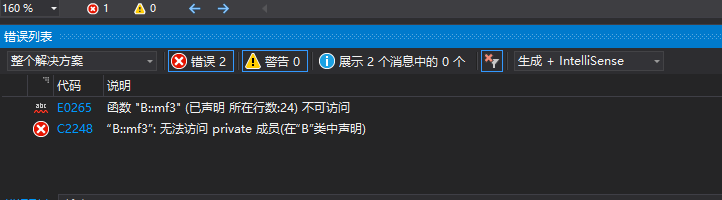<br />从编译输出信息中可以看出子类可以调用父类的public方法mf1和protected方法mf2但是无法调用private方法mf3。<br />现在在mf4中将mf3调用注释掉，代码如下。
```cpp
void D::mf4() {
    mf1(); //调用B::mf1()
    mf2(); //调用B::mf2()
    //mf3(); //错误，B::mf3()在B中是私有访问属性方法，子类无法访问
    std::cout << "D::mf4 run" << std::endl;
}
```
重新编译运行，观察运行结果。<br />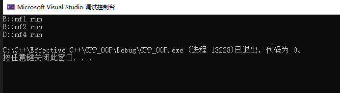<br />正确编译和运行，成功调用B::mf1和B::mf2。
<a name="NwMna"></a>
## 3、public继承父类时子类的成员对外表现的访问权限
类D public继承类B，想要测试类D从类B中继承的方法，则在主函数中定义一个类D的指针，并调用类D从类B继承的方法，代码如下。
```cpp
int main(int argc, char* argv[]){
    D* PD = new D();
    
    PD->mf1(); //正确，调用B::mf1
    PD->mf2(); //错误
    PD->mf3(); //错误
    
    return 0;
}
```
现在编译一下，观察编译输出信息。<br />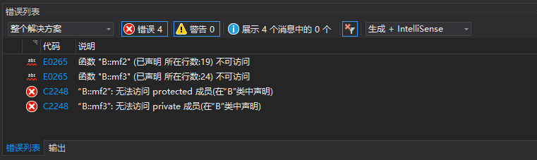<br />从编译输出信息可以知道，无法通过类D指针访问父类B的protected方法和private方法，但是可以访问B类public方法，因此父类B的public成员在子类D中对外的访问权限是public。<br />重新修改代码，并编译运行。
```cpp
int main(int argc, char* argv[])
{
    D* PD = new D();
    
    PD->mf1(); //正确，调用B::mf1
    //PD->mf2();
    //PD->mf3();
    
    return 0;
}
```
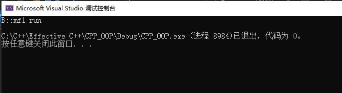<br />类D指针成功调用类B的public方法mf1。<br />现在定义一个类D1 public继承类D，代码如下。
```cpp
class D1 : public D {
public:
  void mf0();
};

void D1::mf0() {
    mf1();
    mf2();
    std::cout << "D1::mf0 run" << std::endl;
}
```
在主函数中调用mf0，编译运行观察运行结果。
```cpp
int main(int argc, char *argv[]) {
    D1 * PD1 = new D1();

    PD1->mf0();

    return 0;
}
```
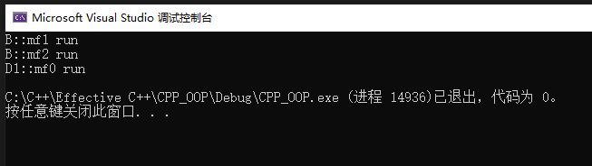<br />从运行输出信息可以看出，子类D1可以调用父类D从类B继承的mf1和mf2。所以mf1在类D中对外表现public，mf2在类D中对外表现protected。因此在C++中子类public继承父类，父类的public、protected和private成员在子类中对外表现分别为public、protected和private访问权限。
<a name="ukofV"></a>
## 4、protected继承时子类对父类成员的访问
在C++中，子类protected继承父类，则子类可以访问父类的public和protected的成员，但是无法访问父类的private成员。现在定义一个子类D2 protected继承父类，代码如下。
```cpp
class D2 : protected B {
public:
void mf5();
};

void D2::mf5() {
    mf1(); //调用B::mf1()
    mf2(); //调用B::mf2()
    mf3(); //错误
    std::cout << "D2::mf5 run" << std::endl;
}
```
在子类D2中定义一个public访问权限的方法mf5，并在mf5中调用父类的方法mf1、mf2和mf3，并在主函数中调用mf5方法，主函数代码如下。
```cpp
int main(int argc, char* argv[]){
    D2* PD2 = new D2();
    PD2->mf5();
    return 0;
}
```
编译输出信息如下。<br />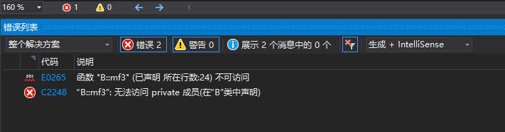<br />从编译输出信息可以看出，在D2::mf5中无法调用private成员mf3，但是可以调用public成员mf1和protected成员mf2。现在在mf5中注释掉mf3的调用，并编译运行结果如下。
```cpp
void D2::mf5() {
    mf1(); //调用B::mf1()
    mf2(); //调用B::mf2()
    //mf3(); //错误
    std::cout << "D2::mf5 run" << std::endl;
}
```
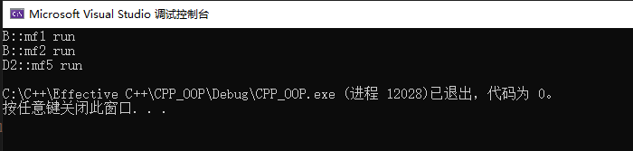<br />OK，编译运行正确。
<a name="yswXz"></a>
## 5、protected继承时子类的成员对外表现的访问权限
类D2 protected继承父类B，在主函数中定义一个类D2的指针，并调用类D2继承类B的成员，主函数代码如下。
```cpp
int main(int argc, char *argv[]) {
    D2 * PD2 = new D2();

    PD2->mf1(); //错误，mf1在D2中是受保护的
    PD2->mf2(); //错误，mf2在D2中是受保护的

    return 0;
}
```
现在编译运行，观察输出信息。<br />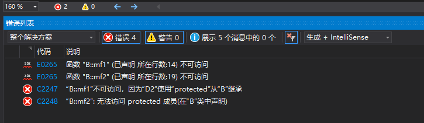<br />对比一下子类D public继承父类，很容易看出区别。mf1在父类B中是public成员，子类D2 protected继承类B后，无法通过类D2指针调用mf1和mf2。那么mf1和mf2在D2中表现的访问权限是什么呢？现在定义一个类D3 public 继承D2，代码如下。
```cpp
class D3 : public D2 {
public:
    void mf6();
};

void D3::mf6() {
    mf1(); //调用B::mf1()
    mf2(); //调用B::mf2()
    std::cout << "D3::mf6 run" << std::endl;
}
```
主函数代码如下。
```cpp
int main(int argc, char *argv[]) {
    D3 * PD3 = new D3();
    PD3->mf6();
    return 0;
}
```
现在编译运行结果如下。<br />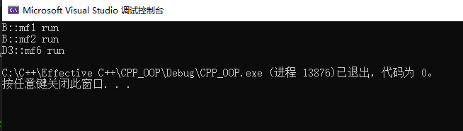<br />从运行结果可以看出，D3成员函数可以调用类B的public成员mf1和protected成员mf2，因此成员函数mf1和mf2在D2类中对外具有protected访问权限。因此，子类protected继承父类，则父类的public成员、protected成员和private成员在子类中对外表现为分别时protected、protected和private访问权限。
<a name="cfqt2"></a>
## 6、private继承时子类对父类成员的访问
在C++中子类private继承父类，子类可以访问父类的public和protected的成员，但是无法访问父类的private成员。现在定义一个类D4 private继承类B，代码如下。
```cpp
class D4 : private B {
public:
    void mf7();
};

void D4::mf7() {
    mf1(); //调用B::mf1()
    mf2(); //调用B::mf2()
    mf3(); //错误，无法调用类B的私有成员mf3
    std::cout << "D4::mf7 run" << std::endl;
}
```
在类D4中定义一个public成员函数mf7，分别调用类B的mf1、mf2和mf3。现在在主函数中调用类D4的mf7函数，主函数代码如下
```cpp
int main(int argc, char *argv[]) {
    D4 * PD4 = new D4();
    PD4->mf7();
    return 0;
}
```
编译结果如下。<br />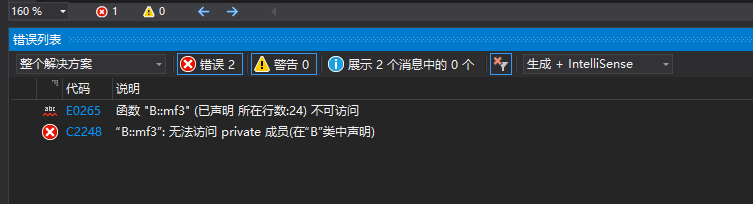<br />在子类D4中可以调用父类B的public成员mf1和protected成员mf2，但是无法访问private成员mf3。现在在mf7中将mf3的调用注释掉，编译运行结果如下。
```cpp
void D4::mf7() {
    mf1(); //调用B::mf1()
    mf2(); //调用B::mf2()
    //mf3(); //错误，无法调用类B的私有成员mf3
    std::cout << "D4::mf7 run" << std::endl;
}
```
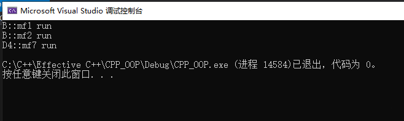<br />成功编译运行。
<a name="LQky0"></a>
## 7、private继承时子类的成员对外表现的访问权限
按照惯例，在主函数中定义一个类D4的指针，并通过指针调用从类B继承的成员。主函数代码如下。
```cpp
int main(int argc, char *argv[]) {
    D4 * PD4 = new D4();

    PD4->mf1(); //错误
    PD4->mf2(); //错误

    return 0;
}
```
编译结果如下。<br />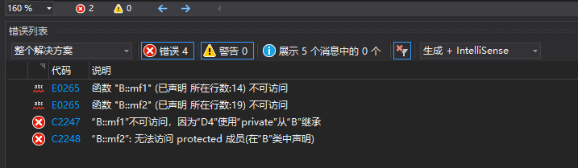<br />从类B private继承后，类D4无法调用类B的public成员mf1和protected成员mf2。那么mf1和mf2在类D4中对外表现的访问权限是什么呢？定义一个类D5 public 继承类D4，代码如下。
```cpp
class D5 : public D4 {
public:
    void mf8();
};

void D5::mf8() {
    mf1(); //错误
    mf2(); //错误
    mf3(); //错误
    std::cout << "D5::mf8 run" << std::endl;
}
```
在主函数中调用mf8，观察运行结果，代码如下。
```cpp
int main(int argc, char *argv[]) {
    D5 * PD5 = new D5();
    PD5->mf8();
    return 0;
}
```
编译输出信息结果如下。<br />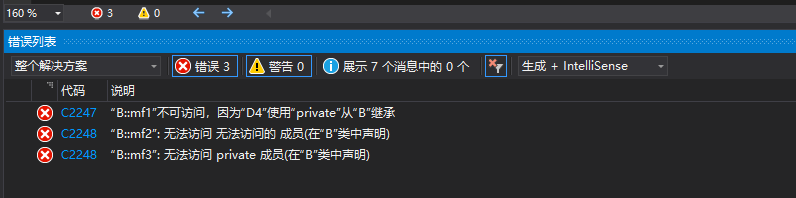<br />由编译输出信息可以看出，B类public成员mf1、protected成员mf2和private成员mf3无法在类D5的public成员函数mf8中调用，则mf1、mf2和mf3函数在类D5中表现为private访问权限。由此可以得出，子类private继承父类，则父类的public、protected和private成员函数在子类中对外表现都是private访问权限。
