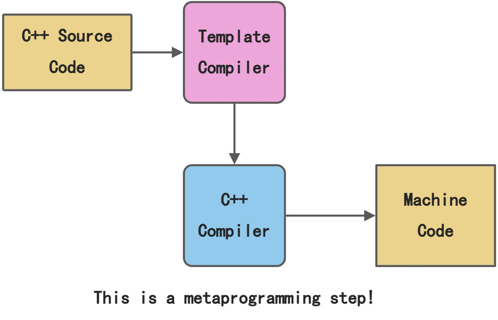

# C++ 模板

泛型编程大家应该都很熟悉了，主要就是利用模板实现“安全的宏”，而模板元编程区别于泛型编程，它是一种较为复杂的模板，属于C++的高阶操作了，它最主要的优点就在于把计算过程提前到编译期，能带来可观的性能提升。
<a name="lSXwM"></a>

## 1、概述
模板元编程（Template Meta programming，TMP）是编写生成或操纵程序的程序，也是一种复杂且功能强大的编程范式（Programming Paradigm）。<br />C++模板给C++提供了元编程的能力，但大部分用户对 C++ 模板的使用并不是很频繁，大致限于泛型编程，在一些系统级的代码，尤其是对通用性、性能要求极高的基础库（如 STL、Boost）几乎不可避免在大量地使用 C++ 模板以及模板元编程。<br />模版元编程完全不同于普通的运行期程序，因为模版元程序的执行完全是在编译期，并且模版元程序操纵的数据不能是运行时变量，只能是编译期常量，不可修改。<br />另外它用到的语法元素也是相当有限，不能使用运行期的一些语法，比如if-else、for和while等语句都不能用。<br />因此，模版元编程需要很多技巧，常常需要类型重定义、枚举常量、继承、模板偏特化等方法来配合，因此模版元编程比较复杂也比较困难。
<a name="NXekO"></a>
## 2、模板元编程的作用
C++ 模板最初是为实现泛型编程设计的，但人们发现模板的能力远远不止于那些设计的功能。<br />一个重要的理论结论就是：C++ 模板是图灵完备的（Turing-complete），就是用 C++ 模板可以模拟图灵机。<br />理论上说 C++ 模板可以执行任何计算任务，但实际上因为模板是编译期计算，其能力受到具体编译器实现的限制（如递归嵌套深度，C++11 要求至少 1024，C++98 要求至少 17）。<br />C++ 模板元编程是“意外”功能，而不是设计的功能，这也是 C++ 模板元编程语法丑陋的根源。<br />C++ 模板是图灵完备的，这使得 C++代码存在两层次，其中，执行编译计算的代码称为静态代码（static code），执行运行期计算的代码称为动态代码（dynamic code），C++的静态代码由模板实现，编写C++的静态代码，就是进行C++的模板元编程。<br />具体来说 C++ 模板可以做以下事情：编译期数值计算、类型计算、代码计算（如循环展开），其中数值计算实际意义不大，而类型计算和代码计算可以使得代码更加通用，更加易用，性能更好（也更难阅读，更难调试，有时也会有代码膨胀问题）。<br />编译期计算在编译过程中的位置请见下图。<br /><br />使用模板元编程的基本原则就是：将负载由运行时转移到编译时，同时保持原有的抽象层次。<br />其中负载可以分为两类，一类就是程序运行本身的开销，一类则是程序员需要编写的代码。<br />前者可以理解为编译时优化，后者则是为提高代码复用度，从而提高程序员的编程效率。<br />图灵完备是对计算能力的描述。<br />简单判定图灵完备的方法就是看该语言能否模拟出图灵机图灵不完备的语言常见原因有循环或递归受限(无法写不终止的程序，如 `while(true){}; )`， 无法实现类似数组或列表这样的数据结构(不能模拟纸带)。这会使能写的程序有限图灵完备可能带来坏处， 如C++的模板语言， 模板语言是在类型检查时执行， 如果编译器不加以检查，完全可以写出使得C++编译器陷入死循环的程序。图灵不完备也不是没有意义， 有些场景需要限制语言本身。如限制循环和递归，可以保证该语言能写的程序一定是终止的。
<a name="fn9MD"></a>
## 3、模板元编程的组成要素
从编程范式上来说，C++模板元编程是函数式编程，用递归形式实现循环结构的功能，用C++ 模板的特例化提供了条件判断能力，这两点使得其具有和普通语言一样通用的能力（图灵完备性）。<br />模版元程序由元数据和元函数组成，元数据就是元编程可以操作的数据，即C++编译器在编译期可以操作的数据。<br />元数据不是运行期变量，只能是编译期常量，不能修改，常见的元数据有enum枚举常量、静态常量、基本类型和自定义类型等。<br />元函数是模板元编程中用于操作处理元数据的“构件”，可以在编译期被“调用”，因为它的功能和形式 和 运行时的函数类似，而被称为元函数，它是元编程中最重要的构件。<br />元函数实际上表现为C++的一个类、模板类或模板函数，它的通常形式如下：
```cpp
template<int N, int M>
struct meta_func
{
    static const int value = N+M;
}
```
调用元函数获取value值：
```cpp
cout<<meta_func<1, 2>::value<<endl;
```
meta_func的执行过程是在编译期完成的，实际执行程序时，是没有计算动作而是直接使用编译期的计算结果。元函数只处理元数据，元数据是编译期常量和类型，所以下面的代码是编译不过的：
```cpp
int i = 1, j = 2;
meta_func<i, j>::value; //错误，元函数无法处理运行时普通数据
```
模板元编程产生的源程序是在编译期执行的程序，因此它首先要遵循C++和模板的语法，但是它操作的对象不是运行时普通的变量，因此不能使用运行时的C++关键字（如if、else、for），可用的语法元素相当有限，最常用的是：
```cpp

enum、static const  　　//用来定义编译期的整数常量；
typedef/using 　　 //用于定义元数据；[类型别名]
T/Args...　　 　　 //声明元数据类型；【模版参数：类型形参，非类型形参】
Template　　　　 //主要用于定义元函数；【模版类，特化，偏特化】
:: 　　　　　　     //域运算符，用于解析类型作用域获取计算结果（元数据）。【获取元数据，元类型】
```
实际上，模板元中的if-else可以通过type_traits来实现，它不仅仅可以在编译期做判断，还可以做计算、查询、转换和选择。<br />模板元中的for等逻辑可以通过递归、重载、和模板特化（偏特化）等方法实现。
<a name="rnYsg"></a>
## 4、模板元编程的控制逻辑
第一个 C++ 模板元程序由Erwin Unruh 在 1994 年编写，这个程序计算小于给定数 N 的全部素数（又叫质数），程序并不运行（都不能通过编译），而是让编译器在错误信息中显示结果（直观展现了是编译期计算结果，C++ 模板元编程不是设计的功能，更像是在戏弄编译器。从此，C++模板元编程的能力开始被人们认识到。<br />在模版元程序的具体实现时，由于其执行完全是在编译期，所以不能使用运行期的一些语法，比如if-else、for和while等语句都不能用。这些控制逻辑需要通过特殊的方法来实现。
<a name="Z4HKm"></a>
### 4.1 if判断
模板元编程中实现条件if判断，参考如下代码：
```cpp

#include <iostream>
 
template<bool c, typename Then, typename Else> class IF_ {};    //基础类模版

template<typename Then, typename Else>
class IF_<true, Then, Else> { public: typedef Then reType; };        //类模版的偏特化; 如果第一个模版非类型参数为true，IF_<true, Then, Else>::reType的值为模版的第二个类型参数Then
 
template<typename Then, typename Else>
class IF_<false,Then, Else> { public: typedef Else reType; };         //类模版的偏特化
 
int main()
{
    const int len = 4;
 
    // 定义一个指定字节数的类型
    typedef
        IF_<sizeof(short)==len, short,
        IF_<sizeof(int)==len, int,
        IF_<sizeof(long)==len, long,
        IF_<sizeof(long long)==len, long long,
        void>::reType>::reType>::reType>::reType int_my;
    std::cout << sizeof(int_my) << '\n';
}
 
/*分析最里面的一层：
 * IF_<sizeof(long long)==len, long long, void>::reType
 * 如果sizeof(long long) == 4, 上面的表达式返回long long, 否则返回void
*/
```
程序输出结果：4。<br />实际上，从C++11开始，可以通过type_traits来实现。因为type_traits提供了编译期选择特性：`std::conditional`，它在编译期根据一个判断式选择两个类型中的一个，和条件表达式的语义类似，类似于一个三元表达式。它的原型是：
```cpp
template< bool B, class T, class F >
struct conditional;
```
所以上面的代码可以改写为如下代码：
```cpp
#include <iostream>
#include <type_traits>
int main()
{
    const int len = 4;
    // 定义一个指定字节数的类型
    typedef
        std::conditional<sizeof(short)==len, short,
        std::conditional<sizeof(int)==len, int,
        std::conditional<sizeof(long)==len, long,
        std::conditional<sizeof(long long)==len, long long,
        void>::type>::type>::type>::type int_my;
    std::cout << sizeof(int_my) << '\n';
}
```
程序同样编译输出4。
<a name="Q76N1"></a>
### 4.2循环展开
编译期的循环展开（ Loop Unrolling）可以通过模板特化来结束递归展开，达到运行期的for和while语句的功能。下面看一个编译期数值计算的例子。
```cpp
#include <iostream>
template<int N> class sum
{
    public: static const int ret = sum<N-1>::ret + N;
};
template<> class sum<0>
{
    public: static const int ret = 0;
};
int main()
{
    std::cout << sum<5>::ret <<std::endl;
    return 0;
}
```
程序输出：15。<br />当编译器遇到`sumt<5>`时，试图实例化之，`sumt<5>` 引用了`sumt<5-1>`即`sumt<4>`，试图实例化`sumt<4>`，以此类推，直到`sumt<0>`，`sumt<0>`匹配模板特例，`sumt<0>::ret`为 `0`，`sumt<1>::ret`为`sumt<0>::ret+1`为`1`，以此类推，`sumt<5>::ret`为`15`。<br />值得一提的是，虽然对用户来说程序只是输出了一个编译期常量`sumt<5>::ret`，但在背后，编译器其实至少处理了`sumt<0>`到`sumt<5>`共6个类型。<br />从这个例子也可以窥探 C++ 模板元编程的函数式编程范型，对比结构化求和程序：`for(i=0,sum=0; i<=N; ++i) sum+=i;` 用逐步改变存储（即变量 sum）的方式来对计算过程进行编程，模板元程序没有可变的存储（都是编译期常量，是不可变的变量），要表达求和过程就要用很多个常量：`sumt<0>::ret`，`sumt<1>::ret`，...，`sumt<5>::ret`。<br />函数式编程看上去似乎效率低下（因为它和数学接近，而不是和硬件工作方式接近），但有自己的优势：描述问题更加简洁清晰，没有可变的变量就没有数据依赖，方便进行并行化。
<a name="h5p43"></a>
### 4.3switch/case分支
同样可以通过模板特化来模拟实现编译期的switch/case分支功能。参考如下代码：
```cpp

#include <iostream>
using namespace std;
template<int v> class Case
{
    public:
    static inline void Run()
    {
        cout << "default case" << endl;
    }
};
template<> class Case<1>
{
public:
    static inline void Run()
{
        cout << "case 1" << endl;
    }
};
template<> class Case<2>
{
public:
    static inline void Run()
{
        cout << "case 2" << endl;
    }
};
int main()
{
    Case<2>::Run();
}
```
程序输出结果：
```cpp
case 2
```
<a name="gtYFZ"></a>
## 5、特性、策略与标签
利用迭代器，可以实现很多通用算法，迭代器在容器与算法之间搭建了一座桥梁。求和函数模板如下：
```cpp
#include <iostream>
#include <vector>
template<typename iter>
typename iter::value_type mysum(iter begin, iter end)
{
    typename iter::value_type sum(0);
    for(iter i=begin; i!=end; ++i)
        sum += *i;
    return sum;
}
int main()
{
    std::vector<int> v;
    for(int i = 0; i<100; ++i)
        v.push_back(i);v.push_back(i);
    std::cout << mysum(v.begin(), v.end()) << '\n';
}
```
程序编译输出：4950。<br />让 `mysum()` 对指针参数也能工作，毕竟迭代器就是模拟指针，但指针没有嵌套类型 value_type，可以定义 `mysum()` 对指针类型的特例，但更好的办法是在函数参数和 value_type 之间多加一层特性（traits）。
```cpp

template<typename iter>
class mytraits            //标准容器通过这里获取容器元素的类型
{
public: typedef typename iter::value_type value_type;
};

template<typename T>
class mytraits<T*>        //数组类型的容器，通过这里获取数组元素的类型
{
    public: typedef T value_type;
};

template<typename iter>
typename mytraits<iter>::value_type mysum(iter begin, iter end)
{
    typename mytraits<iter>::value_type sum(0);
    for(iter i=begin; i!=end; ++i)
        sum += *i;
    return sum;
}
int main()
{
    int v[4] = {1,2,3,4};
    std::cout << mysum(v, v+4) << '\n';
    return 0;
}
```
程序输出：10。<br />其实，C++ 标准定义了类似的 traits， `std::iterator_trait`（另一个经典例子是 `std::numeric_limits`） 。<br />`traits`特性对类型的信息（如 value_type、 reference）进行包装，使得上层代码可以以统一的接口访问这些信息。<br />C++ 模板元编程会涉及大量的类型计算，很多时候要提取类型的信息（`typedef`、 常量值等），如果这些类型信息的访问方式不一致（如上面的迭代器和指针），不得不定义特例，这会导致大量重复代码的出现（另一种代码膨胀），而通过加一层特性可以很好的解决这一问题。<br />另外，特性不仅可以对类型的信息进行包装，还可以提供更多信息，当然，因为加了一层，也带来复杂性。特性是一种提供元信息的手段。<br />策略（policy）一般是一个类模板，典型的策略是 STL 容器的分配器（如`std::vector<>`，完整声明是`template<class T, class Alloc=allocator<T>> class vector;`）（这个参数有默认参数，即默认存储策略），策略类将模板的经常变化的那一部分子功能块集中起来作为模板参数，这样模板便可以更为通用，这和特性的思想是类似的。<br />标签（tag）一般是一个空类，其作用是作为一个独一无二的类型名字用于标记一些东西，典型的例子是 STL 迭代器的五种类型的名字。
```cpp
input_iterator_tag
output_iterator_tag
forward_iterator_tag
bidirectional_iterator_tag
random_access_iterator_tag
```
实际上，<br />`std::vector<int>::iterator::iterator_category`就是`random_access_iterator_tag`，可以使用`type_traits`的特性`is_same`来判断类型是否相同。
```cpp
#include <iostream>
#include <vector>
#include <type_traits>
int main()
{
    std::cout << is_same<std::vector<int>::iterator::iterator_category,  std::random_access_iterator_tag >::value << std::endl;
    return 0;
}
```
程序输出：1。<br />有了这样的判断，还可以根据判断结果做更复杂的元编程逻辑（如一个算法以迭代器为参数，根据迭代器标签进行特例化以对某种迭代器特殊处理）。标签还可以用来分辨函数重载。
<a name="s8uFo"></a>
## 6、小结
C++模板元编程是图灵完备的且是函数式编程，主要特点是代码在编译期执行，可用于编译期数值计算，能够获得更有效率的运行码。模板的使用，也提高了代码泛化。与此同时，模板元编程也存一定缺点，主要有：<br />（1）模板元编程产生的代码较为复杂，难易阅读，可读性较差；<br />（2）大量模板的使用，编译时容易导致代码膨胀，提高了编译时间；<br />（3）对于C++来说，由于各编译器的差异，大量依赖模板元编程（特别是最新形式的）的代码可能会有移植性的问题。<br />所以，对于模板元编程，需要扬其长避其短，合理使用模板元编程。
