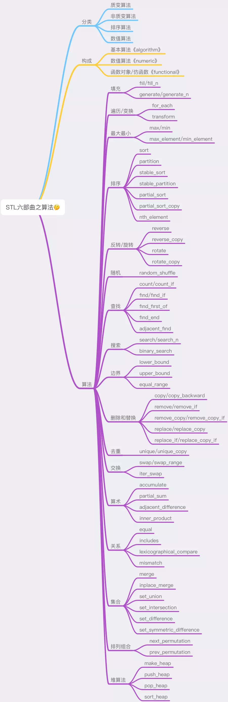

# C++ STL 

STL 算法博大精深，涵盖范围之广，其算法之大观，细节之深入，泛型思维之于字里行间，每每阅读都会有不同的收获。 STL 将很多常见的逻辑都封装为现成的算法，熟悉这些算法的使用和实现很多时候可以大大简化编程。 并且在需要的时候能够对 STL 进行扩展，将自定义的容器和算法融入到 STL 中。 深入源码之前，先观察每一个算法的表现和大观，是一个比较好的学习方式。 先上思维导图： 

## 基本算法
在 STL 标准规格中，并没有区分基本算法或复杂算法，然而 SGI 却把常用的一些算法定义于 <stl_algobase.h>之中，其它算法定义于 <stl_algo.h>中。 常见的基本算法有 equal、fill、fill_n、iter_swap、lexicographical_compare、max、min、mismatch、swap、copy、copy_backward 等。

## 质变算法和非质变算法
所有的 STL 算法归根到底，都可以分为两类。 所谓“质变算法”是指作用在由迭代器[first,last]所标示出来的区间，上运算过程中会更改区间内的元素内容： 比如拷贝(copy)、互换(swap)、替换(replace)、填写(fill)、删除(remove)、排列组合(permutation)、分割(partition)。随机重排(random shuffling)、排序(sort)等算法，都属于这一类。 而非质变算法是指在运算过程中不会更改区间内的元素内容。比如查找(find)，匹配(search)、计数（count）、遍历(for_each)、比较(equal_mismatch)、寻找极值(max,min)等算法。

## 输入参数
所有泛型算法的前两个参数都是一对迭代器，通过称为 first，last 用来标示算法的操作区间。 每一个 STL 算法的声明，都表现出它所需要的最低程度的迭代器类型。 比如 `find()` 需要一个 inputiterator ，这是它的最低要求，但同时也可以接受更高类型的迭代器。 如 `Forwarditerator`、`Bidirectionaliterator` 或 `RandomAcessIterator`。 因为，前者都可以看做是一个 inputiterator，而如果给 `find()` 传入一个 `Outputiterator`，会导致错误。 将无效的迭代器传给某个算法，虽然是一种错误，但不保证能够在编译器期间就被捕捉出来。 因为所谓“迭代器类型”并不是真实的型别，它们只是function template的一种型别参数。 许多 STL 算法不仅支持一个版本，往往第一个版本算法会采用默认的行为，另一个版本会提供额外的参数，接受一个仿函数，以便采取其它的策略。 例如 `unique()` 默认情况下会使用 equality 操作符来比较两个相邻元素，但如果这些元素的型别并没有提供，那么便可以传递一个自定义的函数（或者叫仿函数）。 知道了这一点，对于想要深入研究源码的小伙伴们会更好理解一些。

## 算法的泛型化
将一个表述完整的算法转化为程序代码，是一个合格程序员的基本功。 如何将算法独立于其所处理的数据结构之外，不受数据的牵绊，使得设计的算法在即将处理的未知的数据结构上（也许是 array，也许是 vector，也许是 list，也许是 deque）上，正确地实现所有操作呢？ 这就需要进一步思考：关键在于只要把操作对象的型别加以抽象化，把操作对象的标示法和区间目标的移动行为抽象化，整个算法也就在一个抽象层面上工作了。 这个过程就叫做算法的泛型化，简称泛化。 比如在 STL 源码剖析这本书里举了一个 find 的例子，如果一步步改成 template + 迭代器的形式，来说明了泛化的含义。

## 构成
| 头文件 | 功能 |
| --- | --- |
| <algorithm> | 算法函数 |
| <numeric> | 数值算法 |
| <functional> | 函数对象/仿函数 |

## 分类
| No. | 分类 | 说明 | 

 |
| --- | --- | --- | --- |
| 1 | 非质变算法 | Non-modifying sequence operations | 不直接修改容器内容的算法 |
| 2 | 质变算法 | Modifying sequence operations | 可以修改容器内容的算法 |
| 3 | 排序算法 | Sorting/Partitions/Binary search/ | 对序列排序、合并、搜索算法操作 |
| 4 | 数值算法 | Merge/Heap/Min/max | 对容器内容进行数值计算 |

## 填充
| 函数 | 作用 |
| --- | --- |
| `fill(beg,end,val)` | 将值val赋给[beg,end)范围内的所有元素 |
| `fill_n(beg,n,val)` | 将值val赋给[beg,beg+n)范围内的所有元素 |
| `generate(beg,end,func)` | 连续调用函数func填充[beg,end)范围内的所有元素 |
| `generate_n(beg,n,func)` | 连续调用函数func填充[beg,beg+n)范围内的所有元素 |

- `fill()`/`fill_n()`用于填充相同值，`generate()`/`generate_n()`用于填充不同值。

## 遍历/变换
| 函数 | 作用 |
| --- | --- |
| `for_each(beg,end,func)` | 将[beg,end)范围内所有元素依次调用函数func，返回func。不修改序列中的元素 |
| `transform(beg,end,res,func)` | 将[beg,end)范围内所有元素依次调用函数func，结果放入res中 |
| `transform(beg2,end1,beg2,res,binary)` | 将[beg,end)范围内所有元素与[beg2,beg2+end-beg)中所有元素依次调用函数binnary，结果放入res中 |

## 最大最小
| 函数 | 作用 |
| --- | --- |
| `max(a,b)` | 返回两个元素中较大一个 |
| `max(a,b,cmp)` | 使用自定义比较操作cmp,返回两个元素中较大一个 |
| `max_element(beg,end)` | 返回一个ForwardIterator，指出[beg,end)中最大的元素 |
| `max_element(beg,end,cmp)` | 使用自定义比较操作cmp,返回一个ForwardIterator，指出[beg,end)中最大的元素 |
| `min(a,b)` | 返回两个元素中较小一个 |
| `min(a,b,cmp)` | 使用自定义比较操作cmp,返回两个元素中较小一个 |
| `min_element(beg,end)` | 返回一个ForwardIterator，指出[beg,end)中最小的元素 |
| `min_element(beg,end,cmp)` | 使用自定义比较操作cmp,返回一个ForwardIterator，指出[beg,end)中最小的元素 |

## 排序算法(12个)：元素排序策略
| 函数 | 作用 |
| --- | --- |
| `sort(beg,end)` | 默认升序重新排列元素 |
| `sort(beg,end,comp)` | 使用函数comp代替比较操作符执行`sort()` |
| `partition(beg,end,pred)` | 元素重新排序，使用pred函数，把结果为true的元素放在结果为false的元素之前 |
| `stable_sort(beg,end)` | 与`sort()`类似，保留相等元素之间的顺序关系 |
| `stable_sort(beg,end,pred)` | 使用函数pred代替比较操作符执行`stable_sort()` |
| `stable_partition(beg,end)` | 与`partition()`类似，保留容器中的相对顺序 |
| `stable_partition(beg,end,pred)` | 使用函数pred代替比较操作符执行`stable_partition()` |
| `partial_sort(beg,mid,end)` | 部分排序，被排序元素个数放到[beg,end)内 |
| `partial_sort(beg,mid,end,comp)` | 使用函数comp代替比较操作符执行`partial_sort()` |
| `partial_sort_copy(beg1,end1,beg2,end2)` | 与`partial_sort()`类似，只是将[beg1,end1)排序的序列复制到[beg2,end2) |
| `partial_sort_copy(beg1,end1,beg2,end2,comp)` | 使用函数comp代替比较操作符执行`partial_sort_copy()` |
| `nth_element(beg,nth,end)` | 单个元素序列重新排序，使所有小于第n个元素的元素都出现在它前面，而大于它的都出现在后面 |
| `nth_element(beg,nth,end,comp)` | 使用函数comp代替比较操作符执行`nth_element()` |

### 反转/旋转
| 函数 | 作用 |
| --- | --- |
| `reverse(beg,end)` | 元素重新反序排序 |
| `reverse_copy(beg,end,res)` | 与`reverse()`类似，结果写入res |
| `rotate(beg,mid,end)` | 元素移到容器末尾，由mid成为容器第一个元素 |
| `rotate_copy(beg,mid,end,res)` | 与`rotate()`类似，结果写入res |

### 随机
| 函数 | 作用 |
| --- | --- |
| `random_shuffle(beg,end)` | 元素随机调整次序 |
| `random_shuffle(beg,end,gen)` | 使用函数gen代替随机生成函数执行`random_shuffle()` |

### 查找算法(13个)：判断容器中是否包含某个值

### 统计
| 函数 | 作用 |
| --- | --- |
| `count(beg,end,val)` | 利用==操作符，对[beg,end)的元素与val进行比较，返回相等元素个数 |
| `count_if(beg,end,pred)` | 使用函数pred代替==操作符执行`count()` |

### 查找
| 函数 | 作用 |
| --- | --- |
| `find(beg,end,val)` | 利用==操作符，对[beg,end)的元素与val进行比较。当匹配时结束搜索，返回该元素的InputIterator |
| `find_if(beg,end,pred)` | 使用函数pred代替==操作符执行find() |
| `find_first_of(beg1,end1,beg2,end2)` | 在[beg1,end1)范围内查找[beg2,end2)中任意一个元素的第一次出现。返回该元素的Iterator |
| `find_first_of(beg1,end1,beg2,end2,pred)` | 使用函数pred代替==操作符执行find_first_of()。返回该元素的Iterator |
| `find_end(beg1,end1,beg2,end2)` | 在[beg1,end1)范围内查找[beg2,end2)最后一次出现。找到则返回最后一对的第一个ForwardIterator，否则返回end1 |
| `find_end(beg1,end1,beg2,end2,pred)` | 使用函数pred代替==操作符执行find_end()。返回该元素的Iterator |
| `adjacent_find(beg,end)` | 对[beg,end)的元素，查找一对相邻重复元素，找到则返回指向这对元素的第一个元素的ForwardIterator。否则返回end |
| `adjacent_find(beg,end,pred)` | 使用函数pred代替==操作符执行adjacent_find() |

### 搜索
| 函数 | 作用 |
| --- | --- |
| `search(beg1,end1,beg2,end2)` | 在[beg1,end1)范围内查找[beg2,end2)首一次出现，返回一个ForwardIterator，查找成功,返回[beg1,end1)内第一次出现[beg2,end2)的位置，查找失败指向end1 |
| `search(beg1,end1,beg2,end2,pred)` | 使用函数pred代替==操作符执行search() |
| `search_n(beg,end,n,val)` | 在[beg,end)范围内查找val出现n次的子序列 |
| `search_n(beg,end,n,val,pred)` | 使用函数pred代替==操作符执行search_n() |
| `binary_search(beg,end,val)` | 二分查找，在[beg,end)中查找val，找到返回true |
| `binary_search(beg,end,val,comp)` | 使用函数comp代替比较操作符执行binary_search() |

### 边界
| 函数 | 作用 |
| --- | --- |
| `lower_bound(beg,end,val)` | 在[beg,end)范围内的可以插入val而不破坏容器顺序的第一个位置，返回一个ForwardIterator（返回范围内第一个大于等于值val的位置） |
| `lower_bound(beg,end,val,comp)` | 使用函数comp代替比较操作符执行lower_bound() |
| `upper_bound(beg,end,val)` | 在[beg,end)范围内插入val而不破坏容器顺序的最后一个位置，该位置标志一个大于val的值，返回一个ForwardIterator（返回范围内第一个大于val的位置） |
| `upper_bound(beg,end,val,comp)` | 使用函数comp代替比较操作符执行upper_bound() |
| `equal_range(beg,end,val)` | 返回一对iterator，第一个表示lower_bound，第二个表示upper_bound |
| `equal_range(beg,end,val,comp)` | 使用函数comp代替比较操作符执行lower_bound() |

## 删除和替换算法(15个)

### 复制
| 函数 | 作用 |
| --- | --- |
| `copy(beg,end,res)` | 复制[beg,end)到res |
| `copy_backward(beg,end,res)` | 与copy()相同，不过元素是以相反顺序被拷贝 |

### 移除
| 函数 | 作用 |
| --- | --- |
| `remove(beg,end,val)` | 移除[first,last)区间内所有与val值相等的元素，并不是真正的从容器中删除这些元素(原容器的内容不会改变)而是将结果复制到一个以result为起始位置的容器中。新容器可以与原容器重叠 |
| `remove_if(beg,end,pred)` | 删除[beg,end)内pred结果为true的元素 |
| `remove_copy(beg,end,res,val)` | 将所有不等于val元素复制到res，返回OutputIterator指向被拷贝的末元素的下一个位置 |
| `remove_copy_if(beg,end,res,pred)` | 将所有使pred结果为true的元素拷贝到res |

### 替换
| 函数 | 作用 |
| --- | --- |
| `replace(beg,end,oval,nval)` | 将[beg,end)内所有等于oval的元素都用nval代替 |
| `replace_copy(beg,end,res,oval,nval)` | 与replace()类似，不过将结果写入res |
| `replace_if(beg,end,pred,nval)` | 将[beg,end)内所有pred为true的元素用nval代替 |
| `replace_copy_if(beg,end,res,pred,nval)` | 与`replace_if()`，不过将结果写入res |

### 去重
| 函数 | 作用 |
| --- | --- |
| `unique(beg,end)` | 清除序列中相邻重复元素，不真正删除元素。重载版本使用自定义比较操作 |
| `unique(beg,end,pred)` | 将所有使pred结果为true的相邻重复元素去重 |
| `unique_copy(beg,end,res)` | 与unique类似，不过把结果输出到res |
| `unique_copy(beg,end,res,pred)` | 与unique类似，不过把结果输出到res |

### 交换
| 函数 | 作用 |
| --- | --- |
| `swap(a,b)` | 交换存储在a与b中的值 |
| `swap_range(beg1,end1,beg2)` | 将[beg1,end1)内的元素[beg2,beg2+beg1-end1)元素值进行交换 |
| `iter_swap(it_a,it_b)` | 交换两个ForwardIterator的值 |

## 算术算法(4个)
| 函数 | 作用 |
| --- | --- |
| `accumulate(beg,end,val)` | 对[beg,end)内元素之和，加到初始值val上 |
| `accumulate(beg,end,val,binary)` | 将函数binary代替加法运算，执行`accumulate()` |
| `partial_sum(beg,end,res)` | 将[beg,end)内该位置前所有元素之和放进res中 |
| `partial_sum(beg,end,res,binary)` | 将函数binary代替加法运算，执行`partial_sum()` |
| `adjacent_difference(beg1,end1,res)` | 将[beg,end)内每个新值代表当前元素与上一个元素的差放进res中 |
| `adjacent_difference(beg1,end1,res,binary)` | 将函数binary代替减法运算，执行`adjacent_difference()` |
| `inner_product(beg1,end1,beg2,val)` | 对两个序列做内积(对应元素相乘，再求和)并将内积加到初始值val上 |
| `inner_product(beg1,end1,beg2,val,binary1,binary2)` | 将函数binary1代替加法运算,将binary2代替乘法运算，执行`inner_product()` |

## 关系算法(4个)
| 函数 | 作用 |
| --- | --- |
| `equal(beg1,end1,beg2)` | 判断[beg1,end1)与[beg2,end2)内元素都相等 |
| `equal(beg1,end1,beg2,pred)` | 使用pred函数代替默认的==操作符 |
| `includes(beg1,end1,beg2,end2)` | 判断[beg1,end1)是否包含[beg2,end2)，使用底层元素的<操作符，成功返回true。重载版本使用用户输入的函数 |
| `includes(beg1,end1,beg2,end2,comp)` | 将函数comp代替<操作符，执行includes() |
| `lexicographical_compare(beg1,end1,beg2,end2)` | 按字典序判断[beg1,end1)是否小于[beg2,end2) |
| `lexicographical_compare(beg1,end1,beg2,end2,comp)` | 将函数comp代替<操作符，执行lexicographical_compare() |
| `mismatch(beg1,end1,beg2)` | 并行比较[beg1,end1)与[beg2,end2)，指出第一个不匹配的位置，返回一对iterator，标志第一个不匹配元素位置。如果都匹配，返回每个容器的end |
| `mismatch(beg1,end1,beg2,pred)` | 使用pred函数代替默认的==操作符 |

## 集合算法(6个)
| 函数 | 作用 |
| --- | --- |
| `merge(beg1,end1,beg2,end2,res)` | 合并[beg1,end1)与[beg2,end2)存放到res |
| `merge(beg1,end1,beg2,end2,res,comp)` | 将函数comp代替<操作符，执行`merge()` |
| `inplace_merge(beg,mid,end)` | 合并[beg,mid)与[mid,end)，结果覆盖[beg,end) |
| `inplace_merge(beg,mid,end,cmp)` | 将函数comp代替<操作符，执行`inplace_merge()` |
| `set_union(beg1,end1,beg2,end2,res)` | 取[beg1,end1)与[beg2,end2)元素并集存放到res |
| `set_union(beg1,end1,beg2,end2,res,comp)` | 将函数comp代替<操作符，执行`set_union()` |
| `set_intersection(beg1,end1,beg2,end2,res)` | 取[beg1,end1)与[beg2,end2)元素交集存放到res |
| `set_intersection(beg1,end1,beg2,end2,res,comp)` | 将函数comp代替<操作符，执行`set_intersection()` |
| `set_difference(beg1,end1,beg2,end2,res)` | 取[beg1,end1)与[beg2,end2)元素内差集存放到res |
| `set_difference(beg1,end1,beg2,end2,res,comp)` | 将函数comp代替<操作符，执行`set_difference()` |
| `set_symmetric_difference(beg1,end1,beg2,end2,res)` | 取[beg1,end1)与[beg2,end2)元素外差集存放到res |

## 排列组合算法：提供计算给定集合按一定顺序的所有可能排列组合
| 函数 | 作用 |
| --- | --- |
| `next_permutation(beg,end)` | 取出[beg,end)内的下移一个排列 |
| `next_permutation(beg,end,comp)` | 将函数comp代替<操作符，执行`next_permutation()` |
| `prev_permutation(beg,end)` | 取出[beg,end)内的上移一个排列 |
| `prev_permutation(beg,end,comp)` | 将函数comp代替<操作符，执行`prev_permutation()` |

### 堆算法(4个)
| 函数 | 作用 |
| --- | --- |
| `make_heap(beg,end)` | 把[beg,end)内的元素生成一个堆 |
| `make_heap(beg,end,comp)` | 将函数comp代替<操作符，执行`make_heap()` |
| `pop_heap(beg,end)` | 重新排序堆。它把first和last-1交换，然后重新生成一个堆。可使用容器的back来访问被"弹出"的元素或者使用pop_back进行真正的删除。并不真正把最大元素从堆中弹出 |
| `pop_heap(beg,end,comp)` | 将函数comp代替<操作符，执行`pop_heap()` |
| `push_heap(beg,end)` | 假设first到last-1是一个有效堆，要被加入到堆的元素存放在位置last-1，重新生成堆。在指向该函数前，必须先把元素插入容器后 |
| `push_heap(beg,end,comp)` | 将函数comp代替<操作符，执行`push_heap()` |
| `sort_heap(beg,end)` | 对[beg,end)内的序列重新排序 |
| `sort_heap(beg,end,comp)` | 将函数comp代替<操作符，执行`push_heap()` |

