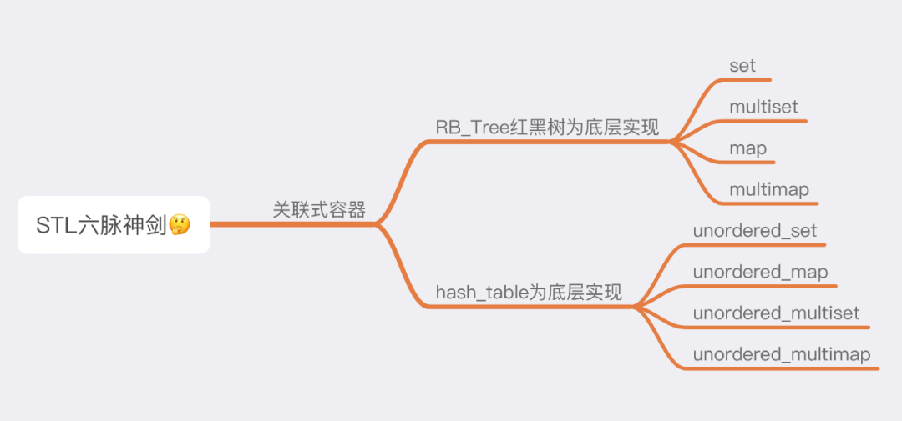
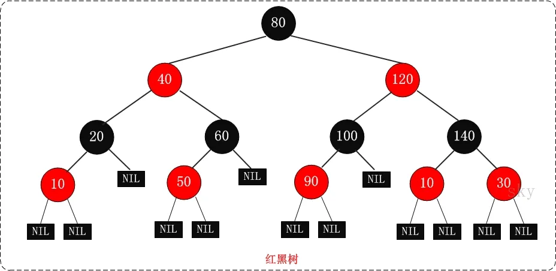
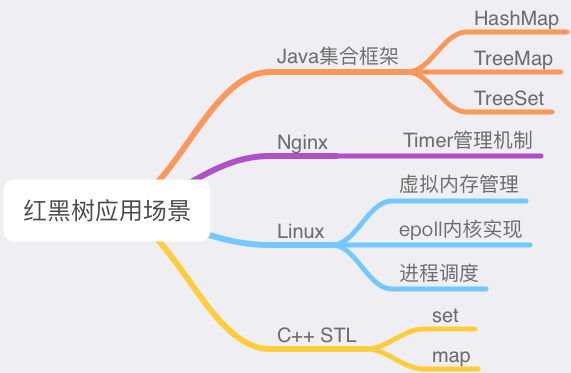
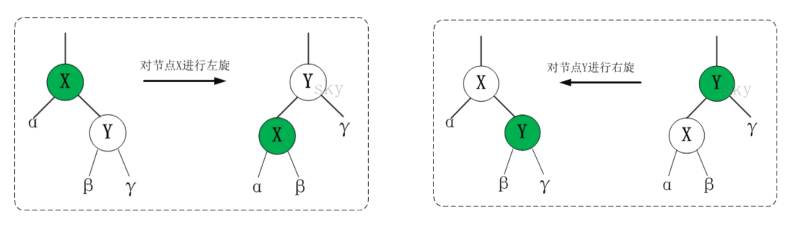
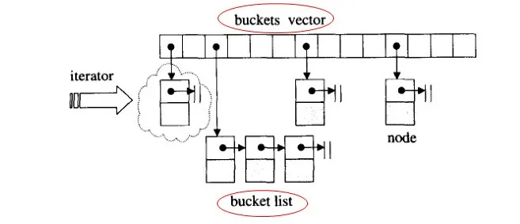
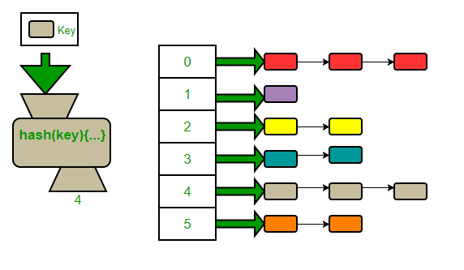
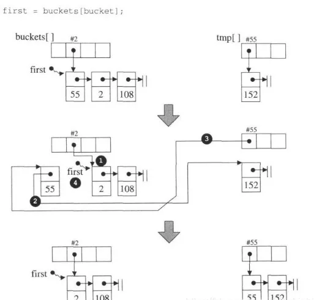
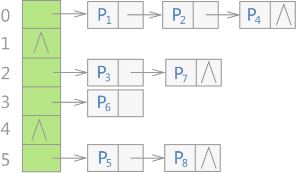
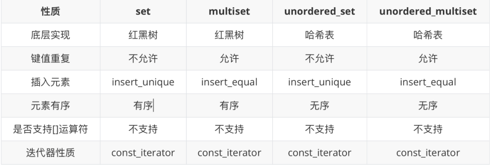
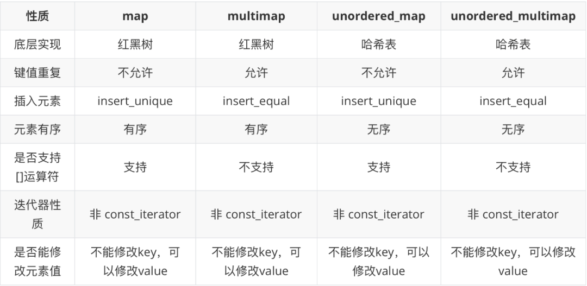

# C++ STL

在 STL 编程中，容器是经常会用到的一种数据结构，容器分为序列式容器和关联式容器。<br />两者的本质区别在于：序列式容器是通过元素在容器中的位置顺序存储和访问元素，而关联容器则是通过键 (key) 存储和读取元素。<br />着重剖析关联式容器相关背后的知识点，来一张思维导图。<br />
<a name="bPcwB"></a>

## 容器分类
前面提到了，根据元素存储方式的不同，容器可分为序列式和关联式，那具体的又有哪些分类呢，这里画了一张图来看一下。<br /><br />关联式容器比序列式容器更好理解，从底层实现来分的话，可以分为 RB_tree 还是 hash_table，所有暴露给用户使用的关联式容器都绕不过底层这两种实现。<br />先来分析其底层的两种实现，后面在逐个一一剖析其外在形式，这样对于新手还是老手，对于其背后核心的设计和奥秘，理解起来都会丝滑顺畅。
<a name="purnD"></a>
## RB-Tree介绍与应用
树的适用场景还是为了增加代码的复用性，以及扩展性。<br />首先来介绍红黑树，RB Tree 全称是 Red-Black Tree，又称为“红黑树”，它一种特殊的二叉查找树。红黑树的每个节点上都有存储位表示节点的颜色，可以是红 (Red) 或黑 (Black)。<br />红黑树的特性:

- 每个节点或者是黑色，或者是红色。
- 根节点是黑色。
- 每个叶子节点（NIL）是黑色。[注意：这里叶子节点，是指为空(NIL或NULL)的叶子节点！]
- 如果一个节点是红色的，则它的子节点必须是黑色的。
- 从一个节点到该节点的子孙节点的所有路径上包含相同数目的黑节点。

注意：

- 特性 (3)中的叶子节点，是只为空(NIL或null)的节点。
- 特性 (5)确保没有一条路径会比其他路径长出俩倍。因而，红黑树是相对是接近衡的二叉树。

红黑树示意图如下：

<br />红黑树保证了最坏情形下在 O(logn) 时间复杂度内完成查找、插入及删除操作；效率非常之高。<br />因此红黑树可用于很多场景，比如下图。<br /><br />好了，红黑树介绍到这里差不多了，关于红黑树的分析在深入又是另一篇文章了，下面再简单介绍一下红黑树的两种数据操作方式。
<a name="HQ7T2"></a>

### RB-Tree的基本操作
红黑树的基本操作包括 添加、删除。<br />在对红黑树进行添加或删除之后，都会用到旋转方法。原因在于添加或删除红黑树中的节点之后，红黑树就发生了变化，可能不满足红黑树的 5 条性质，也就说不再是一颗红黑树了，而是一颗普通的树。<br />而通过旋转，可以使这颗树重新成为红黑树。简单点说，旋转的目的是让树保持红黑树的特性。<br />在红黑树里的旋转包括两种：左旋和右旋。<br />左旋： 对节点 X 进行左旋，也就说让节点 X 成为左节点。<br />右旋： 对节点 X 进行右旋，也就说让节点 X 成为右节点。<br /><br />说完了旋转，再来看一下它的插入，有两种插入方式：
```cpp
//不允许键值重复插入
pair<iterator, bool> insert_unique(const value_type& x);

//允许键值重复插入
iterator insert_equal(const value_type& x);
```
RB-tree 里面分两种插入方式，一种是允许键值重复插入，一种不允许。可以简单的理解，如果调用 insert_unique 插入重复的元素，在 RB-tree 里面其实是无效的。<br />其实在 RB-tree 源码里面，上面两个函数走到最底层，调用的是同一个 __insert() 函数。<br />知道了数据的操作方式，再来看 RB-tree 的构造方式：内部调用 rb_tree_node_allocator ，每次恰恰配置一个节点，会调用 simple_alloc 空间配置器来配置节点。<br />并且分别调用四个节点函数来进行初始化和构造化。<br />get_node(), put_node(), create_node(), clone_node(), destroy_node();<br />RB-tree 的构造方式也有两种：一种是以现有的 RB-tree 复制一个新的 RB-tree，另一种是产生一棵空的树。
<a name="ipwLW"></a>
### 哈希表（hashtable）介绍与应用
红黑树的介绍就到这里了，下面来看一下哈希表。<br />数组的特点是：寻址容易，插入和删除困难；而链表的特点是：寻址困难，插入和删除容易。<br />那么能不能综合两者的特性，做出一种寻址容易，插入删除也容易的数据结构？<br />答案是肯定的，这就是哈希表。<br />哈希表，也被称为散列表，是一种常用的数据结构，这种结构在插入、删除、查找等操作上也具有”常数平均时间“的表现。<br />也可以视为一种字典结构。<br />在讲具体的 hashtable 源码之前，先来认识两个概念：

- 散列函数：使用某种映射函数，将大数映射为小数。负责将某一个元素映射为一个”大小可接受内的索引“，这样的函数称为 hash function（散列函数）。
- 使用散列函数可能会带来问题：可能会有不同的元素被映射到相同的位置，这无法避免，因为元素个数有可能大于分配的 array 容量，这就是所谓的碰撞问题，解决碰撞问题一般有：线性探测、二次探测、开链等。

不同的方法有不同的效率差别，本文以 SGI STL 源码里采用的开链法来进行 hashtable 的学习。<br />拉链法，可以理解为“链表的数组”，其思路是：如果多个关键字映射到了哈希表的同一个位置处，则将这些关键字记录在同一个线性链表中，如果有重复的，就顺序拉在这条链表的后面。<br /><br />以开链法完成的 hash table<br /><br />注意，bucket 维护的链表，并不采用 STL 的 list ，而是自己维护的 hash table node，至于 buckets 表格，则是以 vector 构造完成，以便具有动态扩充能力。<br />hash table 的定义：
```cpp
//模板参数定义
/* 
Value： 节点的实值类型 
Key：   节点的键值类型 
HashFcn：hash function的类型 
ExtractKey：从节点中取出键值的方法（函数或仿函数） 
EqualKey：判断键值是否相同的方法（函数或仿函数） 
Alloc：空间配置器
*/ 
//hash table的线性表是用 vector 容器维护
template <class _Val, class _Key, class _HashFcn,
class _ExtractKey, class _EqualKey, class _Alloc>
class hashtable {
public:
  typedef _Key key_type;
  typedef _Val value_type;
  typedef _HashFcn hasher;
  typedef _EqualKey key_equal;

  typedef size_t            size_type;
  typedef ptrdiff_t         difference_type;
  typedef value_type*       pointer;
  typedef const value_type* const_pointer;
  typedef value_type&       reference;
  typedef const value_type& const_reference;

  hasher hash_funct() const { return _M_hash; }
  key_equal key_eq() const { return _M_equals; }

private:
  typedef _Hashtable_node<_Val> _Node;

```
这里需要注意的是，hashtable 的迭代器是正向迭代器，且必须维持这整个 buckets vector 的关系，并记录目前所指的节点。其前进操作是目前所指的节点，前进一个位置。
```cpp
//以下是hash table的成员变量
private:
hasher                _M_hash;
key_equal             _M_equals;
_ExtractKey           _M_get_key;
vector<_Node*,_Alloc> _M_buckets;//用vector维护buckets
size_type             _M_num_elements;//hashtable中list节点个数

public:
typedef _Hashtable_iterator<_Val,_Key,_HashFcn,_ExtractKey,_EqualKey,_Alloc>
   iterator;
typedef _Hashtable_const_iterator<_Val,_Key,_HashFcn,_ExtractKey,_EqualKey,
_Alloc>
  const_iterator;

public:
//构造函数
hashtable(size_type __n,
          const _HashFcn&    __hf,
          const _EqualKey&   __eql,
          const _ExtractKey& __ext,
          const allocator_type& __a = allocator_type())
    : __HASH_ALLOC_INIT(__a)
        _M_hash(__hf),
_M_equals(__eql),
_M_get_key(__ext),
_M_buckets(__a),
_M_num_elements(0)
{
    _M_initialize_buckets(__n);//预留空间,并将其初始化为空0
    //预留空间大小为大于n的最小素数
}
```
提供两种插入元素的方法：insert_equal允许重复插入；`insert_unique`不允许重复插入。
```cpp
//插入元素节点,不允许存在重复元素
pair<iterator, bool> insert_unique(const value_type& __obj) {
    //判断容量是否够用, 否则就重新配置 
    resize(_M_num_elements + 1);
    //插入元素,不允许存在重复元素
    return insert_unique_noresize(__obj);
}
//插入元素节点,允许存在重复元素
iterator insert_equal(const value_type& __obj)
{
    //判断容量是否够用, 否则就重新配置
    resize(_M_num_elements + 1);
    //插入元素,允许存在重复元素
    return insert_equal_noresize(__obj);
}
```
<a name="gZdZz"></a>
### hashtable 的基本操作
后面马上要介绍的关联容器 set、multiset、map 和 multimap 的底层机制都是基于 RB-Tree 红黑树，虽然能够实现在插入、删除和搜素操作能够达到对数平均时间，可是要求输入数据有足够的随机性。<br />而 hash table 不需要要求输入数据具有随机性，在插入、删除和搜素操作都能达到常数平均时间。<br />SGI 中实现 hash table 的方式，是在每个 buckets 表格元素中维护一个链表, 然后在链表上执行元素的插入、搜寻、删除等操作，该表格中的每个元素被称为桶 (bucket)。<br />虽然开链法并不要求表格大小为质数，但 SGI STL 仍然已质数来设计表格大小，并且将 28 个质数计算好，以备随时访问。
```cpp
// Note: assumes long is at least 32 bits.
// 注意：假设long至少为32-bits, 可以根据自己需要修改
//定义28个素数用作hashtable的大小 
enum { __stl_num_primes = 28 };

static const unsigned long __stl_prime_list[__stl_num_primes] = {
53ul,         97ul,         193ul,       389ul,       769ul,
1543ul,       3079ul,       6151ul,      12289ul,     24593ul,
49157ul,      98317ul,      196613ul,    393241ul,    786433ul,
1572869ul,    3145739ul,    6291469ul,   12582917ul,  25165843ul,
50331653ul,   100663319ul,  201326611ul, 402653189ul, 805306457ul, 
1610612741ul, 3221225473ul, 4294967291ul
};

//返回大于n的最小素数
inline unsigned long __stl_next_prime(unsigned long __n) {
const unsigned long* __first = __stl_prime_list;
const unsigned long* __last = __stl_prime_list + (int)__stl_num_primes;
const unsigned long* pos = lower_bound(__first, __last, __n);
```
hashtable的节点配置和释放分别由 new_node 和 delete_node 来完成，并且插入操作和表格重整分别由 insert_unique 和 insert_equal ,resize 三个函数来完成。限于篇幅，这里用一张图来展示：<br /><br />C++ STL 标准库中，不仅是 unordered_xxx 容器，所有无序容器的底层实现都采用的是哈希表存储结构。更准确地说，是用“链地址法”（又称“开链法”）解决数据存储位置发生冲突的哈希表，整个存储结构如图所示。<br /><br />其中，Pi 表示存储的各个键值对。<br />最左边的绿色称之为 bucket 桶，可以看到，当使用无序容器存储键值对时，会先申请一整块连续的存储空间，但此空间并不用来直接存储键值对，而是存储各个链表的头指针，各键值对真正的存储位置是各个链表的节点。<br />在 C++ STL 标准库中，将图 1 中的各个链表称为桶（bucket），每个桶都有自己的编号（从 0 开始）。当有新键值对存储到无序容器中时，整个存储过程分为如下几步：

- 将该键值对中键的值带入设计好的哈希函数，会得到一个哈希值（一个整数，用 H 表示）；
- 将 H 和无序容器拥有桶的数量 n 做整除运算（即 H % n），该结果即表示应将此键值对存储到的桶的编号；
- 建立一个新节点存储此键值对，同时将该节点链接到相应编号的桶上。

另外值得一提的是，哈希表存储结构还有一个重要的属性，称为负载因子（load factor）。<br />该属性同样适用于无序容器，用于衡量容器存储键值对的空/满程序，即负载因子越大，意味着容器越满，即各链表中挂载着越多的键值对，<br />这无疑会降低容器查找目标键值对的效率；反之，负载因子越小，容器肯定越空，但并不一定各个链表中挂载的键值对就越少。<br />举个例子，如果设计的哈希函数不合理，使得各个键值对的键带入该函数得到的哈希值始终相同（所有键值对始终存储在同一链表上）。这种情况下，即便增加桶数是的负载因子减小，该容器的查找效率依旧很差。<br />无序容器中，负载因子的计算方法为：<br />负载因子 = 容器存储的总键值对 / 桶数<br />默认情况下，无序容器的最大负载因子为 1.0。如果操作无序容器过程中，使得最大复杂因子超过了默认值，则容器会自动增加桶数，并重新进行哈希，以此来减小负载因子的值。<br />需要注意的是，此过程会导致容器迭代器失效，但指向单个键值对的引用或者指针仍然有效。<br />这也就解释了，为什么在操作无序容器过程中，键值对的存储顺序有时会“莫名”的发生变动。<br />C++ STL 标准库为了方便用户更好地管控无序容器底层使用的哈希表存储结构，各个无序容器的模板类中都提供表 所示的成员方法。

| 成员方法 | 功能 |
| --- | --- |
| `bucket_count` | 返回当前容器底层存储键值对时，使用桶的数量 |
| `max_bucket_count` | 返回当前系统中，unordered_xxx 容器底层最多可以使用多少个桶 |
| `bucket_size` | 返回第 n 个桶中存储键值对的数量 |
| `bucket(key)` | 返回以 key 为键的键值对所在桶的编号 |
| `load_factor` | 返回 `unordered_map` 容器中当前的负载因子 |
| `max_load_factor` | 返回或者设置当前 unordered_map 容器的最大负载因子 |
| `rehash(n)` | 尝试重新调整桶的数量为等于或大于 n 的值。如果 n 大于当前容器使用的桶数，则该方法会是容器重新哈希，该容器新的桶数将等于或大于 n。反之，如果 n 的值小于当前容器使用的桶数，则调用此方法可能没有任何作用。 |
| `reserve(n)` | 将容器使用的桶数（`bucket_count()` 方法的返回值）设置为最适合存储 n 个元素的桶 |
| `hash_function` | 返回当前容器使用的哈希函数对象 |

下面开始讲解具体的关联式容器，这里的分类比较多，有的同学可能会有点分不清。<br />那么小贺也给大家总结了一句话：只要是前缀带了`unordered`的就是无序，后缀带了`multi`的就是允许键重复，插入采用 `insert_equal` 而不是 `insert_unique`。
<a name="jVPuT"></a>
## `set`、`multiset`、`unordered_set`、`unordered_multiset`
有了前面的 RB_tree 做铺垫，下面来学习 set/multiset 和 map/multimap 就容易多了。<br />先来看一下 set 的性质

- set 以 RB-tree 作为其底层机制，所有元素都会根据元素的键值自动被排序。
- set 的元素就是键值，set 不允许两个元素有相同的键值。
- 不允许通过 set 的迭代器来改变 set 的元素值，因为 set 的元素值就是键值，更改了元素值就会影响其排列规则，如果任意更改元素值，会严重破坏 set 组织，因此在定义 set 的迭代器时被定义成了 RB-tree 的 const_iterator。
- 由于 set 不允许有两个相同的键值，所以插入时采用的是 RB-tree 的 insert_unique 方式
- 这里的类型的定义要注意一点, 都是 const 类型, 因为 set 的主键定义后就不能被修改了, 所以这里都是以const类型。

下面来看一下 set 的源码<br />set 的主要实现大都是调用 RB-tree 的接口，这里的类型的定义要注意一点, 都是 const 类型， 因为 set 的主键定义后就不能被修改了，所以这里都是以 const 类型。
```cpp
#ifndef __STL_LIMITED_DEFAULT_TEMPLATES
template <class Key, class Compare = less<Key>, class Alloc = alloc>
#else
template <class Key, class Compare, class Alloc = alloc>
#endif
class set {
public:
  // typedefs:
  typedef Key key_type;
  typedef Key value_type;
  typedef Compare key_compare;
  typedef Compare value_compare;
private:
 // 一RB-tree为接口封装
  typedef rb_tree<key_type, value_type, identity<value_type>, key_compare, Alloc> rep_type; 
  rep_type t;  // red-black tree representing set
public:
 // 定义的类型都是const类型, 不能修改
  typedef typename rep_type::const_pointer pointer;
  typedef typename rep_type::const_pointer const_pointer;
  typedef typename rep_type::const_reference reference;
  typedef typename rep_type::const_reference const_reference;
  typedef typename rep_type::const_iterator iterator;
  typedef typename rep_type::const_iterator const_iterator;
  typedef typename rep_type::const_reverse_iterator reverse_iterator;
  typedef typename rep_type::const_reverse_iterator const_reverse_iterator;
  typedef typename rep_type::size_type size_type;
  typedef typename rep_type::difference_type difference_type;
  ...
};
```
构造函数构造成员的时候调用的是 RB-tree 的 insert_unique。
```cpp
class set {
public:
    ...
  set() : t(Compare()) {}
  explicit set(const Compare& comp) : t(comp) {} // 不能隐式转换

    // 接受两个迭代器
    // 构造函数构造成员的时候调用的是RB-tree的insert_unique
  template <class InputIterator>
  set(InputIterator first, InputIterator last)
    : t(Compare()) { t.insert_unique(first, last); }
  template <class InputIterator>
  set(InputIterator first, InputIterator last, const Compare& comp)
    : t(comp) { t.insert_unique(first, last); }

  set(const value_type* first, const value_type* last) 
    : t(Compare()) { t.insert_unique(first, last); }
  set(const value_type* first, const value_type* last, const Compare& comp)
    : t(comp) { t.insert_unique(first, last); }

  set(const_iterator first, const_iterator last)
    : t(Compare()) { t.insert_unique(first, last); }
  set(const_iterator first, const_iterator last, const Compare& comp)
    : t(comp) { t.insert_unique(first, last); }
    ...
};
```
成员属性获取
```cpp
class set {
public:
    ...
  // 所有的操作都是通过调用RB-tree获取的
  key_compare key_comp() const { return t.key_comp(); }
  value_compare value_comp() const { return t.key_comp(); }
  iterator begin() const { return t.begin(); }
  iterator end() const { return t.end(); }
  reverse_iterator rbegin() const { return t.rbegin(); } 
  reverse_iterator rend() const { return t.rend(); }
  bool empty() const { return t.empty(); }
  size_type size() const { return t.size(); }
  size_type max_size() const { return t.max_size(); }
    // 交换
  void swap(set<Key, Compare, Alloc>& x) { t.swap(x.t); }
    // 其他的find, count等都是直接调用的RB-tree的接口
  iterator find(const key_type& x) const { return t.find(x); }
  size_type count(const key_type& x) const { return t.count(x); }
  iterator lower_bound(const key_type& x) const {
    return t.lower_bound(x);
  }
  iterator upper_bound(const key_type& x) const {
    return t.upper_bound(x); 
  }
  pair<iterator,iterator> equal_range(const key_type& x) const {
    return t.equal_range(x);
  }
    ...
};
```
insert 操作源码
```cpp
class set {
public:
    ...
    // pair类型我们准备下一节分析, 这里是直接调用insert_unique, 返回插入成功就是pair( , true), 插入失败则是( , false)
  typedef  pair<iterator, bool> pair_iterator_bool; 
  pair<iterator,bool> insert(const value_type& x) { 
    pair<typename rep_type::iterator, bool> p = t.insert_unique(x); 
    return pair<iterator, bool>(p.first, p.second);
  }
    // 指定位置的插入
  iterator insert(iterator position, const value_type& x) {
    typedef typename rep_type::iterator rep_iterator;
    return t.insert_unique((rep_iterator&)position, x);
  }
    // 可接受范围插入
  template <class InputIterator>
  void insert(InputIterator first, InputIterator last) {
    t.insert_unique(first, last);
  }
    ...
};
```
erase 的实现是通过调用 RB-tree 实现的 erase。
```cpp
class set {
public:
    ...
 // erase的实现是通过调用RB-tree实现的erase
  void erase(iterator position) { 
    typedef typename rep_type::iterator rep_iterator;
    t.erase((rep_iterator&)position); 
  }
  size_type erase(const key_type& x) { 
    return t.erase(x); 
  }
  void erase(iterator first, iterator last) { 
    typedef typename rep_type::iterator rep_iterator;
    t.erase((rep_iterator&)first, (rep_iterator&)last); 
  }
  void clear() { t.clear(); }
 ...
};
```
最后剩下一个重载运算符，也是以 RB-tree 为接口调用。<br />到这里，set 大部分的源码都已经过了一遍。`multiset` 与 `set` 特性完全相同，唯一差别在于它允许键值重复，因此插入操作采用的是底层机制 RB-tree 的 `insert_equal()` 而非 `insert_unique()`。<br />接下来来了解一下两个新的数据结构：`hash_set` 与 `unordered_set`。<br />它们都属于基于哈希表(hash table)构建的数据结构，并且是关键字与键值相等的关联容器。<br />那 `hash_set` 与 `unordered_set` 哪个更好呢？实际上 `unordered_set` 在C++11的时候被引入标准库了，而 hash_set 并没有，所以建议还是使用 `unordered_set` 比较好，这就好比一个是官方认证的，一个是民间流传的。<br />在 SGI STL 源码剖析里，是以 `hash_set` 剖析的。<br />`hash_set` 将哈希表的接口在进行了一次封装, 实现与 set 类似的功能.
```cpp
#ifndef __STL_LIMITED_DEFAULT_TEMPLATES
template <class Value, class HashFcn = hash<Value>,
          class EqualKey = equal_to<Value>,
          class Alloc = alloc>
#else
template <class Value, class HashFcn, class EqualKey, class Alloc = alloc>
#endif
class hash_set {
private:
    // 定义hashtable
  typedef hashtable<Value, Value, HashFcn, identity<Value>,  EqualKey, Alloc> ht;
  ht rep;

public:
  typedef typename ht::key_type key_type;
  typedef typename ht::value_type value_type;
  typedef typename ht::hasher hasher;
  typedef typename ht::key_equal key_equal;

    // 定义为const类型, 键值不允许修改
  typedef typename ht::size_type size_type;
  typedef typename ht::difference_type difference_type;
  typedef typename ht::const_pointer pointer;
  typedef typename ht::const_pointer const_pointer;
  typedef typename ht::const_reference reference;
  typedef typename ht::const_reference const_reference;

    // 定义迭代器
  typedef typename ht::const_iterator iterator;
  typedef typename ht::const_iterator const_iterator;
    // 仿函数
  hasher hash_funct() const { return rep.hash_funct(); }
  key_equal key_eq() const { return rep.key_eq(); }
    ...
};
```
构造函数
```cpp
class hash_set
{
    ...
public:
  hash_set() : rep(100, hasher(), key_equal()) {} // 默认构造函数, 表大小默认为100最近的素数
  explicit hash_set(size_type n) : rep(n, hasher(), key_equal()) {}
  hash_set(size_type n, const hasher& hf) : rep(n, hf, key_equal()) {}
  hash_set(size_type n, const hasher& hf, const key_equal& eql)
    : rep(n, hf, eql) {}

#ifdef __STL_MEMBER_TEMPLATES
  template <class InputIterator>
  hash_set(InputIterator f, InputIterator l)
    : rep(100, hasher(), key_equal()) { rep.insert_unique(f, l); }
  template <class InputIterator>
  hash_set(InputIterator f, InputIterator l, size_type n)
    : rep(n, hasher(), key_equal()) { rep.insert_unique(f, l); }
  template <class InputIterator>
  hash_set(InputIterator f, InputIterator l, size_type n,
           const hasher& hf)
    : rep(n, hf, key_equal()) { rep.insert_unique(f, l); }
  template <class InputIterator>
  hash_set(InputIterator f, InputIterator l, size_type n,
           const hasher& hf, const key_equal& eql)
    : rep(n, hf, eql) { rep.insert_unique(f, l); }
 ...
};
```
插入删除等操作<br />insert调用的是`insert_unqiue`函数
```cpp
class hash_set
{
    ...
   public:
    // 都是调用hashtable的接口, 这里insert_unqiue函数
    pair<iterator, bool> insert(const value_type& obj)
    {
        pair<typename ht::iterator, bool> p = rep.insert_unique(obj);
        return pair<iterator, bool>(p.first, p.second);
    }
```
<a name="R9NjQ"></a>
## `set`、`multiset`、`unordered_set`、`unordered_multiset`总结

<a name="UimE1"></a>
## `map`、`multimap`、`unordered_map`、`unordered_multimap`
在分析 map 相关容器之前，来分析一下 pair 这种结构。<br />pair 是一个有两个变量的结构体, 即谁都可以直接调用它的变量, 毕竟 `struct` 默认权限都是 `public`, 将两个变量用 pair 绑定在一起, 这就为 `map<T1, T2>` 提供的存储的基础.
```cpp
template <class T1, class T2> // 两个参数类型
struct pair {
  typedef T1 first_type;
  typedef T2 second_type;

    // 定义的两个变量
  T1 first; 
  T2 second;
    
    // 构造函数
  pair() : first(T1()), second(T2()) {}
  pair(const T1& a, const T2& b) : first(a), second(b) {}
#ifdef __STL_MEMBER_TEMPLATES
  template <class U1, class U2>
  pair(const pair<U1, U2>& p) : first(p.first), second(p.second) {}
#endif
};
```
重载实现：
```cpp
template <class T1, class T2>
inline bool operator==(const pair<T1, T2>& x, const pair<T1, T2>& y) { 
  return x.first == y.first && x.second == y.second; 
}
template <class T1, class T2>
inline bool operator<(const pair<T1, T2>& x, const pair<T1, T2>& y) { 
  return x.first < y.first || (!(y.first < x.first) && x.second < y.second); 
}
```
整体 pair 的功能与实现都是很简单的，这都是为 map 的实现做准备的，接下来就来分析 map 的实现。<br />map 基本结构定义
```cpp
#ifndef __STL_LIMITED_DEFAULT_TEMPLATES
template <class Key, class T, class Compare = less<Key>, class Alloc = alloc>
#else
template <class Key, class T, class Compare, class Alloc = alloc>
#endif
class map {
public:
  typedef Key key_type; // 定义键值
  typedef T data_type; // 定义数据
  typedef T mapped_type;
  typedef pair<const Key, T> value_type; // 这里定义了map的数据类型为pair, 且键值为const类型, 不能修改
  typedef Compare key_compare;
    
private:
  typedef rb_tree<key_type, value_type, 
                  select1st<value_type>, key_compare, Alloc> rep_type; // 定义红黑树, map是以rb-tree结构为基础的
  rep_type t;  // red-black tree representing map 
public:
...
```
构造函数：map 所有插入操作都是调用的 RB-tree 的 insert_unique，不允许出现重复的键。
```cpp
class map {
public:
 ...
public:
  // allocation/deallocation
  map() : t(Compare()) {} // 默认构造函数
  explicit map(const Compare& comp) : t(comp) {}
#ifdef __STL_MEMBER_TEMPLATES
    // 接受两个迭代器
  template <class InputIterator>
  map(InputIterator first, InputIterator last)
    : t(Compare()) { t.insert_unique(first, last); }
  template <class InputIterator>
  map(InputIterator first, InputIterator last, const Compare& comp)
    : t(comp) { t.insert_unique(first, last); }
...
```
基本属性的获取
```cpp
class map {
public:
 ...
public:
    // 实际调用的是RB-tree的key_comp函数
  key_compare key_comp() const { return t.key_comp(); }
    // value_comp实际返回的是一个仿函数value_compare
  value_compare value_comp() const { return value_compare(t.key_comp()); }
    // 以下的begin, end等操作都是调用的是RB-tree的接口
  iterator begin() { return t.begin(); }
  const_iterator begin() const { return t.begin(); }
  iterator end() { return t.end(); }
  const_iterator end() const { return t.end(); }
  reverse_iterator rbegin() { return t.rbegin(); }
  const_reverse_iterator rbegin() const { return t.rbegin(); }
  reverse_iterator rend() { return t.rend(); }
  const_reverse_iterator rend() const { return t.rend(); }
  bool empty() const { return t.empty(); }
  size_type size() const { return t.size(); }
  size_type max_size() const { return t.max_size(); }
    // 交换, 调用RB-tree的swap, 实际只交换head和count
  void swap(map<Key, T, Compare, Alloc>& x) { t.swap(x.t); }
    ...
};
template <class Key, class T, class Compare, class Alloc>
inline void swap(map<Key, T, Compare, Alloc>& x, 
                 map<Key, T, Compare, Alloc>& y) {
  x.swap(y);
}
```
重载的分析
```cpp
class map {
public:
 ...
public:
  T& operator[](const key_type& k) {
    return (*((insert(value_type(k, T()))).first)).second;
  }
    ...
};
```

- `insert(value_type(k, T())` : 查找是否存在该键值, 如果存在则返回该pair, 不存在这重新构造一该键值并且值为空
- `*((insert(value_type(k, T()))).first)` : pair的第一个元素表示指向该元素的迭代器, 第二个元素指的是(false与true)是否存在,  first 便是取出该迭代器而 * 取出pair.
- `(*((insert(value_type(k, T()))).first)).second` : 取出pair结构中的second保存的数据

这里有坑，初学者容易掉进去，请注意：<br />重载 `operator[]`，这一步返回是实值 value(即`pair.second`)的引用，假如原先没有定义 map 对象，即访问的键值 key 不存在，则会自动新建一个 map 对象，键值 key 为访问的键值 key，实值 value 为空，看下面的例子就明白了。<br />在自己的开发机上测试，int 类型默认 value 为 0，bool 类型默认 value 为 false，string 类型默认是空。
```cpp
_Tp& operator[](const key_type& __k) {
    iterator __i = lower_bound(__k);
    // __i->first is greater than or equivalent to __k.
    if (__i == end() || key_comp()(__k, (*__i).first))
        __i = insert(__i, value_type(__k, _Tp()));
    return (*__i).second;
    //其实简单的方式是直接返回
    //return (*((insert(value_type(k, T()))).first)).second;
}
```
map 的其他 `insert`， `erase`， `find` 都是直接调用 RB-tree 的接口函数实现的， 这里就不直接做分析了。
<a name="sLvRb"></a>
## `map`、`multimap`、`unordered_map`、`unordered_multimap`总结
map 和 multimap 的共同点：

- 两者底层实现均为红黑树，不可以通过迭代器修改元素的键，但是可以修改元素的值；
- 拥有和 list 某些相同的特性，进行元素的新增和删除后，操做前的迭代器依然可用；

不同点：

- map 键不能重复，支持 `[]` 运算符；
- `multimap` 支持重复的键，不支持 [] 运算符；

map 并不像 set 一样将 iterator 设为 RB-tree 的 `const_iterator`，因为它允许用户通过其迭代器修改元素的实值。<br />map 和 `unordered_map` 共同点：

- 两者均不能有重复的建，均支持[]运算符

不同点：

- map 底层实现为红黑树
- `unordered_map` 底层实现为哈希表

`unordered_map` 是不允许存在相同的键存在，底层调用的 `insert_unique()` 插入元素 `unordered_multimap` 可以允许存在多个相同的键，底层调用的 `insert_equal()` 插入元素。<br />map 并不像 set 一样将 iterator 设为 RB-tree 的 `const_iterator`，因为它允许用户通过其迭代器修改元素的实值。<br />
<a name="pfjf4"></a>
## 思考
为什么 `std::set` 不支持`[]`运算符？<br />对于 `std::map` 而言，看一个例子：
```cpp
std::map<std::string,int> m = { {"a",1}, {"b", 2 } };
```
`m["a"]` 返回的是1所在单元的引用。<br />而如果对于 `std::setstd::string s = { "a", "b" };` 而言 `s["a"]` 应该是个什么类型呢？<br />用索引取一个容器的元素 `a[key] = value` 的前提是既有 key 又有 value，set 只有 key 没有 value，加了`[]`会导致歧义。

