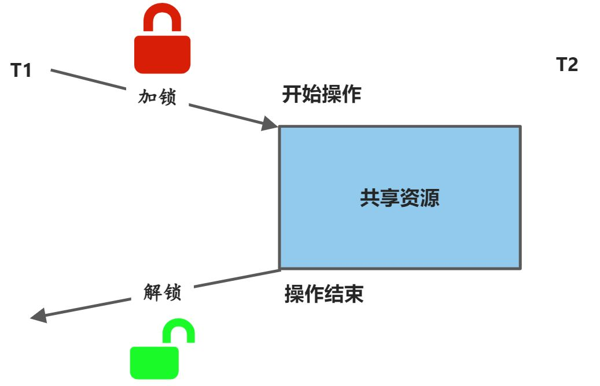

# C++ 多线程

## 1、基本概念
### 1.1 进程

- 简单理解为程序的一次执行，例如在桌面打开一个应用程序就开启了一个进程。进程通常由程序、数据、进程控制块(PCB)构成。
- 传统进程认为：进程可以获取操作系统分配的资源，如内存等；可以参与操作系统的调度，参与CPU的竞争，得到分配的时间片，获得CPU运行。
- 进程在创建、撤销和切换中，系统必须为之付出较大的时空开销，因此系统中开启的进程数不宜过多。
<a name="eVb2C"></a>
### 1.2 线程

- 线程是进程中的一个实体，是被系统独立分配和调度的基本单位。或者说，线程是CPU可执行调度的最小单位，进程本身并不能获取CPU时间，只有它的线程才可以。
- 引入线程后，不同于传统进程：线程参与操作系统的调度，参与CPU的竞争，得到分配的时间片，获得处理机（CPU）运行；而进程负责获取操作系统分配的资源，如内存。
- 线程基本上不拥有资源，只拥有一点运行中必不可少的资源，它可与同属一个进程的其他线程共享进程所拥有的全部资源。同一个进程中的多个线程可以并发执行。
<a name="wgvek"></a>
### 1.3 线程与线程的区别联系
除了上面概念中所提到的，还有：

- 线程分为用户级线程和内核支持线程两类：用户级线程不依赖于内核，该类线程的创建、撤销和切换都不利用系统调用来实现；内核支持线程依赖于内核，即无论是在用户进程中的线程，还是在系统中的线程，其创建、撤销和切换都利用系统调用来实现。
- 系统进程和用户进程在进行切换时都要依赖于内核中的进程调度。因此，无论是什么进程都是与内核有关的，是在内核支持下进程切换的。
- 进程要独立的占用系统资源（如内存），而同一进程的线程之间是共享资源的。进程本身并不能获取CPU时间，只有它的线程才可以。

在一个应用程序（进程）中同时执行多个小的部分（线程），这就是多线程。多个线程虽然共享一样的数据，但是却执行不同的任务。
<a name="muQMU"></a>
### 1.4 并发
并发是指在同一个时间里CPU同时执行两条或多条命令。单核CPU和C++11以前实现的并发一般是伪并发。但随着多核CPU的普及，C++11开始支持真正意义上的并发。<br />C++11可以通过多线程实现并发，这是一种比较底层、传统的实现方式。C++11引入了5个头文件来支持多线程编程：<atomic>/<thread>/<mutex>/<condition_variable>/<future>
```cpp
#include <atomic>   // C++11 原子操作，限制并发程序对共享数据的使用，避免数据竞争
#include <thread>   // 该头文件主要声明了std::thread类，另外std::this_thread命名空间也在该头文件中
#include <mutex>    // C++11 互斥量Mutex。在多线程环境中，有多个线程竞争同一个公共资源，就很容易引发线程安全的问题
#include <condition_variable>  // C++11 并发编程 主要包含了与条件变量相关的类和函数
```
<a name="sxH8W"></a>
## 2、`std::mutex` 互斥访问
`<mutex>`是C++标准程序库中的一个头文件，定义了C++11标准中一些互斥访问的类与方法。<br />其中`std::mutex`表示普通互斥锁，可以与`std::unique_lock`配合使用，把`std::mutex`放到`unique_lock`中时，`mutex`会自动上锁，`unique_lock`析构时，同时把`mutex`解锁。因此`std::mutex`可以保护同时被多个线程访问的共享数据，并且它独占对象所有权，不支持对对象递归上锁。<br />可以这样理解：各个线程在对共享资源操作前都尝试先加锁，成功加锁才能操作，操作结束解锁。(下图来自网络)<br /><br />常用的成员函数有：

1. 构造函数：`std::mutex`不支持`copy`和`move`操作，最初的`mutex`对象处于`unlocked`状态。
2. `lock`函数：互斥锁被锁定。如果线程申请该互斥锁，但未能获得该互斥锁，则申请调用的线程将阻塞(block)在该互斥锁上；如果成功获得该互诉锁，则该线程一直拥有互斥锁直到调用unlock解锁；如果该互斥锁已经被当前调用线程锁住，则产生死锁(deadlock)。
3. `unlock`函数：互斥锁解锁，释放调用线程对该互斥锁的所有权。

一个简单的例子：
```cpp
std::mutex mtx;  // 创建一个互斥锁
static void print_(int n, char c)
{
    mtx.lock();       // 申请对访问资源，上锁
    for (int i = 0; i<n; ++i) { std::cout << c; }
    std::cout << '\n';
    mtx.unlock();    // 对资源操作结束，解锁释放互斥锁的所有权
}
```
<a name="UMUam"></a>
## 3、`std::unique_lock` 锁管理模板类
`std::unique_lock`为锁管理模板类，是对通用`mutex`的封装。<br />`std::unique_lock`对象以独占所有权的方式(unique owership)管理`mutex`对象的上锁和解锁操作，即在`unique_lock`对象的声明周期内，它所管理的锁对象会一直保持上锁状态；而`unique_lock`的生命周期结束之后，它所管理的锁对象会被解锁。因此用`unique_lock`管理互斥对象，可以作为函数的返回值，也可以放到STL的容器中。<br />在使用条件变量`std::condition_variable`时需要使用`std::unique_lock`而不能使用`std::lock_guard`。<br />其常用的成员函数为：

1. `unique_lock`构造函数：禁止拷贝构造，允许移动构造；
2. `lock`函数：调用所管理的`mutex`对象的`lock`函数；
3. `unlock`函数：调用所管理的`mutex`对象的`unlock`函数；

例如这样使用：
```cpp
std::mutex mtx;   // 定义一个互斥锁 
void print_thread_id(int id) {
    std::unique_lock<std::mutex> lck(mtx, std::defer_lock);  // 定义一个锁管理对象（参数2其实可以省略）
    lck.lock();
    std::cout << "thread #" << id << '\n';
    lck.unlock();
}
```
<a name="MdQMp"></a>
## 4、`std::condition_variable` 条件变量
`<condition_variable>`是C++标准程序库中的一个头文件，定义了C++11标准中的一些用于并发编程时表示条件变量的类与方法等。<br />条件变量的引入是为了作为并发程序设计中的一种控制结构。当多个线程访问同一共享资源时，不但需要用互斥锁实现独享访问以避免并发错误(竞争危害)，在获得互斥锁进入临界区后还需要检验特定条件是否成立：

1. 若不满足该条件，拥有互斥锁的线程应该释放该互斥锁，使用`unique_lock`函数把自身阻塞(block)并挂到条件变量的线程队列中
2. 若满足该条件，拥有互斥锁的线程在临界区内访问共享资源，在退出临界区时通知(notify)在条件变量的线程队列中处于阻塞状态的线程，被通知的线程必须重新申请对该互斥锁加锁。

条件变量`std::condition_variable`用于多线程之间的通信，它可以阻塞一个或同时阻塞多个线程。`std::condition_variable`需要与`std::unique_lock`配合使用。<br />常用成员函数：<br />(1)构造函数：仅支持默认构造函数。<br />(2)`wait()`：当前线程调用`wait()`后将被阻塞，直到另外某个线程调用`notify_*`唤醒当前线程。当线程被阻塞时，该函数会自动调用`std::mutex`的`unlock()`释放锁，使得其它被阻塞在锁竞争上的线程得以继续执行。一旦当前线程获得通知(`notify`，通常是另外某个线程调用`notify_*`唤醒当前线程)，`wait()`函数自动调用`std::mutex`的`lock()`。`wait`分为无条件被阻塞和带条件的被阻塞两种：

1. 无条件被阻塞：调用该函数之前，当前线程应该已经对`unique_lock<mutex>` lck完成了加锁。所有使用同一个条件变量的线程必须在wait函数中使用同一个`unique_lock<mutex>`。该`wait`函数内部会自动调用`lck.unlock()`对互斥锁解锁，使得其他被阻塞在互斥锁上的线程恢复执行。使用本函数被阻塞的当前线程在获得通知(notified，通过别的线程调用 `notify_*`系列的函数)而被唤醒后，`wait()`函数恢复执行并自动调用`lck.lock()`对互斥锁加锁。
2. 带条件的被阻塞：`wait`函数设置了谓词(Predicate)，只有当pred条件为false时调用该wait函数才会阻塞当前线程，并且在收到其它线程的通知后只有当pred为true时才会被解除阻塞。因此，等效于`while (!pred()) wait(lck)`。

(3)`notify_all`: 唤醒所有的`wait`线程，如果当前没有等待线程，则该函数什么也不做。<br />(4)`notify_one`：唤醒某个`wait`线程，如果当前没有等待线程，则该函数什么也不做；如果同时存在多个等待线程，则唤醒某个线程是不确定的(unspecified)。<br />简单的说就是，当`std::condition_variable`对象的某个`wait`函数被调用的时候，它使用`std::unique_lock`(通过`std::mutex`)来锁住当前线程。当前线程会一直被阻塞，直到另外一个线程在相同的`std::condition_variable`对象上调用了`notification`函数来唤醒当前线程。
<a name="cdcIK"></a>
## 5、`std::atomic` 原子操作
`<atomic>`是C++标准程序库中的一个头文件，定义了C++11标准中一些表示线程、并发控制时进行原子操作的类与方法，主要声明了两大类原子对象：`std::atomic`和`std::atomic_flag`。<br />原子操作的主要特点是原子对象的并发访问不存在数据竞争，利用原子对象可实现数据结构的无锁设计。在多线程并发执行时，原子操作是线程不会被打断的执行片段。
<a name="jhkMg"></a>
### （1）`atomic_flag`类

1. 是一种简单的原子bool类型，只支持两种操作：`test_and_set(flag=true)`和`clear(flag=false)`。
2. 跟`std::atomic`的其它所有特化类不同，它是锁无关的。
3. 结合`std::atomic_flag::test_and_set()`和`std::atomic_flag::clear()`，`std::atomic_flag`对象可以当作一个简单的自旋锁(spin lock)使用。
4. `atomic_flag`只有默认构造函数，禁用拷贝构造函数，移动构造函数实际上也禁用。
5. 如果在初始化时没有明确使用宏`ATOMIC_FLAG_INIT`初始化，那么新创建的`std::atomic_flag`对象的状态是未指定的(unspecified)，既没有被`set`也没有被`clear`；如果使用该宏初始化，该`std::atomic_flag`对象在创建时处于`clear`状态。
- `test_and_set`：返回该`std::atomic_flag`对象当前状态，检查flag是否被设置，若被设置直接返回true，若没有设置则设置flag为true后再返回false。该函数是原子的。
- `clear`：清除`std::atomic_flag`对象的标志位，即设置`atomic_flag`的值为false。
<a name="ztxSg"></a>
### （2）`std::atomic`类

1. `std::atomic`提供了针对bool类型、整形(integral)和指针类型的特化实现。每个`std::atomic`模板的实例化和完全特化定义一个原子类型。
2. 若一个线程写入原子对象，同时另一个线程从它读取，则行为良好定义。
3. 原子对象的访问可以按`std::memory_order`所指定建立线程间同步，并排序非原子的内存访问。
4. `std::atomic`可以以任何可平凡复制(Trivially Copyable)的类型T实例化。
5. `std::atomic`既不可复制亦不可移动。
6. `ATOMIC_VAR_INIT(val)`：可以由构造函数直接执行此宏初始化`std::atomic`对象。
<a name="z3voO"></a>
### `std::atomic` 常用的成员函数：

1. `std::atomic::store(val)` 函数将参数 val 复制给原子对象所封装的值。
2. `std::atomic::load()` 读取被原子对象封装的值。
3. `std::atomic::exchange(val)` 读取并修改被封装的值，exchange 会将 val 指定的值替换掉之前该原子对象封装的值，并返回之前该原子对象封装的值，整个过程是原子的.
4. `atomic()` 默认构造函数，由默认构造函数创建的 `std::atomic` 对象处于未初始化(uninitialized)状态，对处于未初始化(`uninitialized`)状态 `std::atomic`对象可以由 `atomic_init` 函数进行初始化。
5. `atomic (T val)` 初始化构造函数，由类型 T初始化一个 `std::atomic`对象。
6. `atomic (const atomic&)` 拷贝构造函数被禁用。
