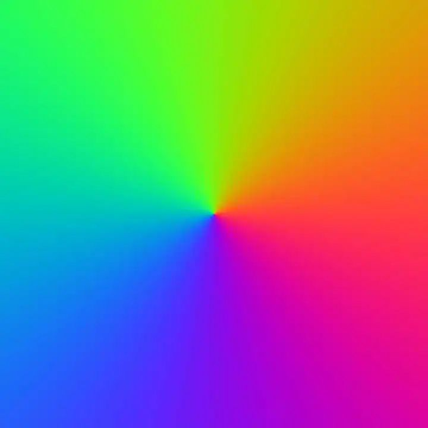
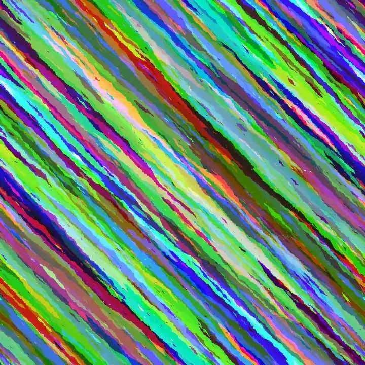
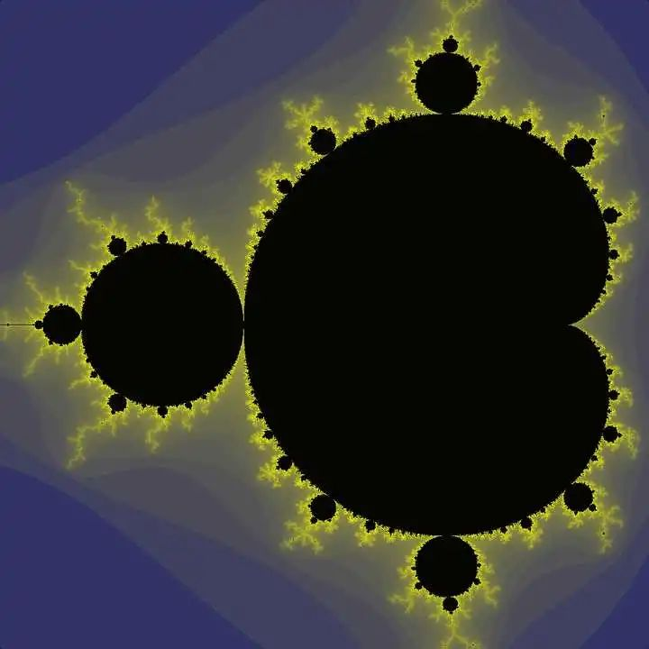
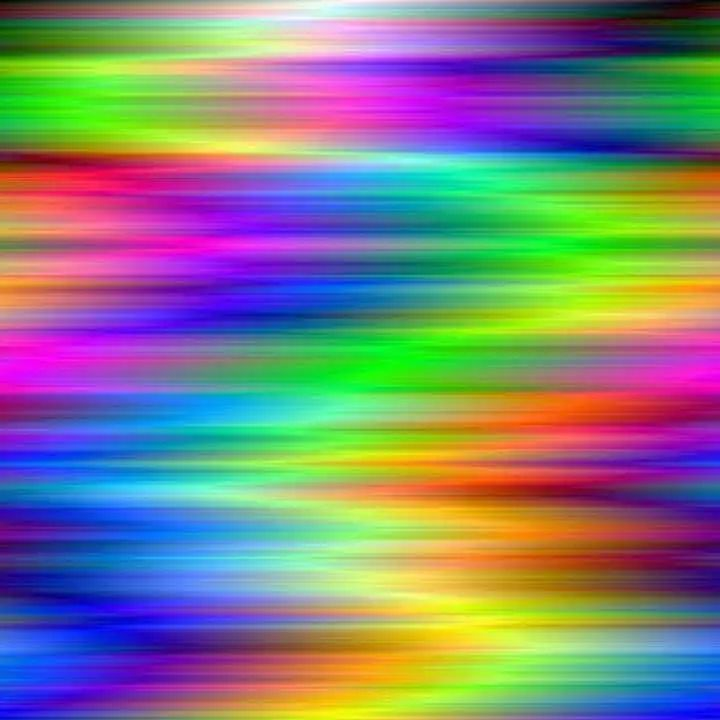
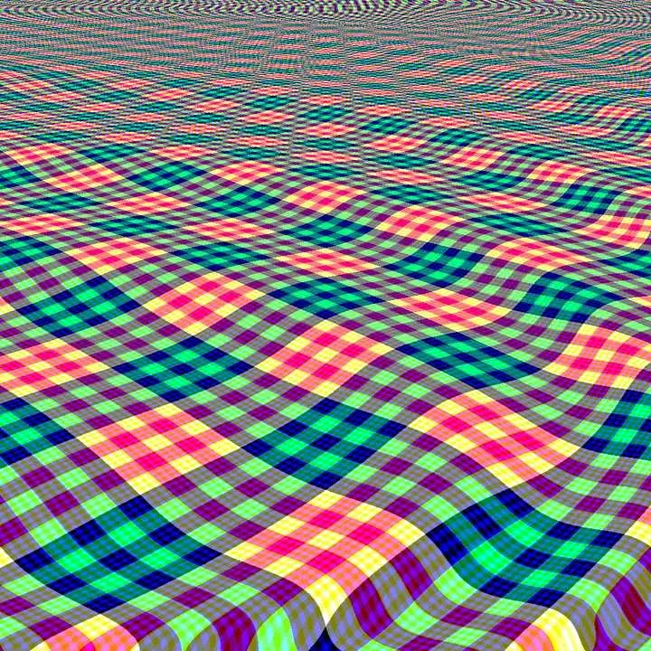
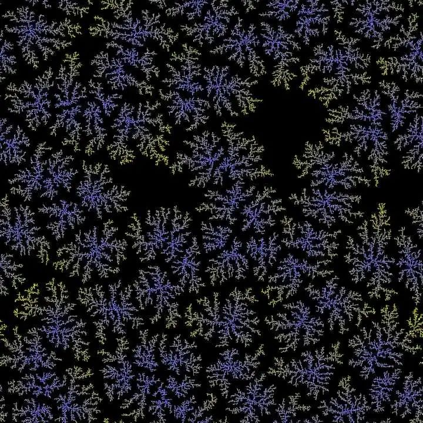
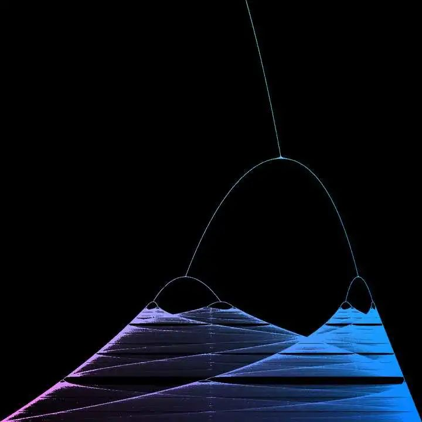

国外有个大佬在StackExchange上发起了一个叫做 Tweetable Mathematical Art 的比赛。

参赛者需要用C++编写代表三原色的RD、GR、BL三个函数，每个函数都不能超过 **140** 个字符。每个函数都会接到 i 和 j 两个整型参数（0 ≤ i, j ≤ 1023），然后需要返回一个 0 到 255 之间的整数，表示位于 (i, j) 的像素点的颜色值。

举个例子，如果 RD(0, 0) 和 GR(0, 0) 返回的都是 0 ，但 BL(0, 0) 返回的是 255 ，那么图像的最左上角那个像素就是蓝色。

参赛者编写的代码会被插进下面这段程序当中，最终会生成一个大小为 1024×1024 的图片。

```cpp
// NOTE: compile with g++ filename.cpp -std=c++11
#include <iostream>
#include <cmath>
#include <cstdlib>
#define DIM 1024
#define DM1 (DIM-1)
#define _sq(x) ((x)*(x)) // square
#define _cb(x) abs((x)*(x)*(x)) // absolute value of cube
#define _cr(x) (unsigned char)(pow((x),1.0/3.0)) // cube root

unsigned char GR(int,int);
unsigned char BL(int,int);

unsigned char RD(int i,int j){
    // YOUR CODE HERE
}
unsigned char GR(int i,int j){
    // YOUR CODE HERE
}
unsigned char BL(int i,int j){
    // YOUR CODE HERE
}

void pixel_write(int,int);
FILE *fp;
int main(){
    fp = fopen("MathPic.ppm","wb");
    fprintf(fp, "P6\n%d %d\n255\n", DIM, DIM);
    for(int j=0;j<DIM;j++)
        for(int i=0;i<DIM;i++)
            pixel_write(i,j);
    fclose(fp);
    return 0;
}
void pixel_write(int i, int j){
    static unsigned char color[3];
    color[0] = RD(i,j)&255;
    color[1] = GR(i,j)&255;
    color[2] = BL(i,j)&255;
    fwrite(color, 1, 3, fp);
}
```
首先是一个来自 Martin Büttner 的作品：

<br />它的代码如下：

```cpp
unsigned char RD(int i,int j){
    return (char)(_sq(cos(atan2(j-512,i-512)/2))*255);
}

unsigned char GR(int i,int j){
    return (char)(_sq(cos(atan2(j-512,i-512)/2-2*acos(-1)/3))*255);
}

unsigned char BL(int i,int j){
    return (char)(_sq(cos(atan2(j-512,i-512)/2+2*acos(-1)/3))*255);
}
```
同样是来自 Martin Büttner 的作品：

<br />这是目前暂时排名第一的作品。它的代码如下：

```cpp
unsigned char RD(int i,int j){
#define r(n)(rand()%n)
static char c[1024][1024];
return!c[i][j]?c[i][j]=!r(999)?r(256):RD((i+r(2))%1024,(j+r(2))%1024):c[i][j];
}

unsigned char GR(int i,int j){
    static char c[1024][1024];
    return!c[i][j]?c[i][j]=!r(999)?r(256):GR((i+r(2))%1024,(j+r(2))%1024):c[i][j];
}

unsigned char BL(int i,int j){
    static char c[1024][1024];
    return!c[i][j]?c[i][j]=!r(999)?r(256):BL((i+r(2))%1024,(j+r(2))%1024):c[i][j];
}
```
下面这张图片仍然出自 Martin Büttner 之手：<br /><br />难以想象， Mandelbrot 分形图形居然可以只用这么一点代码画出：
```cpp
unsigned char RD(int i,int j){
    float x=0,y=0;int k;for(k=0;k++<256;){float a=x*x-y*y+(i-768.0)/512;y=2*x*y+(j-512.0)/512;x=a;if(x*x+y*y>4)break;}
    return log(k)*47;
}

unsigned char GR(int i,int j){
    float x=0,y=0;int k;for(k=0;k++<256;){float a=x*x-y*y+(i-768.0)/512;y=2*x*y+(j-512.0)/512;x=a;if(x*x+y*y>4)break;}
    return log(k)*47;
}

unsigned char BL(int i,int j){
    float x=0,y=0;int k;for(k=0;k++<256;){float a=x*x-y*y+(i-768.0)/512;y=2*x*y+(j-512.0)/512;x=a;if(x*x+y*y>4)break;}
    return 128-log(k)*23;
}
```
Manuel Kasten 也制作了一个 Mandelbrot 集的图片，与刚才不同的是，该图描绘的是 Mandelbrot 集在某处局部放大后的结果：<br /><br />它的代码如下：
```cpp
unsigned char RD(int i,int j){
    double a=0,b=0,c,d,n=0;
    while((c=a*a)+(d=b*b)<4&&n++<880)
        {b=2*a*b+j*8e-9-.645411;a=c-d+i*8e-9+.356888;}
    return 255*pow((n-80)/800,3.);
}

unsigned char GR(int i,int j){
    double a=0,b=0,c,d,n=0;
    while((c=a*a)+(d=b*b)<4&&n++<880)
        {b=2*a*b+j*8e-9-.645411;a=c-d+i*8e-9+.356888;}
    return 255*pow((n-80)/800,.7);
}

unsigned char BL(int i,int j){
    double a=0,b=0,c,d,n=0;
    while((c=a*a)+(d=b*b)<4&&n++<880)
        {b=2*a*b+j*8e-9-.645411;a=c-d+i*8e-9+.356888;}
    return 255*pow((n-80)/800,.5);
}
```
这是 Manuel Kasten 的另一作品：<br /><br />生成这张图片的代码很有意思：函数依靠 static 变量来控制绘画的进程，完全没有用到 i 和 j 这两个参数！
```cpp
unsigned char RD(int i,int j){
    static double k;k+=rand()/1./RAND_MAX;int l=k;l%=512;return l>255?511-l:l;
}

unsigned char GR(int i,int j){
    static double k;k+=rand()/1./RAND_MAX;int l=k;l%=512;return l>255?511-l:l;
}

unsigned char BL(int i,int j){
    static double k;k+=rand()/1./RAND_MAX;int l=k;l%=512;return l>255?511-l:l;
}
```
这是来自 githubphagocyte 的作品：

<br />它的代码如下：

```cpp
unsigned char RD(int i,int j){
    float s=3./(j+99);
    float y=(j+sin((i*i+_sq(j-700)*5)/100./DIM)*35)*s;
    return (int((i+DIM)*s+y)%2+int((DIM*2-i)*s+y)%2)*127;
}

unsigned char GR(int i,int j){
    float s=3./(j+99);
    float y=(j+sin((i*i+_sq(j-700)*5)/100./DIM)*35)*s;
    return (int(5*((i+DIM)*s+y))%2+int(5*((DIM*2-i)*s+y))%2)*127;
}

unsigned char BL(int i,int j){
    float s=3./(j+99);
    float y=(j+sin((i*i+_sq(j-700)*5)/100./DIM)*35)*s;
    return (int(29*((i+DIM)*s+y))%2+int(29*((DIM*2-i)*s+y))%2)*127;
}
```
这是来自 githubphagocyte 的另一个作品：

<br />这是一张使用 diffusion-limited aggregation 模型得到的图片，程序运行起来要耗费不少时间。代码很有意思：巧妙地利用宏定义，打破了函数与函数之间的界限，三段代码的字数限制便能合在一起使用了。

```cpp
unsigned char RD(int i,int j){
    #define D DIM
    #define M m[(x+D+(d==0)-(d==2))%D][(y+D+(d==1)-(d==3))%D]
    #define R rand()%D
    #define B m[x][y]
    return(i+j)?256-(BL(i,j))/2:0;
}

unsigned char GR(int i,int j){
    #define A static int m[D][D],e,x,y,d,c[4],f,n;if(i+j<1){for(d=D*D;d;d--){m[d%D][d/D]=d%6?0:rand()%2000?1:255;}for(n=1
    return RD(i,j);
}

unsigned char BL(int i,int j){
    A;n;n++){x=R;y=R;if(B==1){f=1;for(d=0;d<4;d++){c[d]=M;f=f<c[d]?c[d]:f;}if(f>2){B=f-1;}else{++e%=4;d=e;if(!c[e]){B=0;M=1;}}}}}return m[i][j];
}
```
最后这张图来自 Eric Tressler：

<br />这是由 logistic 映射得到的 Feigenbaum 分岔图。和刚才一样，对应的代码也巧妙地利用了宏定义来节省字符：

```cpp
unsigned char RD(int i,int j){
    #define A float a=0,b,k,r,x
    #define B int e,o
    #define C(x) x>255?255:x
    #define R return
    #define D DIM
    R BL(i,j)*(D-i)/D;
}

unsigned char GR(int i,int j){
    #define E DM1
    #define F static float
    #define G for(
    #define H r=a*1.6/D+2.4;x=1.0001*b/D
    R BL(i,j)*(D-j/2)/D;
}

unsigned char BL(int i,int j){
    F c[D][D];if(i+j<1){A;B;G;a<D;a+=0.1){G b=0;b<D;b++){H;G k=0;k<D;k++){x=r*x*(1-x);if(k>D/2){e=a;o=(E*x);c[e][o]+=0.01;}}}}}R C(c[j][i])*i/D;
}
```
短短几行代码，就能画出如此绚烂的图像。
