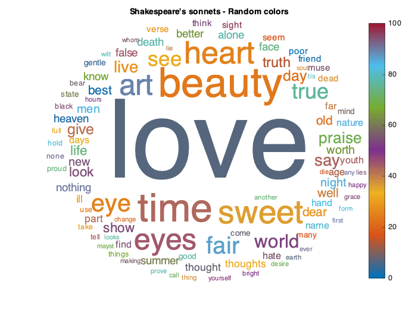
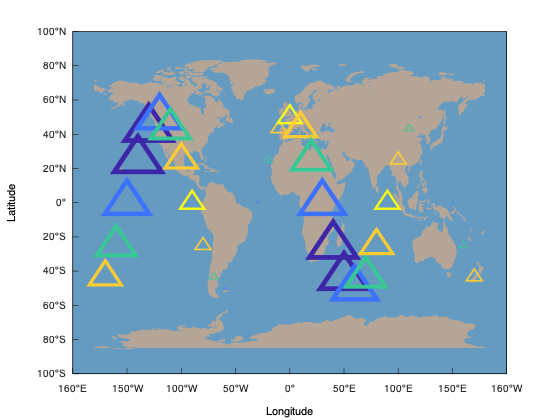
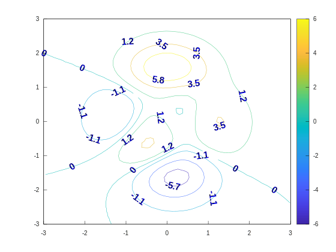
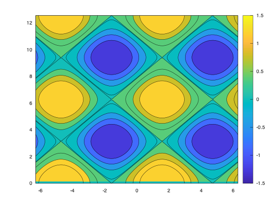
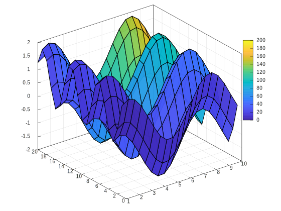
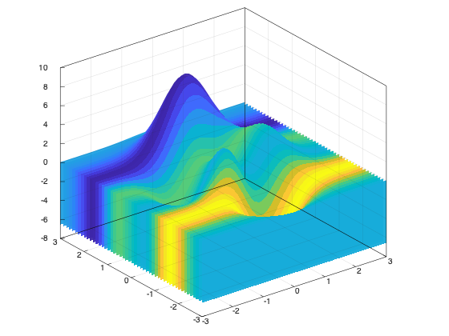
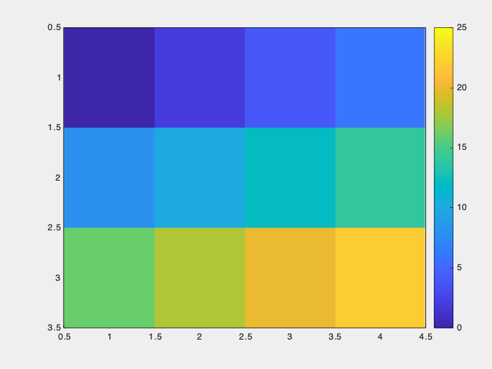
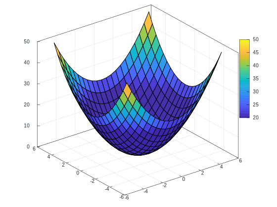
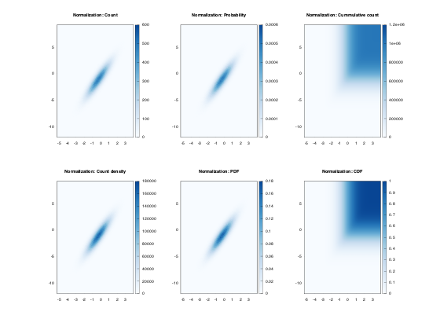

# C++

## Matplot++简单介绍
Matplot++作为C++的一个优秀可视化库，可绘制出高质量的可用于出版的图表，同时也可以应用C++的后端功能，提供几十种绘图类型，几乎囊括了常见出版要求的绘图种类。其默认颜色系也是使用了Matlab的**parula**颜色条，色彩使用更加鲜明和直观。更多详细内容可参考：[**Matplot++官网**](https://alandefreitas.github.io/matplotplusplus/)
## Matplot++样例推荐
Matplot++提供的绘图类型几乎包括了常见图表的所有类型，如下：

- Line Plots
- Data Distribution
- Discrete Data
- Geography
- Polar Plots
- Contour Plots
- Vector Fields
- Surfaces
- Graphs
- Images

下面举几个代表性的样例展示下，如下：

### 样例1：wordcloud

### 样例2：wordcloud

### 样例3：polarscatter

### 样例4：contour

### 样例5：contourf

### 样例6：surf

### 样例7：fence

### 样例8：image

### 样例9：colormap

### 样例10：binscatter
 以上就是简单的列举10副 Matplot++ 的可视化作品，更多详细例子看参考文末链接。

## 总结
推荐基于C++的可视化库Matplot++，主要看重其拥有以下特点：

- 丰富多样的图表类型；
- 适合学术出版的配色和绘图风格；

## 参考资料
**Matplot++官网：**[https://alandefreitas.github.io/matplotplusplus/](https://alandefreitas.github.io/matplotplusplus/)
