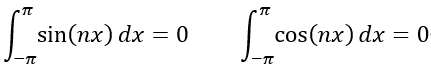
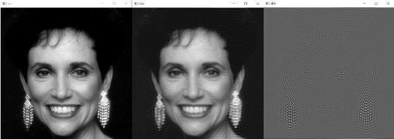

# C++

<a name="h1Dbo"></a>

## 引言
来推导公式。
<a name="gGfuS"></a>
## 1、傅里叶级数
**周期为T的连续变量t的周期函数f(t)，可表示为乘以适当系数的正弦函数和余弦函数之和。**这个和就是**傅里叶级数**，其形式为<br /><br />式中，Cn是傅里叶级数

<br />从上式可知，**若要将一个周期信号展开为傅里叶级数形式，实际上就是确定级数，接下来讨论如何求出cn**。
<a name="ajXmm"></a>
### 1.1 三角函数正交性
**三角函数是周期函数，其在-π到π的积分必定为0**，即<br /><br />由三角函数的积化和差公式，可以继续推导出下列公式<br /><br />因为三角函数在-π到π内的积分为0，因此当m≠n时上面三个式子必定为0，因此可以得出以下结论，**频率不同的三角函数相乘在一个周期内(-π到π)的积分必定为0**。<br />**假设一函数f(t)由一个直流分量和若干正余弦函数组成**<br /><br />在上式两边同时乘以sin⁡(kωt)，并对它们在一个周期内进行积分，可得<br /><br />化简得<br /><br />因此，可得**bn**，同理也可得**an**<br />
<a name="BfQ6j"></a>
### 1.2 欧拉公式与傅里叶级数
根据**欧拉公式**<br /><br />当θ=nωt和θ=-nωt时，<br /><br />将这两项代入傅里叶级数<br /><br />**当n=0时**，代入上一小节得到的a0

**当n=1,2,3,...时**，代入an，bn<br /><br />**当n=-1,-2,-3,...时**，代入an，bn<br /><br />可以看出，**对于任意的n，所有Cn的表达式都是一样的**，傅里叶级数最终可以写为：<br /><br />得证。
<a name="tI6gb"></a>
## 2、傅里叶变换
<a name="tiHmx"></a>
### 2.1 连续傅里叶变换
傅立叶级数是针对周期函数的，而**傅里叶变换针对非周期函数**，**一个非周期函数可以看做周期无限大的函数**。当T趋于无穷大时，频率间隔ω=2π/T趋于无穷小;Δω=(n+1)ω-nω=ω=2π/T，因此Δω也趋于0，1/T=Δω/2π;ΣΔω可以写成积分的形式∫dω。以nω为变量，当ω不等于0时，nω为离散值，，但当ω趋于无穷小时，**nω就变成连续的量**，令nω=W。<br /><br />将这个式子中标红的部分称作**函数f(t)的傅里叶变换，记作F(w)**，即<br /><br />而原始函数f(t)可以写为

<br />称之为**傅里叶反变换**。<br />二维连续函数f(x,y)的傅里叶正变换为<br /><br />相应的傅里叶逆变换公式为<br />
<a name="vp0EC"></a>
### 2.2 离散傅里叶变换
实际的信号往往是离散且有限的，在这种受限下要用到**离散傅里叶变换**（Discrete Fourier Transform简称DFT)。首先，假设采集了N个信号点，其时间为t0, t1, ... , tN-1，对应的信号值为f(t0), f(t1), ... , f(tN-1)。信号连续的时候是积分，现在数据离散了用累加，于是<br /> <br />可以发现，原信号有N个数据点，DFT变换后的信号却变成连续的了，将之称为**离散时间傅里叶变换**（DISCRETE TIME FOURIER TRANSFORM，简称DTFT）。**DTFT有两个缺点**，第一，ω∈(−∞,+∞)且连续，**需要进行无数次计算**，计算机无法计算；第二，在进行计算的时候，**需要已知t0, t1, ... , tN-1，和f(t0), f(t1), ... , f(tN-1)**，但是FFT函数只需要已知f(t0), f(t1), ... , f(tN-1)就可以进行。<br />可以采用相对时间n=0,1,...,N-1来代替真实采样时间t0, t1, ... , tN-1，可以得到<br /><br />此时发现F(ω)变成了以2π为周期的函数，即<br /><br />只需要计算ω∈(0,2π)区间的F(ω)，就可以得到ω∈(−∞,+∞)区间的F(ω)了。也就是说，通过使用相对采样时间n=0,1,...N−1代替真实采样时间t0, t1, ... , tN-1，将F(ω)的范围从(−∞,+∞)缩小到了(0,2π)。再将(0,2π)离散化为N个点，这样计算机就可以计算了，取ω=2πk/N，k=0,1,...N−1，得**离散傅里叶变换**DFT<br /><br />**二维离散函数f(x,y)的傅里叶正变换**的公式如下：<br />其中，u=0,1,2,...,M-1;v=0,1,2,...N-1。<br />相应的**傅里叶逆变换**的公式如下：<br /><br />其中，x=0,1,2,...,M-1;y=0,1,2,...N-1。<br />一维信号是一个序列，傅里叶变换将其分解成若干个一维的简单函数之和。二维信号可以说是一个图像，**二维傅里叶变换将图像分解成若干个复平面波之和**。通过上面的公式，可以计算出，每个平面波在图像重的成分是多少。从公式也可以看出，二维傅里叶变换就是将图像与每个不同频率的不同方向的复平面波做内积（先再求和），也就是一个求在基上投影的过程。**一维的正弦波可以通过三个参数确定，频率ω，幅度A和相位φ。因此在频域中，一维坐标表示频率，每个坐标对应的函数值F(ω)是一个复数，它的模|F(w)|就是幅度A，幅角∠F(w)就是相位。**而二维正弦平面波需要四个参数，其中三个和一维一样（**频率ω，幅度A和相位φ**），令一个是**方向n**。如下图所示，两个平面波仅在方向参数上不同：<br /><br />如何存储频率ω，幅度A，相位φ和方向n这些参数呢？和一维一样，**幅度和相位可以用一个复数表示，复数的模是幅度，幅角是相位**。向量有方向和长度，可以用来表示方向和频率。一个向量n=（u,v)，向量的模√u2+v2代表这个平面波的频率，方向是平面波的方向，在该点的值F(u,v)表示幅度和相位。包含所有（u,v)点的矩阵是K空间，如下图所示<br /><br />上图中，频谱图的中心为原点，即u=0，v=0，中间区域为低频，频率低周期大，条纹间隔宽，从中间向外，频率增大，平面波周期减小，条纹间隔小。图像区域灰度越高表示该频率平面波在图像中成分越多，由于低频表示图像灰度平稳区域，高频表示细节和边缘，所以图像主要是低频，频谱图中间灰度较高。在不同象限的点所代表的平面波方向不同。链接中有很多**图像的二维傅里叶变换频谱图**，可以验证下自己弄懂了没。
<a name="g8wj9"></a>
## 3、应用
**二维离散傅里叶变换**(Two-Dimensional Discrete Fourier Transform)是一种数字变换方法，一般应用于**将图像从空间域转至频域**，在**图像增强**、**图像去噪**、**图像边缘检测**、**图像特征提取**、**图像压缩**等等应用中都起着极其重要的作用。
<a name="meDvf"></a>
### 3.1 频域滤波
图像实质上是二维矩阵。将空间域（二维灰度数表）的图像转换到频域（频率数表）能够更直观地观察和处理图像，也更有利于进行频域滤波等操作。在博客**图像增强**中介绍了不少常用的低通滤波器，也在博客**傅里叶变换**中介绍过OpenCV中傅里叶变换的写法。接下来的这个示例和之前的写法有些不同。<br />**示例 频域滤波**
```cpp
#include <opencv2/opencv.hpp>
using namespace cv;
using namespace std;
 
int main() {   
    clock_t start = clock();
    Mat src = imread("E:/C++projects/CH11/CH11/5.png", 0);
    imshow("src", src);
    // 填充到傅里叶变换最佳尺寸 （gpu下加速明显）
    int h = getOptimalDFTSize(src.rows);
    int w = getOptimalDFTSize(src.cols);
    Mat padded;
    copyMakeBorder(src, padded, 0, h - src.rows, 0, w - src.cols, BORDER_CONSTANT, Scalar::all(0));
    Mat pMat = Mat(padded.size(), CV_32FC1);
     
    // 中心化 （在时域做中心化，傅里叶变换后的频谱图低频在中心）
    for (int i = 0; i < padded.rows; i++)
    {
        for (int j = 0; j < padded.cols; j++)
        {
            pMat.at<float>(i, j) = pow(-1, i + j) * padded.at<uchar>(i, j);
        }
    }   
     
    // 傅里叶变换
    Mat planes[] = { pMat, Mat::zeros(padded.size(), CV_32F) };
    Mat complexImg;
    merge(planes, 2, complexImg);
    dft(complexImg, complexImg, DFT_COMPLEX_OUTPUT);
 
    // 显示频谱图
    split(complexImg, planes);
    Mat magMat;
    magnitude(planes[0], planes[1], magMat);
    magMat += 1;
    log(magMat, magMat);
    normalize(magMat, magMat, 0, 255, NORM_MINMAX);
    magMat.convertTo(magMat, CV_8UC1);
 
    // 低通滤波
    //Mat mask(Size(w, h), CV_32FC2, Scalar(0, 0));
    //circle(mask, Point(w / 2, h / 2), 50, Scalar(255, 255), -1);
    //complexImg = complexImg.mul(mask);
 
    //高通滤波
    Mat mask(Size(w, h), CV_32FC2, Scalar(255, 255));
    circle(mask, Point(w / 2, h / 2), 50, Scalar(0, 0), -1);
    complexImg = complexImg.mul(mask);
 
    // 傅里叶反变换
    Mat dst, tmp;
    idft(complexImg, tmp, DFT_REAL_OUTPUT);
     
    // 去中心化
    for (int i = 0; i < padded.rows; i++)
    {
        for (int j = 0; j < padded.cols; j++)
        {
            pMat.at<float>(i, j) = pow(-1, i + j) * tmp.at<float>(i, j);
        }
    }
    dst = pMat({ 0,0,src.cols ,src.rows }).clone();
    normalize(dst, dst, 0, 1, NORM_MINMAX);
    dst.convertTo(dst, CV_8U, 255);
    imshow("dst", dst);
    clock_t end = clock();
    cout << "spend time:" << end - start << "ms" << endl;
    waitKey(0);
    return 0;
}
```
<br />不知道有没有人发现，是中心化的方法不一样。之前是在频域做的中心化，这次是在时域做中心化→傅里叶变换→滤波→傅里叶逆变换→去中心化。这是傅里叶变换的平移性质，在第4节会详细讲解下。
<a name="hKqrI"></a>
### 3.2 加速滤波计算
用大小为m×n元素的核对大小为M×N的图像进行滤波时，需要的运算次数为MNmn（乘法和加法）。如果核是可分离的，那么运算次数可减少为MN(m+n)。在频率域中执行等效滤波所需要的运算次数仅为2MNlog2MN，前面的系数2表示要计算一次正FFT和一次反FFT。<br />为说明频率域滤波相对于空间滤波的计算优势，分别考虑大小为M×M的方形图像与m×m的核。采用不可分离的核所需的运算次数为M2m2，采用可分离的核所需的运算次数为2M2m，而采用FFT对这种图像滤波所需的运算次数为2M2log2M2，定义FFT方法的计算优势为<br /><br />两种情况下，当C(m)>1时，FFT方法的计算优势更大（根据计算次数）；而当C(m)≤1时，空间滤波的优势更大。下图显示了中等大小图像(M=2048)的Cn(m)与m的曲线关系。对于7×7或更大的核，FFT具有计算优势。这一优势随着m的增大而迅速增大，例如m=101时计算优势超过200，而m=201时计算优势接近1000.下面说明这一优势的含义。如果用FFT对大小为2048×2048的一组图像进行滤波需要1分钟，那么用大小为201×201元素的不可分离核对同一组图像滤波要17小时。这一差异非常明显，因此清楚地表明了使用FFT进行频率域处理的重要性。<br />
<a name="WTTPZ"></a>
### 3.3 倾斜文本校正
对于分行的文本，其频率谱上一定会有一定的特征，当图像旋转时，其频谱也会同步旋转，因此找出这个特征的倾角，就可以将图像旋转校正回去。这是**二维傅里叶变换的旋转性质**，傅里叶变换对<br /><br />使用极坐标<br /><br />可得到如下变换对<br /><br />它指出，若f(x,y)旋转θ0角度，则F(u,v)也旋转相同的角度。反之，若F(u,v)旋转某个角度，f(x,y)也旋转相同的角度。<br />**示例 倾斜文本校正**
```cpp
#include <opencv2/opencv.hpp>
using namespace cv;
using namespace std;
 
double point2Line(Point2f pointP, Point2f pointA, Point2f pointB)
{
    //求直线方程
    double A = 0, B = 0, C = 0;
    A = pointA.y - pointB.y;
    B = pointB.x - pointA.x;
    C = pointA.x * pointB.y - pointA.y * pointB.x;
    //代入点到直线距离公式
    double distance = 0;
    double tmp1 = abs(A * pointP.x + B * pointP.y + C);
    double tmp2 = ((float)sqrtf(A * A + B * B));
    distance = tmp1 / tmp2;
    return distance;
}
int main() {
    vector<string> filenames;
    glob("./", filenames);
    for (int n = 0; n < filenames.size(); n++) {
        string filename = filenames[n];
        Mat src = imread(filename, 0);
        // 填充到傅里叶变换的最佳尺寸
        int h = getOptimalDFTSize(src.rows);
        int w = getOptimalDFTSize(src.cols);
        Mat padded;
        copyMakeBorder(src, padded, 0, h - src.rows, 0, w - src.cols, BORDER_CONSTANT, Scalar::all(0));
        // 傅里叶变换
        Mat planes[] = { Mat_<float>(padded), Mat::zeros(padded.size(), CV_32F) };
        Mat complexImg;
        merge(planes, 2, complexImg);
        dft(complexImg, complexImg, DFT_COMPLEX_INPUT | DFT_COMPLEX_OUTPUT);
        // 求幅值
        split(complexImg, planes);
        Mat magMat;
        magnitude(planes[0], planes[1], magMat);
        magMat += 1;
        log(magMat, magMat);
        normalize(magMat, magMat, 0, 255, NORM_MINMAX);
        magMat.convertTo(magMat, CV_8UC1);
        // 把零频移到中心
        Mat magImg = magMat.clone();
        int cx = magImg.cols / 2;
        int cy = magImg.rows / 2;
        Mat q1 = magImg({ 0, 0, cx, cy });
        Mat q2 = magImg({ 0, cy, cx, cy });
        Mat q3 = magImg({ cx, 0, cx, cy });
        Mat q4 = magImg({ cx, cy, cx, cy });
        Mat temp;
        q1.copyTo(temp);
        q4.copyTo(q1);
        temp.copyTo(q4);
        q2.copyTo(temp);
        q3.copyTo(q2);
        temp.copyTo(q3);
        // 霍夫直线检测有角度的斜线
        Mat binImg;
        threshold(magImg, binImg, 150, 255, THRESH_BINARY);
        Mat markImg;
        cvtColor(binImg, markImg, COLOR_GRAY2BGR);
        vector<Vec4i> lines;
        Vec4i l;
        HoughLinesP(binImg, lines, 1, CV_PI / 180.0, 30, 200, 50);
        Point2f p = Point2f(magImg.cols / 2.0, magImg.rows / 2.0);
        for (int i = 0; i < lines.size(); i++)
        {
            if (abs(lines[i][1] - lines[i][3]) > 15) {
                line(markImg, Point(lines[i][0], lines[i][1]), Point(lines[i][2], lines[i][3]), Scalar(0, 255, 0), 1, 8, 0);
                l = lines[i];
            }
        }
        float theta = atan((l[1] - l[3]) * 1.0 / (l[0] - l[2]) * src.cols / src.rows) * 180 / CV_PI;
        float angle = theta <= 0 ? theta + 90 : theta - 90;
        // 放射变换
        Point2f center = Point2f(src.cols / 2.0, src.rows / 2.0);
        Mat rotMat = getRotationMatrix2D(center, angle, 1.0);
        Mat dst = Mat::ones(src.size(), CV_8UC1);
        warpAffine(src, dst, rotMat, src.size(), 1, 0, Scalar(255, 255, 255));
        imshow("src", src);
        imshow("markImg", markImg);
        imshow("dst", dst);
        waitKey(0);
    }
    return 0;
}
```

<a name="ip640"></a>
## 4、Q&A
<a name="UsHLD"></a>
### Q：为什么要中心化？如何中心化？
直接对数字图像进行二维DFT变换得到的频谱图是高频在中间，低频在四角。为了把能量（在低频）集中起来便于使用滤波器，可以利用**二维DFT的平移性质**对频谱进行中心化。频谱图比较亮的地方是低频，图像的能量一般都是集中在低频部分。中心化不是必须的，主要是为了方便理解和滤波。<br /><br />根据**二维傅里叶的平移性质**，用<=>表示函数和其傅里叶变换的对应性<br /><br />第一个公式表明，将f(x,y)与一个指数项相乘就相当于把其变换后的频域中心移动到新的位置。第二个公式表明将F(u,v)与一个指数项相乘就相当于把其变换后的空域中心移到新的位置，同时可以看出对f(x,y)的平移不会影响其傅里叶变换的幅值。将u0=M/2和v0=N/2代入第一个公式，指数部分就变为<br /><br />代入上面的公式<br /><br />也就是说，对数字图像的每个像素点的取值直接乘以(-1)^(x+y)，x和y是像素坐标。这之后再做傅里叶变换，最后即为中心化后的傅里叶变换。和在频域移动M/2和N/2一样的效果。
<a name="PYfBF"></a>
### **Q：为什么用图像二维傅里叶变换的相位谱进行反变换，能够大致得到原图的形状，而幅度谱则不行呢？**
k空间中储存的是一个复数，其幅度代表平面波的波动的大小，相位代表平面波的相位也就是偏离原点的多少。从k空间回复图像的时候，是将每个复平面乘上对应的复系数，相加而成。可以分为两步：（1）乘上波动大小（幅度）（2）移动相应的距离（相位）<br /><br />**示例 谱和相角对图像信息的贡献**<br />只用相角重建男孩图像，就是令|F(u,v)|=1，可以看出，图像丢失了灰度信息，但有形状特征。只使用谱重建，这意味着指数项为1，也就是令相角为0，此时结果中值包含灰度信息，没有形状信息。最后两张图显示了相位在确定图像空间特征内容方面的优势。
```cpp
...
Mat planes[] = { Mat_<float>(padded), Mat::zeros(padded.size(), CV_32F) };
Mat complexImg;
merge(planes, 2, complexImg);
dft(complexImg, complexImg, DFT_COMPLEX_OUTPUT);
split(complexImg, planes);
Mat magMat;
magnitude(planes[0], planes[1], magMat);
// 相角重建
//divide(planes[0], magMat, planes[0]);
//divide(planes[1], magMat, planes[1]);
//谱重建
planes[0] = magMat;
planes[1] = Mat::zeros(padded.size(), CV_32F);
merge(planes, 2, complexImg);
Mat dst, tmp;
idft(complexImg, tmp, DFT_REAL_OUTPUT);
...
```

<a name="LKQzM"></a>
### Q：傅里叶变换为什么要填充0？
A: (1)提升运算性能；(2)时域补零相当于频域插值，补零操作增加了频域的插值点数，让频域曲线看起来更加光滑，也就是增加了FFT频率分辨率。从傅里叶变换公式可以看出，频域的点数和时域的点数是一样的，时域补零后，采样点增加。
<a name="GVfa4"></a>
### Q：什么是频率（谱）泄漏？
频率泄漏是指傅里叶变换后的频谱中出现了本不该有的频率分量。原来的信号的序列我们认为是无限长的，但要分析某个信号的频谱的时候只能对它有限长度的序列进行分析，相当于时域上对它进行了加窗，类似于盒式函数乘上f(t)，在频率域中这一相乘意味着原变换与一个sinc函数的卷积，进而导致由sinc函数的高频分量产生所谓的频率泄漏。归根结底，频率泄漏的原因就是加窗导致的序列长度有限。<br /><br />频率泄漏会使得图像块效应。虽然频率泄漏无法完全消除，但让取样后的函数乘以另一个两端平滑地过渡到0的函数，可明显降低频率泄漏。这个想法是为了抑制“盒式函数”的急剧过渡。
