# C++

<a name="MpBTc"></a>

## 引言
1987年，小波被证明是多分辨率信号处理和分析的基础。多分辨率理论融合并统一了来自不同学科的技术，包括来自信号处理的子带编码、来自数字语音识别的正交镜像滤波及金字塔图像处理。顾名思义，多分辨率理论涉及多个分辨率下的信号（或图像）表示与分析。<br />Haar-like特征是计算机视觉领域一种常用的特征描述算子，也称为Haar特征，这是因为Haar-like是受到一维haar小波的启示而发明的，所以称为类Haar特征。
<a name="zVbEa"></a>
## 1、从傅里叶变换到小波变换
<a name="bsUN3"></a>
### 1.1 傅里叶变换
对于大多数信号而言， 傅立叶分析绝对是非常有用的，因为频率分析在大多数情况下都非常重要。 那么为什么我们还需要研究短时傅里叶变换呢（STFT）？原因是因为**傅立叶分析有一个非常严重的缺点，** **在将信号从时间域变换到频率域去的时候，把时间信息丢失了**。 当我们在用傅立叶变化去分析一个具体信号的时候， 我们不知道哪个频率是对应在哪个时间点出现的，在哪个时间点消失的。假设有两个信号，这两个信号都是由sin(t)和sin(5t)组成的，y1是先出现了sin(5t)，再出现了sin(t)，y2是先出现了sin(t)，再出现了sin(5t)。<br />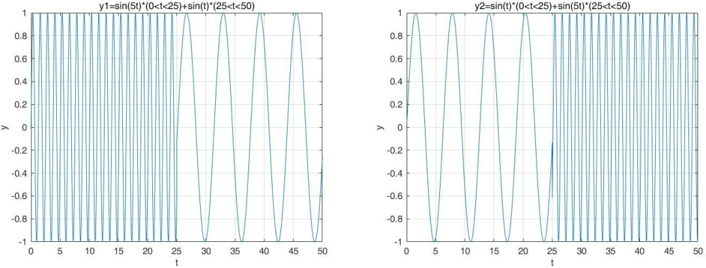<br />进行傅里叶变换后的频谱为<br />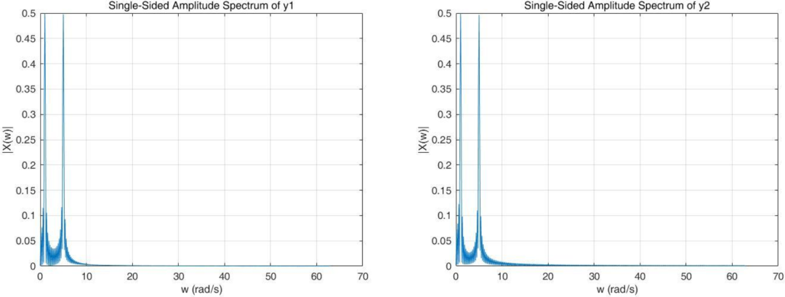<br />可以看出，变换后的结果是一模一样的，都在w=1rad/s和w=5rad/s出现了峰值，这就可以说明FT的缺点了——FT只能提供频域信息，而完全丢失了时域信息。不管某一频率的信号出现的时间是早还是晚，FT都是将它一视同仁地乘上sin和cos(FT的变换基函数)，然后在整个时间区间加和。因此，它**不能提供某一频率信号出现的时间**。如果一个信号的频率并不随着时间变化， 那么我们称它为平稳信号。 那么知道哪一个频率的信号在哪一个时间点出现的就不那么重要了。可是如果现实生活中我们研究的大多数信号都是**非平稳信号**，他们都许多非常短暂变化的特性， 这些特点对于我们信号分析的特点，傅立叶分析并不适合去做这种分析，而**短时傅里叶变换**则可以。
<a name="dZ2tj"></a>
### 1.2 短时傅里叶变换
我们将信号从中间截断，左边进行一次FT，右边进行一次FT，便可以得到，在y1中(0, 25)的信号是5rad/s的频率，(25, 50)的信号是5rad/s的频率，y2恰好相反。这就是**短时傅里叶变换**的基本原理。截断的方法在专业上将叫**分窗**——有一个窗子在信号上从左向右滑动，每次只能看到信号的一部分，相当于把整个时域过程分解成无数个等长的小过程，再傅里叶变换，就知道在哪个时间点上出现了什么频率了。<br />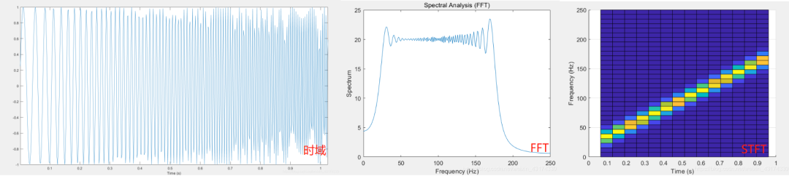<br />短时傅里叶变换输出为三维图形，分别为时间、频率、强度三个轴（颜色即为对应时间、频率下的信号强度），时间频率轴上可明显观察到该信号的频率成分，随时间逐渐由20Hz线性增加到100Hz。<br />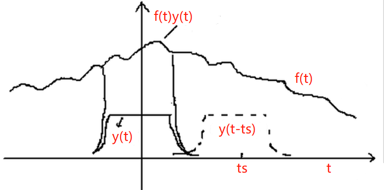<br />定义方窗函数为ywindow，窗长为width，将方窗函数向右平移了ts，再与原信号相乘，由于方窗函数除了中心的width部分是1外，其他部分都是0，这就相当于提取出了原信号在t=ts处，宽度为width的部分。因此，**短时傅里叶变换**可以表示为<br />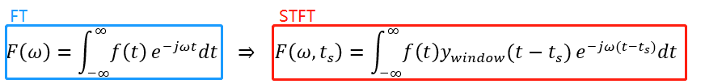<br />这里之所以e−jωt要变成e−jω(t−ts)，是为了保证做FT的时候相乘的基函数具有统一性。<br />在线性代数中，基是描述、刻画向量空间的基本工具。向量空间的基是它的一个特殊的子集，基的元素称为基向量。向量空间中任意一个元素，都可以唯一地表示成基向量的线性组合。比如，向量空间的一个向量可以分解在x，y方向，同时在各个方向定义单位向量e1、e2，这样任意一个向量都可以表示为a=xe1+ye2，这是二维空间的基。<br />在变换中，我们将原始信号乘上的信号称为基函数。在傅里叶变换中，e-jwt是这个变换的基函数。**STFT将基函数乘上一个方窗函数，形成了一个新的基函数**：<br />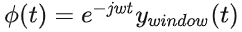<br />假设用正弦函数sin(5t)表示原来的基函数e−jwt ，那么FT基函数和STFT基函数如下：<br />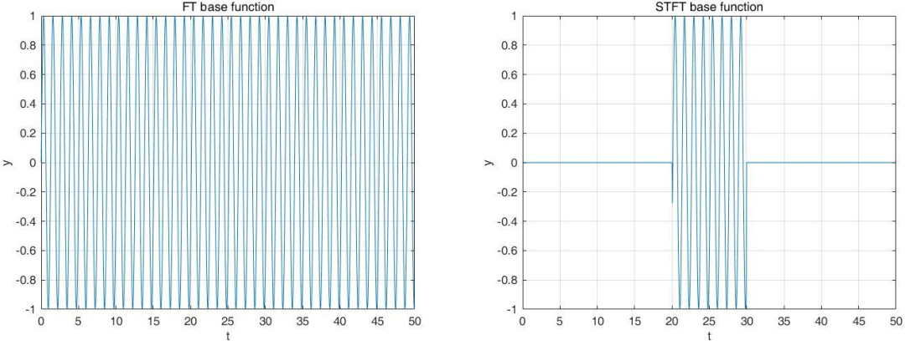<br />FT的基函数是在时域无限延伸的，因此，无论怎么平移，都是任分布在整个时域的，起不到分窗的作用。而STFT的基函数只在时域一段不为0，在剩下的时域都是0，因此，STFT的基函数的平移，就相当于自动加了窗子。STFT的本质是基函数的改变。<br />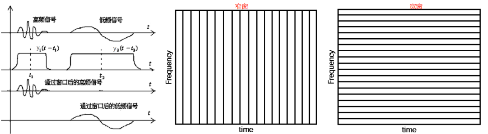<br />**海森堡测不准原理**： ΔtΔf>C，Δt为信号的时间不确定度，Δf为信号的频率不确定度。即，我们永远无法同时确定一个信号的确切时间和确切频率。

- 对于**低频信号**，为了更好地确定频率，我们希望，时域区间宽一些，即时间不确定度Δt大一些，根据海森堡测不准原理，频率不确定度Δf自然小一些；即低频信号，我们希望：宽窗子，**低的时域分辨率，高的频域分辨率**。
- 对于**高频信号**，为了更好地在时域定位，我们希望，时域区间窄一些，即时间不确定度Δt小一些，根据海森堡测不准原理，频率不确定度Δf自然大一些；即高频信号，我们希望：窄窗子，**高的时域分辨率，低的频域分辨率**。

所以，对于时变非稳态信号，高频部分适合用小窗(短周期)，低频部分适合用大窗(长周期)。然而，在一次STFT中，窗口的宽度是固定，即时域分辨率是固定的，根据海森堡测不准原理，其频域分辨率也是固定的。也就是说，不论高频低频，其**时域和频域分辨率都不可调**，这是STFT的缺点。
<a name="Twbql"></a>
### 1.3 连续小波变换
小波分析在时间域和频率域同时具有良好的局部化性质，即在低频部分具有较高的频率分辨率和较低的时间分辨率，在高频部分具有较高的时间分辨率和较低的频率分辨率，因此有“显微镜”之称。小波变换具有对信号的自适应能力，因而比傅里叶分析更适合处理非平稳信号。小波做的改变就在于，将无限长的三角函数基换成了有限长的会衰减的小波基。<br />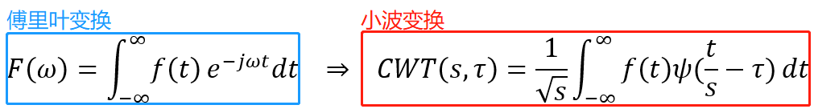<br />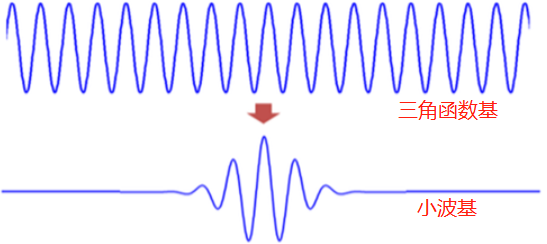<br />从公式可以看出，不同于傅里叶变换，变量只有频率ω，小波变换有两个变量：尺度a(scale)和平移量τ(translation)。尺度a控制小波函数的伸缩，平移量τ控制小波函数的平移。尺度就对应于频率（反比），平移量τ就对应于时间。比如下图，中间的小波s较小，相当于挤压；右边的s较大，相当于拉伸。<br />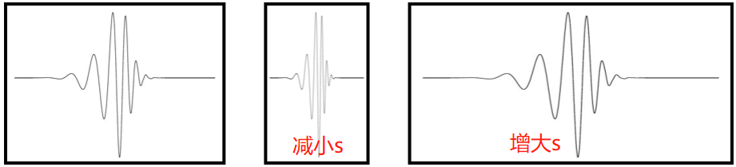<br />根据上面讲的，滑动相当于分窗，窗的长度是基函数不为零的长度。中间的图，s较小，相当于挤压，频率提高了，窗长变小了。右侧的图，s较大，相当于拉伸，频率降低了，窗长变大了。正是我们需要的动态分辨率---低频，宽窗，差的时间分辨率，好的频域分辨率；高频，窄窗，好的时间分辨率，差的频域分辨率。<br />**CWT的变换过程**<br />Step1：把小波ψ(t)和原始信号f(t)的开始部分进行比较，计算系数C。系数C表示该部分信号与小波的近似程度，C的值越高表示信号与小波越相似。<br />Step2：把小波向右移，距离为τ，得到小波ψ(t-τ)，重复步骤1。再把小波右移，得到小波ψ(t-2τ)，重复步骤1。按上述步骤一直重复下去，知道信号f(t)结束。<br />Step3：拓展小波ψ(t)，例如扩展一倍，得到的小波函数ψ(t/s)，重复步骤1-2。

Step4：重复步骤1-3。<br />接下来我们对一个信号就行一次连续小波变换（CWT）。下图中蓝色部分为小波函数，黄色部分为信号。<br />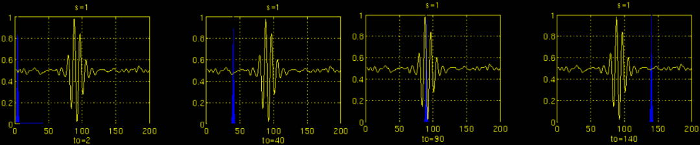<br />如上图，选择较小的s 对小波母函数进行缩放，此时小波函数频率较高，窗子较窄（小波函数不为0的部分窄），用来筛选高频部分。小波函数在时间轴上平移，每一次平移就先相乘，再积分，筛选出信号中与自己频率相近的部分。此时，窗子较窄（小波函数不为0的部分窄），时间分辨率好，频率分辨率差。<br />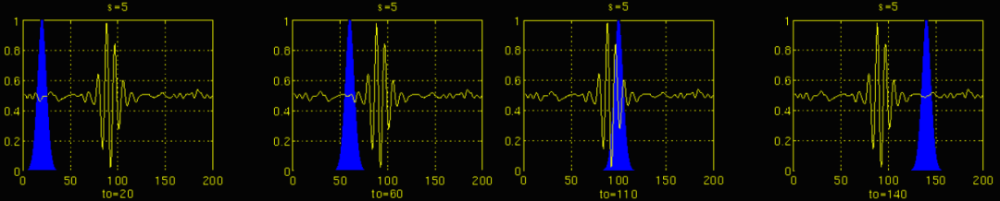<br />如上图，将s 增大，对小波母函数进行缩放，此时小波函数频率降低，窗子变宽（小波函数不为0的部分变宽），用来筛选中频部分。小波函数在时间轴上平移，每一次平移就先相乘，再积分，筛选出信号中与自己频率相近的部分。此时，窗子变宽了（小波函数不为0的部分变宽），时间分辨率变差，频率分辨率变好。<br /><br />如上图，将s 进一步增大，对小波母函数进行缩放，此时小波函数频率再次降低，窗子更宽（小波函数不为0的部分更宽），用来筛选低频部分。小波函数在时间轴上平移，每一次平移就先相乘，再积分，筛选出信号中与自己频率相近的部分。此时，窗子很宽（小波函数不为0的部分很宽），时间分辨率差，频率分辨率很好。
<a name="wlhVA"></a>
### 1.4 总结
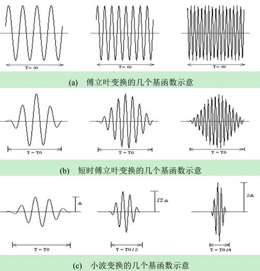

- FT的基函数，是分布在(−∞,+∞)的sin,cos，不具有紧支撑性，只能筛选频率，使得FT完全丧失了时间信息，不具有时间分辨率。
- STFT的基函数，是用窗函数截断的sin,cos （图中是被高斯窗截断的），具有了紧支撑性，时域平移等同于分窗，使得STFT既能筛选频率，也能筛选时间。但是STFT基函数是：先确定频率，再与窗函数相乘构成的。因此不同的频率，具有同样的时间和频率分辨率。另外，窗函数的长短也比较难以确定。
- CWT的基函数，是小波函数，具有紧支撑性，时域平移等同于分窗，使得CWT既能筛选频率，也能筛选时间。小波函数在改变频率的时候，是通过“缩放”实现的，这使得小波函数在改变频率的同时，改变了窗长。因此不同的频率，具有不同的时间和频率分辨率，实现了分辨率动态可调。

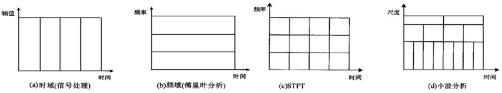
<a name="Qzn8l"></a>
## 2、从小波变换到haar小波
<a name="KDztS"></a>
### 2.1 离散小波变换
离散小波变换是对**基本小波的尺度和平移进行离散化**。为了解决计算量问题，缩放因子和平移参数都选择2j的倍数。执行离散小波变换的有效方法是使用滤波器。该方法时Mallat再1988年开发的，叫做**Mallat算法**。这种方法实际上是一种信号的分解方法，在数字信号处理中称为双通道子带编码。<br />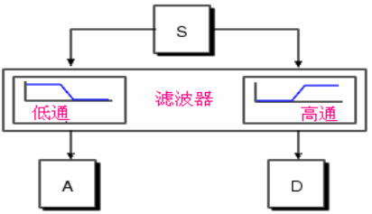<br />首先将原始信号作为输入信号，**通过一组正交的小波基分解成高频部分和低频部分**，**A表示信号的近似值（approximations）**，是大的缩放因子产生的系数，表示信号的低频分量。**D表示信号的细节值(detail)**，是小的缩放因子产生的系数，表示信号的高频分量。然后将得到的**低频部分作为输入信号，又进行小波分解**，得到下一级的高频部分和低频部分，以此类推。随着小波分解的级数增加，其在频域上的分辨率就越高。这就是多分辨率分析（MRA，MultiResolution Analysis）。<br />离散小波变换可以被表示成由低通滤波器和高通滤波器组成的一棵树。原始信号通过这样的一对滤波器进行的分解叫做一级分解。信号的分解过程可以进行多级分解，分解级数的多少取决于要被分析的数据和用户的需要。**小波分解树只对信号的低频分量进行连续分解**。**把分解的系数还原成原始信号的过程叫做小波重构**，数学上叫做逆离散小波变换。<br />任何小波变换的基函数，其实就是对**母小波和父小波缩放和平移的集合**。缩放倍数都是2的级数，平移的大小和当前其缩放的程度有关。小波系统有很多种，不同的母小波，衍生的小波基就完全不同。小波展开的近似形式是这样的：<br /><br />其中的ψj,k(t)就是小波级数，这些级数的组合就形成了小波变换中的基。
<a name="nTzaG"></a>
### 2.2 haar小波函数
最简单的基函数是**haar基函数**，是由一组分段常值函数组成的函数集合，其**父小波**，也叫**尺度函数（scaling function）**<br />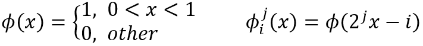<br />其中，i=0,1,...,(2j-1)。j是尺度因子，改变j使函数图形缩小或者放大；i为平移参数，改变i使函数沿x轴方向平移。<br />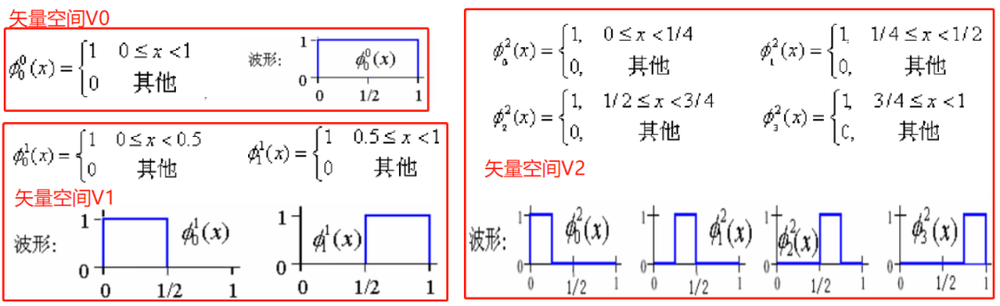<br />尺度函数可以代表一个空间，可以看出，假如有一个函数他属于一个某空间，那你将其在时域上平移，它还是属于这个空间。但如果你对它频域的放大或缩小，它就会相应移到下一个或者上一个空间了。**在矢量空间Vj中的每一个矢量被包含在矢量空间Vj+1中**。我个人的理解，Φ00可以由Φ01和Φ11表示，Φ01可以由Φ02和Φ12表示等等，即任何尺度平移的尺度函数，都可以用更加精细的尺度层面上的尺度函数构建出来。j越大，尺度函数所做的时域上的平移幅度会越小，相应的在j子空间里面得到的f(t)表示粒度会很细，细节展现很多。不同的子空间有不同的分辨率，这就是用**不同的分辨率**去看目标信号。<br />**母小波**<br />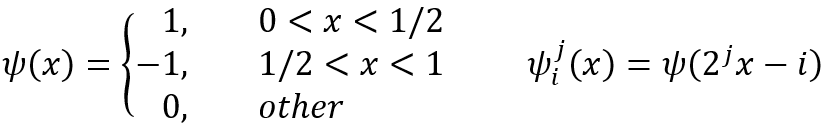<br />其中，i=0,1,...,(2j-1)。j是尺度因子，改变j使函数图形缩小或者放大；i为平移参数，改变i使函数沿x轴方向平移。<br />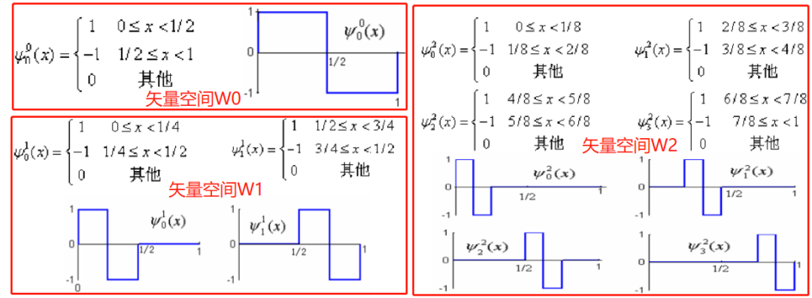<br />矢量空间Wj中的每一个矢量也被包含在矢量空间Wj+1中。下面我们对一个原始信号进行多解析度分析：<br />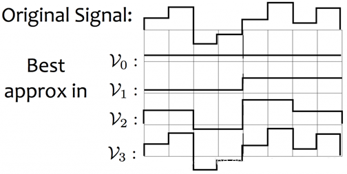<br />可以看出，在不同的子空间，对于同一个信号就有不同的诠释。诠释最好的是V3，完全不损失细节。这就是**多解析度**的意义。可以有嵌套的，由尺度函数演变的基函数集合，每一个集合都提供对原始信号的某种近似，解析度越高，近似越精确。<br />从上面也可以看出，**直接用尺度函数就可以，或者母小波就可以还原信号。为什么要用两个呢？**<br />回顾上面的矢量空间图，矢量空间W0中的小波函数，和V0中的尺度函数，可以构建V1中的尺度函数。矢量空间W1中的小波函数，和V1中的尺度函数，可以构建V2中的尺度函数。继续推导下去，可以发现，**尺度j下的小波函数，可以用来将Vj的基拓展到Vj+1中**。这代表着，对任何一个子空间Vj，我们现在**有两种方法去得到它的正交基**：**（1）用它原本的基Φj,k（2）用上一级子空间的Φj-1,k和上一级子空间的小波函数ψj-1,k**。**第二种选择能给我们带来额外的好处，那就是我们可以循环不断地用上一级子空间的尺度函数以及小波函数的组合来作为当前子空间的基。换句话说，如果针对V3这个子空间，它实际上就有四种不同的，但是等价的正交基。**<br />下面是V3子空间的第二种可选择的正交基，V2的尺度函数和W2的小波函数：（上面没归一化，这边归一化了）<br />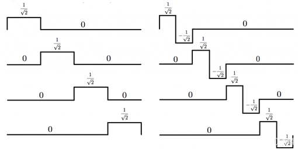<br />左边这四个基和原始信号作内积，表征的是**信号的平均**。而右边的这四个基和原始信号作内积则表征了在平均中丢失的**信号细节**。得益于此，多解析度分析能够对信号在越来越宽的区域上取平均，等同于做**低通滤波**，而且，它还能保留因为平均而损失的信号细节，等同于做**高通滤波**。也就是说，尺度函数和小波函数背后的**物理意义**是：**小波函数等同于对信号做高通滤波保留变化细节，而尺度函数等同于对信号做低通滤波保留平滑的形状。**<br />所有信号空间中的信号都可以写成组成这个基的函数的线性组合：<br />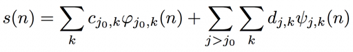<br />对应的系数的计算和平常一样：<br />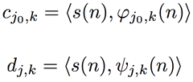<br />**小波变换的基础流程**：<br />**1. 选取合适的小波函数和尺度函数，从已有的信号中，反算出系数c和d。**<br />**2. 对系数做对应处理**<br />**3. 从处理后的系数中重新构建信号。**<br />这里的系数处理是区别你的应用的重点。比如**图像或者视频压缩**，就希望选取能将能量聚集到很小一部分系数中的小波，然后抛弃那些能量很小的小波系数，只保留少数的这些大头系数，再反变换回去。这样的话，图像信号的能量并没有怎么丢失，图像体积却大大减小了。
<a name="IeaDa"></a>
## 3、应用
<a name="wec8r"></a>
### 3.1 一维harr小波分解
**示例：求只有4个像素[9 7 3 5]的图像的哈尔小波变换系数**<br />**步骤1：求均值(averaging)**，也叫Approximation。计算相邻像素对的平均值，得到一幅分辨率比较低的新图像，新的图像的分辨率是原来的1/2，相应的像素值为：[8 4]<br />**步骤2：求差值(differencing)**。很明显，用2个像素表示这幅图像时，图像的信息已经部分丢失。为了能够从由2个像素组成的图像重构出由4个像素组成的原始图像，就需要存储一些图像的细节系数(detail coefficient)，以便在重构时找回丢失的信息。方法是使用这个像素对的差值除以2，(9-7)/2=1，(3-5)/2=-1，结果为[1 -1]。到此为止，**小波变换的一级分解**结束，结果为[8 4 1 -1]。下面是小波变换的二级分解，即对低频部分[8,4]进行分解。<br />**步骤3：**重复第1，2步，把由第一步分解得到的图像进一步分解成分辨率更低的图像和细节系数，结果为[6 2 1 -1]。<br />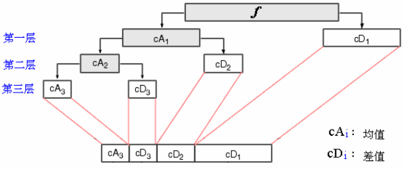<br />在变换过程没有丢失信息，因为能够从所记录的数据中**重构出原始图像**。首先在分辨率为1的图像上重构出分辨率为2的图像，在分辨率为2的图像上重构出分辨率为4的图像。**通过变换之后产生的细节系数的幅度值比较小，这就为图像压缩提供了一种途径**，例如去掉一些微不足道的细节系数并不影响对重构图像的理解。上面的分解其实就是之前说的，可以在不同的矢量空间用不同的基表示该图像，**用不同的分辨率去看图像：**<br />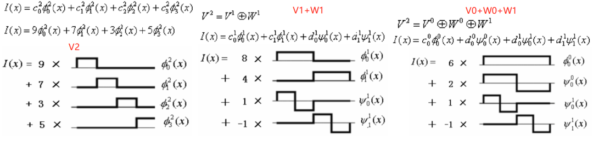
<a name="jAJPd"></a>
### 3.2 二维harr小波分解与重构
以离散余弦变换为基础的JPEG标准算法，把图片分块处理会产生**块效应**，在小波变换中，由于**小波变换中适用的基函数的长度是可变的**，因此无需把输入图像进行分块，避免了块效应。下图为进行多级小波变换后，图像各部分存放的是不同级数的小波系数。左上角的元素表示整个图像块的像素值的平均值，其余是该图像块的细节系数，h水平细节，v垂直细节，c对角细节。如果从矩阵中**去掉图像的某些细节系数**，而且重构的图像质量仍然可以接受，则可实现**压缩**。**具体做法是设置一个阈值，当细节系数小于这个阈值，就当做0来看待。**<br />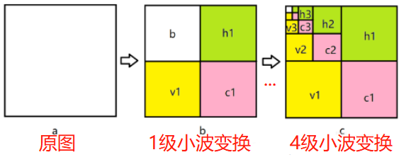<br />**示例 小波图像分解→阈值处理→重构**
```cpp
# include<opencv.hpp>
# include<iostream>
using namespace std;
using namespace cv;
Mat waveletTransform2D(Mat& img, int level) {
    int width = img.cols;
    int height = img.rows;
    int depth = level;
    int depthcount = 1;
    Mat wavelet = Mat::zeros(img.size(), CV_32FC1);       
    Mat tmp = Mat::zeros(img.size(), CV_32FC1);
    Mat imgtmp = img.clone();
    imshow("src", imgtmp);
    imgtmp.convertTo(imgtmp, CV_32FC1, 1.0);
 
    while (depthcount <= depth)
    {
        height = img.rows / depthcount;
        width = img.cols / depthcount;
 
        // 水平
        for (int i = 0; i < height; i++)
        {
            for (int j = 0; j < width / 2; j++)
            {
                tmp.at<float>(i, j) = (imgtmp.at<float>(i, 2 * j) + imgtmp.at<float>(i, 2 * j + 1)) / 2; //水平方向求均值
                tmp.at<float>(i, j + width / 2) = (imgtmp.at<float>(i, 2 * j) - imgtmp.at<float>(i, 2 * j + 1)) / 2; //水平方向求差值
            }
        }
 
        // 竖直
        for (int i = 0; i < height / 2; i++)
        {
            for (int j = 0; j < width; j++)
            {
                wavelet.at<float>(i, j) = (tmp.at<float>(2 * i, j) + tmp.at<float>(2 * i + 1, j)) / 2; //得到总均值和水平方向差值
                wavelet.at<float>(i + height / 2, j) = (tmp.at<float>(2 * i, j) - tmp.at<float>(2 * i + 1, j)) / 2;//得到竖直方向均值和对角差值
            }
        }
        imgtmp = wavelet.clone();
        depthcount++;
    }
    return wavelet;
}
Mat invWaveletTransform2D(Mat& img, int level) {
    int width = img.cols;
    int height = img.rows;
    int depth = level;
    Mat tmp = Mat::ones(img.size(), CV_32FC1);
    Mat wavelet = img.clone();
    Mat imgtmp = img.clone();
   
    while (depth > 0)
    {
        height = img.rows / depth;
        width = img.cols / depth;
 
        // 竖直
        for (int i = 0; i < height; i+=2)
        {
            for (int j = 0; j < width; j++)
            {
                tmp.at<float>(i, j) = (imgtmp.at<float>(i/2, j) + imgtmp.at<float>(i/ 2+height / 2, j));
                tmp.at<float>(i + 1, j) = (imgtmp.at<float>(i/2, j) - imgtmp.at<float>(i/ 2 + height / 2, j)) ;
            }
        }
 
        // 水平
        for (int i = 0; i < height; i++)
        {
            for (int j = 0; j < width; j+=2)
            {
                wavelet.at<float>(i, j) = (tmp.at<float>(i, j/2) + tmp.at<float>(i, j/2+width/2));
                wavelet.at<float>(i, j + 1) = (tmp.at<float>(i, j/2) - tmp.at<float>(i, j/2 + width / 2));
            }
        }
        imgtmp = wavelet;
        depth--;
    }
    return wavelet;
}
int main()
{
    Mat img = imread("./2.tif", cv::IMREAD_GRAYSCALE);
    //Mat img = (Mat_<uchar>(4, 4)<<1, 2, 3, 4,5,6,7,8,9,10,11,12,13,14,15,16);
     
    // 1.小波变换
    Mat wavelet = waveletTransform2D(img, 2);
    // 2.阈值处理
    for (int i = 0; i < wavelet.rows; i++)
    {
        for (int j = 0; j < wavelet.cols; j ++)
        {
            if (abs(wavelet.at<float>(i, j)) < 15)
                wavelet.at<float>(i, j) = 0;
        }
    }
    // 3.逆向小波变换
    Mat dst = invWaveletTransform2D(wavelet, 2);
    dst.convertTo(dst, CV_8UC1);
    imshow("dst", dst);
    waitKey(0);
    return 0;
}
```
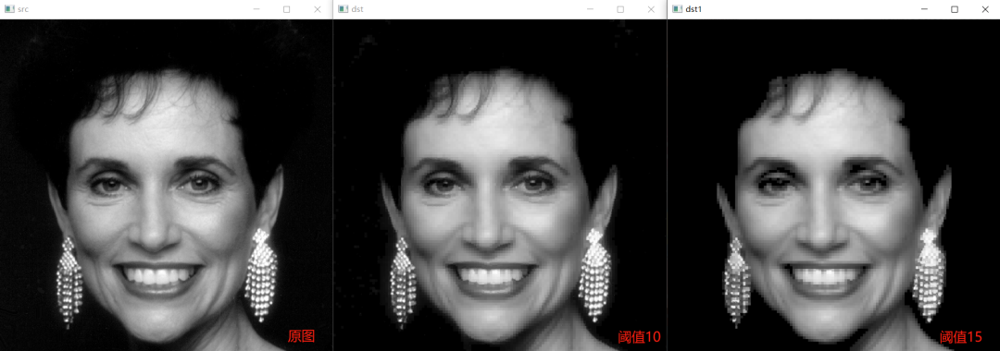<br />一般，有用信号表现为低频信号或者是一些比较平稳的信号，而噪声信号则通常表现为高频信号，因此根据噪声与信号在不同尺度（即不同频率）上的小波谱具有不同表现的特点，将噪声小波谱占主导地位的那些尺度上的小波分量去掉，而实现去噪。根据博客**基于小波变换实现图像增强**：

- 小波分解后删除高频，即低通滤波，可以让图像变得平滑，滤除图像中的噪声。
- 小波分解后删除低频，即高通滤波，可以提取图像边缘，进而锐化图像
- 小波分解后弱化高频，增强低频，可以增强对比度

该博客用**matlab**中的**wavedec2函数** `[c,s]=wavedec2(X,N,'wname')`，c为各层分解系数，s为各层分解系数长度。c是一个行向量，`c=[A(N)|H(N)|V(N)|D(N)|H(N-1)|V(N-1)|D(N-1)|H(N-2)|V(N-2)|D(N-2)|…|H(1)|V(1)|D(1)]`，A(N)代表第N层低频系数，H(N)|V(N)|D(N)代表第N层高频系数，分别是水平，垂直，对角高频，以此类推，到H(1)|V(1)|D(1)。比如，设一级高频系数为0，也就是c的最后部分H(1)|V(1)|D(1)置为0，对应**c++**这边，就是将分解得到的图像右半边和下半边都置为0。
