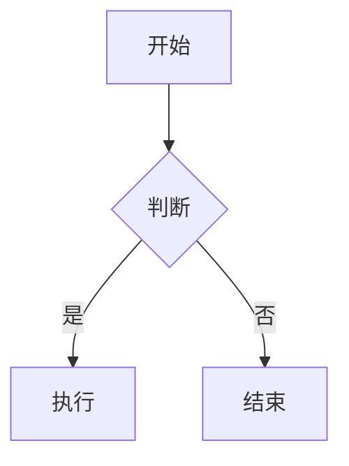
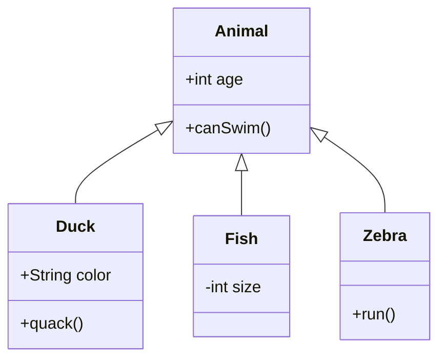

Mermaid 是一种基于文本的图表绘制工具，它允许用户使用简单的标记语言来生成流程图、序列图、甘特图、类图等图表。Mermaid 图表通过文本描述来定义图表的元素和它们之间的关系，然后由 Mermaid 解析器转换成可视化的图表。

Mermaid 的语法非常简洁，例如，要创建一个简单的流程图，你可以使用以下语法：

对于类图，Mermaid 的语法也相当直观。例如，以下是一个简单的类图示例：

在这个示例中，`Animal` 是一个基类，`Duck`、`Fish` 和 `Zebra` 是继承自 `Animal` 的子类。类属性和方法使用 `+` 或 `-` 来表示它们的可见性（public 或 private）。` <|--` 符号表示继承关系。

Mermaid 可以在许多平台上使用，包括一些代码编辑器、Markdown 编辑器和在线工具。如果你需要在支持 Mermaid 的平台上生成图表，只需将上述代码粘贴到相应的编辑器中，Mermaid 就会自动解析并显示图表。

如果你需要在不支持 Mermaid 的平台上生成图表，你可以使用在线的 Mermaid 编辑器，如 [Mermaid Live Editor](https://mermaid-js.github.io/mermaid-live-editor/)，它允许你输入 Mermaid 代码并实时预览生成的图表。