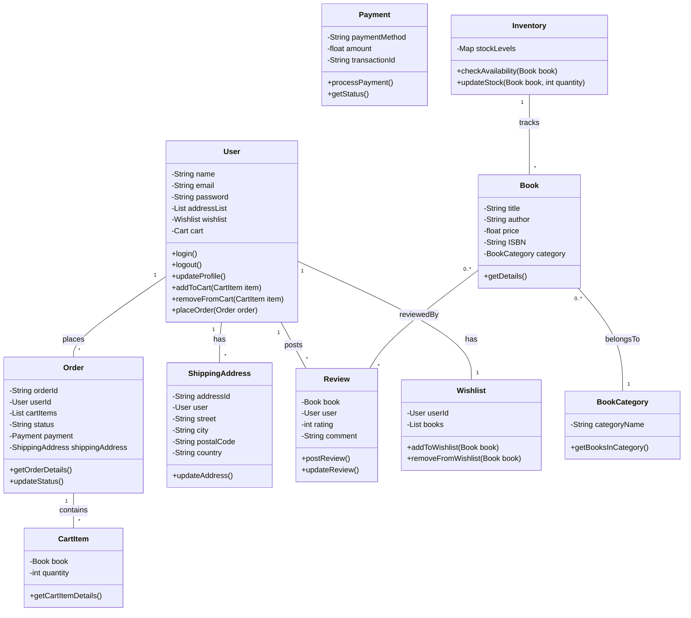

### 在线书店系统类图案例

#### 系统实体和类：

1. **Book**
2. **User**
3. **Order**
4. **Payment**
5. **Inventory**
6. **CartItem**
7. **ShippingAddress**
8. **Review**
9. **Wishlist**
10. **BookCategory**

#### 类属性和方法：

1. **Book**
   - 属性：- title, - author, - price, - ISBN, - category
   - 方法：+ getDetails()

2. **User**
   - 属性：- name, - email, - password, - addressList, - wishlist, - cart
   - 方法：+ login(), + logout(), + updateProfile(), + addToCart(item), + removeFromCart(item), + placeOrder(order)

3. **Order**
   - 属性：- orderId, - userId, - cartItems, - status, - payment, - shippingAddress
   - 方法：+ getOrderDetails(), + updateStatus()

4. **Payment**
   - 属性：- paymentMethod, - amount, - transactionId
   - 方法：+ processPayment(), + getStatus()

5. **Inventory**
   - 属性：- stockLevels
   - 方法：+ checkAvailability(book), + updateStock(book, quantity)

6. **CartItem**
   - 属性：- book, - quantity
   - 方法：+ getCartItemDetails()

7. **ShippingAddress**
   - 属性：- addressId, - user, - street, - city, - postalCode, - country
   - 方法：+ updateAddress()

8. **Review**
   - 属性：- book, - user, - rating, - comment
   - 方法：+ postReview(), + updateReview()

9. **Wishlist**
   - 属性：- userId, - books
   - 方法：+ addToWishlist(book), + removeFromWishlist(book)

10. **BookCategory**
    - 属性：- categoryName
    - 方法：+ getBooksInCategory()

#### 类之间的关系：

- **User** 与 **Order** 存在一对多关系，一个用户可以有多个订单。
- **Order** 与 **CartItem** 存在一对多关系，一个订单包含多个购物项。
- **User** 与 **CartItem** 通过 **Cart** 关联。
- **Order** 与 **Payment** 存在一对一关系，每个订单有一个支付信息。
- **Order** 与 **ShippingAddress** 存在一对一关系，每个订单有一个发货地址。
- **Book** 与 **Review** 存在多对多关系，一本书可以有多个评论，一个用户可以评论多本书。
- **User** 与 **Wishlist** 是一对一关系，每个用户有一个愿望清单。
- **Book** 与 **BookCategory** 存在多对一关系，多本书属于一个分类。

#### Mermaid 类图代码：

请注意，这个类图是一个高层次的抽象，实际的系统设计可能需要更多的细节和考虑，例如安全性、数据验证、错误处理等。此外，实际的系统可能还会包含数据库设计、API 设计、用户界面设计等其他方面的内容。