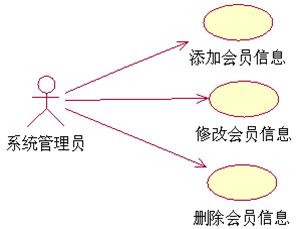

对于[用例图](https://so.csdn.net/so/search?q=用例图&spm=1001.2101.3001.7020)来说我们需要了解的是什么叫用例图，构成用例图的要素，用例图有哪些重要的元素，各个用例之间的关系。当然最重要的是如何根据需求创建用例图。具体的创建通过一个简单的学生管理的例子说明创建的过程和例子。
　　我的所有例子都是是使用Rose这个软件来画的，现在虽然有新的UML模型画图软件，但是我比较喜欢用这个Rose，如果你还没有装这个软件需要先装一个，或者使用你比较喜欢的UML画图软件。下面我们直接进入正题吧，学习一下用例图的相关概念和具体的创建过程。

## 什么叫用例图

### 用例图的含义

　　由参与者（Actor）、用例（Use Case）以及它们之间的关系构成的用于描述系统功能的动态视图称为用例图。要在用例图上显示某个用例，可绘制一个椭圆，然后将用例的名称放在椭圆的中心或椭圆下面的中间位置。
　　要在用例图上绘制一个参与者（表示一个系统用户），可绘制一个人形符号。参与者和用例之间的关系使用带箭头或者不带箭头的线段来描述，箭头表示在这一关系中哪一方是对话的主动发起者，箭头所指方是对话的被动接受者。

　　在用例建模中，为了更加清楚的描述用例或者参与者，会使用到注释。

### 用例图的作用

　　用例图是需求分析中的产物，主要作用是描述参与者和用例之间的关系，帮助开发人员可视化的了解系统的功能。借助于用例图，系统用户、系统分析人员、系统设计人员、领域专家能够以可视化的方式对问题进行探讨，减少了大量交流上的障碍，便于对问题达成共识。
　　用例图可视化地表达了系统的需求，具有直观、规范等优点，克服了纯文字性说明的不足。
　　用例方法是完全从外部来定义系统功能，它把需求和设计完全的分离开来。我们不用关心系统内部是如何完成各种功能的，系统对于我们来说就是一个黑箱子。

## 用例图的构成要素

### 参与者

　　参与者（Actor）是指存在于系统外部并直接与系统进行交互的人、系统、子系统或类的外部实体的抽象。
每个参与者可以参与一个或多个用例，每个用例也可以有一个或多个参与者。
　　在用例图中使用一个人形图标来表示参与者，参与者的名字写在人形图标下面。

### 参与者间的的关系

　　由于参与者实质上也是类，所以它拥有与类相同的关系描述，即参与者与参与者之间主要是泛化关系（或称为“继承”关系）。
泛化关系的含义是把某些参与者的共同行为提取出来表示成通用行为，并描述成超类。泛化关系表示的是参与者之间的一般/特殊关系，在UML图中，使用带空心三角箭头的实线表示泛化关系。

### 系统边界

　　在项目开发过程中，边界是一个非常重要的概念。这里说的系统边界是指系统与系统之间的界限。通常我们所说的系统可以认为是由一系列的相互作用的元素形成的具有特定功能的有机整体。
　　系统同时又是相对的，一个系统本身又可以是另一个更大系统的组成部分，因此，系统与系统之间需要使用系统边界进行区分开来。我们把系统边界以外的同系统相关联的其他部分，称之为系统环境。

## 用例的重要元素

### 如何识别用例

　　任何用例都不能在缺少参与者的情况下独立存在。同样，任何参与者也必须要有与之关联的用例。所以识别用例的最好方法就是从分析系统参与者开始，在这个过程中往往会发现新的参与者。
　　
可以通过以下问题来寻找用例：
　　 (1)参与者希望系统提供什么功能？
　　 (2)参与者是否会读取、创建、修改、删除、存储系统的某种信息？如果是的话，参与者又是如何完成这些操作的？
　　 (3)参与者是否会将外部的某些事件通知给系统？
　　 (4)系统中发生的事件是否通知参与者？
　　 (5)是否存在影响系统的外部事件。
　　

### 用例的粒度

　　用例的粒度指的是用例所包含的系统服务或功能单元的多少。用例的粒度越大，用例包含的功能越多，反之则包含的功能越少。
　　如果用例的粒度很小，得到的用例数就会太多。反之，如果用例的粒度很大，那么得到的用例数就会很少。
　　如果用例数目过多会造成用例模型过大和引入设计困难大大提高。 如果用例数目过少会造成用例的粒度太大，不便于进一步的充分分析。

　　比如：网站后台管理系统中的会员信息维护用例，管理员需要进行添加会员信息、修改会员信息、删除会员信息等操作。

　　我们还可以根据具体的操作把它抽象成3个用例，它展示的系统需求和单个用例是完全一样的。

### 用例规约

　　对于每一个用例，我们还需要有详细的描述信息，以便让别人对于整个系统有一个更加详细的了解，这些信息包含在用例规约之中。
　　
每一个用例的用例规约都应该包含以下内容：
　　 (1)简要说明:对用例作用和目的的简要描述。
　　(2)事件流:事件流包括基本流和备选流。基本流描述的是用例的基本流程，是指用例“正常”运行时的场景。
　　 (3)用例场景:同一个用例在实际执行的时候会有很多不同的情况发生，称之为用例场景，也可以说用例场景就是用例的实例。
　　 (4)特殊需求: 特殊需求指的是一个用例的非功能性需求和设计约束。特殊需求通常是非功能性需求，包括可靠性、性能、可用性和可扩展性等。例如法律或法规方面的需求、应用程序标准和所构建系统的质量属性等。
　　 (5)前置条件: 执行用例之前系统必须所处的状态。例如，前置条件是要求用户有访问的权限或是要求某个用例必须已经执行完。
　　 (6)后置条件:用例执行完毕后系统可能处于的一组状态。例如，要求在某个用例执行完后，必须执行另一个用例。

## 用例之间的关系

### 包含

　　包含关系指用例可以简单地包含其他用例具有的行为，并把它所包含的用例行为作为自身行为的一部分。在UML中，包含关系是通过带箭头的虚线段加<>字样来表示，箭头由基础用例(Base)指向被包含用例(Inclusion)。

　　在处理包含关系时，具体的做法就是把几个用例的公共部分单独的抽象出来成为一个新的用例。主要有两种情况需要用到包含关系：
　　第一，多个用例用到同一段的行为，则可以把这段共同的行为单独抽 象成为一个用例，然后让其他用例来包含这一用例。
　　第二，某一个用例的功能过多、事件流过于复杂时，我们也可以把某一段事件流抽象成为一个被包含的用例，以达到简化描述的目的。

　　

　　

### 扩展

　　在一定条件下，把新的行为加入到已有的用例中，获得的新用例叫做扩展用例(Extension)，原有的用例叫做基础用例(Base)，从扩展用例到基础用例的关系就是扩展关系。
　　一个基础用例可以拥有一个或者多个扩展用例，这些扩展用例可以一起使用。

### 泛化

　　用例的泛化指的是一个父用例可以被特化形成多个子用例，而父用例和子用例之间的关系就是泛化关系。
　　在用例的泛化关系中，子用例继承了父用例所有的结构、行为和关系，子用例是父用例的一种特殊形式。
　　子用例还可以添加、覆盖、改变继承的行为。在UML中，用例的泛化关系通过一个三角箭头从子用例指向父用例来表示。

　　泛化的示例：银行存款有两种方式，一种是银行柜台存款，一种是ATM机存款。在这里，银行柜台存款和ATM机存款都是存款的一种特殊方式，因此“存款”为父用例，“银行柜台存款”和“ATM机存款”为子用例。

## 使用Rose创建用例的步骤说明

### 需求分析

“学生信息管理系统”部分功能性需求包括以下内容：
　　 （1）系统管理员登录后可以对班级的基本信息进行增加、删除、修改、查询等操作。学校领导登录后可以对班级基本信息进行查询操作。
　　 （2）教师登录后可以对学生的考试成绩进行录入、删除、修改、查询等操作。学生登录后可以对考试成绩进行查询操作。
　　 （3）学生登录后可以了解所有选修课程的具体信息，可以根据自己的需要选择不同课程。系统管理员登录后可以增加、修改、查询、删除选修课程。
　　 （4）系统管理员可以对账号进行创建、设置、查看、删除等操作。
　　

### 识别参与者

　　对于一个学校来说，最重要的就是教育学生成才，所以我们首先要考虑到的参与者就是学生。
　　要给学生上课，必然就需要教师。教师负责教育学生、并且在日常管理中可以查询学生的基本信息、查询学生的考试成绩。
　　作为一个学校，除了教师和学生，还有不可或缺的就是校领导。为了便于校领导掌握学校的基本情况，加强对学校的管理导.
　　不管什么系统，基本都会有比较专业的人员来负责管理系统，本系统也不例外。系统管理员除了负责维护系统的日常运行，还要进行录入学生基本信息、维护选课信息等工作。
　　

### 构建用例模型

　　系统管理员直接参与的用例为登录、找回密码、查看班级基本信息、删除班级基本信息、修改班级基本信息和录入班级基本信息。校领导直接参与用例登录、找回密码和查看班级基本信息。当登录过程中发生忘记密码的情况，就需要使用找回密码的功能来找回密码，而在正常情况下用不到找回密码这个功能所以用例找回密码”和用例登录之间是扩展关系。

　　教师参与用例录入成绩、修改成绩、保存成绩、查询成绩、删除成绩和登录。学生参与用例登录和查询成绩。因为修改成绩和录入成绩的时候都要保存成绩，所以将保存成绩抽象出来作为单独的一个用例。用例录入成绩、修改成绩和用例保存成绩之间是包含关系，用例找回密码和用例登录之间是扩展关系。

　　学生作为参与者直接参与用例查看课程信息、按课程编号查看、按课程名查看、选择课程、删除已选课程、登录和找回密码。系统管理员参与用例登录、找回密码和“维护课程信息”。其中查看课程信息有两种方式，一种是按照课程名查看，另一种是按照课程编号查看。所以查看课程信息是父用例，而按照课程名查看和按照课程编号查看是子用例，他们之间的关系是泛化关系。用例找回密码和用例登录之间是扩展关系。

　　系统管理员参与用例创建新账号、设置账号、设置账号基本信息、设置账号权限、查看账号和删除账号。在设置帐号时，主要分为设置账号的基本信息和设置账号的权限，为了便于修改和维护，将这两个功能分别抽象为两个用例。所以用例设置账号基本信息、设置账号权限和用例设置账号之间是包含关系

