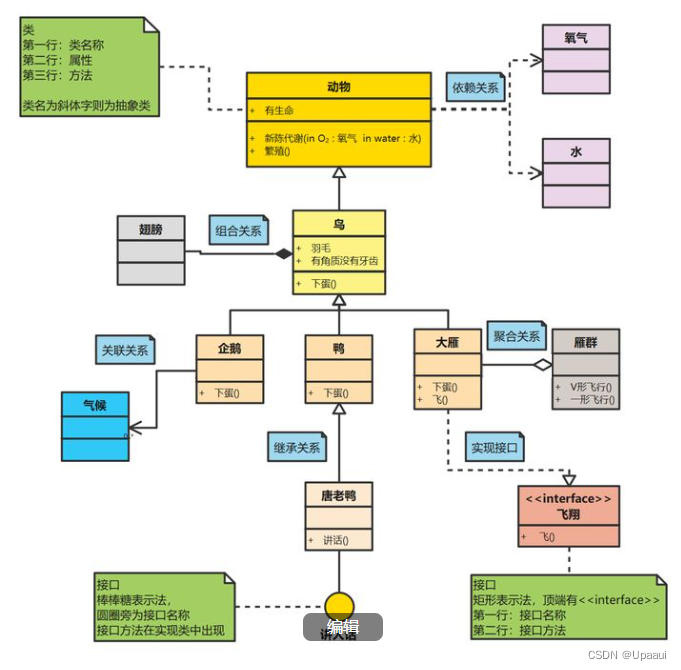
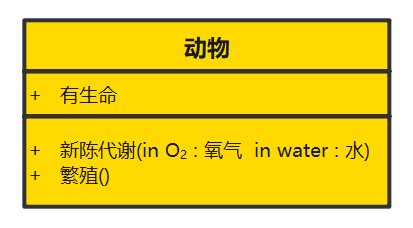
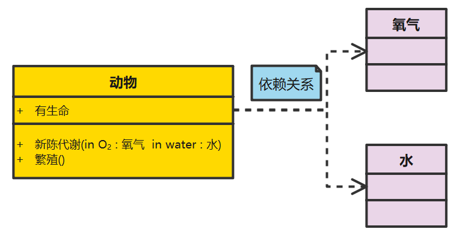
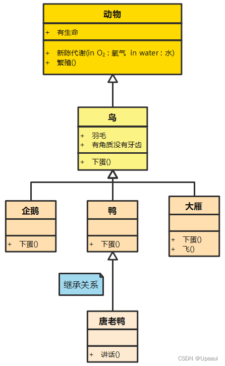
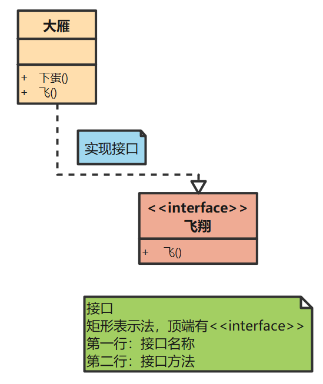
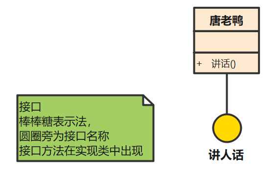
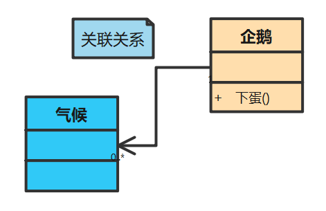
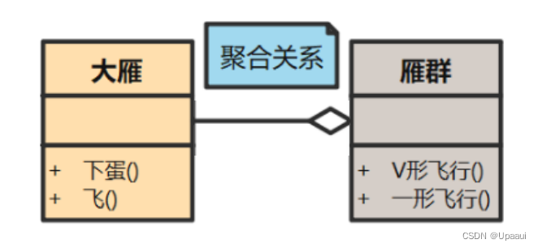
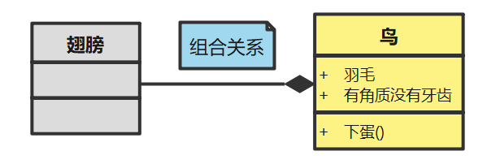

UML类图，UML中的一种重要图形，是在面向对象语言用中用来表示一个类。

如下图所示（它由两部分组成，类和类之间的关系）：

动物UML类图

## 类

类是具有相似结构、行为和关系的一组对象的描述符，是面向对象系统中最重要的构造块。

如下图所示，就表示一个类：

三个格子从上至下分别表示：

+ 类名称（如果是接口，就使用斜体表示）
+ 类的特性（一般是类的字段和属性，可以没有）
+ 类的操作（一般是类的方法或行为）

它们前边的符号有以下几类：

+ “+”表示public，类的成员如果被声明为 `public`则可被任何其他类访问，没有访问限制，这是最宽松的访问级别。

+ “-”表示private，如果类成员被声明为 `private`则只能在定义它们的类内部被访问。这是最严格的访问级别用于隐藏类的内部实现细节。

+ “#”表示protected，类成员如果被声明为 `protected`则可在定义它们的类内部以及继承该类的子类中被访问。这种访问级别比 `private` 宽松但比 `public` 严格，因为它不允许非子类访问这些成员。

## 类的关系

除了类，类图中还有一个重要元素，即类之间的关系。

根据类的关系的不同，具体可分为6种：

### 依赖关系（用虚箭线表示）

所谓依赖关系，就是构造这个类的时候，需要依赖其他的类，比如：动物依赖水和氧气。如下图所以：

### 继承、泛化关系（用带空心三角形的实线表示）

继承（泛化）关系，它指定了子类如何特化父类的所有特征和行为。例如：鸟是动物的一种，企鹅、鸭、大雁是鸟的一种。

### 实线关系（用带空心三角形的虚线表示）

一种类与接口的关系，表示类是接口所有特征和行为的实现。它有两种表示方法：

#### 矩形表示法

+ 顶端有<<interface>>
+ 第一行：接口名称
+ 第二行：接口方法

​                                                                                                           矩形表示法

#### 棒棒糖表示法

+ 圆圈旁为接口名称
+ 接口方法在实现类中出现

​														棒棒糖表示法

### 关联关系（用实箭线表示）

所谓关联关系，就是这个类有一个属性是其他类。

​														关联关系

### 聚合关系（用带空心菱形的实线表示）

聚合关系是关联关系的一种，是强的关联关系 ；

特点： 部分对象的生命周期并不由整体对象来管理。也就是说，当整体对象已经不存在的时候，部分的对象还是可能继续存在的。比如：一只大雁脱离了雁群，依然是可以继续存活的。

​														聚合关系

### 组合关系（用带实心菱形的实线表示）

组合关系同样是关联关系的一种，是比聚合关系还要强的关系。

特点：在组合中，部分与整体生命期一致，部分与组合同时创建并同时消亡 。比如：鸟与翅膀的关系。

​														组合关系

当然，UML不止类图，还有活动图、对象图、状态图、时序图等，这里就不一一拆解了。

总结来说，只有充分了解这些图形的要素组成及要素间关系，我们才能有效地运用UML图来便捷沟通、开发，而不是用糟糕的UML图来添堵。

