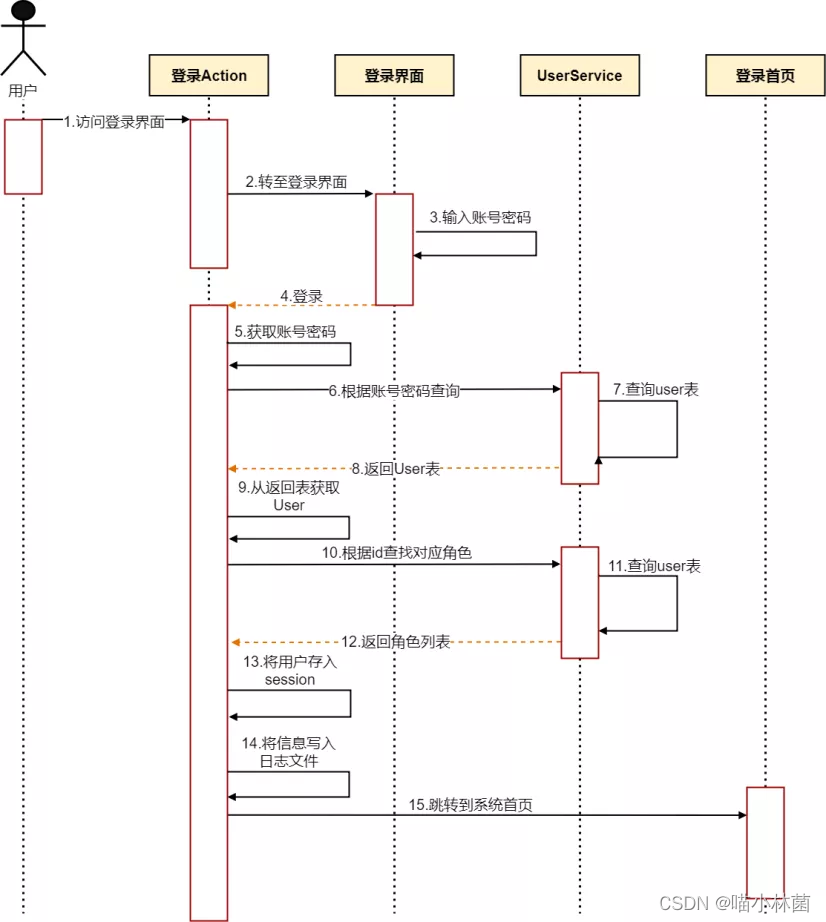
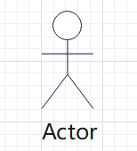
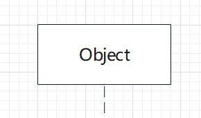
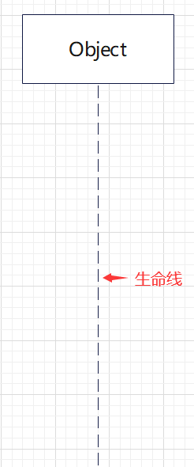
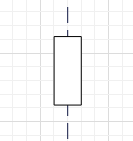
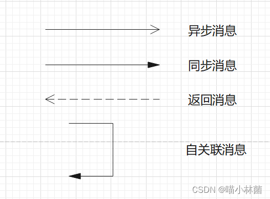
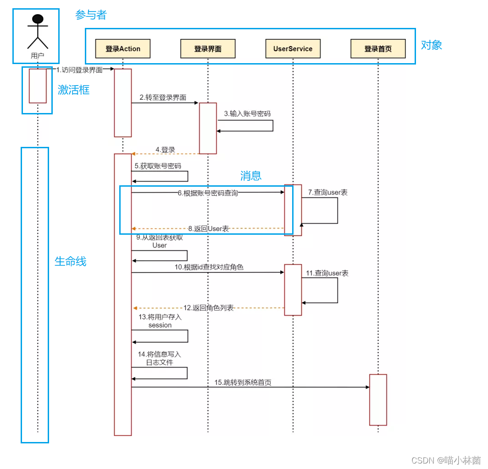
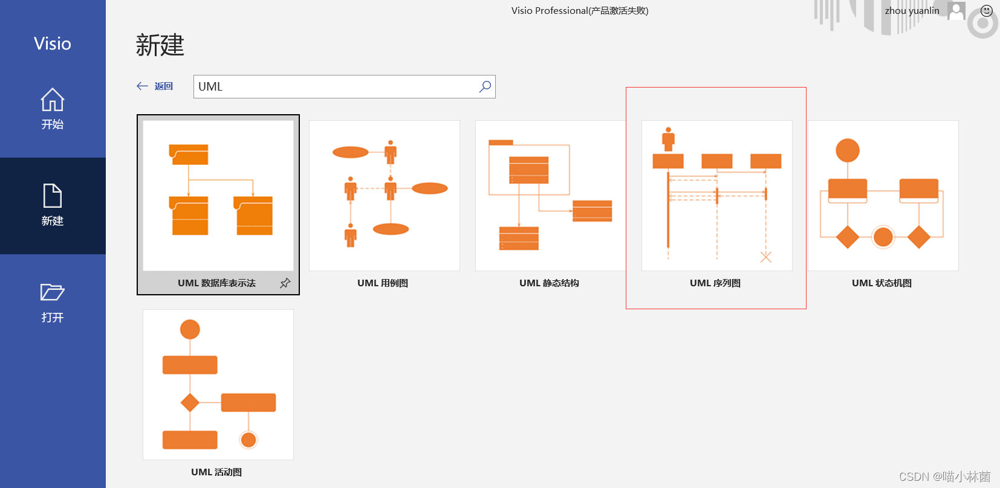
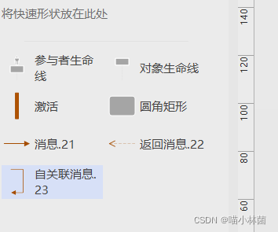
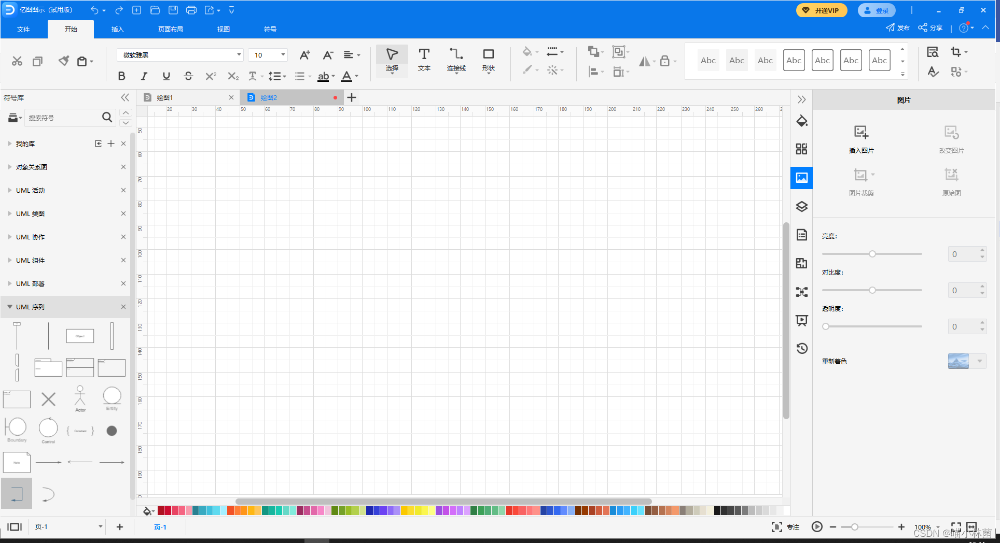

UML时序图（Sequence Diagram）用于描述对象间的交互行为，包括参与者、对象、生命线、激活框和消息等基本元素。参与者代表与系统交互的外部用户，对象在横轴上表示，生命线为对象的动态行为，激活框展示执行状态，消息则通过箭头表示对象间通信。异步和同步消息、返回消息和自关联消息是消息的几种类型。常用的绘制工具有Visio和亿图。

# UML顺序图/序列图/时序图

## UML时序图

### 什么是顺序图

为了实现系统功能，若干个对象之间需要交互协作，顺序图（Sequence Diagram）描述了这些交互对象的动态行为模式，即随着时间的流逝，对象之间是如何交互的。顺序图也叫做序列图或者时序图。

### 基本元素

#### 参与者

与系统、子系统或类发生交互作用的外部用户。一般用一个如下图例表示：

#### 对象

顺序图的横轴上是与序列有关的对象，一般用矩形表示，矩形框中写有对象或者类名。

#### 生命线

坐标轴纵向的虚线表示对象在序列中的执行情况（即发送和接收的消息，对象的活动）这条虚线称为对象的“生命线”。

#### 激活框

表示该对象的某个行为所处的执行状态，用贯穿生命线的竖立小矩形条表示。

#### 消息

消息是从一个对象的生命线到另一个对象生命线的箭头表示，箭头以时间顺序在图中从上到下排列。
异步消息：发送方不需要等待接收方的消息响应。
同步消息：发送方需要等待接收方的消息响应。
返回消息：表示消息的返回。
自关联消息：表示方法的自身调用。

## 绘制工具

### visio

### 亿图

