# 协作图之解一

协作图包含一组对象和以消息交互为联系的关联，用于描述系统的行为是如何由系统的成分合作实现的。在协作图中，类元角色描述了一个对象，关联角色描述了协作关系中的链，并通过几何排列表现交互作用中的各个角色。

## 协作图的含义

所谓协作，是指在一定的语境中一组对象以及用以实现某些行为的这些对象间的相互作用。它描述了这样一组对象为实现某种目的而组成相互合作的“对象社会”。在协作中，它同时包含了运行时的类元角色（Classifier Roles）和关联角色（Association Roles）。类元角色表示参与协作执行的对象描述，系统中的对象可以参与一个或多个协作；关联角色表示参与协作执行的关联的描述。

协作图就是表现对象协作关系的图，它表示了协作中作为各种类元角色的对象所处的位置，在图中主要显示了类元角色和关联角色。类元角色和关联角色描述了对象的配置和当一个协作的实例执行时可能出现的连接。当协作被实例化时，对象受限于类元角色，连接受限于关联角色。

### 从结构方面来讲

协作图和对象图一样，包含了一个角色集合和它们之间定义行为方面的内容的关系，从这个角度来说，协作图也是类图的一种，但是协作图与类图这种静态视图不同的是，静态视图描述了类固有的内在属性，而协作图则描述了类实例的特性，因为只有对象的实例才能在协作中扮演自己的角色，它再协作中起了特殊的作用。

### 从行为方面来讲

协作图和序列图一样，包含了一系列的消息集合，这些消息在具有某一角色的各对象间进行传递交换，完成协作中的对象则为达到的目标。可以说在协作图的一个协作中描述了该协作所有对象组成的网络结构以及相互发送消息的整体行为，表示潜藏于计算过程中的三个主要结构的统一，即数据结构、控制流和数据流的统一。

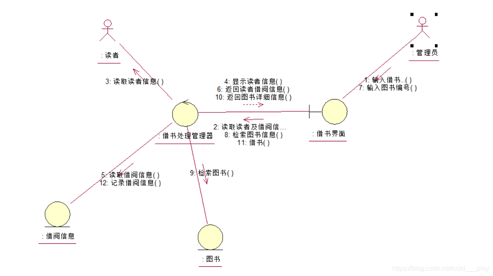

## 协作图的作用

协作图作为一种在给定语境中描述协作中各个对象之间组织交互关系的控件阻止结构的图形化方式，在使用其建模时，可以将其作用分为以下三个方面。

+ 通过描绘对象间消息的传递情况来反映具体的使用语境的逻辑表达。一个使用情境的逻辑可能是一个用例的一部分，或是一条控制流，这个序列图的作用类似。

+ 显示对象及其交互关系的控件阻止结构。协作图显示了在交互过程中各个对象之间的阻止交互关系以及对象彼此之间的连接。与序列图不同，协作图显示的是对象之间的关系，并不是侧重交互的顺序，它没有将时间作为一个单独的维度，而是使用序列号来确定消息及并发线程的顺序。

+ 协作图的另外一个作用是表现一个类操作的实现。协作图可以说明类操作中使用到的参数、局部变量以及返回值等。当使用协作图表现一个系统行为时，消息编号对应了程序中的嵌套调用结构和信号传递过程。

## 组成协作图的元素

对象（Object）、消息（Message）和链（Link）这三个元素构成了协作图。协作图通过各个对象之间的组织交互关系以及对象彼此之间的连接表达对象之间的交互

### 对象

协作图中的对象和序列图中的对象的概念相同，同样都是类的实例。对象的角色表示一个或一组对象在完成目标的过程中所应起的那部分作用。对象是角色所属类的直接或者间接实例。在协作图中，不需要关于某个类的所有对象都出现，同一个类的对象在一个协作图中也可能要充当多个角色。

协作图中对象的表示方式也和序列图中对象的表示方式一样，使用包围名称的矩形框来标记，所显示的对象及其类的名称带有下划线，两者用冒号隔开，使用“对象名：类名”的形式，与序列图不同的是，对象的下部没有一条被称为“生命线”的垂直虚线，并且对象存在多对象的形式。

### 消息

在协作图中，可以通过一系列的消息来描述系统的动态行为。和序列图中的消息概念相同，都是从一个对象（发送者）向另一个或几个其他对象（接收者）发送信号，或由一个对象（发送者或调用者）调用另一个对象（接收者）的操作，并且都由三部分组成，分别是发送者、接收者和活动。

在协作图中，消息使用带有标签的箭头表示，它附在连接发送者和接收者的链上。链连接了发送者和接收者，箭头的指向便是接收者。消息也可以通过发送给对象本身的方式，依附在连接自身的链上。在一个连接上可以有多个消息，它们沿着相同或不同的路径传递。每个消息包括一个顺序号以及消息的名称。消息的名称可以是一个方法，包含一个名字、参数表和可选的返回值表。消息的各种实现的细节也和“交付商品”两步

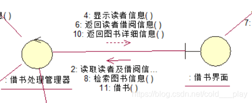

### 链

协作图中的链与对象图中的链的概念和表示形式都相同，都是两个或多个对象之间的独立连接，是对象引用元组（有序表），也是关联的实例。在协作图中，关联角色是与具体语境有关的暂时的类元之间的关系，关联角色的实例也是链，其寿命受限于协作的长短，就如同序列图中对象的生命线一样。

在协作图中，链的表示形式为一个或多个相连的线或弧。在自身关联的类中，链是两端指向同一对象的回路，是一条弧。为了说明对象是如何与另外一个对象进行连接的，可以在链的两端添加上提供者和客户端的可见性修饰。

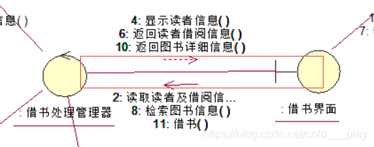

# 协作图之解释二

在实际的开发中不会单独画协作图，因为时序图跟协作图可以相互转化，所以会先画时序图，然后直接用时序图生成协作图。
　　从时序图转换为协作图，只需打开时序图，然后选择 Browse → Create collaboration Diagram 或按 F5
　　从协作图转换为时序图，只需打开协作图，然后选择 Browse → Create sequence Diagram 或按 F5 。

## 什么是协作图

### 协作图的基本概念

所谓协作是指在一定的语境中一组对象以及用以实现某些行为的这些对象间的相互作用。它描述了在这样一组对象为实现某种目的而组成相互合作的“对象社会”。
　　 协作图就是表现对象协作关系的图，它表示了协作中作为各种类元角色的对象所处的位置，在图中主要显示了类元角色（Classifier Roles）和关联角色（Association Roles）。

　　在UML的表示中，协作图将类元角色表示为类的符号（矩形），将关联角色表现为实线的关联路径，关联路径上带有消息符号。
　　不带有消息的协作图标明了交互作用发生的上下文，而不表示交互。它可以用来表示单一操作的上下文，甚至可以表示一个或一组类中所有操作的上下文。如果关联线上标有消息，图形就可以表示一个交互。典型的，一个交互用来代表一个操作或者用例的实现

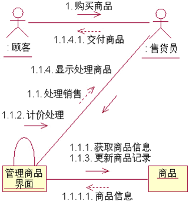

## 为什么要使用协作图

协作图作为一种在给定语境中描述协作中各个对象之间的组织交互关系的空间组织结构图形化方式，在使用其进行建模时，可以将其作用分为以下三个方面：

+ 通过描绘对象之间消息的传递情况来反映具体的使用语境的逻辑表达。一个使用情境的逻辑可能是一个用例的一部分，或是一条控制流。这和序列图的作用类似。

+ 显示对象及其交互关系的空间组织结构。协作图显示了在交互过程中各个对象之间的组织交互关系以及对象彼此之间的链接。与序列图不同，协作图显示的是对象之间的关系，并不侧重交互的顺序，它没有将时间作为一个单独的维度，而是使用序列号来确定消息及并发线程的顺序。

+ 协作图的另外一个作用是表现一个类操作的实现。协作图可以说明类操作中使用到的参数、局部变量以及返回值等。当使用协作图表现一个系统行为时，消息编号对应了程序中嵌套调用结构和信号传递过程。

## 组成协作图的元素

### 对象

一个协作代表了为了完成某个目标而共同工作的一组对象。对象的角色表示一个或一组对象在完成目标的过程中所应起的那部分作用。对象是角色所属的类的直接或者间接实例。
　　在协作图中，不需要关于某个类的所有对象都出现，同一个类的对象在一个协作图中也可能要充当多个角色。
　　协作图中对象的表示形式也和序列图中的对象的表示方式一样，使用包围名称的矩形框来标记，所显示的对象及其类的名称带有下划线，二者用冒号隔开，使用“对象名 ：类名”的形式，与序列图不同的是，对象的下部没有一条被成为“生命线”的垂直虚线，并且对象存在多对象的形式。

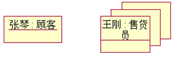

### 消息

在协作图中，可以通过一系列的消息来描述系统的动态行为。
　　在协作图中，消息使用带有标签的箭头来表示，它附在连接发送者和接收者的链上。
　　链连接了发送者和接收者，箭头的指向便是接收者。每个消息包括一个顺序号以及消息的名称。
　　消息的名称可以是一个方法，包含一个名字和参数表、可选的返回值表。消息的各种实现的细节也可以被加入，如同步与异步等。

### 链

在协作图中的链和对象图中链的概念和表示形式都相同，都是两个或多个对象之间的独立连接，是对象引用元组（有序表），是关联的实例。
　　在协作图中，链的表示形式为一个或多个相连的线或弧。在自身相关联的类中，链是两端指向同一对象的回路，是一条弧。为了说明对象是如何与另外一个对象进行连接的，我们还可以在链的两端添加上提供者和客户端的可见性修饰。如下图所示，是链的普通和自身关联的表示形式。

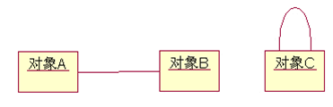

## 使用Rose创建协作图

### 创建对象

创建一个新的协作图，可以通过以下方式进行。
　　 (1) 右键单击浏览器中的Use Case View（用例视图）、Logical View（逻辑视图）或者位于这两种视图下的包。
　　 (2) 在弹出的菜单中，选中“New”（新建）下的“Collaboration Diagram”（协作图）选项。
　　 (3) 输入新的协作图名称。
　　 (4) 双击打开浏览器中的协作图。

使用菜单栏中添加对象的步骤如下：
　　 (1) 使用工具栏时，在菜单栏中，选择“Tools”（浏览）下的“Create”（创建）选项，在“Create”（创建）选项中选择“Object”（对象），此时光标变为“＋”号。
　　 (2) 在协作图中单击选择任意一个位置，系统在该位置创建一个新的对象。
　　 (3) 在对象的名称栏中，输入对象的名称。这时对象的名称也会在对象上端的栏中显示。
　　

### 创建消息

在协作图中添加对象与对象之间的简单消息的步骤如下：
　　 (1)选择协作图的图形编辑工具栏中的图标，或者选择菜单栏“Tools”（工具）中“Create”（新建）下的“Message”选项，此时的光标变为“+”符号。
　　 (2)单击连接对象之间的链。
　　 (3)此时在链上出现一个从发送者到接收者的带箭头的线段。
　　 (4)在消息线段上输入消息的文本内容即可。

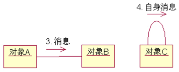

### 创建链

在协作图中创建链的操作与在对象图中创建链的操作相同，可以按照在对象图中创建链的方式进行创建。同样我们也可以在链的规范对话框的“General”选项卡中设置链的名称、关联、角色以及可见性等。
　　链的可见性是指一个对象是否能够对另一个对象可见的机制。

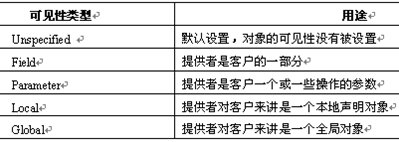

## 在项目中创建协作图案例分析

### 创建协作图的步骤

(1) 根据系统的用例或具体的场景，确定协作图中应当包含的元素。
(2) 确定这些元素之间的关系，可以着手建立早期的协作图，在元素之间添加链接和关联角色等。
(3)将早期的协作图进行细化，把类角色修改为对象实例，并且链上添加消息并指定消息的序列。

### 需求分析

我们可以通过更加具体的描述来确定工作流程，基本工作流程如下：
　　（1）李老师希望通过系统查询某名学生的学科成绩。
　　（2）李老师通过用户界面录入学生的学号以及学科科目请求学生信息。
　　（3）用户界面根据学生的学号向数据库访问层请求学生信息。
　　 （4）数据库访问层根据学生的学号加载学生信息。
　　 （5）数据库访问层根据学生信息和学科科目获取该名学生的分数信息。
　　 （6）数据库访问层将学生信息和分数信息提供给用户界面。
　　 （7）用户界面将学生信息和分数信息显示出来。

### 确定协作图元素

从已经描述的用例中，我们可以确定需要“教师”、“学生”和“成绩”对象，我们还要一个提供教师与系统交互的场所，那么我们需要一个“用户界面”对象。“用户界面”对象如果要获取“学生”和“成绩”对象的信息，那么我们还需要一个用来访问数据库的对象。将这些对象列举到协作图中。

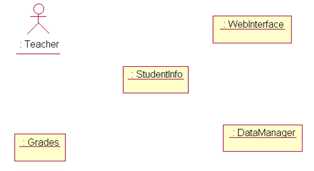

### 确定元素间的关系

创建协作图的下一步是确定这些对象之间的连接关系，使用链和角色将这些对象连接起来。在这一步中，我们基本上可以建立早期的协作图，表达出协作图中的元素如何在空间上进行交互。

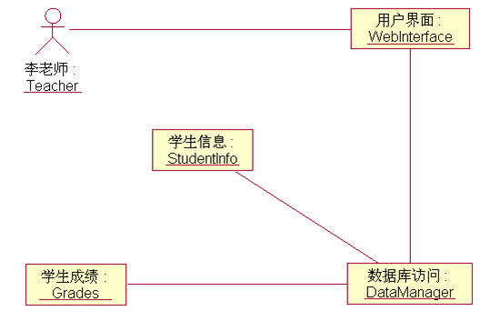

### 完成协作图

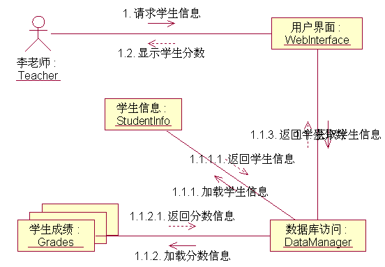