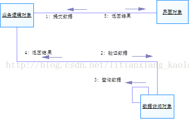
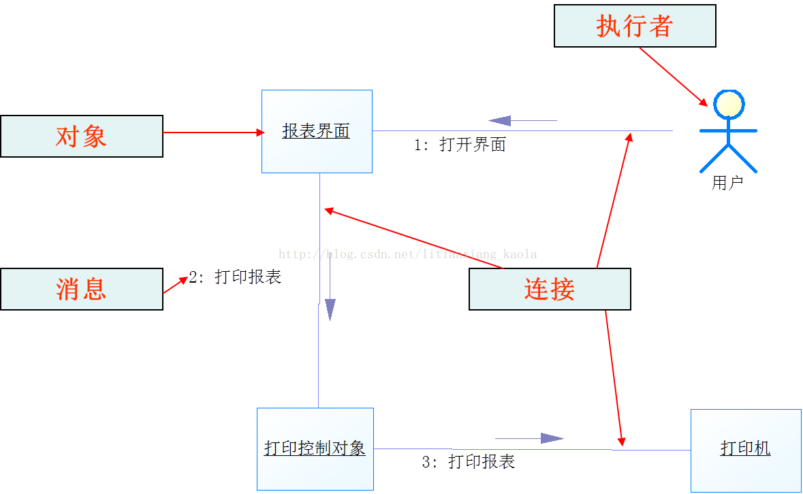
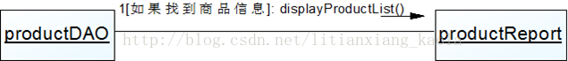
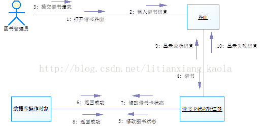

# 通信图

## 定义

1. 在UML1.0中，通信图称为协作图。

2. 通信图强调参与一个交互对象的组织。

3. 它与顺序图是同构图，也就是它们包含了相同的信息，只是表达方式不同而已，通信图与顺序图可以相互转换。

4. 虽然通信图和顺序图均显示了交互，但它们强调了不同的方面。顺序图清晰地显示了时间次序，但没有显式指明对象间关系。通信图清晰地显示了对象间关系，但时间次序必须从顺序号来获得。

5. 顺序图常用于用例场景描述，通信图更适合显示过程设计细节。采用哪种图，一般可以根据这种原则：当对象及其连接有利于理解交互时，选择通信图；当只需了解交互的次序时，选择顺序图。

## 示例

## 组成元素

1，通信图由以下基本元素组成：执行者(Actor)、对象(Object)、连接(Link，也称为链)、消息(Message)和守护条件(Condition)。

2，在UML中，使用实线表示两个对象之间的连接；通信图中的消息，由在连接上方的带有标记的箭头表示，同时可以用数字注明消息的次序。

3，守护条件：以“[条件表达式]”格式表示

## 绘制技巧

1，通信图中的对象与顺序图中的对象对应；

2，通信图中无法表示对象的生命线，因此无法显式表示对象的创建和销毁；

3，通信图中的消息添加了顺序号，用于说明交互过程中消息的时间顺序；

4，通信图用于表示对象之间的协作关系，即强调参与交互的对象的组织。

## 案例分析

