# Git版本控制

## Git的特征

### 1.文件系统

我们都知道Git是个版本控制系统，但是如果你深入了解其原理，就不难发现它更像一个文件管理系统，如果你使用过其他版本控制器，不难发现它们的思路非常符合“版本控制”的逻辑，它们记录的是一个初始文件，以及后续对该文件的历次修改内容，如下：

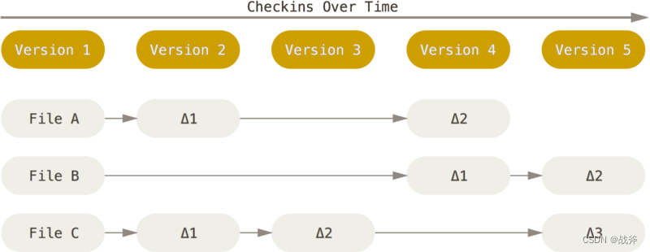

而对于GIT，则是把你每次的“提交”当作一次相机的“快门”，GIT会为你把当时的全部文件内容都做一个快照，然后进行存储，这一系列的快照，每一个快照展开都是完整的文件系统。当然，为了效率，如果文件没有修改，Git 不再重新存储该文件，而是只保留一个链接指向之前存储的文件

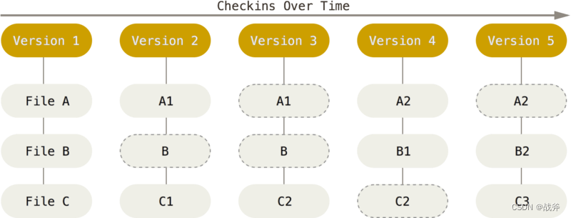

### 2. 分布式

我们可以把上次的图继续拿来使用，GIT的核心工作都是在本地完成的，即其主要工作都聚焦在工作区到本地仓库，这意味着，即使我们离线了，我们仍然能完成提交操作，GIT仍然能忠实的记录下我们的操作记录，而不像其他版本控制器，断网后版本控制功能就失效了。

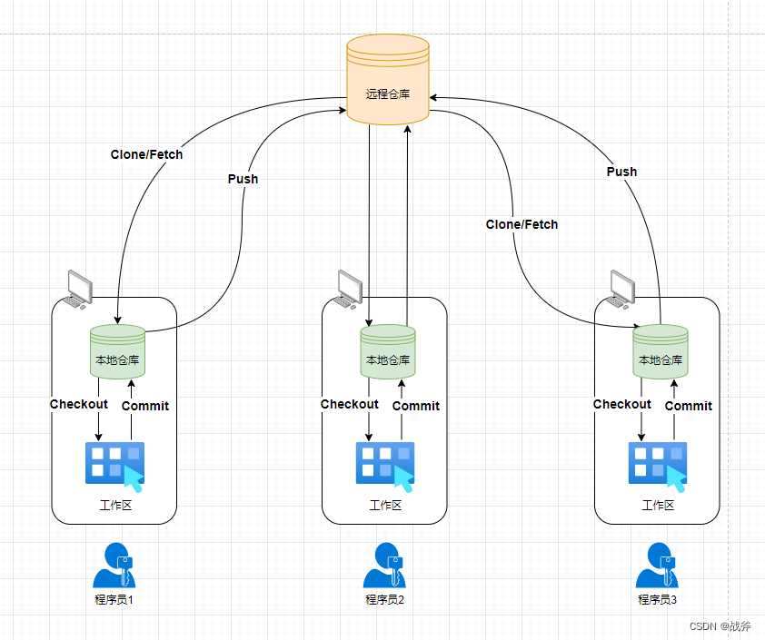

## GIT的术语

在接触GIT的时候，我们难免会接触到一些术语或概念，我们先对术语做个解释，如果你看了某些解释，觉得一头雾水，先别着急，我们在下面会慢慢解释

### 1. 区域术语

GIT一共分为四个区域，对于开发者来说，由远到近依次为：远程仓库、本地仓库、暂存区和工作区

- **远程仓库：** 可以是GitHub、GitLab，也可以是你自己的私有服务器，包含项目所有的版本控制信息和文件历史记录。
- **本地仓库：** 你电脑上的存储库，它包含项目所有的版本控制信息和文件历史记录
- **暂存区：** 也称为索引（Index），用于存储下一次提交时要包含哪些修改或变更。
- **工作区：** 指项目的实际文件夹，即我们日常编辑的文件夹。

我们之前讲了三个部分，唯独没有讲暂存区。实际上，我们的代码不能直接从工作区就到仓库去，本地仓库只接收暂存区提供的内容，所以我们的任何新增、修改实际上都要先加入到暂存区。

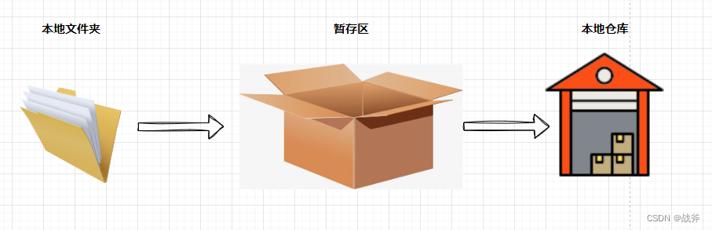

但是为什么这块暂存区存在感不强呢？主要是因为我们现在的各种工具在自动维护，比如我们添加文件时，IDEA会自动弹窗，当我们使用Tortoisegit时，提交时会让我们勾选文件，这些都让我们免于手动往暂存区进行手动添加，自然其存在感就稍弱了

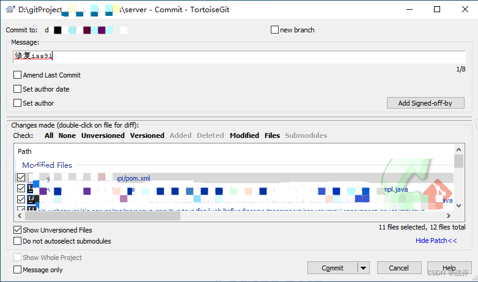

### 2. 名词术语

##### 1. 提交对象

我们每次把暂存区的内容放入本地仓库，称为一次提交，产生一个提交对象（也叫“提交点” 或 “提交”）。

除了手动提交，合并操作也会产生提交点，提交点包含了前一个提交点位置、文件变更信息、变更人、变更时间等所有信息，每个提交点都有自己的SHA-1哈希值作为唯一标志，一般在图中，用一个圈表示。因为提交点（除了首次提交）都会包含上一个提交点的地址，所以在实例图里一般呈链表状，如下图，就展示了三个提交点。

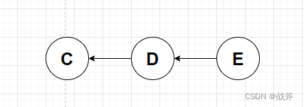

##### 2. 分支

定义：一个指向某个提交对象的指针，表示一个代码的分支。可以有多个分支，并行开发不同的功能或版本

对于分支这个概念，在讲解之前，如果你看过其他的教程，可能会经常看到类似下面的图

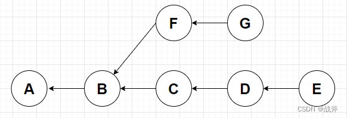

这样的话，你会认为这里有两个分支，一个是由C D E构成，一个是F G构成。的确，这里是有两个分支不假，但这张图更具体的样子应该是这样子

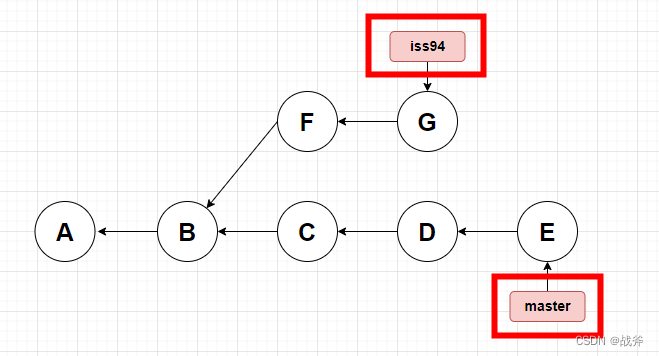

分支并不是树枝，图中真正的分支，其实只是两个指针，如图，分支iss94指向提交点G，分支master指向提交点E，理解了这个概念，你才能明白为什么Git鼓励大家，遇事不决就建立各种分支。在其他版本控制器中，拉个分支可能意味着所有的代码都要复制一遍，而在GIT中，仅仅是建立一个指针。

聪明的你可能想到了一个问题，建分支 = 建指针，那岂不是当我建分支的时候，会产生两个指针，指着同一个节点？，此时，如果我再次提交内容，岂不是乱了套？这个节点会算在哪个分支上？这时候就要用到另一个概念 HEAD

##### 3. HEAD

定义：HEAD是一个特殊的指针，它指向当前所在的分支或提交。一般情况下，HEAD指向当前所在分支的最新提交。

没错，HEAD也是个指针，而且指向分支，如果你没有忘记分支也是个指针的话，那你应该能想象出下面的图例

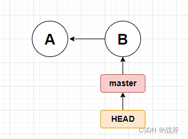

这代表着HEAD指向了master分支，我们把前面分支的知识结合起来，现在如果我们想建立个名叫 iss95 的分支，图就会变成这样子

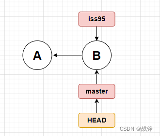

如果此时我们再进行一次提交，会变成什么样呢？

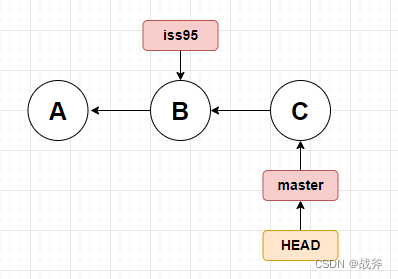

所以，你应该明白HEAD的作用了，它代表着你下次提交的位置，此处它指向master，所以我们的提交是提交至分支master上的。提交后，master指针自动移到C的位置。而iss95则没有任何变化，还是指向B。

严谨的小伙伴可能注意到我们定义中说了一句 一般情况下，HEAD指向当前所在分支的最新提交。那HEAD能指向历史提交吗？

答案是肯定的，我们可以使用 `git checkout <commit>` 命令将HEAD移动到某个历史提交点，如下图：

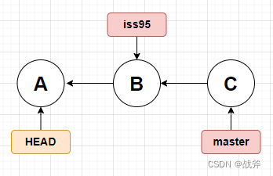

##### 4. 标签（TAG）

定义：在 Git 中，Tag是一种重要的版本控制工具，它们是一些永久性的指针，指向某个特定的提交（commit），常用于代码发布、版本管理以及历史记录的标记等操作

简而言之，标签也是一个指针，只是这个指针不像分支 或 HEAD 一样，它是不会移动的，我们可以看到JDK源码中就有大量的标签，用以标记节点

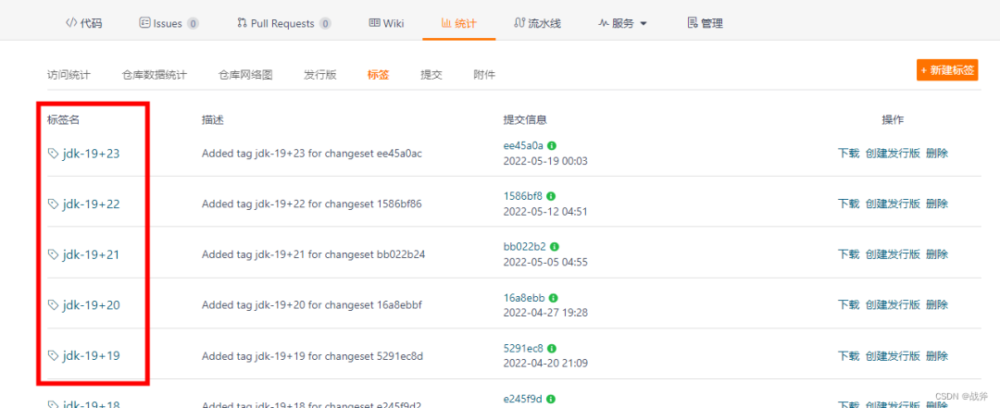

### 3. 动作术语

- **添加 （Add）**: 将工作目录的文件加入暂存区，可以只选择部分文件进行添加
- **提交（Commit）**：将暂存区的内容放入本地仓库，每个提交都有唯一的ID。
- **合并（Merge）**：将两个或多个分支的修改合并到一起。
- **拉取（Pull）**：将远程仓库的修改拉取到本地仓库，并更新工作区。
- **推送（Push）**：将本地仓库的修改推送到远程仓库。
- **检出（Checkout）**：切换某个分支，并同时切换工作目录。

如果前面你都学会了，相信这几个动作，你应该能理解，它们之前能汇聚成下面这张关系图

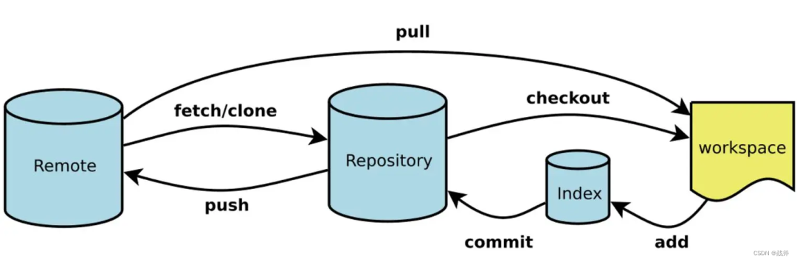

当然，这些命令实际上并不仅仅这么简单，比如 Checkout 不仅可以切换分支，还可以跟文件名，以 `git checkout <file-name>` 来还原文件。但是这些，我们留到下一篇文章再讲解。

## Git 存储模型

### 1. GIT 数据库

前面我们三番五次的把 GIT 说成更像文件系统，这是很合理的。甚至可以说GIT是一个数据库，其实它的核心确实就是一个键值对数据库，你可以向 Git 仓库中插入任意类型的内容，它会返回一个唯一的键，通过该键可以在任意时刻再次取回该内容

~~~ shell
$ echo ‘test content’ | git hash-object -w --stdin
d670460b4b4aece5915caf5c68d12f560a9fe3e4
~~~

如上，我们把标准输入内容 “test content” 存储进GIT，它就会返回给我们一个40字符的 SHA-1 哈希值，我们可以用这个值，重新获取存进去的内容

~~~ shell
$ git cat-file -p d670460b4b4aece5915caf5c68d12f560a9fe3e4
test content
~~~

但注意，使用这种方式存入文件，返回的只有文件内容，等于说文件名我们丢失了，而文件名的遗失对于文件系统来说，是非常不合理的。所以我们还需要树

### 2. 树对象

比方说我们有一个简单的目录，目录下有两个文件，README 以及 Rakefile，并且还有个子目录lib，lib里有个文件simplegit.rb。那么当我们把这个目录及其所有文件纳入GIT管理时，其形态是这样的

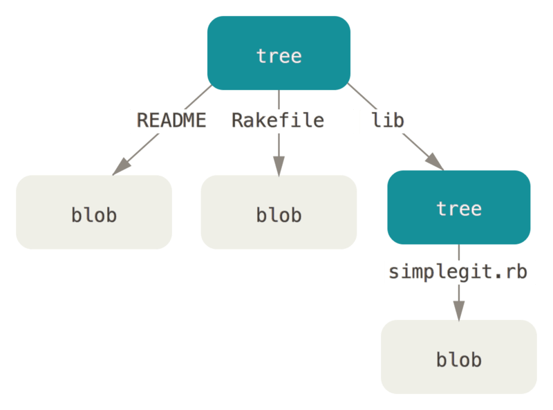

它会把我们的文件存储成blob对象，目录变成tree对象。tree对象可以存文件信息，blob对象存文件内容，而且tree对象还能下辖另一个tree对象，这就和我们目录下还有子目录是一样的。如此一来，我们就可以把我们想存放的目录及其文件，以一棵树的形式完整的存入GIT中了。存是存进去了，但这仅仅是一次保存，存进去最多说GIT保存了我这个目录，那么它的版本控制又体现在哪呢？

### 3. 提交对象

我们上面说了整个目录能变成一个 Tree 对象存入GIT，它是什么时候情况下会存呢？其实就是GIT执行提交命令的时候，当我们提交时，GIT会把我们整个工作目录的所有文件汇聚成一个Tree，并且把这个Tree的引用放进一个提交对象中进行存储。

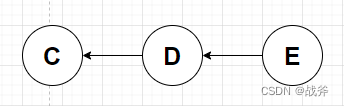

也就是说，如上图，每一个圈（提交对象）不仅有本次提交人、提交时间等信息、而且还指向着一个Tree，所以提交对象实际上就是一个快照

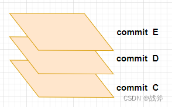

如上图，三次提交实际上构成了一个不断往上摞的切面，为啥说是切面，是因为每一个切面都包含着一棵树，也就是当时整个目录的内容。因此信息量其实是很多的。当然，提交对象、和树对象或者文件对象一样，都会存进GIT，GIT也会返回一个40长度的 SHA-1 哈希值。

这样当我们查询提交历史时，查询到的就是所有过往的提交对象的信息，如果我们确定某个提交对象后，我们就能通过该提交对象的 SHA-1 哈希值能找回当时所有的文件

~~~ shell
$ git log
commit ca82a6dff817ec66f44342007202690a93763949
Author: Scott Chacon <schacon@gee-mail.com>
Date:   Mon Mar 17 21:52:11 2008 -0700

    changed the version number

commit 085bb3bcb608e1e8451d4b2432f8ecbe6306e7e7
Author: Scott Chacon <schacon@gee-mail.com>
Date:   Sat Mar 15 16:40:33 2008 -0700

    removed unnecessary test

commit a11bef06a3f659402fe7563abf99ad00de2209e6
Author: Scott Chacon <schacon@gee-mail.com>
Date:   Sat Mar 15 10:31:28 2008 -0700

    first commit
~~~

> Tree对象不是压缩包，它只是存储着当时那些文件对象的引用。另外，提交时形成的Tree并不是把所有的文件全部又做一遍保存，然后把引用放进Tree，而是只保存改动或新增的文件，那些没有改动过的文件已经存过了，不会再存，所以不用过分担心空间问题。

参考链接 

+ https://blog.csdn.net/u011709538/category_12422421.html

+ https://www.cnblogs.com/clsn/archive/2017/11/30/7929958.html

+ https://www.runoob.com/git/git-branch.html

## Push

### GIT全局部署

~~~ python
git config --global user.name "hzj"
git config --global user.email "hzj@qq.com"
~~~

### 创建一个新的存储库

~~~ python
git clone http://gitlab.situdata.com/zhangyingguang/test123456.git
cd test123456
touch README.md
git add README.md
git commit -m "我第一次提代码"
git push -u origin master
~~~

### 现有文件夹

~~~ python
cd code/
# git初始化
git init
git remote add origin http://gitlab.situdata.com/zhangyingguang/test123456.git
# 添加当前目录下所有文件到版本库
git add Sina 
# 提交到版本库，并填写版本说明，以便以后回滚。
git commit
git push -u origin master
~~~

## Pull

~~~ python
git init
git remote add origin https://git.staff.sina.com.cn/yingguang/IDC-Management-system.git
git pull origin  master
# 查看当前分支版本
git branch -vv

# 强制拉取并覆盖本地代码强制拉取并覆盖本地代码
git fetch --all
git reset --hard origin/master
git pull

# --cached不会把本地的.metedata删除
git rm -r --cached .metedata 
git commit -m 'delete .metedata dir'
git push -u origin master
~~~

~~~ python
# 创建并切换分支
git checkout -b p-dev-batch-changes
git push --set-upstream origin p-dev-batch-changes
git	add
git commit -m "first commit"
git push origin p-dev-batch-changes
~~~

## 常规命令 

| 命令     | 命令说明                                   |
| -------- | ------------------------------------------ |
| add      | 添加文件内容至索引                         |
| bisect   | 通过二分查找定位引入bug的变更              |
| branch   | 列出、创建或删除分支                       |
| checkout | 检出一个分支或路径到工作区                 |
| clone    | 克隆一个版本库到一个目录                   |
| commit   | 记录变更到版本库                           |
| diff     | 显示提交之间、提交和工作区之间等的差异     |
| fetch    | 从另外一个版本库下载对象和引用             |
| grep     | 输出和模式匹配的行                         |
| init     | 创建一个空的工作区                         |
| Git      | 版本库或重新初始化一个已存在的版本库       |
| log      | 显示提交日志                               |
| merge    | 合并两个或更多开发历史                     |
| mv       | 移动或重命名一个文件、目录或符号链接       |
| pull     | 获取并合并另外的版本库或一个本地分支       |
| push     | 更新远程引用和相关的对象                   |
| rebase   | 本地提交转移至更新后的上游分支中           |
| reset    | 重置当前HEAD到指定状态                     |
| rm       | 从工作区和索引中删除文件                   |
| show     | 显示各种类型的对象                         |
| status   | 显示工作区状态                             |
| tag      | 创建、列出、删除或校验一个GPG签名的tag对象 |

## 图解Git

## .gitignore文件

在项目代码中，有一些文件是不能上传的，比如密码文件、数据库文件、核心配置文件等等，还有一些是不用上传的，比如临时文件。为了让git自动忽略这些文件，我们需要创建一个忽略名单。

在项目根目录下新建一个`.gitignore`文件，这里可能需要你在Pycharm下安装ignore插件，如下图所示：

在`.gitignore`文件里写入下面的内容：

~~~ python
.gitignore
venv
.idea
settings.py
db.sqlite3
mysite/__pycache__/
~~~

对于settings.py文件有个问题，如果没有这个文件是无法运行Django项目的，但是settings中又可能包含很多关键的不可泄露的部分，比如SECRET_KEY：

~~~ python
# SECURITY WARNING: keep the secret key used in production secret!
SECRET_KEY = 'b(&6i_$g2%8vh)ruu$)a9pkw+s-e&qj_e_#=@gnbo^48#gp_8a'
~~~

还有数据库的IP/Port、用户名和密码，邮件发送端的用户名和密码，这些都是绝对不能泄露的。

那怎么办呢？简单！复制settings文件，并重命名为settings.example.py文件，放在同一目录里，把敏感信息、密码等修改或删除。使用者看到这个文件名，自然会明白它的作用。

## 	GitHub的高级搜索方式

### 一、单条件使用

**1.项目名称**

​		仓库名称包含spring的项目

​		in:name spring

**2.项目描述**

​		仓库描述中包含spring的项目

​		in:description spring

**3.readme文件**

​		readme中的描述包含 spring 的项目

​		in:readme spring

**4.star数量**

​		star 数量大于 1000 的项目

​		stars: > 1000

​		star 数量在 10~20 之间的项目

​		stars:10..20

**5.fork数量** 

​		fork 数量大于 1000 的项目

​		fork：> 1000

​		fork 数量在 10~20 之间的项目

**6.仓库大小**

​		按仓库大小搜索，单位：KB，仓库大于1000kB的项目

​		size:.>=1000

**7.最近更新时间**

​		最近一次提交在2019年以后的仓库

​		pushed:>2019-01-01 关键词

**8.仓库创建时间**

​		2019年以后创建的仓库

​		created:>2019-01-01 关键词

**9.license**

​		使用 apache-2.0 协议的仓库

​		license：apache-2.0 关键词

**10.仓库使用的开发语言**

​		用 java 语言写的仓库

​		language:Java 关键词

**11.仓库的作者**

​		用户 google 上传的仓库

​		user: google 关键词

**12.组织的仓库**

​		列出 org 的 spring-cloud 仓库

​		org: spring-cloud

### 二、组合条件使用 

**1.搜索名字包含 spring boot ,并且 star 在 1000 以上的项目。**

​		*in:name spring boot stars:>1000*

**2. 搜索描述中包含 spring boot,并且 star 在1000以上，language 为 java 的项目。**

​		*in:description spring boot stars:>1000 language:java*

**3. 搜索 readme 中包含关键字【测试自动化框架】，并且 star 在 100 以上，language 是 python 的项目.**

​		*in:readme 测试自动化框架 stars:>100 language:python*

