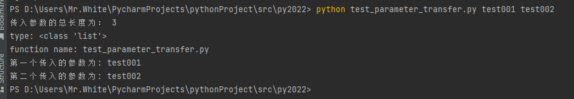
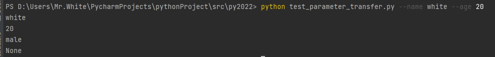
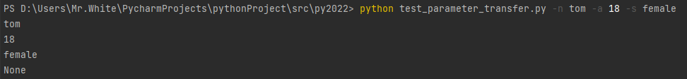
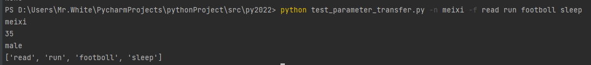
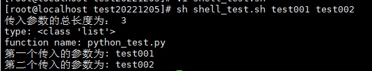

## python文件传参

### <code>sys.argv</code>数组传入

使用sys.argv必须按照先后的顺序传入对应的参数；sys.argv则封装了传入的参数数据，作为数组的方式已经传入

~~~ python
import sys

print("传入参数的总长度为：", len(sys.argv))
print("type:", type(sys.argv))
print("function name:", sys.argv[0])
try:
    print("第一个传入的参数为:", sys.argv[1])
    print("第二个传入的参数为:", sys.argv[2])
except Exception as e:
    print("Input Error:", e)
~~~

通过命令行查看运行结果：

### 用<code>argparse</code>包传入

说明：parser.add_argument 方法的type参数理论上可以是任何合法的类型，而且传入的顺序并没有要求

​	参数使用的说明：

~~~ shell
--xx  完整参数输入

-x   简写参数输入
type  输入的参数将要被转换的数据类型
default 默认值
help  参数介绍
nargs  可传入的参数数量
required  是否为必须参数
~~~

~~~ python
import argparse
parser = argparse.ArgumentParser(description='argparse testing')
parser.add_argument('--name','-n',type=str, default = "bk",required=True,help="a programmer's name")
parser.add_argument('--age','-a',type=int, default=35,help='age of the programmer')
parser.add_argument('--sex','-s',type=str, default='male')
parser.add_argument('--favorite','-f',type=str, nargs="+",required=False,help="favorite of the programmer")

args = parser.parse_args()
print(args.name)
print(args.age)
print(args.sex)
print(args.favorite)
~~~

查看运行结果

1. 用完整参数传入

   

2. 用简写参数输入

3. 多参数传入

### shell脚本向python脚本传递参数

<code>python</code>脚本依然使用<code>sys.argv</code>的数组的方式传入参数

<code>python</code>脚本(python_test.py)如下：

~~~ python
import sys

print("传入参数的总长度为：", len(sys.argv))
print("type:", type(sys.argv))
print("function name:", sys.argv[0])
try:
    print("第一个传入的参数为:", sys.argv[1])
    print("第二个传入的参数为:", sys.argv[2])
except Exception as e:
    print("Input Error:", e)
~~~

<code>shell</code>脚本(shell_test.sh)如下：

~~~ shell
#!/bin/bash
#定义变量
para1=$1
para2=$2
python python_test.py $para1 $para2
~~~

查看结果：

