# 特征工程

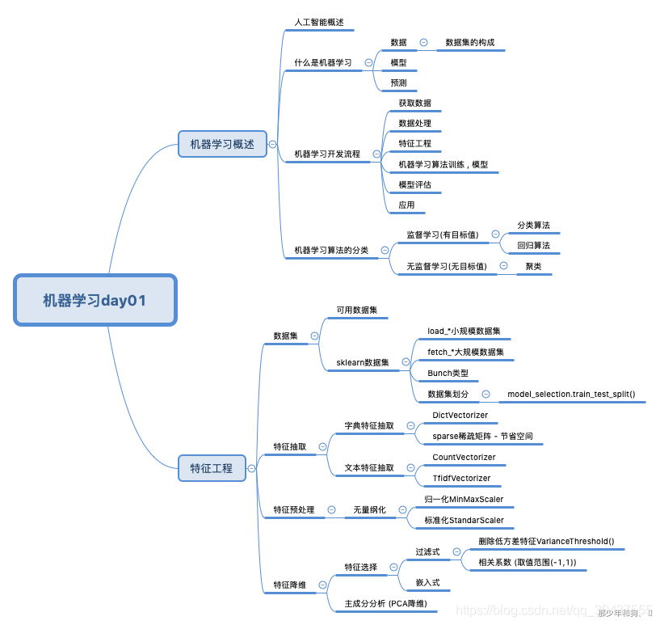

## 1.数据集

+ 可用数据集(学习阶段:Sklearn, Kaggle, UCI)

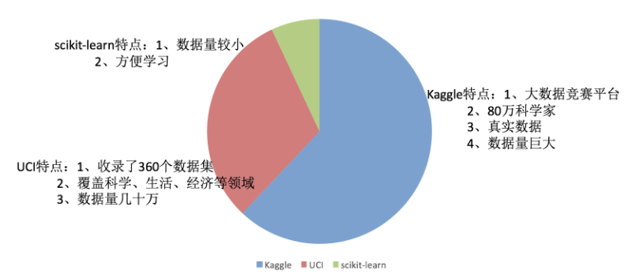

> Kaggle网址：https://www.kaggle.com/datasets
>
> Kaggle介绍：https://zhuanlan.zhihu.com/p/396740267?utm_id=0
>
> 
>
> UCI数据集网址： http://archive.ics.uci.edu/ml/
>
> scikit-learn网址：[http://scikit-learn.org/stable/datasets/index.html#datasets](http://scikit-learn.org/stable/datasets)

### sklearn

~~~ python
pip install Scikit-learn==0.19.1
# 安装scikit-learn需要Numpy, Scipy等库
~~~

+ <b>sklearn</b>数据集API介绍<b>(sklearn.datasets)</b>

  + load_* 获取小规模数据集

    + 加载并返回鸢尾花数据集：sklearn.datasets.load_iris()

    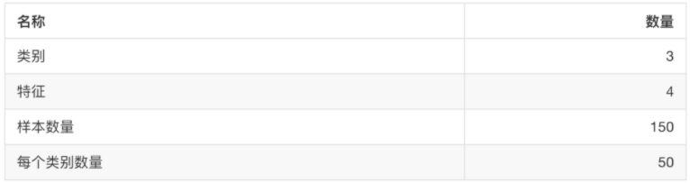

    + 加载并返回波士顿房价数据集：sklearn.datasets.load_boston()

    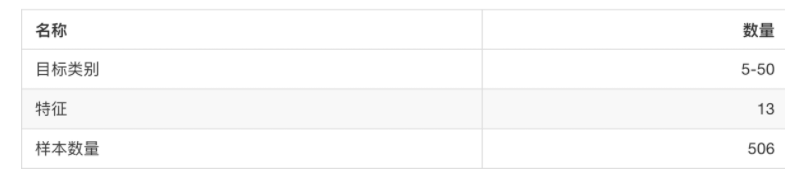

  

  + fetch_* 获取大规模数据集

    大数据集：sklearn.datasets.fetch_20newgroups(data_home=None, subset=“train”)

    第一个参数：是数据集下载的目录 , 默认是~/scikit_learn_data

    第二个参数 : “train” , “test” , “all” , 可选 , 按着要下载的数据集 , 训练集的"训练" , 测试集的"测试" , 两者的"全部"

    

  + 数据集地返回值： datasets.base.Bunch(字典格式)

    dist[“key”] = values
    bunch.key = values

    

+ 数据集的划分

  + 机器学习一般的数据集划分两部分

    + 训练数据：用于训练，构建模型
    + 测试数据：模型检验时使用，用于评估模型是否有效

    

  + 划分比例

    + 训练集：70% 80% 75%
    + 测试集：30% 20% 25%

    

  + 数据集划分的API

    sklearn.model_selection.train_test_split(*arrays, **options)

    + x 数据集的特征值
    + y 数据集的标签值
    + test_size 测试集的大小，一般为float
    + random_state 随机数种子，不同的种子造成不同的随机采样结果。相同的种子采样结果相同。
    + return 测试集特征训练集特征值

~~~ python
from sklearn.datasets import load_iris
from sklearn.model_selection import train_test_split

def datasets_demo():
    """
    sklearn 数据集使用
    :return:
    """
    # 1、获取鸢尾花数据集
    iris = load_iris()
    print("鸢尾花数据集返回值 \n", iris)
    # 返回值是一个继承自字典的Bench
    print("查看数据集描述 \n", iris.DESCR)
    print("查看数据集描述 \n", iris["DESCR"])
    print("鸢尾花的特征值名称", iris.feature_names)
    print("鸢尾花的特征值", iris.data)
    print("鸢尾花的目标值名称", iris.target_names)
    print("鸢尾花的目标值", iris.target)
    print("", iris.data.shape)
    
     # 2、对鸢尾花数据集进行分割
    # 训练集的特征值x_train 测试集的特征值x_test 训练集的目标值y_train 测试集的目标值y_test
    x_train, x_test, y_train, y_test = train_test_split(iris.data, iris.target, test_size=0.2, random_state=22)
    print("训练集的特征值", x_train, x_train.shape)
    print("测试集的特征值", x_test, x_test.shape)
    print("训练集的目标值", y_train, y_train.shape)
    print("测试集的目标值", y_test, y_test.shape)
    return None

if __name__ == "__main__":
    # 代码1 : sklearn数据集的使用
    datasets_demo()
~~~

## 2. 特征工程介绍

数据与特征决定了机器学习的上限 , 而模型与算法则是逼近这个上限

**特征工程包括**

- 特征抽取
- 特征预处理
- 特征降维

## 3. 特征抽取

什么是特征抽取？

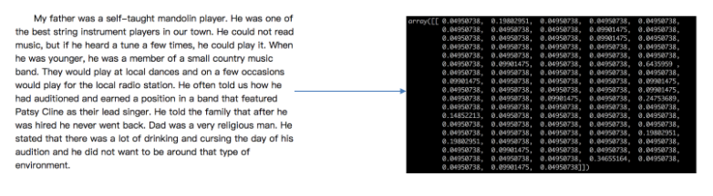

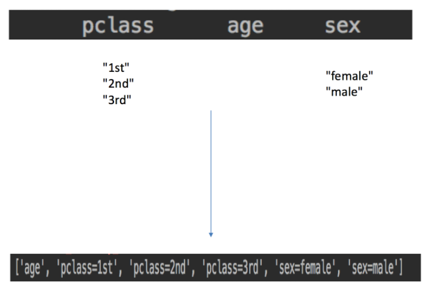

## 4. 特征提取 (特征值化)

将任意数据（如文本或图像）转换为可用于机器学习的数字特征

### 字典特征提取

**作用：对字典数据进行特征值化**

- sklearn.feature_extraction.DictVectorizer(sparse=True,…)

- - DictVectorizer.fit_transform(X) X:字典或者包含字典的迭代器返回值：返回sparse矩阵
  - DictVectorizer.inverse_transform(X) X:array数组或者sparse矩阵 返回值:转换之前数据格式
  - DictVectorizer.get_feature_names() 返回类别名称

- 

**示例**

~~~ python
[{'city': '北京','temperature':100}
{'city': '上海','temperature':60}
{'city': '深圳','temperature':30}]
~~~

~~~ python
from sklearn.feature_extraction import DictVectorizer

def dict_demo():
    """
    对字典类型的数据进行特征抽取
    :return: None
    """
    data = [{'city': '北京','temperature':100}, {'city': '上海','temperature':60}, {'city': '深圳','temperature':30}]
    # 1、实例化一个转换器类
    transfer = DictVectorizer(sparse=False)
    # 2、调用fit_transform
    data = transfer.fit_transform(data)
    # 打印特征名字
    print("特征名字：\n", transfer.get_feature_names())
    print("返回的结果:\n", data)
    return None

# 没有加上sparse=False参数的结果,返回sparse(稀疏)矩阵,将非零值按照位置(某行某列)表示,节省内存,提高加载效率
特征名字：
 ['city=上海', 'city=北京', 'city=深圳', 'temperature']
  (0, 1)    1.0
  (0, 3)    100.0
  (1, 0)    1.0
  (1, 3)    60.0
  (2, 2)    1.0
  (2, 3)    30.0
    
# 加上sparse=False参数的结果    
特征名字：
 ['city=上海', 'city=北京', 'city=深圳', 'temperature']
 [[   0.    1.    0.  100.]
 [   1.    0.    0.   60.]
 [   0.    0.    1.   30.]]
~~~

我们把这个处理数据的技巧叫做”one-hot“编码

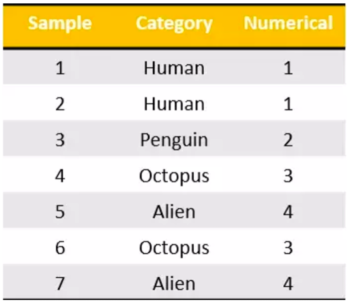

转化为：

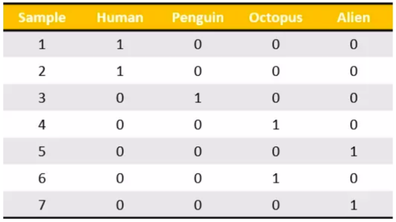

### 文本特征抽取

**作用：对文本数据进行特征值化**

- **sklearn.feature_extraction.text.CountVectorizer(stop_words=[])**

- - 返回词频矩阵
  - stop_words : 停用词

- CountVectorizer.fit_transform(X) X:文本或者包含文本字符串的可迭代对象 返回值：返回sparse矩阵
- CountVectorizer.inverse_transform(X) X:array数组或者sparse矩阵 返回值:转换之前数据格
- CountVectorizer.get_feature_names() 返回值:单词列表
- **sklearn.feature_extraction.text.TfidfVectorizer**

**示例**

~~~ python
["life is short,i like python",
"life is too long,i dislike python"]
~~~

~~~ python
from sklearn.feature_extraction.text import CountVectorizer

def text_count_demo():
    """
    对文本进行特征抽取，countvetorizer
    :return: None
    """
    data = ["life is short,i like like python", "life is too long,i dislike python"]
    # 1、实例化一个转换器类
    # transfer = CountVectorizer(sparse=False)
    transfer = CountVectorizer()
    # 2、调用fit_transform方法输入数据并转换 （注意返回格式，利用toarray()进行sparse矩阵转换array数组）
    data = transfer.fit_transform(data)
    print("返回特征名字：\n", transfer.get_feature_names())
    print("文本特征抽取的结果：\n", data.toarray())

    return None

返回特征名字：
 ['dislike', 'is', 'life', 'like', 'long', 'python', 'short', 'too']
 [[0 1 1 2 0 1 1 0]
 [1 1 1 0 1 1 0 1]]
~~~

#### jieba分词处理

~~~ python
from sklearn.feature_extraction.text import CountVectorizer
import jieba

def cut_word(text):
    """
    对中文进行分词
    "我爱北京天安门"————>"我 爱 北京 天安门"
    """
    # 用结巴对中文字符串进行分词
    text = " ".join(list(jieba.cut(text)))

    return text

def text_chinese_count_demo():
    """
    对中文进行特征抽取
    """
    data = ["一种还是一种今天很残酷，明天更残酷，后天很美好，但绝对大部分是死在明天晚上，所以每个人不要放弃今天。",
            "我们看到的从很远星系来的光是在几百万年之前发出的，这样当我们看到宇宙时，我们是在看它的过去。",
            "如果只用一种方式了解某样事物，你就不会真正了解它。了解事物真正含义的秘密取决于如何将其与我们所了解的事物相联系。"]
    # 将原始数据转换成分好词的形式
    text_list = []
    for sent in data:
        text_list.append(cut_word(sent))
    print(text_list)

    # 1、实例化一个转换器类
    # transfer = CountVectorizer(sparse=False)
    transfer = CountVectorizer()
    # 2、调用fit_transform
    data = transfer.fit_transform(text_list)
    print("返回特征名字：\n", transfer.get_feature_names())
    print("文本特征抽取的结果：\n", data.toarray())

    return None

['一种 还是 一种 今天 很 残酷 ， 明天 更 残酷 ， 后天 很 美好 ， 但 绝对 大部分 是 死 在 明天 晚上 ， 所以 每个 人 不要 放弃 今天 。', '我们 看到 的 从 很 远 星系 来 的 光是在 几百万年 之前 发出 的 ， 这样 当 我们 看到 宇宙 时 ， 我们 是 在 看 它 的 过去 。', '如果 只用 一种 方式 了解 某样 事物 ， 你 就 不会 真正 了解 它 。 了解 事物 真正 含义 的 秘密 取决于 如何 将 其 与 我们 所 了解 的 事物 相 联系 。']
返回特征名字：
 ['一种', '不会', '不要', '之前', '了解', '事物', '今天', '光是在', '几百万年', '发出', '取决于', '只用', '后天', '含义', '大部分', '如何', '如果', '宇宙', '我们', '所以', '放弃', '方式', '明天', '星系', '晚上', '某样', '残酷', '每个', '看到', '真正', '秘密', '绝对', '美好', '联系', '过去', '还是', '这样']
文本特征抽取的结果：
 [[2 0 1 0 0 0 2 0 0 0 0 0 1 0 1 0 0 0 0 1 1 0 2 0 1 0 2 1 0 0 0 1 1 0 0 1 0]
 [0 0 0 1 0 0 0 1 1 1 0 0 0 0 0 0 0 1 3 0 0 0 0 1 0 0 0 0 2 0 0 0 0 0 1 0 1]
 [1 1 0 0 4 3 0 0 0 0 1 1 0 1 0 1 1 0 1 0 0 1 0 0 0 1 0 0 0 2 1 0 0 1 0 0 0]]
~~~

**如果把这样的词语特征用于分类，会出现什么问题？比如想判断文章类型**

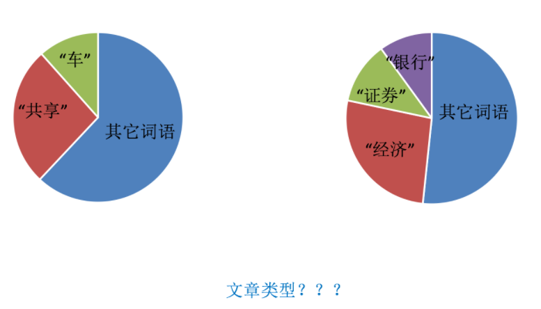

#### Tf-idf文本特征提取

- TF-IDF的主要思想是：如果**某个词或短语在一篇文章中出现的概率高，并且在其他文章中很少出现**，则认为此词或者短语具有很好的类别区分能力，适合用来分类。
- **TF-IDF作用：用以评估一字词对于一个文件集或一个语料库中的其中一份文件的重要程度。**

**公式**

- TF - 词频（term frequency，tf）指的是某一个给定的词语在该文件中出现的频率
- IDF -逆向文档频率（inverse document frequency，idf）是一个词语普遍重要性的度量。某一特定词语的idf，可以**由总文件数目除以包含该词语之文件的数目，再将得到的商取以10为底的对数得到**

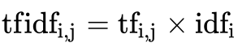

最终得出结果可以理解为重要程度。

**注：**假如一篇文件的总词语数是100个，而词语"非常"出现了5次，那么"非常"一词在该文件中的词频就是5/100=0.05。而计算文件频率（IDF）的方法是以文件集的文件总数，除以出现"非常"一词的文件数。所以，如果"非常"一词在1,000份文件出现过，而文件总数是10,000,000份的话，其逆向文件频率就是lg（10,000,000 / 1,0000）=3。最后"非常"对于这篇文档的tf-idf的分数为0.05 * 3=0.15

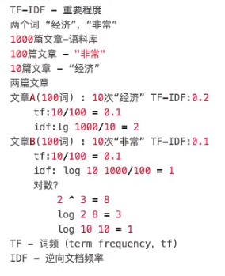

~~~ python
from sklearn.feature_extraction.text import TfidfVectorizer
import jieba

def cut_word(text):
    """
    对中文进行分词
    "我爱北京天安门"————>"我 爱 北京 天安门"
    :param text:
    :return: text
    """
    # 用结巴对中文字符串进行分词
    text = " ".join(list(jieba.cut(text)))

    return text

def text_chinese_tfidf_demo():
    """
    对中文进行特征抽取
    :return: None
    """
    data = ["一种还是一种今天很残酷，明天更残酷，后天很美好，但绝对大部分是死在明天晚上，所以每个人不要放弃今天。",
            "我们看到的从很远星系来的光是在几百万年之前发出的，这样当我们看到宇宙时，我们是在看它的过去。",
            "如果只用一种方式了解某样事物，你就不会真正了解它。了解事物真正含义的秘密取决于如何将其与我们所了解的事物相联系。"]
    # 将原始数据转换成分好词的形式
    text_list = []
    for sent in data:
        text_list.append(cut_word(sent))
    print(text_list)

    # 1、实例化一个转换器类
    # transfer = CountVectorizer(sparse=False)
    transfer = TfidfVectorizer(stop_words=['一种', '不会', '不要'])
    # 2、调用fit_transform
    data = transfer.fit_transform(text_list)
    print("返回特征名字：\n", transfer.get_feature_names())
    print("文本特征抽取的结果：\n", data.toarray())

    return None

['一种 还是 一种 今天 很 残酷 ， 明天 更 残酷 ， 后天 很 美好 ， 但 绝对 大部分 是 死 在 明天 晚上 ， 所以 每个 人 不要 放弃 今天 。', '我们 看到 的 从 很 远 星系 来 的 光是在 几百万年 之前 发出 的 ， 这样 当 我们 看到 宇宙 时 ， 我们 是 在 看 它 的 过去 。', '如果 只用 一种 方式 了解 某样 事物 ， 你 就 不会 真正 了解 它 。 了解 事物 真正 含义 的 秘密 取决于 如何 将 其 与 我们 所 了解 的 事物 相 联系 。']
返回特征名字：
 ['之前', '了解', '事物', '今天', '光是在', '几百万年', '发出', '取决于', '只用', '后天', '含义', '大部分', '如何', '如果', '宇宙', '我们', '所以', '放弃', '方式', '明天', '星系', '晚上', '某样', '残酷', '每个', '看到', '真正', '秘密', '绝对', '美好', '联系', '过去', '还是', '这样']
文本特征抽取的结果：
 [[0.         0.         0.         0.43643578 0.         0.
  0.         0.         0.         0.21821789 0.         0.21821789
  0.         0.         0.         0.         0.21821789 0.21821789
  0.         0.43643578 0.         0.21821789 0.         0.43643578
  0.21821789 0.         0.         0.         0.21821789 0.21821789
  0.         0.         0.21821789 0.        ]
 [0.2410822  0.         0.         0.         0.2410822  0.2410822
  0.2410822  0.         0.         0.         0.         0.
  0.         0.         0.2410822  0.55004769 0.         0.
  0.         0.         0.2410822  0.         0.         0.
  0.         0.48216441 0.         0.         0.         0.
  0.         0.2410822  0.         0.2410822 ]
 [0.         0.644003   0.48300225 0.         0.         0.
  0.         0.16100075 0.16100075 0.         0.16100075 0.
  0.16100075 0.16100075 0.         0.12244522 0.         0.
  0.16100075 0.         0.         0.         0.16100075 0.
  0.         0.         0.3220015  0.16100075 0.         0.
  0.16100075 0.         0.         0.        ]]
~~~

## 5. 特征预处理

什么是特征预处理？

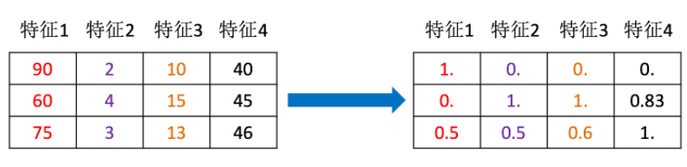

为什么要进行归一化/标准化？

- 特征的**单位或者大小相差较大，或者某特征的方差相比其他的特征要大出几个数量级**，**容易影响（支配）目标结果**，使得一些算法无法学习到其它的特征

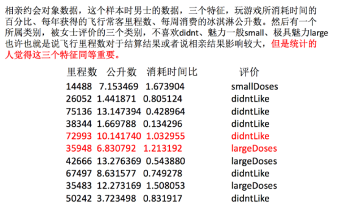

### 归一化

- 概念 : 通过一些转换函数将特征数据转换成更适合算法模型的特征数据的过程
- 公式

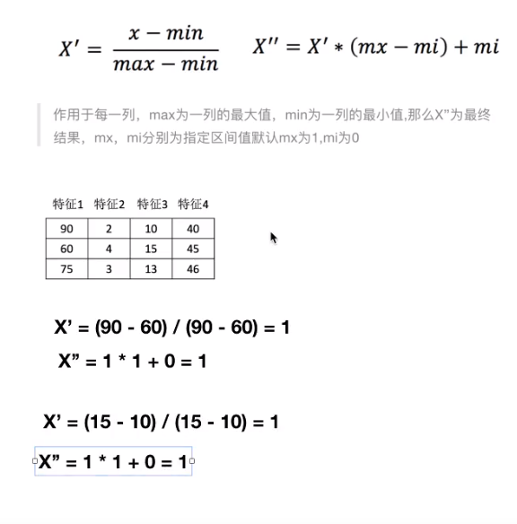

~~~ python
import pandas as pd
from sklearn.preprocessing import MinMaxScaler

def minmax_demo():
    """
    归一化演示
    :return: None
    """
    data = pd.read_csv("dating.txt")
    print(data)
    # 1、实例化一个转换器类
    transfer = MinMaxScaler(feature_range=(2, 3))
    # 2、调用fit_transform
    data = transfer.fit_transform(data[['milage','Liters','Consumtime']])
    print("最小值最大值归一化处理的结果：\n", data)

    return None

     milage     Liters  Consumtime  target
0     40920   8.326976    0.953952       3
1     14488   7.153469    1.673904       2
2     26052   1.441871    0.805124       1
3     75136  13.147394    0.428964       1
..      ...        ...         ...     ...
998   48111   9.134528    0.728045       3
999   43757   7.882601    1.332446       3

[1000 rows x 4 columns]
最小值最大值归一化处理的结果：
 [[ 2.44832535  2.39805139  2.56233353]
 [ 2.15873259  2.34195467  2.98724416]
 [ 2.28542943  2.06892523  2.47449629]
 ..., 
 [ 2.29115949  2.50910294  2.51079493]
 [ 2.52711097  2.43665451  2.4290048 ]
 [ 2.47940793  2.3768091   2.78571804]]
~~~

**总结：**注意最大值最小值是变化的，另外，最大值与最小值非常容易受异常点影响，**所以这种方法鲁棒性较差，只适合传统精确小数据场景。**

**问题：**如果数据中异常点较多，会有什么影响？

### 标准化（常用）

- 概念：通过对原始数据进行变换把数据变换到均值为0,标准差为1范围内
- 公式：

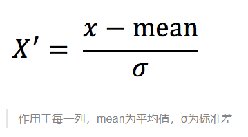

- 对于归一化来说：如果出现异常点，影响了最大值和最小值，那么结果显然会发生改变
- 对于标准化来说：如果出现异常点，由于具有一定数据量，少量的异常点对于平均值的影响并不大，从而方差改变较小。

~~~ python
import pandas as pd
from sklearn.preprocessing import StandardScaler

def stand_demo():
    """
    标准化演示
    :return: None
    """
    data = pd.read_csv("dating.txt")
    print(data)
    # 1、实例化一个转换器类
    transfer = StandardScaler()
    # 2、调用fit_transform
    data = transfer.fit_transform(data[['milage','Liters','Consumtime']])
    print("标准化的结果:\n", data)
    print("每一列特征的平均值：\n", transfer.mean_)
    print("每一列特征的方差：\n", transfer.var_)

    return None

     milage     Liters  Consumtime  target
0     40920   8.326976    0.953952       3
1     14488   7.153469    1.673904       2
2     26052   1.441871    0.805124       1
..      ...        ...         ...     ...
997   26575  10.650102    0.866627       3
998   48111   9.134528    0.728045       3
999   43757   7.882601    1.332446       3

[1000 rows x 4 columns]
标准化的结果:
 [[ 0.33193158  0.41660188  0.24523407]
 [-0.87247784  0.13992897  1.69385734]
 [-0.34554872 -1.20667094 -0.05422437]
 ..., 
 [-0.32171752  0.96431572  0.06952649]
 [ 0.65959911  0.60699509 -0.20931587]
 [ 0.46120328  0.31183342  1.00680598]]
每一列特征的平均值：
 [  3.36354210e+04   6.55996083e+00   8.32072997e-01]
每一列特征的方差：
 [  4.81628039e+08   1.79902874e+01   2.46999554e-01]
~~~

**总结：**在已有样本足够多的情况下比较稳定，适合现代嘈杂大数据场景。

## 6. 特征降维

**含义：**降低维数即降低特征的个数 , 得到一组不相关的主变量的过程

为什么特征选择

- 冗余：部分特征的相关度高，容易消耗计算性能
- 噪声：部分特征对预测结果有影响

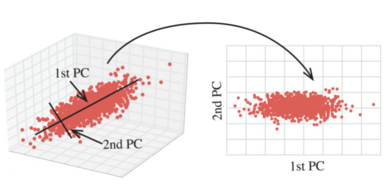

- 降维的两种方式 : 特征选择 , 主成分分析
- 模块 : sklearn.feature_selection
- **特征选择 : 数据中包含冗或相关变量(如称特征 , 属性 , 指标等) , 旨在原有特征中找出主要特征**

### 特征选择

- **概述：**单纯的从提取到的所有特征中选择部分特征作为训练集特征，特征在选择前和选择后可以改变值、也不改变值，但是选择后特征维数比选择前小，毕竟我们只选择了其中一部分特征。

- **方法：**

  + **Filter(过滤式)：主要探究特征本身特点、特征与特征和目标值之间关联**

    + **方差选择法：低方差特征过滤**

    + **相关系数**

  + **Embedded (嵌入式)：算法自动选择特征（特征与目标值之间的关联）**

    + **决策树:信息熵、信息增益**

    + **正则化：L1、L2**

    + **深度学习：卷积等**

### 过滤式

低方差特征过滤

删除低方差的一些特征，前面讲过方差的意义。再结合方差的大小来考虑这个方式的角度。

- 特征方差小：某个特征大多样本的值比较相近
- 特征方差大：某个特征很多样本的值都有差别

### API

- sklearn.feature_selection.VarianceThreshold(threshold = 0.0)

- - 删除所有低方差特征
  - Variance.fit_transform(X)

- - - X:numpy array格式的数据[n_samples,n_features]
    - 返回值：训练集差异低于threshold的特征将被删除。默认值是保留所有非零方差特征，即删除所有样本中具有相同值的特征。

**数据计算**：我们对某些股票的指标特征之间进行一个筛选，数据在"factor_regression_data/factor_returns.csv"文件当中,除去'index,'date','return'列不考虑（这些类型不匹配，也不是所需要指标）

一共这些特征

~~~ python
from sklearn.feature_selection import VarianceThreshold
from scipy.stats import pearsonr
import pandas as pd

def variance_demo():
    """
    过滤低方差特征
    :return: None
    """
    # 1. 获取数据
    data = pd.read_csv("factor_returns.csv")
    print(data)
    # 2. 实例化一个转换器类
    transfer = VarianceThreshold(threshold=1)
    # 3. 调用fit_transform
    data = transfer.fit_transform(data.iloc[:, 1:10])
    print("删除低方差特征的结果：\n", data)
    print("形状：\n", data.shape)

    return None

            index  pe_ratio  pb_ratio    market_cap  \
0     000001.XSHE    5.9572    1.1818  8.525255e+10   
1     000002.XSHE    7.0289    1.5880  8.411336e+10    
...           ...       ...       ...           ...   
2316  601958.XSHG   52.5408    2.4646  3.287910e+10   
2317  601989.XSHG   14.2203    1.4103  5.911086e+10   

      return_on_asset_net_profit  du_return_on_equity            ev  \
0                         0.8008              14.9403  1.211445e+12   
1                         1.6463               7.8656  3.002521e+11    
...                          ...                  ...           ...   
2316                      2.7444               2.9202  3.883803e+10   
2317                      2.0383               8.6179  2.020661e+11   

      earnings_per_share       revenue  total_expense        date    return  
0                 2.0100  2.070140e+10   1.088254e+10  2012-01-31  0.027657  
1                 0.3260  2.930837e+10   2.378348e+10  2012-01-31  0.082352  
2                -0.0060  1.167983e+07   1.203008e+07  2012-01-31  0.099789   
...                  ...           ...            ...         ...       ...  
2315              0.2200  1.789082e+10   1.749295e+10  2012-11-30  0.137134  
2316              0.1210  6.465392e+09   6.009007e+09  2012-11-30  0.149167  
2317              0.2470  4.509872e+10   4.132842e+10  2012-11-30  0.183629  

[2318 rows x 12 columns]
删除低方差特征的结果：
 [[  5.95720000e+00   1.18180000e+00   8.52525509e+10 ...,   1.21144486e+12
    2.07014010e+10   1.08825400e+10]
 [  7.02890000e+00   1.58800000e+00   8.41133582e+10 ...,   3.00252062e+11
    2.93083692e+10   2.37834769e+10]
 [ -2.62746100e+02   7.00030000e+00   5.17045520e+08 ...,   7.70517753e+08
    1.16798290e+07   1.20300800e+07]
 ..., 
 [  3.95523000e+01   4.00520000e+00   1.70243430e+10 ...,   2.42081699e+10
    1.78908166e+10   1.74929478e+10]
 [  5.25408000e+01   2.46460000e+00   3.28790988e+10 ...,   3.88380258e+10
    6.46539204e+09   6.00900728e+09]
 [  1.42203000e+01   1.41030000e+00   5.91108572e+10 ...,   2.02066110e+11
    4.50987171e+10   4.13284212e+10]]
形状：
 (2318, 8)
~~~

**相关系数** 

- 皮尔逊相关系数(Pearson Correlation Coefficient)

- - 反映变量之间相关关系密切程度的统计指标

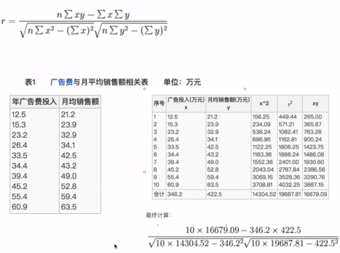

= 0.9942

**所以我们最终得出结论是广告投入费与月平均销售额之间有高度的正相关关系。** 　　

**相关系数特点**

**相关系数的值介于–1与+1之间，即–1≤ r ≤+1**。其性质如下：

- **当r>0时，表示两变量正相关，r<0时，两变量为负相关**
- 当|r|=1时，表示两变量为完全相关，当r=0时，表示两变量间无相关关系
- **当0<|r|<1时，表示两变量存在一定程度的相关。且|r|越接近1，两变量间线性关系越密切；|r|越接近于0，表示两变量的线性相关越弱**
- **一般可按三级划分：|r|<0.4为低度相关；0.4≤|r|<0.7为显著性相关；0.7≤|r|<1为高度线性相关**

> 这个符号：|r|为r的绝对值， |-5| = 5

API

from scipy.stats import pearsonr

●x : (N,) array_like

●y : (N,) array_like Returns: (Pearson’s correlation coefficient, p-value)

案例：股票的财务指标相关性计算

~~~ python
import pandas as pd
from scipy.stats import pearsonr

def pearsonr_demo():
    """
    相关系数计算
    :return: None
    """
    data = pd.read_csv("factor_returns.csv")
	# 我们刚才的股票的这些指标进行相关性计算， 假设我们以
    factor = ['pe_ratio', 'pb_ratio', 'market_cap', 'return_on_asset_net_profit', 'du_return_on_equity', 'ev',
              'earnings_per_share', 'revenue', 'total_expense']

    for i in range(len(factor)):
        for j in range(i, len(factor) - 1):
            print(
                "指标%s与指标%s之间的相关性大小为%f" % (factor[i], factor[j + 1], pearsonr(data[factor[i]], data[factor[j + 1]])[0]))

    return None

指标pe_ratio与指标pb_ratio之间的相关性大小为-0.004389
指标pe_ratio与指标market_cap之间的相关性大小为-0.068861
指标pe_ratio与指标return_on_asset_net_profit之间的相关性大小为-0.066009
指标pe_ratio与指标du_return_on_equity之间的相关性大小为-0.082364
指标pe_ratio与指标ev之间的相关性大小为-0.046159
指标pe_ratio与指标earnings_per_share之间的相关性大小为-0.072082
指标pe_ratio与指标revenue之间的相关性大小为-0.058693
指标pe_ratio与指标total_expense之间的相关性大小为-0.055551
指标pb_ratio与指标market_cap之间的相关性大小为0.009336
指标pb_ratio与指标return_on_asset_net_profit之间的相关性大小为0.445381
指标pb_ratio与指标du_return_on_equity之间的相关性大小为0.291367
指标pb_ratio与指标ev之间的相关性大小为-0.183232
指标pb_ratio与指标earnings_per_share之间的相关性大小为0.198708
指标pb_ratio与指标revenue之间的相关性大小为-0.177671
指标pb_ratio与指标total_expense之间的相关性大小为-0.173339
指标market_cap与指标return_on_asset_net_profit之间的相关性大小为0.214774
指标market_cap与指标du_return_on_equity之间的相关性大小为0.316288
指标market_cap与指标ev之间的相关性大小为0.565533
指标market_cap与指标earnings_per_share之间的相关性大小为0.524179
指标market_cap与指标revenue之间的相关性大小为0.440653
指标market_cap与指标total_expense之间的相关性大小为0.386550
指标return_on_asset_net_profit与指标du_return_on_equity之间的相关性大小为0.818697
指标return_on_asset_net_profit与指标ev之间的相关性大小为-0.101225
指标return_on_asset_net_profit与指标earnings_per_share之间的相关性大小为0.635933
指标return_on_asset_net_profit与指标revenue之间的相关性大小为0.038582
指标return_on_asset_net_profit与指标total_expense之间的相关性大小为0.027014
指标du_return_on_equity与指标ev之间的相关性大小为0.118807
指标du_return_on_equity与指标earnings_per_share之间的相关性大小为0.651996
指标du_return_on_equity与指标revenue之间的相关性大小为0.163214
指标du_return_on_equity与指标total_expense之间的相关性大小为0.135412
指标ev与指标earnings_per_share之间的相关性大小为0.196033
指标ev与指标revenue之间的相关性大小为0.224363
指标ev与指标total_expense之间的相关性大小为0.149857
指标earnings_per_share与指标revenue之间的相关性大小为0.141473
指标earnings_per_share与指标total_expense之间的相关性大小为0.105022
指标revenue与指标total_expense之间的相关性大小为0.995845
~~~

从中我们得出

- 指标revenue与指标total_expense之间的相关性大小为0.995845
- 指标return_on_asset_net_profit与指标du_return_on_equity之间的相关性大小为0.818697

我们也可以通过画图来观察结果

~~~ python
import matplotlib.pyplot as plt

plt.figure(figsize=(20, 8), dpi=100)
plt.scatter(data['revenue'], data['total_expense'])
plt.show()
~~~

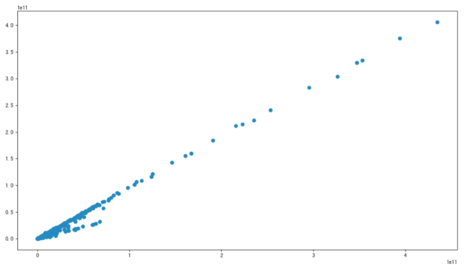

### 主成分分析 (PCA)

- 定义：**高维数据转化为低维数据的过程**，在此过程中**可能会舍弃原有数据、创造新的变量**
- 作用：**是数据维数压缩，尽可能降低原数据的维数（复杂度），损失少量信息。**
- 应用：回归分析或者聚类分析当中

那么更好的理解这个过程呢？我们来看一张图

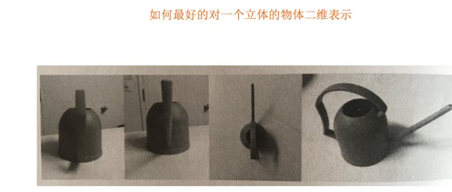

- API

- - sklearn.decomposition.PCA(n_components=None)
  - 将数据分解为较低维数空间
  - n_components:

- - - **小数：表示保留百分之多少的信息**
    - **整数：减少到多少特征**

- - PCA.fit_transform(X) X:numpy array格式的数据[n_samples,n_features]
  - 返回值：转换后指定维度的array

~~~ python
from sklearn.decomposition import PCA

def pca_demo():
    """
    对数据进行PCA降维
    :return: None
    """
    data = [[2,8,4,5], [6,3,0,8], [5,4,9,1]]

    # 1、实例化PCA, 小数——保留多少信息
    transfer = PCA(n_components=0.9)
    # 2、调用fit_transform
    data1 = transfer.fit_transform(data)

    print("保留90%的信息，降维结果为：\n", data1)

    # 1、实例化PCA, 整数——指定降维到的维数
    transfer2 = PCA(n_components=3)
    # 2、调用fit_transform
    data2 = transfer2.fit_transform(data)
    print("降维到3维的结果：\n", data2)

    return None

保留90%的信息，降维结果为：
 [[ -3.13587302e-16   3.82970843e+00]
 [ -5.74456265e+00  -1.91485422e+00]
 [  5.74456265e+00  -1.91485422e+00]]
降维到3维的结果：
 [[ -3.13587302e-16   3.82970843e+00   4.59544715e-16]
 [ -5.74456265e+00  -1.91485422e+00   4.59544715e-16]
 [  5.74456265e+00  -1.91485422e+00   4.59544715e-16]]
~~~

#### 案例

- 案例 : 探究用户对物品类别的喜好细分

数据如下：

- order_products__prior.csv：订单与商品信息

- - 字段：**order_id**, **product_id**, add_to_cart_order, reordered

- products.csv：商品信息

- - 字段：**product_id**, product_name, **aisle_id**, department_id

- orders.csv：用户的订单信息

- - 字段：**order_id**,**user_id**,eval_set,order_number,….

- aisles.csv：商品所属具体物品类别

- - 字段： **aisle_id**, **aisle**

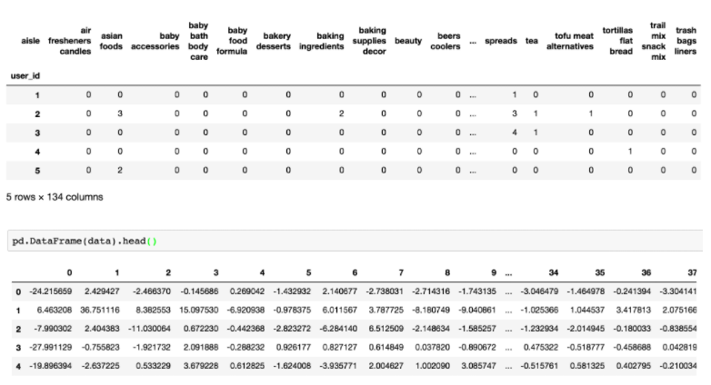

- user_id  aisle
  第一 : 合并表，使得**user_id**与**aisle**在一张表当中
  第二 : 找到user_id和aisle的关系 — 交叉表和透视表
  第三 : 特征冗余过多 , PCA降维

~~~ python
# 1. 获取数据
# 2. 合并表
# 3. 找到user_id和aisle之间的关系
# 4. PCA降维

import pandas as pd
from sklearn.decomposition import PCA

# 1、获取数据集
# ·商品信息- products.csv：
# Fields：product_id, product_name, aisle_id, department_id
# ·订单与商品信息- order_products__prior.csv：
# Fields：order_id, product_id, add_to_cart_order, reordered 
# ·用户的订单信息- orders.csv：
# Fields：order_id, user_id,eval_set, order_number,order_dow, order_hour_of_day, days_since_prior_order 
# ·商品所属具体物品类别- aisles.csv：
# Fields：aisle_id, aisle     
products = pd.read_csv("./instacart/products.csv")
order_products = pd.read_csv("./instacart/order_products__prior.csv")
orders = pd.read_csv("./instacart/orders.csv")
aisles = pd.read_csv("./instacart/aisles.csv")

# 2、合并表，将user_id和aisle放在一张表上
# 1）合并orders和order_products on=order_id tab1:order_id, product_id, user_id
tab1 = pd.merge(orders, order_products, on=["order_id", "order_id"])
# 2）合并tab1和products on=product_id tab2:aisle_id
tab2 = pd.merge(tab1, products, on=["product_id", "product_id"])
# 3）合并tab2和aisles on=aisle_id tab3:user_id, aisle
tab3 = pd.merge(tab2, aisles, on=["aisle_id", "aisle_id"])

# 3、交叉表处理，把user_id和aisle进行分组
table = pd.crosstab(tab3["user_id"], tab3["aisle"])

# 4、主成分分析的方法进行降维
# 1）实例化一个转换器类PCA
transfer = PCA(n_components=0.95)
# 2）fit_transform
data = transfer.fit_transform(table)

data.shape

# 返回结果
(206209, 44)
~~~

