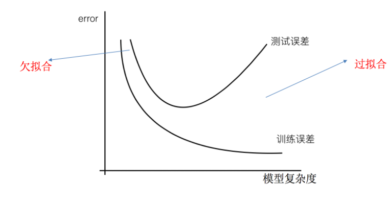

# 线性回归

- 回归问题
  目标值 - 是连续型的数据
- **定义**：线性回归(Linear regression)是利用回归方程(函数)对一个或多个自变量(特征值)和因变量(目标值)之间关系进行建模的一种分析方式。
- **应用场景**：房价预测、销售额度预测、金融（贷款额度预测，利用线性回归以及系数分析因子）
- **特点：**只有一个自变量的情况称为单变量回归，大于一个自变量情况的叫做多元回归

那么怎么理解呢？我们来看几个例子

- **期末成绩：0.7×考试成绩+0.3×平时成绩**
- **房子价格 = 0.02×中心区域的距离 + 0.04×城市一氧化氮浓度 + (-0.12×自住房平均房价) + 0.254×城镇犯罪率**

上面两个例子，**我们看到特征值与目标值之间建立的一个关系，这个可以理解为回归方程**。

线性回归当中的关系有两种，一种是线性关系，另一种是非线性关系。**在这里我们只能画一个平面更好去理解，所以都用单个特征举例子。**

## 线性关系

**注释**：如果在单特征与目标值的关系呈直线关系，或者两个特征与目标值呈现平面的关系，更高维度的我们不用自己去想，记住这种关系即可

**注释：**为什么会这样的关系呢？原因是什么？我们后面 讲解过拟合欠拟合重点介绍，如果是非线性关系，那么回归方程可以理解为：w1x1+w2x2^2+w3x3^2

**线性模型：**函数关系中符合两种情况的任意一种即为线性模型

- 线性关系一定是线性模型，线性模型不一定是线性关系

## 损失函数

**假设刚才的房子例子，真实的数据之间存在这样的关系**

~~~ tex
真实关系：真实房子价格 = 0.02×中心区域的距离 + 0.04×城市一氧化氮浓度 + (-0.12×自住房平均房价) + 0.254×城镇犯罪率
~~~

那么现在呢，我们随意指定一个关系（猜测）

~~~ tex
随机指定关系：预测房子价格 = 0.25×中心区域的距离 + 0.14×城市一氧化氮浓度 + 0.42×自住房平均房价 + 0.34×城镇犯罪率
~~~

请问这样的话，会发生什么？真实结果与我们预测的结果之间是不是存在一定的误差呢？类似这样样子

那么存在这个误差，我们将这个误差给衡量出来

- 真实关系与假定关系之间存在一定的误差，这个误差用损失函数（cost / 成本函数 / 目标函数）表示，**损失函数** 定义如下：

- y_i为第i个训练样本的真实值
- h(x_i)为第i个训练样本特征值组合预测函数
- 又称最小二乘法

**如何去减少这个损失，使我们预测的更加准确些？既然存在了这个损失，我们一直说机器学习有自动学习的功能，在线性回归这里更是能够体现。这里可以通过一些优化方法去优化（其实是数学当中的求导功能）回归的总损失！！！**

## 优化算法

**如何去求模型当中的W，使得损失最小？（目的是找到最小损失对应的W值）**

### 1. 正规方程（直接求 W ）

X为特征值矩阵，Y为目标值矩阵，直接求得最好的结果，当过多过于复杂的特征时，求解速度慢而且求不到结果

**理解**：X为特征值矩阵，y为目标值矩阵。直接求到最好的结果

**缺点**：当特征过多过复杂时，求解速度太慢并且得不到结果

### 2. 梯度下降

### 

α在梯度下降算法中被称作为**学习率**或者**步长**，意味着我们可以通过α来控制每一步走的距离。α不能太大, 会导致错过最低点; 也不能太小, 可能导致迟迟走不到最低点。

梯度前加一个负号，就意味着朝着梯度相反的方向前进！梯度的方向实际就是函数在此点上升最快的方向！而我们需要朝着下降最快的方向走，自然就是负的梯度的方向，所以此处需要加上负号。

我们通过两个图更好理解梯度下降的过程

**所以有了梯度下降这样一个优化算法，回归就有了"自动学习"的能力**

### 3. 梯度下降方法

- **全梯度下降算法(Full gradient descent),**
- **随机梯度下降算法(Stochastic gradient descent),**
- **小批量梯度下降算法(Mini-batch gradient descent),**
- **随机平均梯度下降算法(Stochastic average gradient descent)**

### 4. 梯度下降优化器（GD、SGD、SAG）

- 文字对比

| 梯度下降             | 正规方程                        |
| -------------------- | ------------------------------- |
| 需要选择学习率       | 不需要                          |
| 需要迭代求解         | 一次运算得出                    |
| 特征数量较大可以使用 | 需要计算方程，时间复杂度高O(n3) |

- 选择：

- - 小规模数据：

- - - **LinearRegression(不能解决拟合问题)**
    - 岭回归

- - 大规模数据：SGDRegressor

**GD：**梯度下降(Gradient Descent)，原始的梯度下降法需要计算所有样本的值才能够得出梯度，计算量大，所以后面才有会一系列的改进。

**SGD： ** **随机梯度下降(Stochastic gradient descent)是一个优化方法。它在一次迭代时只考虑一个训练样本。**

- SGD的优点是：

- - 高效
  - 容易实现

- SGD的缺点是：

- - SGD需要许多超参数：比如正则项参数、迭代数。
  - SGD对于特征标准化是敏感的。

**SAG：**随机平均梯度法(Stochasitc Average Gradient)，由于收敛的速度太慢，有人提出SAG等基于梯度下降的算法

> Scikit-learn：SGDRegressor、岭回归、逻辑回归等当中都会有SAG优化

### 5. 线性回归API

**sklearn.linear_model.LinearRegression(fit_intercept=True)** : 通过正规方程优化

参数

- fit_intercept：是否计算偏置

属性

- LinearRegression.coef_：回归系数
- LinearRegression.intercept_：偏置

**sklearn.linear_model.SGDRegressor(loss="squared_loss", fit_intercept=True, learning_rate ='invscaling', eta0=0.01)**

SGDRegressor类实现了随机梯度下降学习，它支持不同的**loss函数和正则化惩罚项**来拟合线性回归模型。

参数：

- **loss=”squared_loss”: 普通最小二乘法**
- fit_intercept：是否计算偏置
- learning_rate : 学习率填充

- - 'constant': eta = eta0
  - 'optimal': eta = 1.0 / (alpha * (t + t0)) [default]
  -  'invscaling': eta = eta0 / pow(t, power_t)  **power_t=0.25:存在父类当中**

-  属性：

- - SGDRegressor.coef_：回归系数
  - SGDRegressor.intercept_：偏置

### 6. 波士顿房价预测

#### 6.1 回归性能评估

均方误差(Mean Squared Error)MSE)：

注：为预测值，为真实值

**sklearn.metrics.mean_squared_error(y_true, y_pred)**

- y_true:真实值
- y_pred:预测值
- return:浮点数结果

#### 6.2 代码实现

#### 6.2.1 正规方程

~~~ python
from sklearn.datasets import load_boston
from sklearn.model_selection import train_test_split
from sklearn.preprocessing import StandardScaler
from sklearn.linear_model import LinearRegression
from sklearn.metrics import mean_squared_error

# 1.获取数据
data = load_boston()
# 2.数据集划分
x_train, x_test, y_train, y_test = train_test_split(data.data, data.target, random_state=22)
# 3.特征工程-标准化
transfer = StandardScaler()
x_train = transfer.fit_transform(x_train)
x_test = transfer.transform(x_test)
# 4.机器学习-线性回归(正规方程)
estimator = LinearRegression()
estimator.fit(x_train, y_train)
# 5.模型评估
# 5.1 获取系数等值
y_predict = estimator.predict(x_test)
print("预测值为:\n", y_predict)
print("模型中的系数为:\n", estimator.coef_)
print("模型中的偏置为:\n", estimator.intercept_)
# 5.2 评价
# 均方误差
error = mean_squared_error(y_test, y_predict)0.
print("误差为:\n", error)
~~~

#### 6.2.2 梯度下降法

~~~ python
from sklearn.datasets import load_boston
from sklearn.model_selection import train_test_split
from sklearn.preprocessing import StandardScaler
from sklearn.linear_model import SGDRegressor
from sklearn.metrics import mean_squared_error

# 1.获取数据
data = load_boston()
# 2.数据集划分
x_train, x_test, y_train, y_test = train_test_split(data.data, data.target, random_state=22)
# 3.特征工程-标准化
transfer = StandardScaler()
x_train = transfer.fit_transform(x_train)
x_test = transfer.transform(x_test)
# 4.机器学习-线性回归(特征方程)
estimator = SGDRegressor(max_iter=1000)
estimator.fit(x_train, y_train)
# 5.模型评估
# 5.1 获取系数等值
y_predict = estimator.predict(x_test)
print("预测值为:\n", y_predict)
print("模型中的系数为:\n", estimator.coef_)
print("模型中的偏置为:\n", estimator.intercept_)
# 5.2 评价
# 均方误差
error = mean_squared_error(y_test, y_predict)
print("误差为:\n", error)
~~~

### 7. 正则化线性模型

正则化力度越大，权重系数会越小

正则化力度越小，权重系数会越大

#### 7.1 Ridge Regression (岭回归, Tikhonov regularization)

岭回归是线性回归的正则化版本，即在原来的线性回归的 cost function 中添加正则项(regularization term), 以达到在拟合数据的同时，使模型权重尽可能小的目的,岭回归代价函数: 

>  α=0：岭回归退化为线性回归

#### 7.2 Lasso Regression(Lasso 回归)

Lasso 回归是线性回归的另一种正则化版本，正则项为权值向量的ℓ1范数。 

**注意**

-  Lasso Regression 的代价函数在 处是不可导的.

+ 解决方法：在处用一个次梯度向量(subgradient vector)代替梯度，如下式

Lasso Regression 有一个很重要的性质是：倾向于完全消除不重要的权重。

例如：当α 取值相对较大时，高阶多项式退化为二次甚至是线性：高阶多项式特征的权重被置为0。

也就是说，Lasso Regression 能够自动进行特征选择，并输出一个稀疏模型（只有少数特征的权重是非零的）。

#### 7.3 Elastic Net (弹性网络)

弹性网络在岭回归和Lasso回归中进行了折中，通过 **混合比(mix ratio) r** 进行控制： 

- r=0：弹性网络变为岭回归
- r=1：弹性网络便为Lasso回归

#### 7.4 api

~~~ python
from sklearn.linear_model import Ridge, ElasticNet, Lasso
~~~

**sklearn.linear_model.Ridge(alpha=1.0, fit_intercept=True,solver="auto", normalize=False)**

- 具有l2正则化的线性回归
- alpha:正则化力度，也叫 λ, **取值：0~1 1~10**
- solver:会根据数据自动选择优化方法

- - **sag: 如果数据集、特征都比较大，选择该随机梯度下降优化**

- normalize:数据是否进行标准化

- - normalize=False:可以在fit之前调用preprocessing.StandardScaler标准化数据

- Ridge.coef_:回归权重
- Ridge.intercept_:回归偏置

> **Ridge方法相当于SGDRegressor(penalty='l2', loss="squared_loss"),只不过SGDRegressor实现了一个普通的随机梯度下降学习，推荐使用Ridge(实现了SAG)**

**sklearn.linear_model.RidgeCV(_BaseRidgeCV, RegressorMixin)**

- 具有l2正则化的线性回归，可以进行交叉验证
- coef_:回归系数

~~~ python
class _BaseRidgeCV(LinearModel):
    def __init__(self, alphas=(0.1, 1.0, 10.0),
                 fit_intercept=True, normalize=False,scoring=None,
                 cv=None, gcv_mode=None,
                 store_cv_values=False):
~~~

#### 7.5 波士顿房价预测

~~~ python
from sklearn.datasets import load_boston
from sklearn.model_selection import train_test_split
from sklearn.preprocessing import StandardScaler
from sklearn.linear_model import Ridge, RidgeCV
from sklearn.metrics import mean_squared_error

# 1.获取数据
data = load_boston()
# 2.数据集划分
x_train, x_test, y_train, y_test = train_test_split(data.data, data.target, random_state=22)
# 3.特征工程-标准化
transfer = StandardScaler()
x_train = transfer.fit_transform(x_train)
x_test = transfer.transform(x_test)
# 4.机器学习-线性回归(岭回归)
estimator = Ridge(alpha=1)
# estimator = RidgeCV(alphas=(0.1, 1, 10))
estimator.fit(x_train, y_train)
# 5.模型评估
# 5.1 获取系数等值
y_predict = estimator.predict(x_test)
print("预测值为:\n", y_predict)
print("模型中的系数为:\n", estimator.coef_)
print("模型中的偏置为:\n", estimator.intercept_)
# 5.2 评价
# 均方误差
error = mean_squared_error(y_test, y_predict)
print("误差为:\n", error)
~~~

### 8. 模型的保存和加载

**import joblib**

- 保存：joblib.dump(estimator, 'test.pkl')
- 加载：estimator = joblib.load('test.pkl')

~~~ python
from sklearn.datasets import load_boston
from sklearn.model_selection import train_test_split
from sklearn.preprocessing import StandardScaler
from sklearn.linear_model import Ridge, RidgeCV
from sklearn.metrics import mean_squared_error
import joblib

# 1.获取数据
data = load_boston()
# 2.数据集划分
x_train, x_test, y_train, y_test = train_test_split(data.data, data.target, random_state=22)
# 3.特征工程-标准化
transfer = StandardScaler()
x_train = transfer.fit_transform(x_train)
x_test = transfer.transform(x_test)
# # 4.机器学习-线性回归(岭回归)
# # 4.1 模型训练
# estimator = Ridge(alpha=1)
# estimator.fit(x_train, y_train)
# # 4.2 模型保存
# joblib.dump(estimator, "./data/test.pkl")
# 4.3 模型加载
estimator = joblib.load("./data/test.pkl")
# 5.模型评估
# 5.1 获取系数等值
y_predict = estimator.predict(x_test)
print("预测值为:\n", y_predict)
print("模型中的系数为:\n", estimator.coef_)
print("模型中的偏置为:\n", estimator.intercept_)
# 5.2 评价
# 均方误差
error = mean_squared_error(y_test, y_predict)
print("误差为:\n", error)
~~~

# 欠拟合与过拟合

- 欠拟合：一个假设在训练数据上不能获得更好的拟合，并且在测试数据集上也不能很好地拟合数据，此时认为这个假设出现了欠拟合的现象。(模型过于简单)

- 过拟合：一个假设在训练数据上能够获得比其他假设更好的拟合， 但是在测试数据集上却不能很好地拟合数据，此时认为这个假设出现了过拟合的现象。(模型过于复杂)

分析

- 第一种情况：因为机器学习到的天鹅特征太少了，导致区分标准太粗糙，不能准确识别出天鹅。
- 第二种情况：机器已经基本能区别天鹅和其他动物了。然后，很不巧已有的天鹅图片全是白天鹅的，于是机器经过学习后，会认为天鹅的羽毛都是白的，以后看到羽毛是黑的天鹅就会认为那不是天鹅。

那么是什么原因导致模型复杂？线性回归进行训练学习的时候变成模型会变得复杂，这里就对应前面再说的线性回归的两种关系，非线性关系的数据，也就是存在很多无用的特征或者现实中的事物特征跟目标值的关系并不是简单的线性关系。

## 原因以及解决办法

- 欠拟合原因以及解决办法

- - 原因：学习到数据的特征过少
  - 解决办法：增加数据的特征数量

- 过拟合原因以及解决办法

- - 原因：原始特征过多，存在一些嘈杂特征， 模型过于复杂是因为模型尝试去兼顾各个测试数据点
  - 解决办法：

- - - 正则化

> 在这里针对回归，我们选择了正则化。但是对于其他机器学习算法如分类算法来说也会出现这样的问题，除了一些算法本身作用之外（决策树、神经网络），我们更多的也是去自己做特征选择，包括之前说的删除、合并一些特征

在学习的时候，数据提供的特征有些影响模型复杂度或者这个特征的数据点异常较多，所以算法在学习的时候尽量减少这个特征的影响（甚至删除某个特征的影响），这就是正则化

**注**：调整时候，算法并不知道某个特征影响，而是去调整参数得出优化的结果

## 正则化类别

- L2正则化

- - 作用：可以使得其中一些W的都很小，都接近于0，削弱某个特征的影响
  - 优点：越小的参数说明模型越简单，越简单的模型则越不容易产生过拟合现象
  - Ridge回归- 岭回归
  - 加入 L2 正则化后损失函数：
  - m 为样本数，n为特征数

- L1正则化

- - 作用：可以使得其中一些W的值直接为0，删除这个特征的影响
  - 损失函数 + λ惩罚项
  - LASSO 回归

# 线性回归的改进 - 岭回归

- **定义：**岭回归，其实也是一种线性回归。只不过在算法建立回归方程时候，加上正则化的限制，从而达到解决过拟合的效果
- API

- - sklearn.linear_model.Ridge(alpha=1.0, fit_intercept=True,solver="auto", normalize=False)
  - 具有l2正则化的线性回归
  - **alpha:正则化力度，也叫 λ**

- - - **λ取值：0~1 1~10**

- - **solver:会根据数据自动选择优化方法**

- - - **sag:如果数据集、特征都比较大，选择该随机梯度下降优化**

- - normalize:数据是否进行标准化

- - - normalize=False:可以在fit之前调用preprocessing.StandardScaler标准化数据

- - Ridge.coef_:回归权重
  - Ridge.intercept_:回归偏置

- 

另一种实现方法：

Ridge方法相当于SGDRegressor(penalty='l2', loss="squared_loss"),只不过SGDRegressor实现了一个普通的随机梯度下降学习，推荐使用Ridge(实现了SAG)

- sklearn.linear_model.RidgeCV(_BaseRidgeCV, RegressorMixin)

- - 具有l2正则化的线性回归，可以进行交叉验证
  - coef_:回归系数

~~~ python
class _BaseRidgeCV(LinearModel):
    def __init__(self, alphas=(0.1, 1.0, 10.0),
                 fit_intercept=True, normalize=False, scoring=None,
                 cv=None, gcv_mode=None,
                 store_cv_values=False):
~~~

观察正则化程度的变化，对结果的影响？

- alpha：正则化力度 = 惩罚项系数
- 正则化力度越小，惩罚项系数越大
- 正则化力度越大，惩罚项系数越小

## 实例：岭回归对波士顿房价进行预测

~~~ python
from sklearn.datasets import load_boston
from sklearn.model_selection import train_test_split
from sklearn.preprocessing import StandardScaler
from sklearn.linear_model import LinearRegression, SGDRegressor, Ridge
from sklearn.metrics import mean_squared_error
from sklearn.externals import joblib

def linear3():
    """
    岭回归对波士顿房价进行预测
    :return:
    """
    # 1）获取数据
    boston = load_boston()
    print("特征数量：\n", boston.data.shape)

    # 2）划分数据集
    x_train, x_test, y_train, y_test = train_test_split(boston.data, boston.target, random_state=22)

    # 3）标准化
    transfer = StandardScaler()
    x_train = transfer.fit_transform(x_train)
    x_test = transfer.transform(x_test)

    # 4）预估器
    # estimator = Ridge(alpha=0.5, max_iter=10000)
    # estimator.fit(x_train, y_train)

    # 保存模型
    # joblib.dump(estimator, "my_ridge.pkl")
    # 加载模型
    estimator = joblib.load("my_ridge.pkl")

    # 5）得出模型
    print("岭回归-权重系数为：\n", estimator.coef_)
    print("岭回归-偏置为：\n", estimator.intercept_)

    # 6）模型评估
    y_predict = estimator.predict(x_test)
    print("预测房价：\n", y_predict)
    error = mean_squared_error(y_test, y_predict)
    print("岭回归-均方误差为：\n", error)

    return None
~~~

# 逻辑回归与二分类

逻辑回归（Logistic Regression）是机器学习中的**一种分类模型**.

 逻辑回归是一种分类算法，虽然名字中带有回归。

## 1. 原理

### 1.1 输入

逻辑回归的输入就是一个线性回归的结果。

### 1.2 激活函数

sigmoid函数: 

回归的结果输入到 sigmoid 函数当中, 输出结果是 [0, 1]区 间中的一个概率值, 默认为0.5为阈值

>  逻辑回归最终的分类是通过属于某个类别的概率值来判断是否属于某个类别，并且这个类别默认标记为1(正例),另外的一个类别会标记为0(反例)。（方便损失计算）

### 1.3 损失

逻辑回归的损失，称之为**对数似然损失**：

>  其中y为真实值，$h_\theta(x)$为预测值

### 1.4 优化

同样使用梯度下降优化算法，去减少损失函数的值。这样去更新逻辑回归前面对应算法的权重参数，**提升原本属于1类别的概率，降低原本是0类别的概率。**

## 2. 逻辑回归api

**sklearn.linear_model.LogisticRegression(solver='liblinear', penalty=‘l2’, C = 1.0)**

- solver可选参数:{'liblinear', 'sag', 'saga','newton-cg', 'lbfgs'}，

- - 默认: 'liblinear'；用于优化问题的算法。
  - 对于小数据集来说，“liblinear”是个不错的选择，而“sag”和'saga'对于大型数据集会更快。
  - 对于多类问题，只有'newton-cg'， 'sag'， 'saga'和'lbfgs'可以处理多项损失;“liblinear”仅限于“one-versus-rest”分类。

- penalty：正则化的种类
- C：正则化力度

**默认将类别数量少的当做正例**

**LogisticRegression方法相当于 SGDClassifier(loss="log", penalty=" "),SGDClassifier实现了一个普通的随机梯度下降学习。而使用LogisticRegression(实现了SAG)**

## 3. 良／恶性乳腺癌肿瘤预测

原始数据的下载地址：[https://archive.ics.uci.edu/ml/machine-learning-databases/](https://link.zhihu.com/?target=https%3A//archive.ics.uci.edu/ml/machine-learning-databases/breast-cancer-wisconsin/)

**数据描述**

1. 699条样本，共11列数据，第一列用语检索的id，后9列分别是与肿瘤相关的医学特征，最后一列表示肿瘤类型的数值。
2. 包含16个缺失值，用”?”标出。

~~~ python
import pandas as pd
import numpy as np
from sklearn.model_selection import train_test_split
from sklearn.preprocessing import StandardScaler
from sklearn.linear_model import LogisticRegression
import ssl

ssl._create_default_https_context = ssl._create_unverified_context
# 1.获取数据
names = ['Sample code number', 'Clump Thickness', 'Uniformity of Cell Size', 'Uniformity of Cell Shape',
                   'Marginal Adhesion', 'Single Epithelial Cell Size', 'Bare Nuclei', 'Bland Chromatin',
                   'Normal Nucleoli', 'Mitoses', 'Class']
data = pd.read_csv("https://archive.ics.uci.edu/ml/machine-learning-databases/breast-cancer-wisconsin/breast-cancer-wisconsin.data",
                  names=names)
data.head()
# 2.基本数据处理
# 2.1 缺失值处理
data = data.replace(to_replace="?", value=np.NaN)
data = data.dropna()
# 2.2 确定特征值,目标值
x = data.iloc[:, 1:10]
x.head()
y = data["Class"]
y.head()
# 2.3 分割数据
x_train, x_test, y_train, y_test = train_test_split(x, y, random_state=22)
# 3.特征工程(标准化)
transfer = StandardScaler()
x_train = transfer.fit_transform(x_train)
x_test = transfer.transform(x_test)
# 4.机器学习(逻辑回归)
estimator = LogisticRegression()
estimator.fit(x_train, y_train)
# 5.模型评估
y_predict = estimator.predict(x_test)
y_predict
estimator.score(x_test, y_test)
~~~

# 无监督学习 - K-means 算法

- K-means 聚类的步骤
  1、随机设置 K 个特征空间内的点作为初始的聚类中心
  2、对于其他每个点计算到 K 个中心点的距离，未知点选择最近一个聚类中心点作为标记类别
  3、接着对标记的聚类中心重新计算每个聚类的中心点（平均值）
  4、如果计算得出的中心点与原中心点一样，则结束，否则重新进行第二步

+ API

- 案例 - K-meas对Instacart Market用户聚类流程分析 - 降维后的数据1、预估器流程2、模型评估

- - 性能评估指标

- 

对于每个点 i 为已聚类数据中的样本，b_i 为 i 到其他组的所有样本的距离的最小值，a_i 为 i 到本身的距离平均值，最终计算出所有样本点的轮廓系数平均值

- - 结论
    b_i >> a_i 趋近于 1 效果好
    b_i << a_i 趋近于 -1 效果不好
    轮廓系数的值是介于[-1, 1]，越趋近于 1 代表内聚度和分离度都相对较优

- 

- API

+ + 特点
    采用迭代式算法，易懂、实用、直观
    但容易收敛到局部最优解(多次聚类)
    聚类一般用在分类之前
