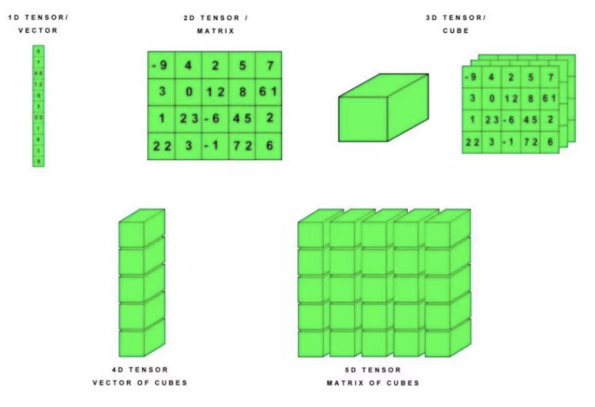
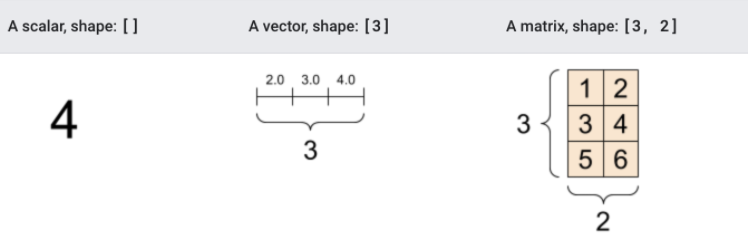
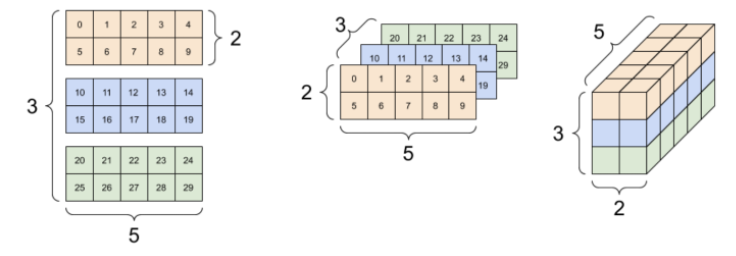
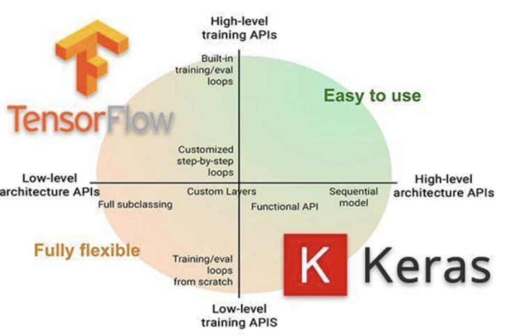
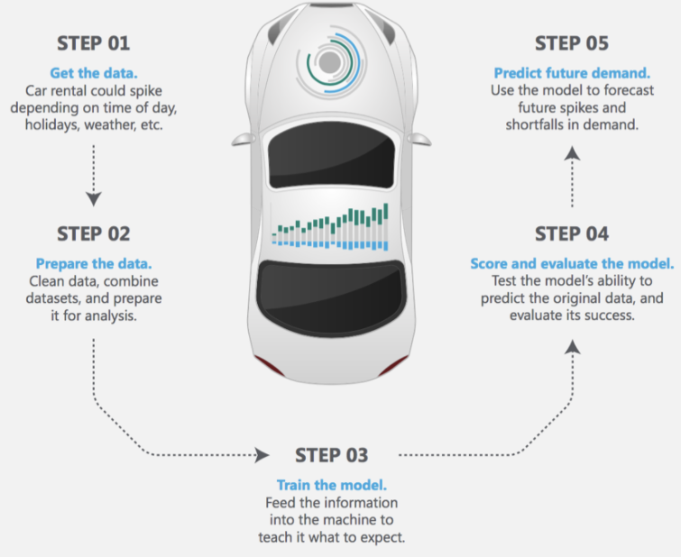
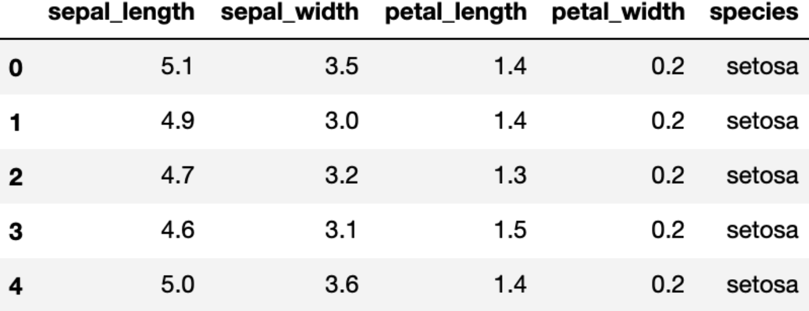
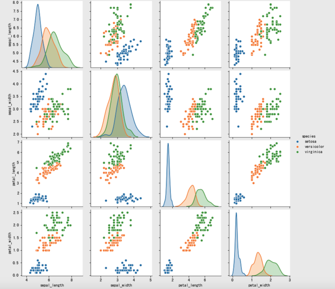
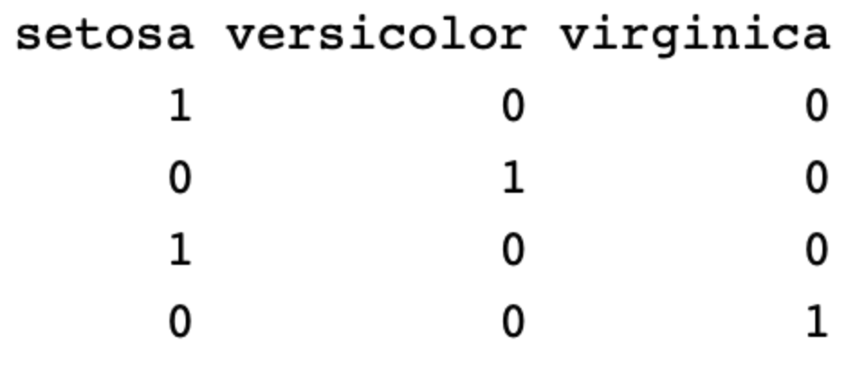
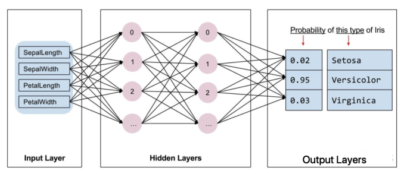

# [TensorFlow ](https://www.yuque.com/models/yvphv7/ulzf32)

**简介：**TensorFlows是人工智能AI领域的一个重要软件工具，是谷歌开发的开源软件(即免费的)。 人工智能领域分为三个方面，即基础层、技术层和应用层；而TensorFlow就是技术层中的学习框架。所谓学习框架，你可以用它来处理大量数据，快速建立数学模型，这些模型可以完成智能功能，例如自动识别一个图片里面的人物是否是范冰冰，当你百度范冰冰时，这个模型就可以识别并呈现范冰冰的图片；TensorFlow就好像一个功能强大的机床，它可以帮助制造出不同的产品(即数学模型)。

TensorFlow 2.0 将专注于简单性和易用性，工作流程如下所示：

1. **使用tf.data加载数据。** 使用tf.data实例化读取训练数据和测试数据
2. **模型的建立与调试：** 使用动态图模式 Eager Execution 和著名的神经网络高层 API 框架 Keras，结合可视化工具 TensorBoard，简易、快速地建立和调试模型
3. **模型的训练：** 支持 CPU / 单 GPU / 单机多卡 GPU / 多机集群 / TPU 训练模型，充分利用海量数据和计算资源进行高效训练
4. **预训练模型调用：** 通过 TensorFlow Hub，可以方便地调用预训练完毕的已有成熟模型
5. **模型的部署：** 通过 TensorFlow Serving、TensorFlow Lite、TensorFlow.js 等组件，可以将TensorFlow 模型部署到服务器、移动端、嵌入式端等多种使用场景

**安装：**

TensorFlow在64 位系统上测试这些系统支持 TensorFlow：

- Ubuntu 16.04 或更高版本
- Windows 7 或更高版本
- macOS 10.12.6 (Sierra) 或更高版本（不支持 GPU）

进入虚拟环境当中再安装。推荐使用anoconda进行安装

- 1、非GPU版本安装

ubuntu安装

~~~ tex
pip install tensorflow==2.3.0 -i https://pypi.tuna.tsinghua.edu.cn/simple
~~~

- 2、GPU版本安装

~~~ tex
pip install tensorflow-gpu==2.3.0 -i https://pypi.tuna.tsinghua.edu.cn/simple
~~~

注：如果需要下载GPU版本的（TensorFlow只提供windows和linux版本的，没有Macos版本的）。

## 张量Tensor

**张量是一个多维数组，** 与NumPy ndarray对象类似，tf.Tensor对象也具有数据类型和形状。如下图所示：

### 1.基本方法

此外，tf.Tensors可以保留在GPU中。 TensorFlow提供了丰富的操作库（tf.add，tf.matmul，tf.linalg.inv等），它们使用和生成tf.Tensor。在进行张量操作之前先导入相应的工具包：

~~~ python
import tensorflow as tf
import numpy as np

# 创建int32类型的0维张量，即标量
rank_0_tensor = tf.constant(4)
print(rank_0_tensor)

# 创建float32类型的1维张量
rank_1_tensor = tf.constant([2.0, 3.0, 4.0])
print(rank_1_tensor)

# 创建float16类型的二维张量
rank_2_tensor = tf.constant([[1, 2],
                             [3, 4],
                             [5, 6]], dtype=tf.float16)
print(rank_2_tensor)

# 创建float32类型的张量
rank_3_tensor = tf.constant([
  [[0, 1, 2, 3, 4],
   [5, 6, 7, 8, 9]],
  [[10, 11, 12, 13, 14],
   [15, 16, 17, 18, 19]],
  [[20, 21, 22, 23, 24],
   [25, 26, 27, 28, 29]],])

print(rank_3_tensor)

# 输出结果为：
tf.Tensor(4, shape=(), dtype=int32)
tf.Tensor([2. 3. 4.], shape=(3,), dtype=float32)
tf.Tensor(
[[1. 2.]
 [3. 4.]
 [5. 6.]], shape=(3, 2), dtype=float16)
tf.Tensor(
[[[ 0  1  2  3  4]
  [ 5  6  7  8  9]]

 [[10 11 12 13 14]
  [15 16 17 18 19]]

 [[20 21 22 23 24]
  [25 26 27 28 29]]], shape=(3, 2, 5), dtype=int32)
~~~

### 2.转换成numpy

我们可将张量转换为numpy中的ndarray的形式，转换方法有两种，以张量rank_2_tensor为例：

- np.array

~~~ python
np.array(rank_2_tensor)
~~~

- Tensor.numpy()

~~~ python
rank_2_tensor.numpy()
~~~

### 3.常用函数

我们可以对张量做一些基本的数学运算，包括加法、元素乘法和矩阵乘法等：

~~~ python
# 定义张量a和b
a = tf.constant([[1, 2],
                 [3, 4]])
b = tf.constant([[1, 1],
                 [1, 1]]) 
print(tf.add(a, b), "\n") # 计算张量的和
print(tf.multiply(a, b), "\n") # 计算张量的元素乘法
print(tf.matmul(a, b), "\n") # 计算乘法
~~~

输出结果为：

~~~ python
tf.Tensor(
[[2 3]
 [4 5]], shape=(2, 2), dtype=int32) 
tf.Tensor(
[[1 2]
 [3 4]], shape=(2, 2), dtype=int32) 
tf.Tensor(
[[3 3]
 [7 7]], shape=(2, 2), dtype=int32)
~~~

另外张量也可用于各种聚合运算：

~~~ python
tf.reduce_sum()  # 求和
tf.reduce_mean() # 平均值
tf.reduce_max()  # 最大值
tf.reduce_min()  # 最小值
tf.argmax() # 最大值的索引
tf.argmin() # 最小值的索引
~~~

例如：

~~~ python
c = tf.constant([[4.0, 5.0], [10.0, 1.0]])
# 最大值
print(tf.reduce_max(c))
# 最大值索引
print(tf.argmax(c))
# 计算均值
print(tf.reduce_mean(c))
~~~

输出为：

~~~ python
tf.Tensor(10.0, shape=(), dtype=float32)
tf.Tensor([1 0], shape=(2,), dtype=int64)
tf.Tensor(5.0, shape=(), dtype=float32)
~~~

### 4.变量

变量是一种特殊的张量，形状是不可变，但可以更改其中的参数。定义时的方法是：

~~~ python
my_variable = tf.Variable([[1.0, 2.0], [3.0, 4.0]])
~~~

我们也可以获取它的形状，类型及转换为ndarray:

~~~ python
print("Shape: ",my_variable.shape)
print("DType: ",my_variable.dtype)
print("As NumPy: ", my_variable.numpy)
~~~

输出为：

~~~ python
Shape:  (2, 2)
DType:  <dtype: 'float32'>
As NumPy:  <bound method BaseResourceVariable.numpy of <tf.Variable 'Variable:0' shape=(2, 2) dtype=float32, numpy=
array([[1., 2.],
       [3., 4.]], dtype=float32)>>
~~~

## tf.keras

tf.keras是TensorFlow 2.0的高阶API接口，为TensorFlow的代码提供了新的风格和设计模式，大大提升了TF代码的简洁性和复用性，官方也推荐使用tf.keras来进行模型设计和开发。

### 1.常用模块

tf.keras中常用模块如下表所示：

| 模块          | 概述                                                         |
| ------------- | ------------------------------------------------------------ |
| activations   | 激活函数                                                     |
| applications  | 预训练网络模块                                               |
| Callbacks     | 在模型训练期间被调用                                         |
| datasets      | tf.keras数据集模块，包括boston_housing，cifar10，fashion_mnist，imdb ，mnist |
| layers        | Keras层API                                                   |
| losses        | 各种损失函数                                                 |
| metircs       | 各种评价指标                                                 |
| models        | 模型创建模块，以及与模型相关的API                            |
| optimizers    | 优化方法                                                     |
| preprocessing | Keras数据的预处理模块                                        |
| regularizers  | 正则化，L1,L2等                                              |
| utils         | 辅助功能实现                                                 |

### 2.常用方法

深度学习实现的主要流程：1.数据获取，2，数据处理，3.模型创建与训练，4 模型测试与评估，5.模型预测

#### 1.导入tf.keras

使用 `tf.keras`，首先需要在代码开始时导入`tf.keras` 

~~~ python
import tensorflow as tf
from tensorflow import keras
~~~

#### 2.数据输入

对于小的数据集，可以直接使用numpy格式的数据进行训练、评估模型，对于大型数据集或者要进行跨设备训练时使用tf.data.datasets来进行数据输入。

#### 3.模型构建

- 简单模型使用Sequential进行构建
- 复杂模型使用函数式编程来构建
- 自定义layers

#### 4.训练与评估

- 配置训练过程：

~~~ python
# 配置优化方法，损失函数和评价指标
model.compile(optimizer=tf.train.AdamOptimizer(0.001),
	loss='categorical_crossentropy',
     metrics=['accuracy'])
~~~

- 模型训练

~~~ python
# 指明训练数据集，训练epoch,批次大小和验证集数据
model.fit/fit_generator(dataset, epochs=10, 
          batch_size=3,
          validation_data=val_dataset,
          )
~~~

- 模型评估

~~~ python
# 指明评估数据集和批次大小
model.evaluate(x, y, batch_size=32)
~~~

- 模型预测

~~~ python
# 对新的样本进行预测
model.predict(x, batch_size=32)
~~~

#### 5.回调函数（callbacks）

回调函数用在模型训练过程中，来控制模型训练行为，可以自定义回调函数，也可使用tf.keras.callbacks 内置的 callback ：

+ ModelCheckpoint：定期保存 checkpoints；

+ LearningRateScheduler：动态改变学习速率；

+ EarlyStopping：当验证集上的性能不再提高时，终止训练；

+ TensorBoard：使用 TensorBoard 监测模型的状态；

#### 6.模型的保存和恢复

- 只保存参数

~~~ python
# 只保存模型的权重
model.save_weights('./my_model')
# 加载模型的权重
model.load_weights('my_model')
~~~

- 保存整个模型

~~~ python
# 保存模型架构与权重在h5文件中
model.save('my_model.h5')
# 加载模型：包括架构和对应的权重
model = keras.models.load_model('my_model.h5')
~~~

## 案例

通过鸢尾花分类案例，介绍tf.keras的基本使用流程。tf.keras使用tensorflow中的高级接口，我们调用它即可完成：

1. 导入和解析数据集
2. 构建模型
3. 使用样本数据训练该模型
4. 评估模型的效果。

由于与scikit -learn的相似性，接下来我们将通过将Keras与scikit -learn进行比较，介绍tf.Keras的相关使用方法。

### 1.相关的库的导入

在这里使用sklearn和tf.keras完成鸢尾花分类，导入相关的工具包：

~~~ python
# 绘图
import seaborn as sns
import matplotlib.pyplot as plt
# 数值计算
import numpy as np
# sklearn中的相关工具
# 划分训练集和测试集
from sklearn.model_selection import train_test_split
# 逻辑回归
from sklearn.linear_model import LogisticRegressionCV
# tf.keras中使用的相关工具
# 用于模型搭建
from tensorflow.keras.models import Sequential
# 构建模型的层和激活方法
from tensorflow.keras.layers import Dense, Activation
# 数据处理的辅助工具
from tensorflow.keras import utils
~~~

### 2.数据展示和划分

利用seborn导入相关的数据，iris数据以dataFrame的方式在seaborn进行存储，我们读取后并进行展示：

~~~ python
# 读取数据
iris = sns.load_dataset("iris")
# 展示数据和
print(iris.shape)
# 展示数据的前五行
print(iris.head())

(150, 5)
   sepal_length  sepal_width  petal_length  petal_width species
0           5.1          3.5           1.4          0.2  setosa
1           4.9          3.0           1.4          0.2  setosa
2           4.7          3.2           1.3          0.2  setosa
3           4.6          3.1           1.5          0.2  setosa
4           5.0          3.6           1.4          0.2  setosa
~~~

另外，利用seaborn中pairplot函数探索数据特征间的关系：

~~~ python
# 将数据之间的关系进行可视化
sns.pairplot(iris, hue='species')
plt.show()
~~~

将数据划分为训练集和测试集：从iris dataframe中提取原始数据，将花瓣和萼片数据保存在数组X中，标签保存在相应的数组y中：

~~~ python
# 花瓣和花萼的数据
X = iris.values[:, :4]
# 标签值
y = iris.values[:, 4]
~~~

利用train_test_split完成数据集划分：

~~~ python
# 将数据集划分为训练集和测试集
train_X, test_X, train_y, test_y = train_test_split(X, y, train_size=0.5, test_size=0.5, random_state=0)
# 展示测试集的数据和
print(test_X.shape)

(75, 4)
~~~

接下来，我们就可以使用sklearn和tf.keras来完成预测

#### sklearn实现

利用逻辑回归的分类器，并使用交叉验证的方法来选择最优的超参数，实例化LogisticRegressionCV分类器，并使用fit方法进行训练：

~~~ python
# 实例化分类器
lr = LogisticRegressionCV()
# 训练
lr.fit(train_X, train_y)
~~~

利用训练好的分类器进行预测，并计算准确率：

~~~ python
# 计算准确率并进行打印
print("Accuracy = {:.2f}".format(lr.score(test_X, test_y)))
~~~

逻辑回归的准确率为：

~~~ python
Accuracy = 0.93
~~~

完整代码

~~~ python
# 绘图
import seaborn as sns
import matplotlib.pyplot as plt
# 数值计算
import numpy as np
# sklearn中的相关工具
# 划分训练集和测试集
from sklearn.model_selection import train_test_split
# 逻辑回归
from sklearn.linear_model import LogisticRegressionCV
# tf.keras中使用的相关工具
# 用于模型搭建
from tensorflow.keras.models import Sequential
# 构建模型的层和激活方法
from tensorflow.keras.layers import Dense, Activation
# 数据处理的辅助工具
from tensorflow.keras import utils

# 读取数据
iris = sns.load_dataset("iris")
# 展示数据和
print(iris.shape)
# 展示数据的前五行
print(iris.head())

# 将数据之间的关系进行可视化
sns.pairplot(iris, hue='species')
plt.show()

# 花瓣和花萼的数据
X = iris.values[:, :4]
# 标签值
y = iris.values[:, 4]

# 将数据集划分为训练集和测试集
train_X, test_X, train_y, test_y = train_test_split(X, y, train_size=0.5, test_size=0.5, random_state=0)
# 展示测试集的数据和
print(test_X.shape)

# 实例化分类器
lr = LogisticRegressionCV()
# 训练
lr.fit(train_X, train_y)

# 计算准确率并进行打印
print("Accuracy = {:.2f}".format(lr.score(test_X, test_y)))
~~~

#### tf.keras实现

在sklearn中我们只要实例化分类器并利用fit方法进行训练，最后衡量它的性能就可以了，那在tf.keras中与在sklearn非常相似，不同的是：

- 构建分类器时需要进行模型搭建
- 数据采集时，sklearn可以接收字符串型的标签，如：“setosa”，但是在tf.keras中需要对标签值进行热编码，如下所示：

有很多方法可以实现热编码，比如pandas中的get_dummies(),在这里我们使用tf.keras中的方法进行热编码：

~~~ python
# 进行热编码
def one_hot_encode_object_array(arr):
    # 去重获取全部的类别
    uniques, ids = np.unique(arr, return_inverse=True)
    # 返回热编码的结果
    return utils.to_categorical(ids, len(uniques))
~~~

##### 数据处理

接下来对标签值进行热编码：

~~~ python
# 训练集热编码
train_y_ohe = one_hot_encode_object_array(train_y)
# 测试集热编码
test_y_ohe = one_hot_encode_object_array(test_y)
~~~

##### 模型搭建

在sklearn中，模型都是现成的。tf.Keras是一个神经网络库,我们需要根据数据和标签值构建神经网络。神经网络可以发现特征与标签之间的复杂关系。神经网络是一个高度结构化的图，其中包含一个或多个隐藏层。每个隐藏层都包含一个或多个神经元。神经网络有多种类别，该程序使用的是密集型神经网络，也称为全连接神经网络：一个层中的神经元将从上一层中的每个神经元获取输入连接。例如，图 2 显示了一个密集型神经网络，其中包含 1 个输入层、2 个隐藏层以及 1 个输出层，如下图所示：

上图 中的模型经过训练并馈送未标记的样本时，它会产生 3 个预测结果：相应鸢尾花属于指定品种的可能性。对于该示例，输出预测结果的总和是 1.0。该预测结果分解如下：山鸢尾为 0.02，变色鸢尾为 0.95，维吉尼亚鸢尾为 0.03。这意味着该模型预测某个无标签鸢尾花样本是变色鸢尾的概率为 95％。

TensorFlow `tf.keras` API 是创建模型和层的首选方式。通过该 API，您可以轻松地构建模型并进行实验，而将所有部分连接在一起的复杂工作则由 Keras 处理。

`tf.keras.Sequential` 模型是层的线性堆叠。该模型的构造函数会采用一系列层实例；在本示例中，采用的是 2 个密集层（分别包含 10 个节点）以及 1 个输出层（包含 3 个代表标签预测的节点）。第一个层的 `input_shape` 参数对应该数据集中的特征数量：

~~~ python
# 利用sequential方式构建模型
model = Sequential([
  # 隐藏层1，激活函数是relu,输入大小有input_shape指定
  Dense(10, activation="relu", input_shape=(4,)),  
  # 隐藏层2，激活函数是relu
  Dense(10, activation="relu"),
  # 输出层
  Dense(3,activation="softmax")
])
~~~

通过model.summary可以查看模型的架构：

~~~ python
Model: "sequential"
_________________________________________________________________
Layer (type)                 Output Shape              Param #   
=================================================================
dense (Dense)                (None, 10)                50        
_________________________________________________________________
dense_1 (Dense)              (None, 10)                110       
_________________________________________________________________
dense_2 (Dense)              (None, 3)                 33        
=================================================================
Total params: 193
Trainable params: 193
Non-trainable params: 0
_________________________________________________________________
~~~

激活函数可决定层中每个节点的输出形状。这些非线性关系很重要，如果没有它们，模型将等同于单个层。激活函数有很多，但隐藏层通常使用 ReLU。

隐藏层和神经元的理想数量取决于问题和数据集。与机器学习的多个方面一样，选择最佳的神经网络形状需要一定的知识水平和实验基础。一般来说，增加隐藏层和神经元的数量通常会产生更强大的模型，而这需要更多数据才能有效地进行训练。

##### 模型训练和预测

在训练和评估阶段，我们都需要计算模型的损失。这样可以衡量模型的预测结果与预期标签有多大偏差，也就是说，模型的效果有多差。我们希望尽可能减小或优化这个值，所以我们设置优化策略和损失函数，以及模型精度的计算方法：

~~~ python
# 设置模型的相关参数：优化器，损失函数和评价指标
model.compile(optimizer='adam', loss='categorical_crossentropy', metrics=["accuracy"])
~~~

接下来与在sklearn中相同，分别调用fit和predict方法进行预测即可。

~~~ python
# 模型训练前需要将格式转换回keras可以识别的类型
train_X = train_X.astype('float64')
test_X = test_X.astype('float64')

# 模型训练：epochs,训练样本送入到网络中的次数，batch_size:每次训练的送入到网络中的样本个数
model.fit(train_X, train_y_ohe, epochs=10, batch_size=1, verbose=1)
~~~

上述代码完成的是：

1. 迭代每个epoch。通过一次数据集即为一个epoch。
2. 在一个epoch中，遍历训练 Dataset 中的每个样本，并获取样本的特征 (x) 和标签 (y)。
3. 根据样本的特征进行预测，并比较预测结果和标签。衡量预测结果的不准确性，并使用所得的值计算模型的损失和梯度。
4. 使用 optimizer 更新模型的变量。
5. 对每个epoch重复执行以上步骤，直到模型训练完成。

训练过程展示如下：

~~~ python
Epoch 1/10
75/75 [==============================] - 0s 616us/step - loss: 0.0585 - accuracy: 0.9733
Epoch 2/10
75/75 [==============================] - 0s 535us/step - loss: 0.0541 - accuracy: 0.9867
Epoch 3/10
75/75 [==============================] - 0s 545us/step - loss: 0.0650 - accuracy: 0.9733
Epoch 4/10
75/75 [==============================] - 0s 542us/step - loss: 0.0865 - accuracy: 0.9733
Epoch 5/10
75/75 [==============================] - 0s 510us/step - loss: 0.0607 - accuracy: 0.9733
Epoch 6/10
75/75 [==============================] - 0s 659us/step - loss: 0.0735 - accuracy: 0.9733
Epoch 7/10
75/75 [==============================] - 0s 497us/step - loss: 0.0691 - accuracy: 0.9600
Epoch 8/10
75/75 [==============================] - 0s 497us/step - loss: 0.0724 - accuracy: 0.9733
Epoch 9/10
75/75 [==============================] - 0s 493us/step - loss: 0.0645 - accuracy: 0.9600
Epoch 10/10
75/75 [==============================] - 0s 482us/step - loss: 0.0660 - accuracy: 0.9867
~~~

与sklearn中不同，对训练好的模型进行评估时，与sklearn.score方法对应的是tf.keras.evaluate()方法，返回的是损失函数和在compile模型时要求的指标:

~~~ python
# 计算模型的损失和准确率
loss, accuracy = model.evaluate(test_X, test_y_ohe, verbose=1)
print("Accuracy = {:.2f}".format(accuracy))
~~~

分类器的准确率为：

~~~ python
3/3 [==============================] - 0s 591us/step - loss: 0.1031 - accuracy: 0.9733
Accuracy = 0.97
~~~

完整代码

~~~ python
# 绘图
import seaborn as sns
import matplotlib.pyplot as plt
# 数值计算
import numpy as np
# sklearn中的相关工具
# 划分训练集和测试集
from sklearn.model_selection import train_test_split
# 逻辑回归
from sklearn.linear_model import LogisticRegressionCV
# tf.keras中使用的相关工具
# 用于模型搭建
from tensorflow.keras.models import Sequential
# 构建模型的层和激活方法
from tensorflow.keras.layers import Dense, Activation
# 数据处理的辅助工具
from tensorflow.keras import utils

# 读取数据
iris = sns.load_dataset("iris")
# 展示数据和
print(iris.shape)
# 展示数据的前五行
print(iris.head())

# 将数据之间的关系进行可视化
sns.pairplot(iris, hue='species')
plt.show()

# 花瓣和花萼的数据
X = iris.values[:, :4]
# 标签值
y = iris.values[:, 4]

# 将数据集划分为训练集和测试集
train_X, test_X, train_y, test_y = train_test_split(X, y, train_size=0.5, test_size=0.5, random_state=0)
# 展示测试集的数据和
print(test_X.shape)

# 进行热编码
def one_hot_encode_object_array(arr):
    # 去重获取全部的类别
    uniques, ids = np.unique(arr, return_inverse=True)
    # 返回热编码的结果
    return utils.to_categorical(ids, len(uniques))

# 训练集热编码
train_y_ohe = one_hot_encode_object_array(train_y)
# 测试集热编码
test_y_ohe = one_hot_encode_object_array(test_y)

# 利用sequential方式构建模型
model = Sequential([
  # 隐藏层1，激活函数是relu,输入大小有input_shape指定
  Dense(10, activation="relu", input_shape=(4,)),
  # 隐藏层2，激活函数是relu
  Dense(10, activation="relu"),
  # 输出层
  Dense(3,activation="softmax")
])
# 设置模型的相关参数：优化器，损失函数和评价指标
model.compile(optimizer='adam', loss='categorical_crossentropy', metrics=["accuracy"])

# 设置模型的相关参数：优化器，损失函数和评价指标
train_X = train_X.astype('float64')
test_X = test_X.astype('float64')

# 模型训练：epochs,训练样本送入到网络中的次数，batch_size:每次训练的送入到网络中的样本个数
model.fit(train_X, train_y_ohe, epochs=10, batch_size=1, verbose=1)

# 计算模型的损失和准确率
loss, accuracy = model.evaluate(test_X, test_y_ohe, verbose=1)
print("Accuracy = {:.2f}".format(accuracy))
~~~

