# [卷积神经网络CNN](https://www.yuque.com/models/yvphv7/nyf5if#HpNAC)

## 1 CNN网络的构成

卷积神经网络与普通神经网络的区别在于，卷积神经网络包含了一个由卷积层和子采样层（池化层）构成的特征抽取器。在卷积神经网络的卷积层中，一个神经元只与部分邻层神经元连接。在CNN的一个卷积层中，通常包含若干个特征图(featureMap)，每个特征图由一些矩形排列的的神经元组成，同一特征图的神经元共享权值，这里共享的权值就是卷积核。卷积核一般以随机小数矩阵的形式初始化，在网络的训练过程中卷积核将学习得到合理的权值。共享权值（卷积核）带来的直接好处是减少网络各层之间的连接，同时又降低了过拟合的风险。子采样也叫做池化（pooling），通常有均值子采样（mean pooling）和最大值子采样（max pooling）两种形式。子采样可以看作一种特殊的卷积过程。卷积和子采样大大简化了模型复杂度，减少了模型的参数。

首先，我们先获取一个感性认识，下图是一个卷积神经网络的实例：

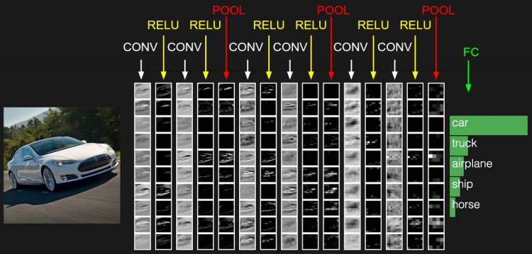

卷积神经网络通常包含以下几种层：

- 卷积层（Convolutional layer），卷积神经网路中每层卷积层由若干卷积单元组成，每个卷积单元的参数都是通过反向传播算法优化得到的。卷积运算的目的是提取输入的不同特征，第一层卷积层可能只能提取一些低级的特征如边缘、线条和角等层级，更多层的网络能从低级特征中迭代提取更复杂的特征。
- 线性整流层（Rectified Linear Units layer, ReLU layer），这一层神经的活性化函数（Activation function）使用线性整流（Rectified Linear Units, ReLU）f(x)=max(0,x)f(x)=max(0,x)。
- 池化层（Pooling layer），通常在卷积层之后会得到维度很大的特征，将特征切成几个区域，取其最大值或平均值，得到新的、维度较小的特征。

+ 全连接层（ Fully-Connected layer）, 把所有局部特征结合变成全局特征，用来计算最后每一类的得分。

## 2 卷积层

卷积层是卷积神经网络中的核心模块，卷积层的目的是提取输入特征图的特征，如下图所示，卷积核可以提取图像中的边缘信息。

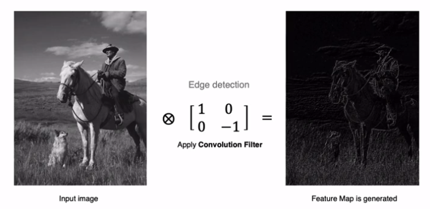

### 2.1 卷积的计算方法

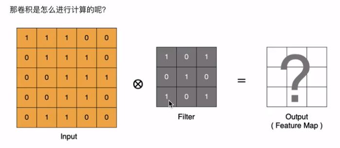

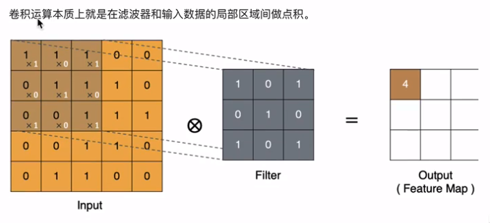

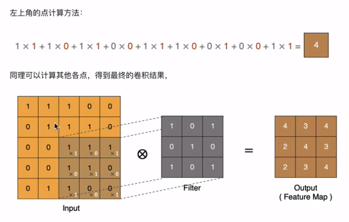

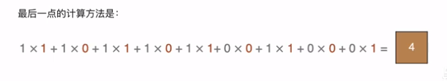

### 2.2 padding

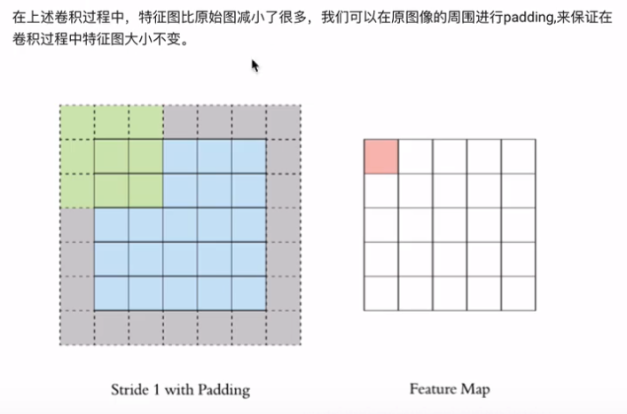

### 2.3 stride

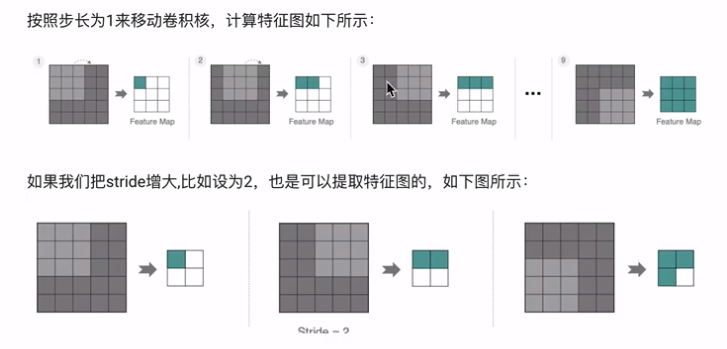

### 2.4 多通道卷积

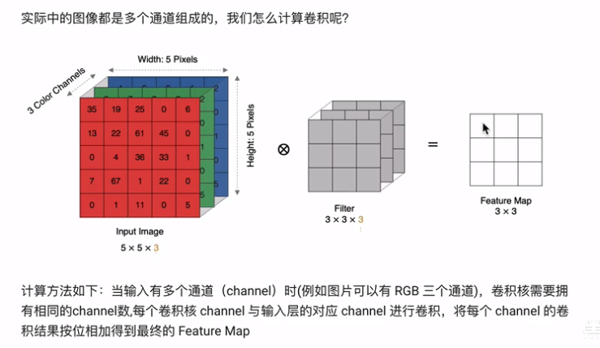

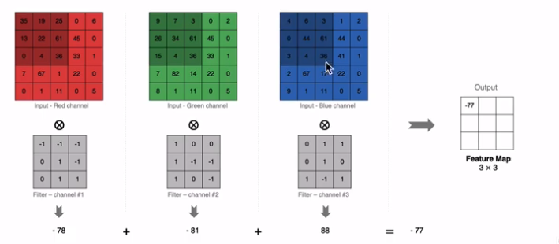

### 2.5 多卷积核卷积

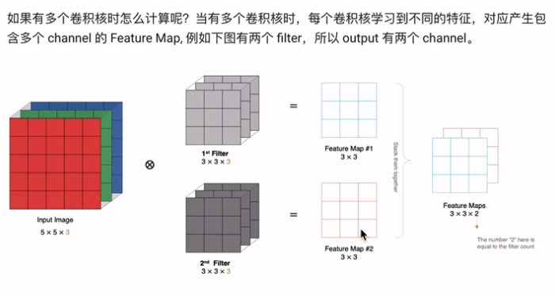

### 2.6 特征图大小

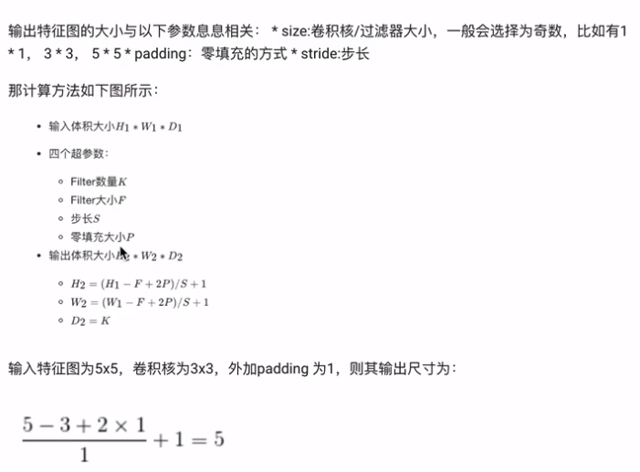

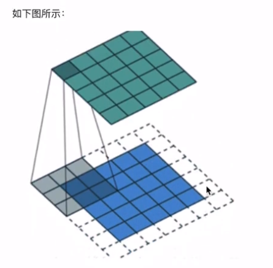

在tk.keras中卷积核的实际应用

~~~ python
tk.keras.layers.Conv2D(
	filters, kernel_size, strides=(1, 1), padding='valid', activcation=None
)
~~~

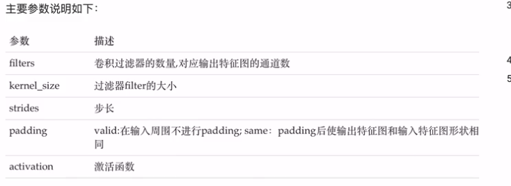

## 3 池化层

池化层降低了后续网络层的输入维度，缩减模型大小，提高计算速度，并提高了Feature Map的鲁棒性，防止过拟合，它主要对卷积层学到的特征进行采样处理，主要有两种

### 3.1 最大池化

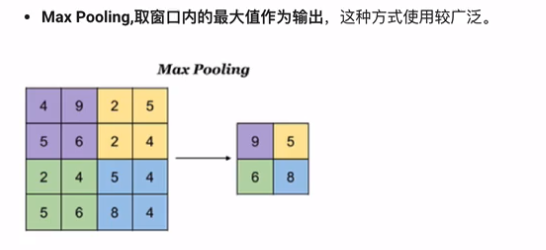

在tk.keras中池化的方法是：

~~~ python
tk.keras.layers.Conv2D(
	pool_size=(2, 2), strides=None, padding='valid'
)
~~~

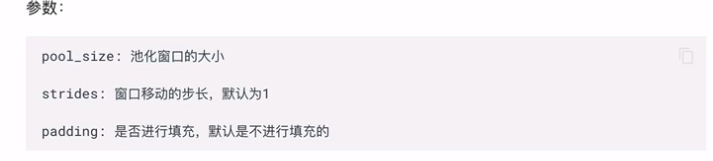

### 3.2 平均池化

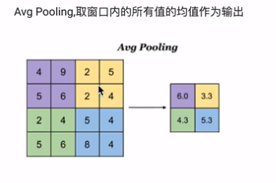

在tk.keras中池化的方法是：

~~~ python
tk.keras.layers.AveragePooling2D(
	pool_size=(2, 2), strides=None, padding='valid'
)
~~~

## 4 全连接层

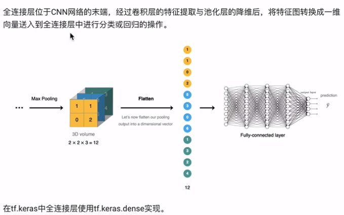

## 5 卷积神经网络的构建

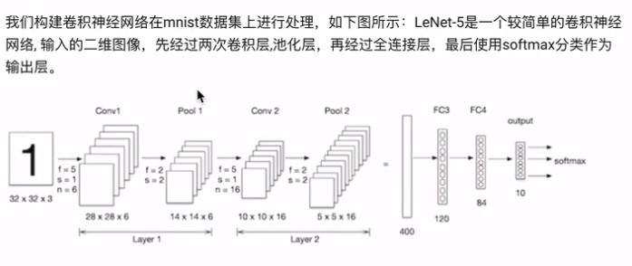

导入工具包：

~~~ python
import tensorflow as tf
from tensorflow.keras.datasets import mnist
~~~

### 5.1 数据加载

与神经网络的案例一直，首先加载数据集：

~~~ python
(train_images, train_labels), (test_images, test_lables) = mnist.load_data()
~~~

### 5.2 数据处理

卷积神经网络的输入要求是：N H W C，分别是图片数量，图片高度，图片宽度和图片的通道，因为是灰度图，通道为1

~~~ python
# 训练集数据维度调整
train_images = tf.reshape(train_images, (train_images.shape[0], train_images.shape[1], train_images.shape[2], 1))
print(train_images.shape)
# 测试集数据维度调整
test_images = tf.reshape(test_images, (test_images.shape[0], test_images.shape[1], test_images.shape[2], 1))
print(test_images.shape)
~~~

结果为：

~~~ python
(60000, 28, 28, 1)
(10000, 28, 28, 1)
~~~

### 5.3 模型搭建

Lenet-5模型输入的二维图像，先经过两次卷积层、池化层，再经过全连接层，最后使用softmax分类作为输出层，模型构建如下：

~~~ python
# 模型构建
net = tf.keras.models.Sequential([
    # 卷基层：6个5*5的卷积核，激活时sigmoid
    tf.keras.layers.Conv2D(filters=6, kernel_size=5, activation='sigmoid', input_shape=(28, 28, 1)),
    # 最大池化
    tf.keras.layers.MaxPool2D(pool_size=2, strides=2),
    # 卷积层：16个5*5的卷积核，激活时sigmoid
    tf.keras.layers.Conv2D(filters=16, kernel_size=5, activation='sigmoid'),
    # 最大池化
    tf.keras.layers.MaxPool2D(pool_size=2, strides=2),
    # 维度调整为1维数据，准备送入全连接层
    tf.keras.layers.Flatten(),
    # 全卷积层，激活sigmoid
    tf.keras.layers.Dense(120, activation='sigmoid'),
    # 全卷积层，激活sigmoid
    tf.keras.layers.Dense(84, activation='sigmoid'),
    # 全卷积层，激活softmax
    tf.keras.layers.Dense(10, activation='softmax')

])
~~~

输出结果为：

~~~ python
Model: "sequential"
_________________________________________________________________
Layer (type)                 Output Shape              Param #   
=================================================================
conv2d (Conv2D)              (None, 24, 24, 6)         156       
_________________________________________________________________
max_pooling2d (MaxPooling2D) (None, 12, 12, 6)         0         
_________________________________________________________________
conv2d_1 (Conv2D)            (None, 8, 8, 16)          2416      
_________________________________________________________________
max_pooling2d_1 (MaxPooling2 (None, 4, 4, 16)          0         
_________________________________________________________________
flatten (Flatten)            (None, 256)               0         
_________________________________________________________________
dense (Dense)                (None, 120)               30840     
_________________________________________________________________
dense_1 (Dense)              (None, 84)                10164     
_________________________________________________________________
dense_2 (Dense)              (None, 10)                850       
=================================================================
Total params: 44,426
Trainable params: 44,426
Non-trainable params: 0
_________________________________________________________________
~~~

### 5.4 模型编译

设置优化器和损失函数：

~~~ python
# 优化器
optimizer = tf.keras.optimizers.SGD(learning_rate=0.9)
# 模型编译：损失函数，优化器和评估指标
net.compile(optimizer=optimizer, loss='sparse_categorical_crossentropy', metrics=['accuracy'])
~~~

### 5.5 模型训练

~~~ python
# 模型训练
net.fit(train_images, train_labels, epochs=5, validation_split=0.1)
~~~

训练流程：

~~~ python
Epoch 1/5
1688/1688 [==============================] - 24s 14ms/step - loss: 1.1290 - accuracy: 0.5778 - val_loss: 0.1543 - val_accuracy: 0.9505
Epoch 2/5
1688/1688 [==============================] - 26s 15ms/step - loss: 0.1514 - accuracy: 0.9524 - val_loss: 0.0943 - val_accuracy: 0.9698
Epoch 3/5
1688/1688 [==============================] - 25s 15ms/step - loss: 0.1034 - accuracy: 0.9671 - val_loss: 0.1162 - val_accuracy: 0.9617
Epoch 4/5
1688/1688 [==============================] - 24s 14ms/step - loss: 0.0782 - accuracy: 0.9749 - val_loss: 0.0643 - val_accuracy: 0.9782
Epoch 5/5
1688/1688 [==============================] - 20s 12ms/step - loss: 0.0660 - accuracy: 0.9791 - val_loss: 0.0756 - val_accuracy: 0.9765
~~~

### 5.6 模型评估

~~~ python
# 模型评估
score = net.evaluate(test_images, test_lables, verbose=1)
print('Test accuracy', score[1])
~~~

输出为：

~~~ python
Test accuracy 0.9713000059127808
~~~

与全连接网络相比，准确度提高了很多。